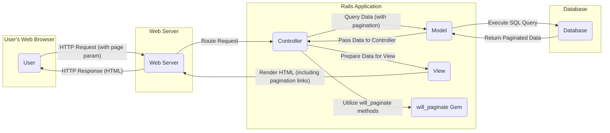

## Project Design Document: will_paginate Gem Integration (Improved)

**1. Introduction**

This document provides an enhanced and more detailed design overview of the integration of the `will_paginate` gem within a Ruby on Rails application. This revised document aims to provide a stronger foundation for subsequent threat modeling activities by offering a more granular understanding of the system's components, data flow, and potential interaction points. The focus is on providing the necessary context for security analysis.

**1.1. Purpose**

The primary purpose of this document is to provide a clear and comprehensive architectural description of a system utilizing the `will_paginate` gem. This detailed view will empower security professionals to more effectively identify potential vulnerabilities, understand attack vectors, and design appropriate security mitigations.

**1.2. Scope**

This document focuses specifically on the integration points and interactions of the `will_paginate` gem within a typical Ruby on Rails web application environment. It comprehensively covers the communication and data exchange between the gem, the application's controllers, models, and views, the underlying data store, and the end-user's web browser. While it doesn't delve into the internal code of the `will_paginate` gem itself, it thoroughly examines its role and impact on the application's architecture and security posture.

**1.3. Target Audience**

This document is primarily intended for:

*   Security architects and engineers responsible for conducting threat modeling, security assessments, and penetration testing.
*   Software developers involved in the design, implementation, and maintenance of Ruby on Rails applications that utilize `will_paginate`.
*   DevOps engineers responsible for the deployment, configuration, and operational security of these applications.

**2. System Overview**

The `will_paginate` gem is a widely adopted pagination library for Ruby on Rails applications. It significantly simplifies the process of displaying large datasets to users in manageable, page-by-page chunks. When integrated into a Rails application, it introduces helper methods that are used within controllers to manage the logic of fetching specific subsets of data and within views to render the necessary pagination controls and links.

**3. Architectural Design**

The following key components are integral to the operation of a system leveraging the `will_paginate` gem:

*   **End User's Web Browser:** The client-side application (e.g., Chrome, Firefox, Safari) used by the end-user to interact with the web application's user interface.
*   **Web Server (e.g., Puma, Unicorn, Passenger):** The server software responsible for receiving incoming HTTP requests from user browsers and routing them to the appropriate Rails application instance.
*   **Ruby on Rails Application:** The core application logic built using the Ruby on Rails framework. This includes:
    *   **Controllers:** Handle incoming user requests, orchestrate interactions with models, and prepare data for rendering in the view. They utilize `will_paginate` methods to manage data retrieval.
    *   **Models:** Represent the application's data structures and encapsulate the logic for interacting with the underlying database. They are queried by controllers, often using `will_paginate`'s pagination scope.
    *   **Views:** Responsible for rendering the HTML content presented to the user's browser. They utilize `will_paginate` helper methods to generate pagination links and display the paginated data.
    *   **`will_paginate` Gem:** The library itself, providing helper methods and logic for implementing pagination functionality within controllers and views.
*   **Database System:** The persistent storage system (e.g., PostgreSQL, MySQL, SQLite) where the application's data is stored and managed.

**3.1. Detailed Component Interaction Diagram**

**4. Data Flow (Detailed)**

The following outlines a more granular data flow for a paginated request using the `will_paginate` gem:

1. **User Initiates Request:** The user interacts with the web application, either by initially navigating to a page displaying paginated data or by clicking on a pagination link (e.g., "Next", "Previous", a specific page number). This action generates an HTTP GET request. The request URL typically includes a `page` parameter (e.g., `/items?page=2`).
2. **Web Server Receives and Routes:** The web server receives the incoming HTTP request. Based on the configured routes, it identifies the appropriate Rails controller and action to handle the request.
3. **Controller Action Invoked:** The designated controller action is executed. This action is responsible for fetching and preparing the data to be displayed.
4. **Pagination Parameter Extraction:** The controller extracts the pagination parameters from the request, most commonly the `page` parameter.
5. **Data Retrieval with `will_paginate`:** The controller utilizes methods provided by the `will_paginate` gem, often in conjunction with ActiveRecord query methods in the model. This typically involves calling `Model.paginate(page: params[:page], per_page: ...)` or similar. This method constructs a database query that limits the result set based on the requested page and the configured number of items per page.
6. **Database Query Execution:** The model interacts with the database, executing the SQL query generated by ActiveRecord (influenced by `will_paginate`). This query retrieves only the specific subset of data required for the current page.
7. **Database Returns Paginated Data:** The database returns the requested subset of data to the model.
8. **Data Passed to Controller:** The model passes the paginated collection of data back to the controller action.
9. **View Rendering Preparation:** The controller prepares the data, including the paginated collection and the pagination object provided by `will_paginate` (which contains information about the total number of pages, current page, etc.).
10. **View Renders Pagination Links:** The view utilizes `will_paginate` helper methods (e.g., `will_paginate @items`) to generate the HTML for the pagination links. These links typically include URLs for navigating to other pages, incorporating the `page` parameter.
11. **HTML Response Construction:** The view renders the complete HTML response, including the paginated data and the generated pagination links.
12. **Web Server Sends Response:** The web server sends the generated HTML response back to the user's web browser.
13. **Browser Displays Content:** The user's web browser renders the HTML, displaying the current page of data along with the interactive pagination controls.

**5. Security Considerations (Enhanced for Threat Modeling)**

The integration of `will_paginate` introduces several potential security vulnerabilities that require careful consideration during threat modeling:

*   **Direct Object Reference (DOR) via Page Parameter Manipulation:** Attackers might manipulate the `page` parameter in the URL to attempt to access data they are not authorized to view. For example, by incrementing the page number beyond the expected range or by using negative numbers. Robust input validation and authorization checks are crucial.
*   **Denial of Service (DoS) through Excessive Page Requests:** A malicious user could send a large number of requests with very high `page` values or attempt to request an extremely large number of items per page (if configurable), potentially overloading the database or application server. Implementing rate limiting and setting reasonable upper bounds for pagination parameters can mitigate this.
*   **Information Disclosure through Insecure Query Construction:** While `will_paginate` helps with pagination, developers must still ensure that the underlying database queries do not inadvertently expose sensitive information. Improperly constructed queries, even with pagination, can lead to data leaks.
*   **SQL Injection Vulnerabilities (Indirectly Related):** Although `will_paginate` itself doesn't directly introduce SQL injection, if pagination parameters are used unsafely within custom SQL queries or if the application's model layer has vulnerabilities, attackers could exploit these weaknesses. Ensure all data access logic is secure.
*   **Cross-Site Scripting (XSS) via Pagination Links:** If the pagination links generated by `will_paginate` are not properly escaped before being rendered in the HTML, an attacker could inject malicious JavaScript code into the links. When another user clicks on such a link, the script could be executed in their browser. Always ensure proper output encoding.
*   **Mass Assignment Risks with Pagination Parameters (Less Direct):** While less direct, if pagination parameters are inadvertently used in mass assignment scenarios (e.g., directly updating model attributes based on request parameters without proper filtering), it could lead to unintended data modification.
*   **Dependency Vulnerabilities in `will_paginate`:** Like any external library, `will_paginate` might have undiscovered vulnerabilities. Regularly updating the gem to the latest stable version is essential to patch known security flaws.
*   **Bypass of Business Logic through Pagination Manipulation:** Attackers might manipulate pagination parameters to bypass intended business logic or limitations. For example, if a system limits the number of items a user can view, manipulating the `per_page` parameter might allow them to circumvent this limit.

**6. Assumptions and Constraints**

The following assumptions and constraints are relevant to this design:

*   The application is built using the Ruby on Rails framework and follows standard Rails conventions.
*   Database interactions are primarily managed through ActiveRecord or a similar Object-Relational Mapper (ORM).
*   General web security best practices, such as input validation and output encoding, are intended to be followed within the application's codebase.
*   The `will_paginate` gem is used with its default or commonly recommended configurations.
*   The application utilizes a standard web server environment (e.g., behind a reverse proxy).

**7. Future Considerations**

*   **API Pagination Strategies:** If the application exposes an API, different pagination strategies (e.g., cursor-based pagination, offset-based with different parameter names) might be employed, requiring a separate security analysis.
*   **Integration with Search and Filtering:** The interaction between pagination and search/filtering functionalities introduces additional complexity and potential attack vectors that need to be considered during threat modeling.
*   **Real-time Data Updates and Pagination:** If the underlying data is subject to frequent real-time updates, the pagination logic needs to be robust enough to handle these changes without introducing inconsistencies or vulnerabilities.
*   **Performance Implications of Large Datasets:** For extremely large datasets, the performance implications of offset-based pagination (used by `will_paginate`) should be considered, and alternative approaches might be evaluated.

This improved document provides a more detailed and nuanced understanding of the architecture and data flow involved in utilizing the `will_paginate` gem within a Ruby on Rails application. This enhanced information is crucial for conducting a more thorough and effective threat model, enabling the identification and mitigation of a wider range of potential security vulnerabilities.