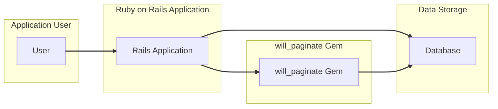
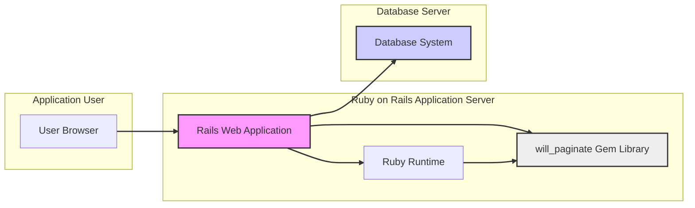
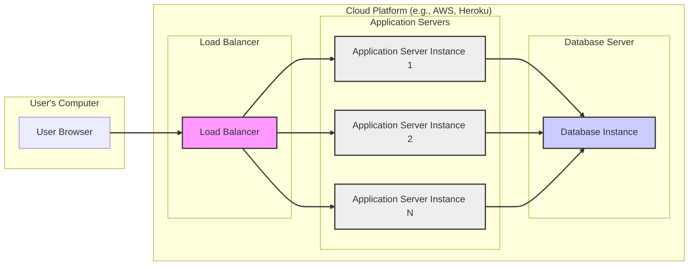

# BUSINESS POSTURE

This project, represented by the `will_paginate` Github repository, provides a Ruby gem that simplifies the implementation of pagination in Ruby on Rails applications.

- Business Priorities and Goals:
  - To provide a reusable and efficient solution for paginating data in web applications.
  - To improve user experience by allowing users to navigate large datasets in a structured and performant manner.
  - To reduce development time and effort required to implement pagination functionality in Rails projects.
  - To maintain a stable and reliable gem that is widely adopted and supported by the Ruby on Rails community.

- Business Risks:
  - Bugs in the pagination logic could lead to incorrect data display or application errors, impacting user experience and data integrity.
  - Performance issues in the pagination implementation could slow down applications and degrade user experience, especially with large datasets.
  - Security vulnerabilities in the gem could be exploited by malicious actors to gain unauthorized access or disrupt application functionality.
  - Lack of maintenance or community support could lead to the gem becoming outdated or incompatible with newer versions of Rails, hindering its usability and adoption.
  - Dependency on this gem introduces a supply chain risk, where vulnerabilities in the gem itself or its dependencies could affect applications using it.

# SECURITY POSTURE

- Security Controls:
  - security control: Code review process for contributions to the gem (Implicit in open-source development on GitHub).
  - security control: Unit and integration tests to ensure the gem functions as expected (Implicit in good software development practices).
  - security control: Version control using Git (GitHub repository).
  - security control: Publicly accessible issue tracker on GitHub for reporting bugs and security vulnerabilities.

- Accepted Risks:
  - accepted risk: Potential vulnerabilities in dependencies of the gem.
  - accepted risk: Risk of undiscovered vulnerabilities in the gem code itself.
  - accepted risk: Reliance on community contributions for security fixes and updates.

- Recommended Security Controls:
  - security control: Implement automated dependency scanning to identify known vulnerabilities in gem dependencies.
  - security control: Integrate static application security testing (SAST) tools into the development process to identify potential security flaws in the gem code.
  - security control: Establish a clear process for handling security vulnerability reports, including response time and communication strategy.
  - security control: Consider signing gem releases to ensure authenticity and integrity.
  - security control: Promote and encourage security audits of the gem by independent security researchers.

- Security Requirements:
  - Authentication:
    - Not directly applicable to the `will_paginate` gem itself, as it is a library for pagination. Authentication is the responsibility of the application using the gem.
  - Authorization:
    - Authorization logic is the responsibility of the application using `will_paginate`. The gem should not bypass or interfere with application-level authorization controls. Pagination should only apply to data that the user is already authorized to access.
  - Input Validation:
    - security requirement: The gem should validate input parameters related to pagination, such as page numbers and per-page limits, to prevent unexpected behavior or potential vulnerabilities. Input validation should be implemented within the gem to ensure robustness.
  - Cryptography:
    - Not directly applicable to the `will_paginate` gem itself. Cryptography is the responsibility of the application using the gem for securing sensitive data.

# DESIGN

## C4 CONTEXT



- Context Diagram Elements:
  - Element:
    - Name: User
    - Type: Person
    - Description: End-users who interact with the Ruby on Rails application. They request and view paginated data through the application's user interface.
    - Responsibilities: Initiating requests for data, navigating paginated data views.
    - Security controls: User authentication and session management are handled by the Rails Application.
  - Element:
    - Name: Rails Application
    - Type: Software System
    - Description: The Ruby on Rails web application that integrates the `will_paginate` gem to provide pagination functionality. It handles user requests, retrieves data from the database, and renders paginated views.
    - Responsibilities: Handling user requests, application logic, data retrieval, rendering views, implementing application-level security controls.
    - Security controls: security control: Authentication, security control: Authorization, security control: Input validation, security control: Session management, security control: Web Application Firewall (WAF) (potentially).
  - Element:
    - Name: will_paginate Gem
    - Type: Software System
    - Description: The Ruby gem that provides pagination logic and helpers for Rails applications. It is a library integrated into the Rails Application.
    - Responsibilities: Providing pagination logic, generating pagination links, assisting in data retrieval for paginated views.
    - Security controls: security control: Input validation for pagination parameters within the gem.
  - Element:
    - Name: Database
    - Type: Software System
    - Description: The data storage system (e.g., PostgreSQL, MySQL) that holds the data being paginated. The Rails Application interacts with the database to retrieve and display data.
    - Responsibilities: Storing and retrieving data, ensuring data integrity and availability.
    - Security controls: security control: Database access controls, security control: Data encryption at rest and in transit, security control: Database auditing.

## C4 CONTAINER



- Container Diagram Elements:
  - Element:
    - Name: User Browser
    - Type: Container
    - Description: The web browser used by the end-user to interact with the Rails web application.
    - Responsibilities: Rendering the user interface, sending HTTP requests to the Rails Web Application, displaying paginated data.
    - Security controls: Browser security features, user-managed security settings.
  - Element:
    - Name: Rails Web Application
    - Type: Container
    - Description: The Ruby on Rails application running on an application server. It handles HTTP requests, executes application logic, integrates the `will_paginate` gem, and interacts with the Database System.
    - Responsibilities: Handling HTTP requests, application logic, integrating `will_paginate` gem, data retrieval and processing, rendering web pages.
    - Security controls: security control: Web application framework security features (Rails security defaults), security control: Input validation, security control: Output encoding, security control: Session management, security control: Authentication and Authorization middleware.
  - Element:
    - Name: Ruby Runtime
    - Type: Container
    - Description: The Ruby interpreter (e.g., MRI, JRuby) that executes the Rails Web Application code and the `will_paginate` gem.
    - Responsibilities: Executing Ruby code, managing memory, providing runtime environment for the application.
    - Security controls: Operating system level security controls, Ruby runtime security updates.
  - Element:
    - Name: will_paginate Gem Library
    - Type: Container
    - Description: The `will_paginate` gem, a library of Ruby code that provides pagination functionality. It is loaded and used by the Rails Web Application.
    - Responsibilities: Providing pagination logic and helper methods to the Rails Web Application.
    - Security controls: security control: Input validation within the gem code.
  - Element:
    - Name: Database System
    - Type: Container
    - Description: The database management system (e.g., PostgreSQL, MySQL) that stores the application data.
    - Responsibilities: Data storage, data retrieval, data persistence, database access control.
    - Security controls: security control: Database access controls, security control: Database user management, security control: Data encryption at rest, security control: Data encryption in transit, security control: Database auditing, security control: Regular database backups.

## DEPLOYMENT

For a typical Ruby on Rails application using `will_paginate`, a common deployment architecture involves cloud platforms or traditional server infrastructure. Let's consider a cloud-based deployment using a platform like AWS, Heroku, or similar.



- Deployment Diagram Elements:
  - Element:
    - Name: User Browser
    - Type: Deployment Node
    - Description: The user's web browser, running on their local machine.
    - Responsibilities: Rendering the application UI, sending requests.
    - Security controls: Browser security features.
  - Element:
    - Name: Load Balancer
    - Type: Deployment Node
    - Description: Distributes incoming traffic across multiple Application Server Instances for scalability and availability.
    - Responsibilities: Traffic distribution, health checks, SSL termination (potentially).
    - Security controls: security control: DDoS protection, security control: SSL/TLS encryption, security control: Access control lists (ACLs).
  - Element:
    - Name: Application Server Instance (1, 2, N)
    - Type: Deployment Node
    - Description: Virtual machines or containers running the Rails Web Application and the `will_paginate` gem. Multiple instances for redundancy and scaling.
    - Responsibilities: Running the Rails application, handling requests, executing application logic.
    - Security controls: security control: Operating system hardening, security control: Security patching, security control: Firewall, security control: Intrusion detection system (IDS) (potentially), security control: Regular security audits.
  - Element:
    - Name: Database Instance
    - Type: Deployment Node
    - Description: The database server instance running the Database System.
    - Responsibilities: Data storage and retrieval, database management.
    - Security controls: security control: Database access controls, security control: Database encryption at rest, security control: Database encryption in transit, security control: Database backups, security control: Database monitoring, security control: Regular database security audits.

## BUILD

```mermaid
flowchart LR
    subgraph "Developer Workstation"
        A[Developer]
        B[Code Editor]
        C[Git Client]
    end
    subgraph "GitHub Repository"
        D[GitHub Repository]
    end
    subgraph "CI/CD System (e.g., GitHub Actions)"
        E[CI Server]
        F[Build Tools (Ruby, Bundler)]
        G[Test Suite]
        H[SAST Scanner]
        I[Dependency Scanner]
    end
    subgraph "Package Registry (RubyGems.org)"
        J[RubyGems.org]
    end

    A --> B
    B --> C
    C --> D
    D --> E
    E --> F
    E --> G
    E --> H
    E --> I
    E --> J

    linkStyle 0,1,2,3,4,5,6,7,8 stroke:#333,stroke-width:2px;
```

- Build Process Elements:
  - Element:
    - Name: Developer
    - Type: Person
    - Description: Software developer working on the `will_paginate` gem.
    - Responsibilities: Writing code, fixing bugs, implementing features, committing code changes.
    - Security controls: security control: Secure coding practices training, security control: Code review participation.
  - Element:
    - Name: Code Editor
    - Type: Tool
    - Description: Integrated Development Environment (IDE) or text editor used by the developer.
    - Responsibilities: Code editing, local testing, code formatting.
    - Security controls: Editor security features, plugins from trusted sources only.
  - Element:
    - Name: Git Client
    - Type: Tool
    - Description: Git command-line tool or GUI client used for version control.
    - Responsibilities: Version control, committing changes, pushing code to the repository.
    - Security controls: security control: SSH key management, security control: Git commit signing (optional).
  - Element:
    - Name: GitHub Repository
    - Type: Platform
    - Description: GitHub repository hosting the `will_paginate` gem source code.
    - Responsibilities: Source code storage, version history, collaboration platform, issue tracking, pull request management.
    - Security controls: security control: Access control management (GitHub permissions), security control: Branch protection rules, security control: Audit logs.
  - Element:
    - Name: CI Server (GitHub Actions)
    - Type: System
    - Description: Continuous Integration/Continuous Delivery system (e.g., GitHub Actions) that automates the build, test, and release process.
    - Responsibilities: Automated build process, running tests, performing security scans, publishing gem releases.
    - Security controls: security control: Secure CI/CD pipeline configuration, security control: Secrets management for API keys and credentials, security control: Build environment isolation.
  - Element:
    - Name: Build Tools (Ruby, Bundler)
    - Type: Tool
    - Description: Ruby and Bundler used to build and manage gem dependencies.
    - Responsibilities: Gem building, dependency resolution, package management.
    - Security controls: security control: Using trusted versions of build tools, security control: Dependency vulnerability scanning.
  - Element:
    - Name: Test Suite
    - Type: System
    - Description: Automated test suite for the `will_paginate` gem (unit, integration tests).
    - Responsibilities: Verifying gem functionality, ensuring code quality, preventing regressions.
    - Security controls: Well-maintained and comprehensive test suite.
  - Element:
    - Name: SAST Scanner
    - Type: Tool
    - Description: Static Application Security Testing tool to analyze source code for potential security vulnerabilities.
    - Responsibilities: Identifying potential security flaws in the gem code before release.
    - Security controls: Regularly updated SAST rules, configuration for relevant security checks.
  - Element:
    - Name: Dependency Scanner
    - Type: Tool
    - Description: Tool to scan gem dependencies for known vulnerabilities.
    - Responsibilities: Identifying vulnerable dependencies, alerting developers to update dependencies.
    - Security controls: Regularly updated vulnerability database, automated dependency scanning in CI/CD.
  - Element:
    - Name: RubyGems.org
    - Type: Platform
    - Description: Public repository for Ruby gems, used to distribute the `will_paginate` gem.
    - Responsibilities: Gem hosting, gem distribution, version management.
    - Security controls: security control: Gem signing (optional), security control: RubyGems.org platform security.

# RISK ASSESSMENT

- Critical Business Processes:
  - Displaying paginated lists of data to users in Ruby on Rails applications. While seemingly simple, this is crucial for user experience in applications dealing with large datasets. Failure in this process can lead to usability issues, user frustration, and potentially impact business workflows that rely on accessing and navigating data.

- Data Sensitivity:
  - The `will_paginate` gem itself does not handle or store any application-specific data. It is a library that assists in the presentation of data. The sensitivity of the data being paginated depends entirely on the application using the gem. It could range from publicly available information to highly sensitive personal or financial data. The security risks associated with paginating data are therefore dependent on the context of the application where `will_paginate` is used. If the application handles sensitive data, then ensuring secure pagination is important to prevent information leakage or unauthorized access through pagination vulnerabilities (though unlikely in this gem itself, more in application logic around it).

# QUESTIONS & ASSUMPTIONS

- Questions:
  - What types of applications are most commonly using `will_paginate`? (e.g., e-commerce, content management systems, dashboards).
  - What is the typical size of datasets being paginated using this gem?
  - Are there any known security vulnerabilities reported or fixed in `will_paginate` in the past?
  - What is the process for reporting and fixing security vulnerabilities in `will_paginate`?
  - Is there a dedicated security team or person responsible for the security of `will_paginate`?

- Assumptions:
  - BUSINESS POSTURE: The primary business goal is to provide a stable, reliable, and easy-to-use pagination solution for Ruby on Rails applications. The project prioritizes community adoption and maintainability.
  - SECURITY POSTURE: Security is considered important, but the project relies on standard open-source development security practices. There is no dedicated security team, and security is addressed through community contributions and general software development best practices. Input validation within the gem is assumed to be present for core pagination parameters.
  - DESIGN: The gem is designed as a library to be integrated into Rails applications. It is deployed as part of the application deployment. The build process involves standard Ruby gem development and publishing practices, potentially using CI/CD for automation.