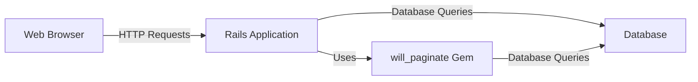
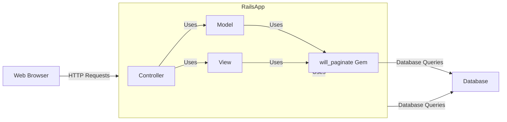
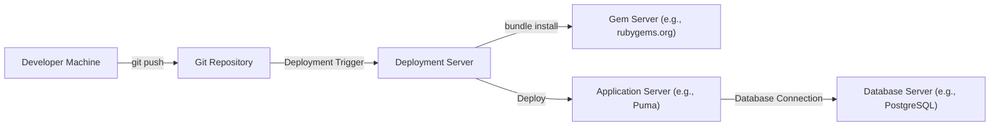
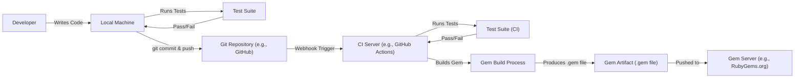

Okay, let's create a design document for the `will_paginate` Ruby gem, focusing on aspects relevant for threat modeling.

# BUSINESS POSTURE

`will_paginate` is a pagination library for Ruby on Rails (and other Ruby frameworks).  Its primary business goal is to simplify the implementation of pagination in web applications, improving user experience by breaking down large datasets into manageable pages.  It's a developer convenience tool, not a direct revenue generator, but contributes to application quality and maintainability.  Since it's an open-source library, its reputation and adoption are key.

Business Priorities:

*   Ease of Use:  The library must be simple to integrate and use.
*   Performance: Pagination should be efficient, minimizing database load and response times.
*   Compatibility:  Support a wide range of Rails versions and database adapters.
*   Maintainability:  The codebase should be clean and well-tested to facilitate ongoing maintenance and updates.
*   Community Trust:  Maintain a positive reputation within the Ruby community.

Business Risks:

*   Security Vulnerabilities:  Vulnerabilities in the library could be exploited in applications using it, potentially leading to data breaches or other security incidents. This is the most critical risk.
*   Performance Bottlenecks:  Inefficient pagination logic could lead to performance issues in applications, especially with large datasets.
*   Compatibility Issues:  Breaking changes or lack of support for newer Rails versions could disrupt existing applications.
*   Abandonment:  Lack of maintenance could lead to the library becoming obsolete and insecure.
*   Negative Community Perception:  Bugs, security issues, or poor maintainability could damage the library's reputation.

# SECURITY POSTURE

Existing Security Controls:

*   security control: Input Sanitization: The library likely uses Rails' built-in mechanisms for sanitizing user input (e.g., parameters passed to database queries) to prevent SQL injection. Implemented in Rails' ActiveRecord and potentially in `will_paginate`'s query generation logic.
*   security control: Regular Expression Validation: The library uses regular expressions to validate and parse parameters, such as the `page` parameter. Implemented in `will_paginate`'s parameter parsing logic.
*   security control: Testing: The library has a test suite to ensure functionality and potentially catch some security issues. Described in the project's test files.
*   security control: Community Scrutiny: As an open-source project, the code is subject to review by the community, which can help identify vulnerabilities.  Implicit in the open-source nature of the project.
*   security control: Dependency Management: The project uses Bundler to manage dependencies, allowing for updates to address vulnerabilities in dependent gems. Described in the `Gemfile` and `Gemfile.lock`.

Accepted Risks:

*   accepted risk: Reliance on Rails' Security: The library heavily relies on Rails' built-in security features (e.g., ActiveRecord's protection against SQL injection).  Vulnerabilities in Rails could impact `will_paginate`.
*   accepted risk: Limited Scope: The library primarily focuses on pagination logic and doesn't implement extensive security features beyond basic input validation.

Recommended Security Controls:

*   security control: Security Audits: Conduct regular security audits of the codebase, including static analysis and penetration testing.
*   security control: Vulnerability Disclosure Program: Establish a clear process for reporting and addressing security vulnerabilities.
*   security control: Content Security Policy (CSP) Compatibility: Ensure the library doesn't introduce any issues with CSP headers in applications.

Security Requirements:

*   Authentication: Not directly applicable, as `will_paginate` doesn't handle authentication.
*   Authorization: Not directly applicable, as `will_paginate` doesn't handle authorization.  Authorization should be handled by the application using `will_paginate`.
*   Input Validation:
    *   The `page` parameter must be validated to ensure it's a positive integer.
    *   Other parameters (e.g., `per_page`) should also be validated to prevent unexpected behavior or potential vulnerabilities.
*   Cryptography: Not directly applicable, as `will_paginate` doesn't handle sensitive data requiring encryption.
*   Output Encoding: Ensure that any output generated by the library is properly encoded to prevent cross-site scripting (XSS) vulnerabilities. This is primarily handled by the Rails framework, but `will_paginate` should be careful not to introduce any raw output.

# DESIGN

## C4 CONTEXT

Element Descriptions:

*   Element:
    *   Name: Web Browser
    *   Type: User
    *   Description: The user's web browser, used to access the Rails application.
    *   Responsibilities: Sending HTTP requests to the Rails application, rendering HTML responses.
    *   Security controls: Browser-based security controls (e.g., same-origin policy, XSS protection).

*   Element:
    *   Name: Rails Application
    *   Type: System
    *   Description: The web application using the `will_paginate` gem.
    *   Responsibilities: Handling user requests, interacting with the database, rendering views.
    *   Security controls: Rails' built-in security features (e.g., CSRF protection, session management), application-specific security controls.

*   Element:
    *   Name: will\_paginate Gem
    *   Type: Library
    *   Description: The pagination library.
    *   Responsibilities: Generating pagination links, modifying database queries to retrieve paginated data.
    *   Security controls: Input sanitization, regular expression validation.

*   Element:
    *   Name: Database
    *   Type: System
    *   Description: The application's database.
    *   Responsibilities: Storing and retrieving data.
    *   Security controls: Database-level security controls (e.g., access control, encryption).

## C4 CONTAINER

Element Descriptions:

* Elements outside RailsApp are the same as in C4 Context diagram.

*   Element:
    *   Name: Controller
    *   Type: Component
    *   Description: Rails controller handling user requests.
    *   Responsibilities: Receiving requests, interacting with the model, rendering views.
    *   Security controls: Input validation, authorization checks.

*   Element:
    *   Name: Model
    *   Type: Component
    *   Description: Rails model representing data.
    *   Responsibilities: Interacting with the database, encapsulating business logic.
    *   Security controls: Data validation, potentially data encryption.

*   Element:
    *   Name: View
    *   Type: Component
    *   Description: Rails view rendering the user interface.
    *   Responsibilities: Displaying data to the user.
    *   Security controls: Output encoding to prevent XSS.

*   Element:
    *   Name: will\_paginate Gem
    *   Type: Library
    *   Description: The pagination library.
    *   Responsibilities: Generating pagination links, modifying database queries to retrieve paginated data.
    *   Security controls: Input sanitization, regular expression validation.

## DEPLOYMENT

Possible Deployment Solutions:

1.  Bundler with Ruby on Rails: Standard deployment with a Ruby on Rails application.
2.  Gem Server:  Hosting the gem on a private gem server for internal use.
3.  Packaged with Application:  Including the gem's source code directly within the application.

Chosen Solution (Bundler with Ruby on Rails):

Element Descriptions:

*   Element:
    *   Name: Developer Machine
    *   Type: Workstation
    *   Description: The developer's local machine.
    *   Responsibilities: Writing code, running tests, committing changes.
    *   Security controls: Local security measures (e.g., firewall, antivirus).

*   Element:
    *   Name: Git Repository
    *   Type: Repository
    *   Description: The source code repository (e.g., GitHub, GitLab).
    *   Responsibilities: Storing code, managing versions.
    *   Security controls: Access control, branch protection rules.

*   Element:
    *   Name: Deployment Server
    *   Type: Server
    *   Description: The server responsible for deploying the application.
    *   Responsibilities: Pulling code, installing dependencies, running deployment scripts.
    *   Security controls: SSH access control, limited user permissions.

*   Element:
    *   Name: Gem Server
    *   Type: Server
    *   Description: The server hosting Ruby gems (e.g., rubygems.org).
    *   Responsibilities: Providing access to gem files.
    *   Security controls: HTTPS, gem signing (optional).

*   Element:
    *   Name: Application Server
    *   Type: Server
    *   Description: The server running the Rails application (e.g., Puma, Unicorn).
    *   Responsibilities: Handling HTTP requests, serving the application.
    *   Security controls: Firewall, reverse proxy (e.g., Nginx), TLS encryption.

*   Element:
    *   Name: Database Server
    *   Type: Server
    *   Description: The server hosting the database (e.g., PostgreSQL, MySQL).
    *   Responsibilities: Storing and retrieving data.
    *   Security controls: Database-level security controls (e.g., access control, encryption), firewall.

## BUILD

Build Process Description:

1.  Developer writes code and runs local tests.
2.  Code is committed and pushed to a Git repository (e.g., GitHub).
3.  A webhook triggers a CI server (e.g., GitHub Actions).
4.  The CI server runs the test suite.
5.  If tests pass, the CI server builds the gem using the `gemspec` file.
6.  The built gem (.gem file) is created.
7.  The gem is pushed to a gem server (e.g., RubyGems.org) or a private gem server.

Security Controls:

*   security control: Test Suite:  A comprehensive test suite helps ensure code quality and can catch some security issues.
*   security control: CI/CD Pipeline:  Automated builds and tests in a CI/CD pipeline (e.g., GitHub Actions) ensure consistency and reduce the risk of manual errors.
*   security control: Dependency Management:  Using Bundler to manage dependencies allows for easy updates to address vulnerabilities in dependent gems.
*   security control: Gem Signing (Optional):  Signing the gem can help verify its integrity and prevent tampering.
*   security control: Static Analysis (Recommended):  Integrating static analysis tools (e.g., RuboCop, Brakeman) into the CI pipeline can help identify potential security vulnerabilities.

# RISK ASSESSMENT

Critical Business Processes:

*   Serving web pages with paginated content.  The core function of any application using `will_paginate` is to display data, and pagination is a key part of that for large datasets.  Failure of pagination can lead to application unavailability or severe performance degradation.

Data to Protect and Sensitivity:

*   Database Records: `will_paginate` itself doesn't directly handle sensitive data. However, it interacts with the database, and the data being paginated *could* be sensitive, depending on the application.  The sensitivity depends entirely on the application using the gem. Examples include:
    *   User Data (High Sensitivity):  If the application is paginating a list of users, this could include personally identifiable information (PII).
    *   Financial Data (High Sensitivity):  If the application is paginating transaction records, this could include sensitive financial information.
    *   Public Content (Low Sensitivity):  If the application is paginating a list of blog posts, this data might be publicly available and therefore low sensitivity.

# QUESTIONS & ASSUMPTIONS

Questions:

*   Are there any specific compliance requirements (e.g., GDPR, PCI DSS) that apply to applications using `will_paginate`? (This would influence the sensitivity assessment of the data being paginated.)
*   What are the expected data volumes and performance requirements for applications using `will_paginate`? (This would help determine the importance of performance optimizations.)
*   Is there a specific threat model already in place for the broader Rails ecosystem that this should align with?

Assumptions:

*   BUSINESS POSTURE: The primary users of `will_paginate` are developers integrating it into their Rails applications. The main business goal is to provide a convenient and reliable pagination solution.
*   SECURITY POSTURE: The library relies heavily on Rails' built-in security features. Developers using the library are responsible for implementing appropriate security controls in their applications.
*   DESIGN: The deployment environment is a typical Rails application deployment, using Bundler to manage dependencies. The build process involves running tests and building the gem using the `gemspec` file.