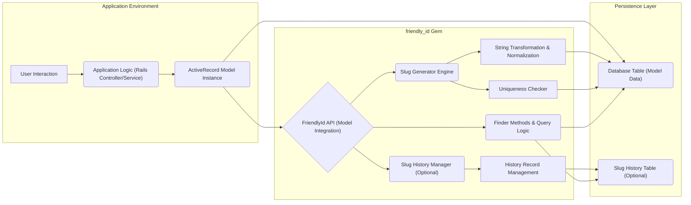
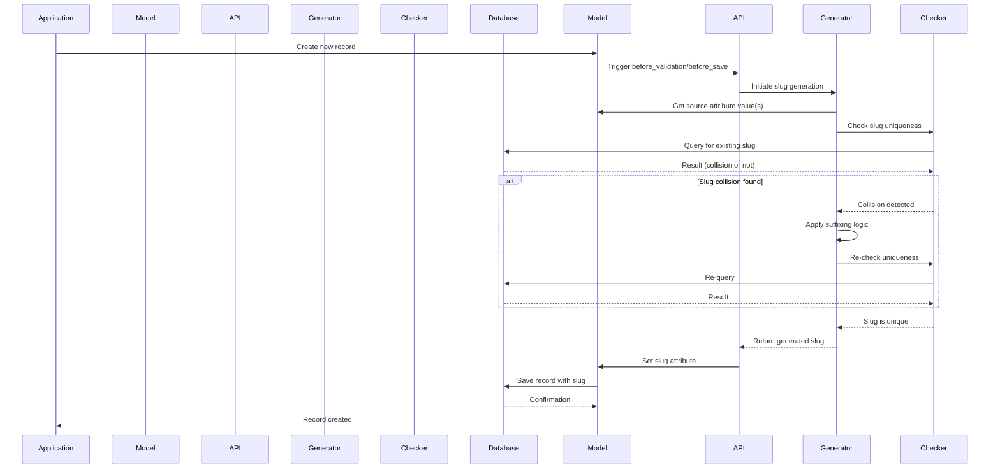
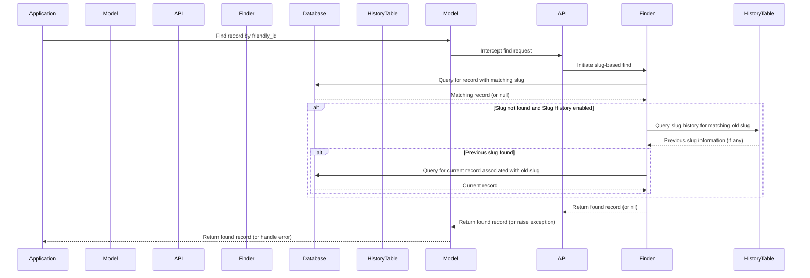

# Project Design Document: friendly_id Gem

**Version:** 1.1
**Date:** October 26, 2023
**Author:** AI Software Architect

## 1. Introduction

This document provides an enhanced and more detailed design overview of the `friendly_id` Ruby gem, building upon the previous version. This refined design will serve as a robust foundation for subsequent threat modeling activities, enabling a deeper understanding of potential security vulnerabilities and design flaws. The document comprehensively outlines the gem's purpose, architecture, key components with greater granularity, data flow with more detail, and relevant considerations for security and deployment.

## 2. Goals

* To provide a comprehensive and highly detailed architectural understanding of the `friendly_id` gem.
* To meticulously identify the key components and their intricate interactions within the gem.
* To thoroughly document the data flow and processing logic involved in both generating and utilizing friendly IDs.
* To highlight specific and potential areas of security concern for future, more targeted threat modeling.
* To illustrate the impact of configuration options on the gem's behavior and security posture.

## 3. Overview

The `friendly_id` gem is a sophisticated Ruby on Rails extension that empowers developers to effortlessly generate human-readable, URL-friendly slug identifiers for ActiveRecord models. Instead of exposing raw, sequential database IDs in URLs, which can be informative to attackers, `friendly_id` intelligently generates unique, readable slugs derived from model attributes. This significantly enhances the user experience by providing cleaner URLs and can positively impact SEO.

## 4. Architecture

The `friendly_id` gem operates as an integral middleware layer seamlessly integrated between the application's ActiveRecord models and the underlying database. It strategically intercepts requests related to creating, updating, and finding records, injecting its carefully designed slug generation and lookup logic.

### 4.1. Key Components (Detailed)

* **FriendlyId API (Model Integration):**  This is the primary interface exposed by the gem, providing methods that are seamlessly mixed into ActiveRecord models to activate friendly ID functionality. Examples include the `friendly_id` declaration and the overridden `find` method.
    *  **`friendly_id` Declaration:** Defines the source attribute(s) for slug generation, the slug generator strategy, and other configuration options.
    *  **Model Callbacks:** Leverages ActiveRecord callbacks (e.g., `before_validation`, `before_save`) to trigger `friendly_id` logic at appropriate points in the model lifecycle.
* **Slug Generator Engine:**  This component is the core of the slug generation process. It orchestrates the steps involved in creating a unique and URL-friendly slug.
    * **String Transformation & Normalization:**  Responsible for manipulating the source string extracted from the model attribute(s). This includes:
        *  **Downcasing:** Converting the string to lowercase.
        *  **Transliteration:**  Converting characters from non-Latin alphabets to their Latin equivalents.
        *  **Replacement of Special Characters:** Substituting or removing characters that are not URL-safe.
        *  **Truncation:** Limiting the length of the slug.
    * **Uniqueness Checker:** Ensures that the generated slug is unique within the specified scope (e.g., across all records of a model, or within a specific association).
        *  **Database Querying:** Performs database queries to check for existing slugs.
        *  **Suffixing Logic:** If a collision is detected, appends a suffix (e.g., a sequence number, a UUID) to the slug until a unique value is found.
* **Slug History Manager (Optional):** This component manages the optional slug history feature, allowing the tracking of slug changes over time.
    * **History Record Management:**  When a model's friendly ID source attribute changes, this component creates a new slug and manages the old slug, potentially marking it as inactive or creating a redirect.
    * **Redirection Logic:**  Provides mechanisms to redirect requests for old slugs to the current slug, preventing broken links.
* **Finder Methods & Query Logic:** This component overrides or extends ActiveRecord's find methods to enable lookups by friendly ID slugs.
    * **Slug-Based Finders:**  Provides methods like `friendly.find` that specifically search for records based on their slug.
    * **Query Construction:**  Constructs appropriate database queries to search the designated slug column.
    * **Integration with Slug History:** If enabled, incorporates logic to check the slug history table if a record is not found with the current slug.

### 4.2. Data Flow (Detailed)

The following provides a more granular view of the data flow during key operations:

#### 4.2.1. Creating a Record with a Friendly ID

* The application initiates the creation of a new record, typically through a controller action.
* The ActiveRecord model instance is instantiated and attributes are assigned.
* ActiveRecord lifecycle hooks trigger the `before_validation` or `before_save` callback registered by `friendly_id`.
* The FriendlyId API invokes the Slug Generator Engine.
* The String Transformation & Normalization sub-component retrieves the value(s) from the configured source attribute(s) of the model.
* Transformations (downcasing, transliteration, etc.) are applied to generate the initial candidate slug.
* The Uniqueness Checker queries the database to determine if a record with the generated slug already exists within the defined scope.
* **Collision Handling:**
    * If a collision is found, the Slug Generator applies a suffixing strategy (e.g., appending a sequence number).
    * The Uniqueness Checker re-queries the database with the modified slug. This process repeats until a unique slug is generated.
* The FriendlyId API sets the generated unique slug to the designated slug attribute of the ActiveRecord model.
* The ActiveRecord model proceeds with the saving process, persisting the data, including the generated slug, to the database.

#### 4.2.2. Finding a Record by Friendly ID

* The application attempts to retrieve a record using its friendly ID, often through a URL parameter.
* The overridden `find` method (or a specific finder like `friendly.find`) in the ActiveRecord model is invoked.
* The FriendlyId API intercepts the find request.
* The Finder Methods & Query Logic component constructs a database query to search for a record where the slug column matches the provided friendly ID.
* The query is executed against the database.
* **Slug History Consideration:**
    * If Slug History is enabled and a record is not found with the current slug, the component queries the Slug History Table for matching old slugs.
    * If a match is found in the history table, redirection logic might be triggered, or the associated current record might be retrieved.
* The matching record (or `nil` if not found) is returned to the ActiveRecord model.

## 5. Key Design Considerations (Expanded)

* **Slug Generation Strategy:** The chosen strategy significantly impacts URL aesthetics and potential security risks.
    * **Predictability:** Simpler strategies might lead to predictable slugs, enabling enumeration.
    * **Transliteration Accuracy:** Incorrect transliteration could lead to unintended or confusing slugs.
    * **Customization Flexibility:** The gem's ability to customize the generation process is crucial for specific application needs.
* **Uniqueness Enforcement:**  The method used to guarantee uniqueness is vital for data integrity.
    * **Scope Definition:**  Properly defining the scope of uniqueness prevents collisions within relevant contexts.
    * **Suffixing Complexity:** The complexity of the suffixing algorithm can impact performance and, in rare cases, predictability.
* **Slug History Management:**  While improving link persistence, it introduces complexity.
    * **Data Volume:**  The history table can grow large over time, requiring careful management.
    * **Query Performance:**  Efficient indexing and querying of the history table are essential.
    * **Security of History Data:**  The history data itself should be protected from unauthorized modification.
* **Customization:**  Extensive customization options offer flexibility but also increase the potential for misconfiguration.
    * **Security Implications of Custom Logic:**  Custom slug generation logic needs careful security review.
* **Performance:**  Slug generation and lookup can introduce performance overhead.
    * **Database Indexing:**  Proper indexing of the slug column is paramount.
    * **Caching Strategies:**  Consider caching frequently accessed records or slugs.
    * **Complexity of Uniqueness Checks:**  Complex uniqueness checks can lead to slower database queries.

## 6. Security Considerations (Detailed)

This section expands on potential security concerns, providing more specific examples.

* **Slug Predictability/Enumeration:**
    * **Sequential Suffixes:**  Using simple sequential numbers as suffixes makes enumeration easier. Attackers could iterate through possible IDs.
    * **Time-Based Generation:** If slugs incorporate timestamps or other predictable time-related elements, this can aid in enumeration.
    * **Insufficient Entropy:**  If custom slug generation logic lacks sufficient randomness, it might be predictable.
* **Collision Handling Vulnerabilities:**
    * **Race Conditions:**  In highly concurrent environments, race conditions during slug generation could potentially lead to non-unique slugs.
    * **Denial of Service:**  Attackers might attempt to create numerous records simultaneously to trigger excessive collision resolution logic, leading to performance degradation.
* **Information Disclosure via Slugs:**
    * **Including Sensitive Data:**  Accidentally including sensitive information (e.g., usernames, email addresses) in the slug source attribute could expose it in URLs.
    * **Inferring Information from Slug Structure:**  Even seemingly innocuous information in slugs, when combined, might allow attackers to infer sensitive details about the system or its users.
* **Denial of Service through Slug Generation:**
    * **Resource Exhaustion:**  Attackers might try to create records with source attributes that result in computationally expensive slug generation, exhausting server resources.
    * **Database Load:**  Excessive attempts to generate slugs, especially with complex uniqueness checks, can overload the database.
* **Input Validation and Sanitization:**
    * **Bypassing Transformations:**  While `friendly_id` transforms the source string, it's crucial to validate and sanitize the *input* to the model attributes to prevent injection attacks or other vulnerabilities before slug generation.
* **Slug History Manipulation (if enabled):**
    * **Unauthorized Modification:**  If the slug history table is not properly protected, attackers might be able to modify it to redirect users to malicious sites or gain unauthorized access to resources.
    * **Data Integrity Issues:**  Tampering with the history table could lead to inconsistencies and broken links.
* **Configuration Vulnerabilities:**
    * **Insecure Defaults:**  Default configuration settings might not be optimal from a security perspective.
    * **Exposed Configuration:**  If configuration details are exposed (e.g., in version control or error messages), attackers might gain insights into the slug generation process.

## 7. Deployment Considerations (Security Focused)

* **Database Schema Security:**  Ensure proper access controls and permissions are in place for the database tables used by `friendly_id` (including the optional slug history table).
* **Secure Configuration Management:**  Store `friendly_id` configuration securely and avoid hardcoding sensitive information.
* **Input Validation at the Application Layer:**  Implement robust input validation and sanitization for the model attributes used as the source for slug generation.
* **Rate Limiting:**  Consider implementing rate limiting on record creation endpoints to mitigate potential DoS attacks related to slug generation.
* **Monitoring and Logging:**  Monitor database performance and application logs for suspicious activity related to slug generation or access.

## 8. Dependencies

* **Ruby on Rails:**  The gem is tightly integrated with the Rails framework.
* **ActiveRecord:**  Relies heavily on ActiveRecord for ORM functionality.
* **Stringex (Optional):**  Provides extended string manipulation capabilities for certain slug generation configurations. Ensure this dependency is up-to-date and free of known vulnerabilities.

## 9. Future Considerations

* **More Advanced Uniqueness Strategies:** Explore more sophisticated and performant uniqueness algorithms.
* **Built-in Security Features:**  Consider adding features like rate limiting or mechanisms to detect and prevent slug enumeration attempts.
* **Improved Error Handling and Logging:**  Enhance error handling and logging to provide more detailed information for debugging and security analysis.
* **Auditing Capabilities:**  Potentially add features to audit changes to slugs and the slug history.

This improved design document offers a more in-depth understanding of the `friendly_id` gem, providing a stronger foundation for comprehensive threat modeling and security analysis. The added detail regarding components, data flow, and security considerations will enable a more targeted and effective identification of potential vulnerabilities.
