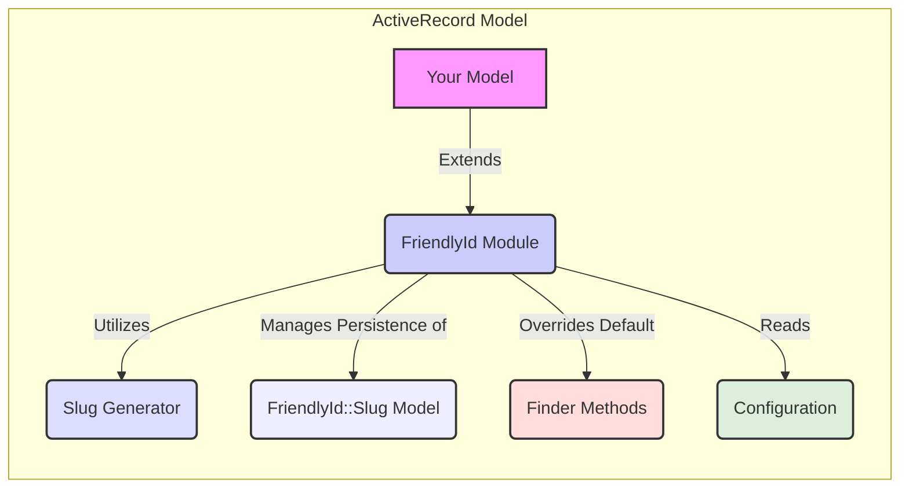
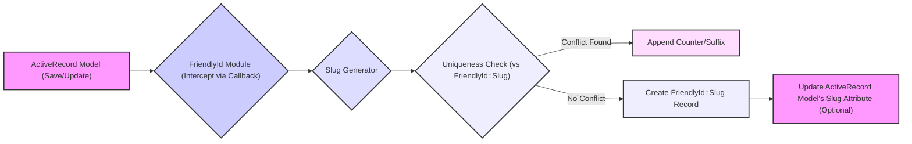

# Project Design Document: FriendlyId Gem (Improved)

**Version:** 1.1
**Date:** October 26, 2023
**Author:** AI Software Architect

## 1. Introduction

This document provides an enhanced design overview of the `friendly_id` Ruby gem, specifically tailored for subsequent threat modeling activities. Building upon the initial design, this version offers more detailed explanations and clarifies potential security implications. It outlines the key components, architecture, and data flow within the gem, facilitating a deeper understanding of its functionality and associated security considerations.

## 2. Goals

*   Provide a clear, concise, and comprehensive description of the `friendly_id` gem's architecture and functionality.
*   Clearly identify the key components and articulate their interactions and responsibilities.
*   Illustrate the data flow within the gem during critical operations with enhanced clarity.
*   Highlight potential areas of security concern with more specific examples for future threat modeling exercises.

## 3. Overview of FriendlyId

The `friendly_id` gem is a powerful extension for Ruby on Rails' ActiveRecord models, enabling the use of human-readable and URL-friendly strings (slugs) as identifiers in place of numeric IDs. This significantly improves user experience by creating more intuitive and memorable URLs, and it also benefits Search Engine Optimization (SEO). The gem offers robust mechanisms for generating unique slugs, efficiently finding records by their slugs, and managing slug changes over time, including the option to maintain a history of old slugs for redirection purposes. It also supports scoped slugs, allowing for unique slugs within a specific context.

## 4. System Architecture

The `friendly_id` gem operates as an extension to ActiveRecord models, injecting its functionality through a module inclusion. This tight integration allows for seamless interaction with the model lifecycle and database operations.

### 4.1. Key Components

*   **FriendlyId Module:** This is the central module that is included within ActiveRecord models using the `extend FriendlyId` directive. It acts as the primary interface for configuring and utilizing friendly IDs. It defines the DSL for specifying the attribute to base the slug on, handling reserved words, and configuring slug generation options. It also orchestrates the interactions between other components.
*   **Slug Generator:** This component is responsible for the core logic of transforming an input string (typically an attribute of the model) into a valid URL slug. It handles tasks like downcasing, replacing spaces with hyphens, removing special characters, and ensuring uniqueness. The gem provides default generators, and developers can implement custom generators for specific needs.
*   **Slug Model (`FriendlyId::Slug`):** This ActiveRecord model serves as the persistent storage for the generated slugs. Each slug record stores the actual slug string, the associated parent model's ID, the class name of the parent model (for polymorphic associations if needed), and optionally a scope value for scoped slugs. This separation allows for efficient querying and management of slugs.
*   **Finder Methods:** The `friendly_id` module strategically overrides the default `find` method inherited from ActiveRecord. This override enables the gem to transparently handle lookups by either the numeric ID or the friendly slug. It also introduces specialized finder methods like `friendly.find` and `friendly.find!` that explicitly target slug-based lookups, providing clarity and control.
*   **Configuration:**  Configuration options are defined within the model that includes `FriendlyId`. This configuration dictates how slugs are generated, which words are considered reserved and should be avoided, whether to use slug history, and other behavioral aspects of the gem. This allows for per-model customization of friendly ID behavior.
*   **History (Optional):** When enabled, `friendly_id` maintains a record of previously used slugs for a given record in the `FriendlyId::Slug` table. This is crucial for ensuring that old URLs continue to work even after a record's slug has been changed, typically by redirecting requests for old slugs to the current one.

### 4.2. Component Diagram



## 5. Data Flow

### 5.1. Slug Generation (Detailed)

1. When a new record is created or when an attribute designated for slug generation is updated within an ActiveRecord model instance, the ActiveRecord lifecycle triggers a `save` operation.
2. The `FriendlyId` module, having been included in the model, intercepts this `save` operation through ActiveRecord callbacks (specifically, before\_validation or before\_save).
3. The configured `Slug Generator` is invoked. It receives the value of the attribute specified in the `friendly_id` configuration (e.g., the title of a blog post).
4. The `Slug Generator` applies its transformation logic to the input string. This typically involves:
    *   Lowercasing the string.
    *   Replacing spaces and other non-alphanumeric characters with hyphens.
    *   Removing or replacing special characters.
    *   Potentially truncating the slug to a maximum length.
5. The `FriendlyId` module checks for slug uniqueness. If a similar slug already exists (optionally within the specified scope), it appends a separator and a counter (e.g., `-2`) to ensure uniqueness.
6. A new `FriendlyId::Slug` record is created in the database. This record stores the generated slug, the ID of the parent model, and potentially the scope value.
7. The parent model's designated slug attribute (if one is configured to mirror the slug) is updated with the final generated slug value.



### 5.2. Finding a Record by Slug (Detailed)

1. An incoming web request arrives at the Rails application, with the URL potentially containing a friendly slug in place of a numeric ID.
2. The Rails routing mechanism interprets the URL and maps it to a specific controller action.
3. Within the controller action, code attempts to retrieve a model record, often using the `find` method on the model class, passing the slug value as the argument (e.g., `Article.find('my-article-slug')`).
4. The `friendly_id` module's overridden `find` method intercepts this call.
5. The overridden `find` method first queries the `FriendlyId::Slug` table to find a slug record that matches the provided slug string and the model's class name (and scope, if applicable).
6. If a matching slug record is found:
    *   The associated parent model's ID is extracted from the slug record.
    *   The original `find` method (or a similar mechanism) is then used to retrieve the actual model record from its primary table using this ID.
7. If no matching slug record is found, and slug history is enabled:
    *   The `FriendlyId::Slug` table is queried for historical slugs that match the provided slug and belong to the same record.
    *   If a historical slug is found, the application might perform a redirect to the current, correct slug for that record.
8. If no matching current or historical slug is found, the `find` method will typically raise an `ActiveRecord::RecordNotFound` exception.

```mermaid
graph LR
    A["Incoming Request (with Slug)"] --> B["Rails Routing"]
    B --> C["Controller Action (Model.find(slug))"]
    C --> D{"FriendlyId Module (Overridden find)"}
    D -- "Query FriendlyId::Slug for Current Slug" --> E["FriendlyId::Slug Model (Lookup)"]
    E -- "Match Found" --> F["Extract Parent ID"]
    F --> G["ActiveRecord Model (Find by ID)"]
    E -- "No Match, History Enabled" --> H["Query FriendlyId::Slug for Historical Slugs"]
    H -- "Historical Match Found" --> I["Perform Redirect to Current Slug"]
    H -- "No Historical Match" --> J["Raise ActiveRecord::RecordNotFound"]
    E -- "No Match, History Disabled" --> J
    style A fill:#afa,stroke:#333,stroke-width:2px
    style B fill:#bbb,stroke:#333,stroke-width:2px
    style C fill:#ccc,stroke:#333,stroke-width:2px
    style D fill:#ccf,stroke:#333,stroke-width:2px
    style E fill:#eef,stroke:#333,stroke-width:2px
    style F fill:#cdf,stroke:#333,stroke-width:2px
    G fill:#f9f,stroke:#333,stroke-width:2px
    style H fill:#eef,stroke:#333,stroke-width:2px
    style I fill:#ddf,stroke:#333,stroke-width:2px
    style J fill:#fdd,stroke:#333,stroke-width:2px
```

## 6. Security Considerations (Detailed)

These are more specific security considerations to be addressed during threat modeling:

*   **Slug Predictability/Enumeration:**
    *   If the slug generation logic is based on easily guessable patterns (e.g., sequential numbers appended to titles), attackers might be able to enumerate valid slugs and potentially access or infer the existence of resources they shouldn't.
    *   Consider the entropy of the slug generation process. Using UUIDs or more complex hashing mechanisms can mitigate this.
*   **Slug Conflicts and Manipulation:**
    *   How robust is the mechanism for preventing slug collisions? If not handled correctly, it could lead to data integrity issues or denial-of-service if attackers can intentionally create conflicting slugs.
    *   If the slug attribute is directly mass-assignable without proper sanitization, attackers could potentially overwrite existing slugs, leading to broken links or access control issues.
*   **SQL Injection Vulnerabilities:**
    *   While `friendly_id` itself aims to prevent direct SQL injection, vulnerabilities could arise if slug values are used in custom SQL queries without proper sanitization or parameterization.
    *   Care must be taken when using slug values in `where` clauses or other database interactions outside of the gem's built-in methods.
*   **Denial of Service (DoS):**
    *   If the slug generation process is computationally expensive (e.g., involving complex string manipulations or external API calls), an attacker could potentially create a large number of records to exhaust server resources.
    *   Consider rate-limiting or background job processing for slug generation in high-volume scenarios.
*   **Information Disclosure through Slugs:**
    *   Avoid including sensitive information directly in the slug (e.g., usernames, internal IDs). Slugs are often visible in URLs and can be indexed by search engines.
*   **Handling of Reserved Words and Routing Conflicts:**
    *   Ensure that the gem's reserved word handling is comprehensive and prevents conflicts with existing application routes or critical functionality. Improper handling could lead to unexpected behavior or security vulnerabilities.
*   **Slug History and Redirection Security:**
    *   While slug history is beneficial for usability, ensure that redirects are handled securely to prevent open redirect vulnerabilities.
    *   Consider the potential for attackers to manipulate historical slugs for phishing or other malicious purposes if not implemented carefully.
*   **Case Sensitivity and Encoding:**
    *   Be aware of how the database and application handle case sensitivity and character encoding for slugs. Inconsistencies could lead to bypasses or unexpected behavior.

## 7. Dependencies

*   **Ruby on Rails:** The gem is tightly coupled with the Rails framework and its conventions.
*   **ActiveRecord:**  It relies extensively on ActiveRecord for model interactions, database schema management, and data persistence.
*   **Database Adapter:** The specific database adapter used (e.g., PostgreSQL, MySQL, SQLite) can influence aspects like case sensitivity and character encoding, which are relevant to slug handling.

## 8. Future Considerations

*   **More Sophisticated Slug Generation Strategies:** Exploring and implementing more advanced slug generation techniques, potentially incorporating machine learning or natural language processing, while carefully considering the security implications of increased complexity.
*   **Integration with Content Delivery Networks (CDNs):**  Consider how `friendly_id` interacts with CDNs and caching mechanisms, particularly regarding slug updates and redirects.
*   **Enhanced Security Auditing and Logging:**  Adding more detailed logging around slug generation, updates, and lookups could aid in security monitoring and incident response.

This improved document provides a more in-depth understanding of the `friendly_id` gem's design and highlights specific areas of potential security concern. This enhanced information will be invaluable for conducting a more thorough and effective threat modeling exercise.