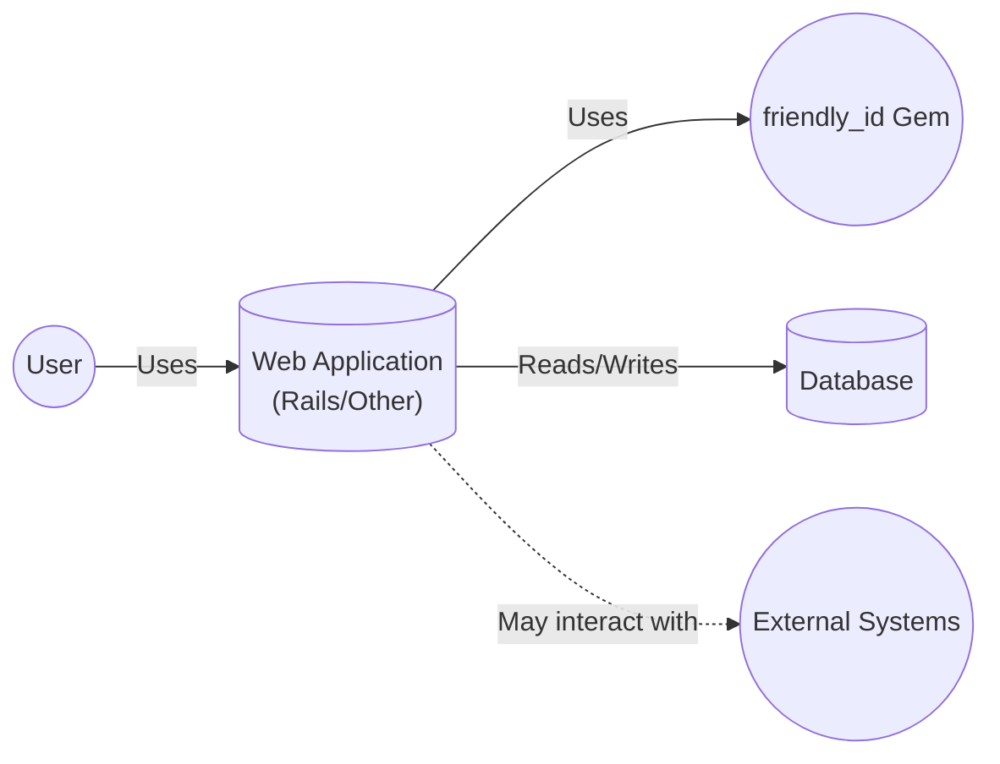
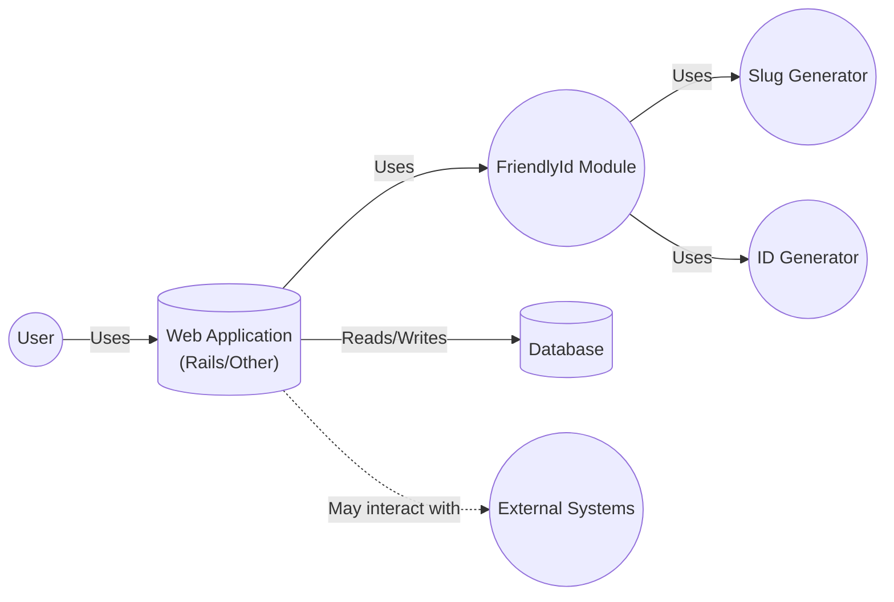
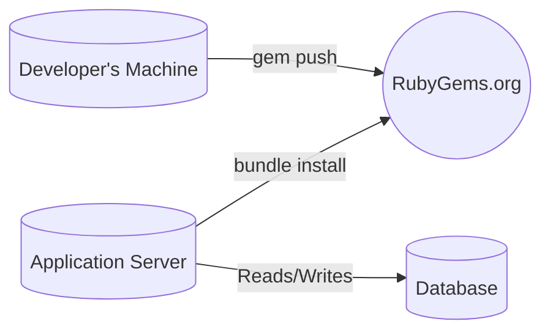

Okay, let's create a design document for the `friendly_id` Ruby gem, focusing on aspects relevant to threat modeling.

# BUSINESS POSTURE

Business Priorities and Goals:

*   Provide a user-friendly and developer-friendly way to generate slugs and human-readable IDs in Ruby applications (primarily Rails, but also supports other ORMs).
*   Improve the user experience by replacing numerical IDs in URLs with more descriptive and memorable text.
*   Enhance SEO by using keyword-rich slugs in URLs.
*   Offer a flexible and customizable solution that can adapt to various application needs (e.g., different slugging methods, custom ID sequences).
*   Maintain a well-tested and reliable library to minimize bugs and regressions.
*   Provide good documentation and support to the user community.

Business Risks:

*   Data integrity: Incorrect slug generation or ID collisions could lead to data corruption or unexpected application behavior.
*   Availability: Bugs or performance issues in the library could impact the availability of applications that depend on it.
*   Reputation: Security vulnerabilities or data breaches related to the library could damage the reputation of the library and its maintainer, as well as applications using it.
*   Maintainability: Lack of proper code structure, tests, or documentation could make it difficult to maintain and evolve the library over time.

# SECURITY POSTURE

Existing Security Controls:

*   security control: Test Suite: The project has a comprehensive test suite (RSpec) that covers various scenarios and edge cases. This helps prevent regressions and ensures the library functions as expected. (Described in the `spec` directory and executed via `rake`).
*   security control: Code Reviews: Contributions to the project are likely subject to code reviews by the maintainer(s) before being merged. (Implicit in the GitHub workflow).
*   security control: Static Analysis (RuboCop): The project uses RuboCop for static code analysis, enforcing coding style and identifying potential code quality issues. (Defined in `.rubocop.yml` and executed via `rake`).
*   security control: Dependency Management (Bundler): The project uses Bundler to manage its dependencies, ensuring consistent and reproducible builds. (Defined in `Gemfile` and `Gemfile.lock`).
*   security control: Semantic Versioning: The project follows semantic versioning principles, helping users understand the impact of updates and avoid breaking changes.

Accepted Risks:

*   accepted risk: Limited Input Validation: While the library handles some input sanitization (e.g., removing special characters), it relies on the application to provide reasonably well-formed input. It doesn't perform extensive validation to prevent all possible malicious inputs.
*   accepted risk: Potential for ID Collisions (with very low probability): Although the library uses a combination of timestamps and random numbers to generate unique IDs, there's a theoretical (extremely small) chance of collisions, especially in high-concurrency scenarios or when using custom sequence generators.
*   accepted risk: Reliance on Underlying Libraries: The library depends on other gems (e.g., `activemodel`, `activesupport`). Vulnerabilities in these dependencies could potentially affect the security of `friendly_id`.

Recommended Security Controls:

*   security control: Security Audits: Conduct regular security audits of the codebase and its dependencies to identify potential vulnerabilities.
*   security control: Fuzz Testing: Implement fuzz testing to explore edge cases and unexpected inputs that might not be covered by the existing test suite.
*   security control: Dependency Monitoring: Use automated tools to monitor dependencies for known vulnerabilities and apply updates promptly.

Security Requirements:

*   Authentication: Not directly applicable, as the library itself doesn't handle authentication.
*   Authorization: Not directly applicable, as the library itself doesn't handle authorization.
*   Input Validation:
    *   The library should handle invalid characters in input strings gracefully, either by removing them or replacing them with safe alternatives.
    *   The library should have reasonable limits on the length of input strings to prevent potential denial-of-service attacks.
    *   Consider adding options for stricter input validation based on application-specific requirements (e.g., allowing only alphanumeric characters and hyphens).
*   Cryptography:
    *   If custom sequence generators are used, ensure they use a cryptographically secure random number generator (CSPRNG) to minimize the risk of ID prediction.
*   Data Integrity
    *   Ensure that generated slugs and IDs are unique within the defined scope (e.g., per model or table).
    *   Provide mechanisms to handle potential ID collisions gracefully (e.g., retrying with a different ID).

# DESIGN

## C4 CONTEXT



Element Descriptions:

*   Element:
    *   Name: User
    *   Type: Person
    *   Description: A person interacting with the web application.
    *   Responsibilities: Browsing the application, accessing content via URLs.
    *   Security controls: Browser security settings, user awareness.

*   Element:
    *   Name: Web Application (Rails/Other)
    *   Type: Software System
    *   Description: The application that uses the `friendly_id` gem.
    *   Responsibilities: Handling user requests, generating responses, interacting with the database, using `friendly_id` to generate slugs and friendly IDs.
    *   Security controls: Authentication, authorization, input validation, output encoding, session management, etc. (application-specific).

*   Element:
    *   Name: friendly\_id Gem
    *   Type: Library
    *   Description: The `friendly_id` gem itself.
    *   Responsibilities: Providing methods for generating slugs and friendly IDs, interacting with the application's models and database.
    *   Security controls: Input sanitization, test suite, code reviews, static analysis.

*   Element:
    *   Name: Database
    *   Type: Database System
    *   Description: The database used by the web application.
    *   Responsibilities: Storing application data, including slugs and friendly IDs.
    *   Security controls: Access control, encryption at rest, encryption in transit, auditing, etc. (database-specific).

*   Element:
    *   Name: External Systems
    *   Type: Software System
    *   Description: Any external systems the web application might interact with (e.g., payment gateways, third-party APIs).
    *   Responsibilities: Varies depending on the specific external system.
    *   Security controls: Varies depending on the specific external system.

## C4 CONTAINER



Element Descriptions:

*   Element:
    *   Name: User
    *   Type: Person
    *   Description: A person interacting with the web application.
    *   Responsibilities: Browsing the application, accessing content via URLs.
    *   Security controls: Browser security settings, user awareness.

*   Element:
    *   Name: Web Application (Rails/Other)
    *   Type: Software System
    *   Description: The application that uses the `friendly_id` gem.
    *   Responsibilities: Handling user requests, generating responses, interacting with the database, using `friendly_id` to generate slugs and friendly IDs.
    *   Security controls: Authentication, authorization, input validation, output encoding, session management, etc. (application-specific).

*   Element:
    *   Name: FriendlyId Module
    *   Type: Module
    *   Description: Main module of friendly\_id gem.
    *   Responsibilities: Providing methods for generating slugs and friendly IDs, interacting with the application's models and database.
    *   Security controls: Input sanitization, test suite, code reviews, static analysis.

*   Element:
    *   Name: Slug Generator
    *   Type: Module
    *   Description: Module responsible for generating slugs.
    *   Responsibilities: Generate slugs from input strings.
    *   Security controls: Input sanitization.

*   Element:
    *   Name: ID Generator
    *   Type: Module
    *   Description: Module responsible for generating friendly IDs.
    *   Responsibilities: Generate friendly IDs.
    *   Security controls: Use of CSPRNG if custom sequence generators are used.

*   Element:
    *   Name: Database
    *   Type: Database System
    *   Description: The database used by the web application.
    *   Responsibilities: Storing application data, including slugs and friendly IDs.
    *   Security controls: Access control, encryption at rest, encryption in transit, auditing, etc. (database-specific).

*   Element:
    *   Name: External Systems
    *   Type: Software System
    *   Description: Any external systems the web application might interact with (e.g., payment gateways, third-party APIs).
    *   Responsibilities: Varies depending on the specific external system.
    *   Security controls: Varies depending on the specific external system.

## DEPLOYMENT

Possible Deployment Solutions:

1.  RubyGems Deployment: The standard way to deploy Ruby gems.
2.  Bundler with Git: Deploying directly from the Git repository using Bundler.
3.  Private Gem Server: Deploying to a private gem server (e.g., Gemfury, a custom gem server).

Chosen Solution (RubyGems Deployment):



Element Descriptions:

*   Element:
    *   Name: Developer's Machine
    *   Type: Workstation
    *   Description: The machine where the gem is developed and built.
    *   Responsibilities: Writing code, running tests, building the gem, pushing the gem to RubyGems.org.
    *   Security controls: Local security measures (e.g., firewall, antivirus), secure coding practices.

*   Element:
    *   Name: RubyGems.org
    *   Type: Package Repository
    *   Description: The public RubyGems repository.
    *   Responsibilities: Hosting the gem, providing it for download via Bundler.
    *   Security controls: RubyGems.org's security measures (e.g., access control, vulnerability scanning).

*   Element:
    *   Name: Application Server
    *   Type: Server
    *   Description: The server where the application that uses the gem is deployed.
    *   Responsibilities: Running the application, fetching dependencies (including `friendly_id`) via Bundler.
    *   Security controls: Server security measures (e.g., firewall, intrusion detection, regular updates).

*   Element:
    *   Name: Database
    *   Type: Database System
    *   Description: The database used by the web application.
    *   Responsibilities: Storing application data, including slugs and friendly IDs.
    *   Security controls: Access control, encryption at rest, encryption in transit, auditing, etc. (database-specific).

## BUILD

```mermaid
graph LR
    Developer[("Developer")]
    LocalMachine[("Local Machine")]
    GitHub[("GitHub Repository")]
    CI[("CI Server\n(GitHub Actions)")]
    RubyGems(("RubyGems.org"))
    Artifacts(("Build Artifacts\n(.gem file)")]

    Developer -- "Writes Code & Tests" --> LocalMachine
    LocalMachine -- "Commits & Pushes" --> GitHub
    GitHub -- "Triggers Build" --> CI
    CI -- "Runs Tests (RSpec)" --> CI
    CI -- "Runs Static Analysis (RuboCop)" --> CI
    CI -- "Builds Gem" --> Artifacts
    CI -- "Pushes Gem (if tagged)" --> RubyGems
```

Build Process Description:

1.  Developer writes code and tests on their local machine.
2.  Code is committed and pushed to the GitHub repository.
3.  GitHub Actions (or another CI system) is triggered by the push.
4.  The CI server runs the test suite (RSpec) to ensure code quality.
5.  The CI server runs static analysis (RuboCop) to enforce coding standards.
6.  If all tests and checks pass, the CI server builds the gem file (`.gem`).
7.  If the commit is tagged (indicating a release), the CI server pushes the gem to RubyGems.org.

Security Controls in Build Process:

*   security control: Test Suite (RSpec): Ensures code quality and prevents regressions.
*   security control: Static Analysis (RuboCop): Enforces coding standards and identifies potential code quality issues.
*   security control: CI/CD (GitHub Actions): Automates the build and testing process, ensuring consistency and reducing manual errors.
*   security control: Gated Check-ins: The CI build must pass before code can be merged into the main branch (enforced by GitHub branch protection rules).
*   security control: Signed Commits (Optional): Developers can sign their commits using GPG keys to verify their identity and prevent tampering.
*   security control: RubyGems.org API Key: The API key used to push gems to RubyGems.org should be kept secret and stored securely (e.g., as a GitHub Actions secret).

# RISK ASSESSMENT

Critical Business Processes:

*   Generating user-friendly URLs for content.
*   Maintaining data integrity related to slugs and IDs.
*   Ensuring the availability and performance of applications using the gem.

Data to Protect:

*   Slugs (Medium Sensitivity): While slugs are often publicly visible, they can contain information about the content they represent.  Incorrect or manipulated slugs could lead to broken links or expose unintended content.
*   IDs (Low Sensitivity): Friendly IDs are generally considered low sensitivity, as they are often just replacements for numerical IDs. However, if custom sequence generators are used that leak information, the sensitivity could be higher.
*   Source Code (Medium Sensitivity): The source code of the gem itself should be protected from unauthorized modification.
*   RubyGems.org API Key (High Sensitivity): This key allows publishing new versions of the gem and should be kept strictly confidential.

# QUESTIONS & ASSUMPTIONS

Questions:

*   Are there any specific regulatory or compliance requirements that apply to applications using this gem (e.g., GDPR, CCPA)?
*   What are the expected concurrency levels for applications using this gem? This can help assess the risk of ID collisions.
*   Are there any plans to add new features or functionalities to the gem that might introduce new security considerations?
*   What is the process for handling security vulnerabilities reported by users or researchers?
*   Are there any specific security concerns or requirements from users of the gem?

Assumptions:

*   BUSINESS POSTURE: The primary goal is to provide a user-friendly and developer-friendly way to generate slugs and friendly IDs.
*   BUSINESS POSTURE: The maintainer(s) of the gem are committed to maintaining its security and quality.
*   SECURITY POSTURE: The application using the gem is responsible for its own overall security (authentication, authorization, etc.).
*   SECURITY POSTURE: The application using the gem will provide reasonably well-formed input to the library.
*   DESIGN: The gem is primarily used in Ruby on Rails applications, but also supports other ORMs.
*   DESIGN: The gem is deployed via RubyGems.org.
*   DESIGN: The build process is automated using GitHub Actions.