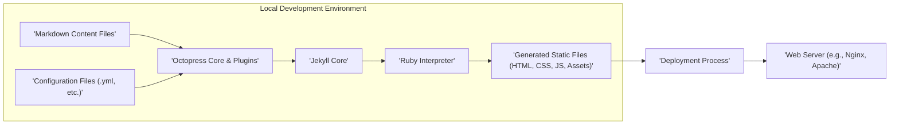
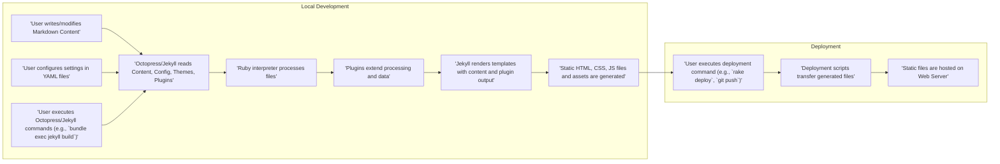

# Project Design Document: Octopress Static Site Generator

**Version:** 1.1
**Date:** October 26, 2023
**Author:** AI Software Architect

## 1. Introduction

This document provides an enhanced and detailed design overview of Octopress, a static site generator framework built upon the foundation of Jekyll. The primary objective is to offer a clear and comprehensive understanding of Octopress's architecture, its constituent components, and the flow of data during the site generation and deployment processes. This detailed design serves as a critical foundation for subsequent threat modeling activities, enabling a more focused and effective security analysis.

## 2. Goals

*   Deliver a refined and more detailed architectural overview of Octopress, clarifying the relationships between its core elements.
*   Provide enhanced descriptions of key components, elaborating on their specific functions and responsibilities within the system.
*   Present a more granular depiction of the data flow within the Octopress generation and deployment lifecycle, highlighting key transformation points.
*   Strengthen the document's utility as a basis for future threat modeling, offering specific areas of focus for security analysis.
*   Provide a more comprehensive description of typical deployment scenarios, outlining the steps involved in each method.

## 3. Non-Goals

*   Exhaustive analysis of every available plugin or extension for Octopress. The focus remains on the core framework and commonly used extensions where relevant to the overall architecture.
*   In-depth, line-by-line code-level examination of the Octopress codebase. This document focuses on the architectural design and interactions.
*   Detailed performance benchmarking, optimization techniques, or scalability considerations for Octopress.
*   Step-by-step instructions for the installation, configuration, or daily usage of Octopress. Users should refer to the official Octopress documentation for such guidance.

## 4. Architectural Overview

Octopress functions as a static site generator, transforming content authored in Markdown, along with predefined templates and configurations, into a fully functional static website. The fundamental process involves converting source files into standard web technologies: HTML for structure, CSS for styling, and JavaScript for interactivity. These generated files are then ready for deployment to a web server.

## 5. Detailed Design

### 5.1. Components

*   **Markdown Content Files:** Plain text files authored using Markdown syntax. These files contain the core content of the website, including blog posts, static pages, and other textual information. They represent the primary input for the site generation process.
*   **Configuration Files:** YAML-formatted files (e.g., `_config.yml`, plugin-specific configurations). These files define global site settings (title, URL), theme selection, plugin activation and configuration, navigation menus, and other customizable aspects of the website.
*   **Octopress Core:** A collection of Ruby scripts, Rake tasks, and supporting files that extend the base functionality provided by Jekyll. Octopress provides features like enhanced theming capabilities, simplified plugin management, and streamlined deployment workflows. It acts as a layer on top of Jekyll.
*   **Jekyll Core:** The underlying static site generator engine written in Ruby. Jekyll is responsible for the core transformation logic: reading source files, applying templates, and generating the final static website. Octopress leverages Jekyll's core functionalities.
*   **Ruby Interpreter:** The runtime environment necessary to execute the Ruby code that constitutes Octopress and Jekyll. A specific version of Ruby and its associated libraries (gems) are required for the framework to function correctly.
*   **Plugins:** Optional Ruby gems that extend the capabilities of both Octopress and Jekyll. Plugins can add features such as syntax highlighting for code blocks, integration with social media platforms, generation of sitemaps, custom tag support, and various other enhancements.
*   **Themes:** Collections of templates (primarily Liquid templates), stylesheets (CSS files), and potentially JavaScript files that define the visual design and layout of the generated website. Themes dictate the overall look and feel of the site.
*   **Generated Static Files:** The output of the Octopress generation process. This includes HTML files for each page and post, CSS stylesheets for styling, JavaScript files for interactivity, and associated assets like images, fonts, and other media. These are the files deployed to the web server.
*   **Deployment Scripts/Tools:** Scripts or command-line tools used to transfer the generated static files from the local development environment to the target web server or hosting platform. Common examples include `rsync`, `scp`, Git commands for platforms like GitHub Pages, or platform-specific deployment CLIs.
*   **Web Server:** The server software (e.g., Nginx, Apache) or cloud-based hosting service (e.g., AWS S3, Netlify, Vercel) that hosts the generated static files and serves them to website visitors upon request. The web server is responsible for making the website accessible on the internet.
*   **Git Repository (Optional but Common):** A version control system (using Git) to manage the Octopress project's source files, configuration, themes, and potentially the generated output. Git facilitates collaboration, tracks changes, and is often integrated with deployment workflows.

### 5.2. Data Flow

The process of generating and deploying an Octopress website involves a distinct flow of data through various stages:

**Detailed Steps:**

1. **Content Creation:** A user authors or modifies website content using Markdown syntax in designated files.
2. **Configuration:** The user adjusts site-wide settings, theme options, and plugin configurations within YAML files.
3. **Generation Command:** The user initiates the site generation process by executing an Octopress or Jekyll command-line instruction (e.g., `bundle exec jekyll build` is a common command when using Bundler for dependency management).
4. **File Reading and Parsing:** Octopress and Jekyll read and parse the Markdown content files, YAML configuration files, theme templates (written in Liquid), and plugin code.
5. **Processing with Ruby:** The Ruby interpreter executes the Octopress and Jekyll code, processing the input files according to the defined logic and configurations.
6. **Plugin Execution and Data Manipulation:** During the processing stage, registered plugins are executed. These plugins can modify content, generate new data, or perform other transformations based on their functionality.
7. **Template Rendering:** Jekyll utilizes the templates from the active theme, combined with the processed content and any data generated by plugins, to render the final HTML structure of each page. CSS is applied for styling, and JavaScript is included for dynamic behavior.
8. **Static File Output:** The result of the rendering process is a collection of static files: HTML files for each page, CSS stylesheets, JavaScript files, and any associated assets (images, fonts, etc.). These files represent the complete website.
9. **Deployment Command:** The user executes a deployment command. This command can vary depending on the chosen deployment strategy (e.g., `rake deploy` for Octopress's built-in deployment tasks, `git push` for platforms like GitHub Pages or Netlify).
10. **File Transfer:** Deployment scripts or tools are invoked to transfer the generated static files from the local development environment to the designated web server or hosting platform. The method of transfer depends on the chosen deployment strategy (e.g., `rsync` over SSH, pushing to a Git repository).
11. **Hosting and Serving:** The web server receives the transferred static files and hosts them, making the website accessible to users on the internet. When a user requests a page, the web server serves the corresponding static HTML file along with associated CSS, JavaScript, and assets.

### 5.3. Key Interactions

*   **User <-> Local Development Environment:** The user interacts with the local environment by creating and modifying content, configuring the site, and executing commands to generate and deploy the website.
*   **Octopress Core <-> Jekyll Core:** Octopress builds upon and extends the core functionalities of Jekyll. Octopress relies on Jekyll for the fundamental static site generation process.
*   **Octopress/Jekyll <-> Ruby Interpreter:** The Ruby interpreter is the essential runtime environment for executing the Ruby code that powers both Octopress and Jekyll.
*   **Octopress/Jekyll <-> Plugins:** Plugins provide a mechanism to extend the functionality of the core framework. Octopress and Jekyll interact with plugins during the site generation process.
*   **Local Development Environment <-> Deployment Process:** The generated static files are transferred from the local machine to the deployment environment through various methods.
*   **Deployment Process <-> Web Server:** The deployment process is responsible for placing the generated static files onto the target web server or hosting platform.
*   **Web Server <-> Website Visitors:** The web server serves the static files to users who access the website through their web browsers.

## 6. Security Considerations (High-Level)

While the primary focus of this document is architectural design, it's crucial to highlight key security considerations that are relevant for subsequent threat modeling:

*   **Dependency Vulnerabilities:** Octopress and its plugins rely on Ruby gems. Vulnerabilities discovered in these dependencies could introduce security risks if not promptly addressed through updates.
*   **Third-Party Plugin Security:** The security of third-party plugins is a significant concern. Malicious or poorly written plugins could introduce vulnerabilities such as cross-site scripting (XSS) risks or expose sensitive information.
*   **Configuration Management:** Misconfigured settings, such as exposing sensitive API keys or using default credentials, can create security vulnerabilities. Secure configuration practices are essential.
*   **Deployment Pipeline Security:** The deployment process itself can be a target for attacks. Compromised credentials used for deployment or insecure transfer protocols could lead to unauthorized modification of the website.
*   **Web Server Security:** The security configuration of the web server hosting the static files is paramount. Vulnerabilities in the web server software or misconfigurations can expose the website to attacks.
*   **Content Security:** While static sites are generally less susceptible to server-side injection attacks, vulnerabilities can still arise from user-generated content (if allowed), insecurely included JavaScript, or reliance on external resources served over insecure protocols (HTTP).
*   **Supply Chain Security:**  The security of the tools and processes used to build and deploy Octopress sites (e.g., RubyGems, package managers) is a consideration. Compromises in these areas could have downstream security implications.

## 7. Deployment Scenarios

Octopress generated sites are commonly deployed using several methods:

*   **Direct File Transfer (using `rsync`, `scp`, FTP):** This involves directly copying the generated static files to the web server using tools like `rsync` over SSH, `scp`, or FTP. This method provides direct control but requires manual configuration and management of the server.
*   **GitHub Pages:** By pushing the Octopress project's source code or the generated static files to a designated GitHub repository, GitHub Pages automatically builds (if source is pushed) and serves the static website. This is a popular and straightforward option for hosting static sites.
*   **Netlify/Vercel (Continuous Deployment):** Connecting the Octopress repository to platforms like Netlify or Vercel enables automated builds and deployments whenever changes are pushed to the repository. These platforms offer features like CDN integration, HTTPS by default, and easy rollback capabilities.
*   **Cloud Storage (e.g., AWS S3, Google Cloud Storage, Azure Blob Storage):** Uploading the generated static files to cloud storage buckets configured for static website hosting. This approach leverages the scalability and reliability of cloud infrastructure. Configuration of bucket policies and permissions is crucial for security.
*   **Containerization (e.g., Docker):** Packaging the generated static files and a lightweight web server (like Nginx) into a Docker container. This allows for consistent deployment across different environments and can be integrated into container orchestration platforms like Kubernetes.

## 8. Future Considerations

*   A more in-depth analysis of commonly used Octopress plugins and their potential security vulnerabilities.
*   A detailed examination of security best practices for configuring and deploying Octopress sites, including secure coding practices for custom plugins or modifications.
*   Consideration of integration with Content Delivery Networks (CDNs) and the associated security implications and benefits.
*   Detailed discussion of HTTPS configuration, certificate management (including Let's Encrypt integration), and enforcing secure connections.
*   Exploration of security headers and other web server configurations to enhance the security posture of deployed Octopress sites.

This enhanced design document provides a more comprehensive and detailed understanding of the Octopress architecture, serving as a robust foundation for conducting thorough and effective threat modeling exercises. The refined descriptions of components, the more granular depiction of data flow, and the expanded security considerations offer specific areas of focus for identifying potential vulnerabilities and security risks.
