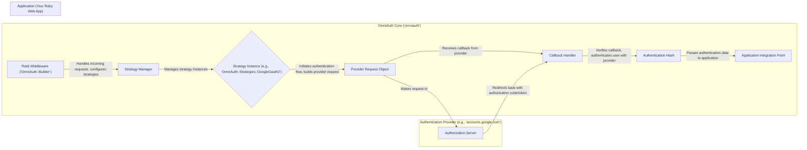
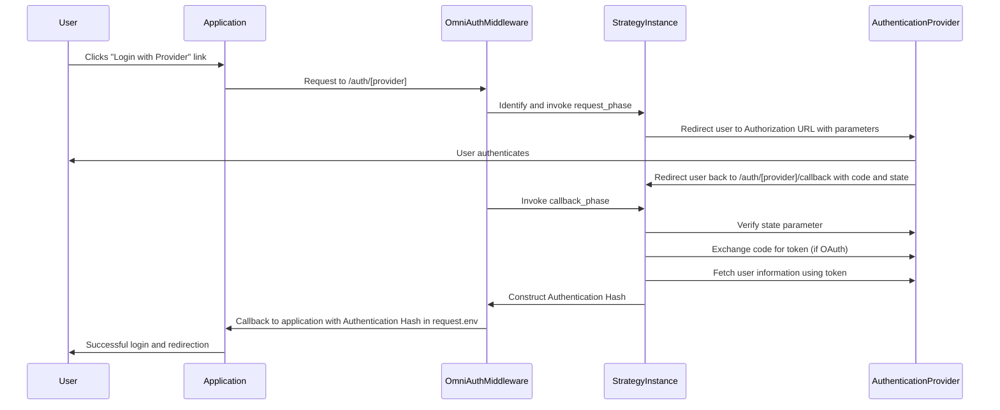

# Project Design Document: OmniAuth

**Version:** 1.1
**Date:** October 26, 2023
**Author:** AI Software Architect

## 1. Introduction

This document provides an enhanced architectural design of the OmniAuth library, focusing on its structure, components, and data flow. This detailed design will serve as the foundation for subsequent threat modeling activities to identify potential security vulnerabilities and risks. OmniAuth is a widely adopted, flexible authentication system for Ruby web applications. It offers a standardized and extensible interface for integrating with various third-party authentication providers (e.g., Google, Facebook, Twitter, GitHub, etc.), simplifying the process of implementing social login and other forms of delegated authentication.

## 2. Goals

*   Clearly and comprehensively define the architecture and interacting components of OmniAuth.
*   Illustrate the detailed data flow during a typical authentication process.
*   Provide a robust and well-structured overview suitable for effective and targeted threat modeling.
*   Document key security considerations inherent in the design and usage of OmniAuth.
*   Enhance clarity and provide more specific details compared to the previous version.

## 3. Architectural Overview

OmniAuth's architecture is elegantly designed around the concept of "strategies." Each strategy is an isolated unit of code responsible for handling the intricacies of authenticating with a specific identity provider. The core of OmniAuth provides the foundational framework for managing these strategies, orchestrating the overall authentication flow, and acting as a bridge between the web application and the various providers.

### 3.1. Key Components

*   **Rack Middleware ('OmniAuth::Builder'):** This is the entry point for OmniAuth within a Rack-based application. It intercepts incoming web requests that match the configured authentication paths (e.g., `/auth/google_oauth2`). The `OmniAuth::Builder` is responsible for:
    *   **Configuration:**  Loading and configuring the specified authentication strategies based on the application's settings.
    *   **Request Routing:** Directing incoming authentication requests to the appropriate strategy instance.
*   **Strategy Manager:**  Internally manages the lifecycle of the configured strategies. It ensures that the correct strategy is invoked based on the requested provider.
*   **Strategy Instance (e.g., 'OmniAuth::Strategies::GoogleOauth2'):**  A concrete implementation for authenticating with a specific provider. Each strategy encapsulates the provider-specific logic, including:
    *   **Initialization:**  Receives and stores provider-specific credentials (client ID, client secret), scopes, and other configuration options.
    *   **Request Phase:**  Constructs the authorization URL for the provider, including necessary parameters like `client_id`, `redirect_uri`, `scope`, and the `state` parameter for CSRF protection. It then redirects the user's browser to this URL.
    *   **Callback Phase:**  Handles the request received back from the authentication provider at the designated callback URL. This involves:
        *   **State Verification:** Validating the `state` parameter to mitigate CSRF attacks.
        *   **Code/Token Exchange:** If using OAuth 2.0, exchanging the authorization code received from the provider for an access token by making a server-side request to the provider's token endpoint.
        *   **User Information Retrieval:** Using the access token (or other credentials) to fetch user profile information from the provider's API.
        *   **Authentication Hash Construction:** Creating a standardized hash containing the authenticated user's information.
*   **Provider Request Object:** Represents the outgoing HTTP request made to the authentication provider's authorization or token endpoints. This object encapsulates the necessary headers, parameters, and authentication details for interacting with the provider's API.
*   **Callback Handler:**  The part of the strategy that specifically processes the response received from the authentication provider. It performs crucial security checks and data extraction.
*   **Authentication Hash:** A Ruby hash with a predefined structure that contains the essential information about the authenticated user. This typically includes:
    *   `uid`: The unique identifier of the user at the provider.
    *   `info`: A hash containing user profile details like name, email, and profile picture URL.
    *   `credentials`:  A hash containing authentication credentials like the access token and refresh token (if applicable).
    *   `extra`:  Additional information returned by the provider.
*   **Application Integration Point:** This refers to the point in the Ruby web application where OmniAuth passes control back after successful (or failed) authentication. This is typically a callback route defined in the application's routes (e.g., `/auth/google_oauth2/callback`). The application then uses the `Authentication Hash` to establish a user session or perform other actions.

## 4. Data Flow

The authentication flow using OmniAuth generally follows these steps:

1. **User Initiates Authentication:** The user interacts with the application (e.g., clicks a "Login with Google" button), triggering a request to the OmniAuth middleware at a path like `/auth/google_oauth2`.
2. **Middleware Interception:** The `OmniAuth::Builder` middleware intercepts the request based on the configured authentication paths.
3. **Strategy Invocation:** The middleware identifies the appropriate strategy (e.g., `OmniAuth::Strategies::GoogleOauth2`) based on the requested provider and creates an instance of it.
4. **Request Phase Execution:** The strategy's `request_phase` method is executed. This involves:
    *   Constructing the authorization URL for the provider's authorization server.
    *   Including parameters like `client_id`, `redirect_uri` (pointing back to the application's callback URL), `response_type`, `scope`, and a randomly generated `state` parameter for CSRF protection.
    *   Redirecting the user's browser to the provider's authorization URL.
5. **User Authentication at Provider:** The user is redirected to the authentication provider's website (e.g., Google's login page) and authenticates themselves using their provider credentials.
6. **Provider Authorization and Redirection:** If authentication is successful, the provider redirects the user back to the application's callback URL (specified in the `redirect_uri`) with an authorization code (in OAuth 2.0 flows) or other authentication credentials. The `state` parameter is also included in the redirect.
7. **Callback Phase Execution:** The `OmniAuth::Builder` middleware intercepts the callback request. The corresponding strategy's `callback_phase` method is executed. This involves:
    *   **State Verification:** The strategy verifies that the `state` parameter received in the callback matches the one generated during the request phase, preventing CSRF attacks.
    *   **Code Exchange (OAuth 2.0):** If an authorization code is present, the strategy makes a server-side request to the provider's token endpoint to exchange the code for an access token and potentially a refresh token. This request typically includes the `client_id`, `client_secret`, `grant_type`, and the authorization code.
    *   **User Information Retrieval:** Using the obtained access token (or other authentication credentials), the strategy makes a request to the provider's API to fetch the user's profile information.
    *   **Authentication Hash Construction:** The strategy creates the standardized `Authentication Hash` containing the user's `uid`, `info`, `credentials`, and `extra` data.
8. **Callback to Application:** OmniAuth calls a registered callback within the application, typically a route handler defined in the application's routing configuration. The `Authentication Hash` is made available to the application (often through the `request.env['omniauth.auth']` variable).
9. **Application Handles Authentication:** The application receives the `Authentication Hash` and uses this information to:
    *   Find or create a local user account based on the `uid`.
    *   Establish a user session.
    *   Potentially store the access token for future API interactions with the provider (if necessary and done securely).
    *   Redirect the user to a protected area of the application.

## 5. Security Considerations

Robust security practices are paramount when using OmniAuth. Key considerations include:

*   **Strict CSRF Protection:**  The `state` parameter in OAuth 2.0 flows is critical for preventing Cross-Site Request Forgery attacks. OmniAuth strategies must generate a unique, unpredictable `state` value during the request phase and rigorously verify it upon receiving the callback from the provider.
*   **Secure Secret Management:** Client IDs and, more importantly, client secrets for each authentication provider are highly sensitive credentials. They must be stored securely and never hardcoded directly into the application's source code. Recommended practices include using environment variables, secure configuration management systems (like HashiCorp Vault), or encrypted configuration files.
*   **Callback URL Whitelisting and Validation:**  Carefully configure and validate the registered callback URLs for each provider within the provider's developer console. This prevents attackers from using their own callback URLs to intercept authorization codes or access tokens. OmniAuth itself relies on the application's routing to handle the callback.
*   **Enforce HTTPS:** All communication between the application, OmniAuth, and the authentication providers *must* occur over HTTPS (TLS/SSL). This protects sensitive data like authorization codes, access tokens, and user information from eavesdropping and man-in-the-middle attacks.
*   **Secure Access Token Handling:** Access tokens obtained from providers grant access to user data and should be treated as highly sensitive. Store them securely if persistence is required (e.g., using encrypted database fields). Avoid storing them in cookies or local storage where they are more vulnerable to client-side attacks.
*   **Input Validation and Sanitization:**  While OmniAuth handles the core authentication flow, the application code that processes the `Authentication Hash` must validate and sanitize the data received from the provider. This helps prevent injection attacks or unexpected behavior caused by malicious data in the user's profile.
*   **Secure Session Management:** After successful authentication via OmniAuth, the application's session management practices are crucial. Use secure cookies (with `HttpOnly` and `Secure` flags), implement appropriate session expiration and revocation mechanisms, and protect against session fixation attacks.
*   **Regularly Update OmniAuth and Strategies:** Keep OmniAuth and its strategies up-to-date to benefit from the latest security patches and bug fixes. Vulnerabilities in the underlying libraries or specific strategies can expose the application to risks.
*   **Rate Limiting Authentication Attempts:** Implement rate limiting on authentication attempts to mitigate brute-force attacks targeting user accounts or the authentication flow itself.
*   **Consider Provider Security Practices:** Be aware of the security practices and potential vulnerabilities of the third-party authentication providers being used. Stay informed about any security advisories or recommended security measures from the providers.

## 6. Threat Modeling Focus Areas

When performing threat modeling for an application using OmniAuth, focus on the following areas:

*   **Manipulation of Authentication Requests:**  Analyze the potential for attackers to manipulate the initial authentication request to redirect users to phishing sites, inject malicious parameters, or bypass security checks. Pay close attention to the construction of the authorization URL in the strategy's `request_phase`.
*   **Exploitation of Callback URLs:**  Investigate whether an attacker could register a malicious callback URL with the provider (if the application's configuration is flawed) or otherwise intercept the callback to steal authorization codes or access tokens. Focus on the validation of the `redirect_uri` by both the application and the provider.
*   **Bypassing CSRF Protection (State Parameter Vulnerabilities):**  Thoroughly examine the implementation of the `state` parameter generation and verification within the OmniAuth strategies. Look for weaknesses that could allow an attacker to bypass this crucial protection mechanism.
*   **Interception of Authorization Codes/Tokens:**  Consider the risk of attackers intercepting the authorization code or access token during the redirects between the application and the provider. Emphasize the importance of HTTPS and secure network configurations.
*   **Theft and Misuse of Access Tokens:**  Analyze how access tokens are handled, stored, and used within the application. Identify potential vulnerabilities that could allow an attacker to steal an access token and impersonate a legitimate user.
*   **Provider Impersonation Attacks:**  Evaluate the possibility of an attacker impersonating a legitimate authentication provider to trick users into providing their credentials. Focus on the mechanisms used to verify the identity of the provider during the callback phase.
*   **Data Injection through Malicious Providers:**  Consider the scenario where a compromised or malicious authentication provider injects malicious data into the `Authentication Hash` passed to the application. Emphasize the need for robust input validation on the application side.
*   **Vulnerabilities in Specific OmniAuth Strategies:**  Conduct a detailed review of the code within each specific OmniAuth strategy being used, as vulnerabilities in the provider-specific implementation could introduce security risks.
*   **Denial of Service Attacks:**  Assess the potential for attackers to launch denial-of-service attacks against the authentication flow, for example, by sending a large number of authentication requests.

## 7. Conclusion

This enhanced design document provides a more detailed and comprehensive overview of the OmniAuth library's architecture, data flow, and security considerations. This information is essential for conducting thorough and effective threat modeling, enabling developers to proactively identify and mitigate potential security vulnerabilities. By understanding the intricacies of OmniAuth's design and potential attack vectors, developers can build more secure and resilient web applications that leverage the benefits of delegated authentication.