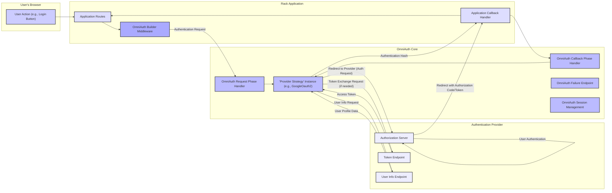

## Project Design Document: OmniAuth (Improved for Threat Modeling)

**1. Introduction**

This document provides an enhanced design overview of the OmniAuth library, specifically tailored for threat modeling. OmniAuth simplifies authentication in Rack-based Ruby web applications by providing a standardized interface for interacting with various authentication providers. This revised document offers a deeper understanding of OmniAuth's architecture, data flow, and potential security considerations, making it a more effective resource for identifying and mitigating potential threats.

**2. Goals and Objectives**

* **Detailed Architectural Documentation:** Provide a granular view of OmniAuth's components and their interactions, emphasizing security-relevant aspects.
* **Comprehensive Data Flow Analysis:**  Illustrate the complete lifecycle of an authentication request, highlighting data exchange points and potential vulnerabilities.
* **Targeted Component Identification for Threat Modeling:** Clearly define the boundaries and responsibilities of each component to facilitate focused threat analysis.
* **Enhanced Security Context:**  Proactively identify potential security concerns and areas requiring further scrutiny during threat modeling.
* **Clear and Accessible Information:** Present the information in a structured and understandable manner for security professionals and developers.

**3. System Architecture**

OmniAuth functions as a Rack middleware, intercepting and processing HTTP requests related to authentication. Its architecture is built around the concept of interchangeable "strategies," each responsible for handling the specific protocol and API of an authentication provider.

**4. Data Flow (Detailed for Threat Analysis)**

The authentication process involves a series of data exchanges, each presenting potential security considerations:

* **User Initiates Authentication:**
    * Data: User interaction (e.g., clicking a "Login with Provider" link).
    * Security Relevance:  Potential for UI redressing or clickjacking if not implemented carefully by the application.
* **Authentication Request to OmniAuth:**
    * Data: HTTP request to `/auth/:provider`.
    * Security Relevance: Ensure proper routing and that only intended authentication requests are processed.
* **OmniAuth Request Phase:**
    * Data: Configuration details for the specific provider (client ID, client secret, scopes, callback URL).
    * Security Relevance: Secure storage and handling of client secrets are critical. Misconfiguration can lead to vulnerabilities.
* **Redirection to Authentication Provider:**
    * Data:  Authentication request URL containing:
        * `"client_id"`: Application's identifier.
        * `"redirect_uri"`: Application's callback URL.
        * `"scope"`: Requested permissions.
        * `"response_type"`:  Typically "code" for the authorization code grant.
        * `"state"`:  CSRF protection token.
    * Security Relevance:  The `state` parameter is crucial for preventing CSRF attacks. Ensure proper generation and validation. The `redirect_uri` must be carefully managed to prevent open redirects.
* **User Authentication at Provider:**
    * Data: User credentials submitted to the provider.
    * Security Relevance:  Security of this step is primarily the responsibility of the authentication provider. However, the application should use HTTPS to protect the initial redirect.
* **Redirection Back to Application (with Authorization Code or Implicit Token):**
    * Data: HTTP redirect to the `redirect_uri` with:
        * `"code"` (Authorization Code Grant): Temporary authorization code.
        * `"state"`:  The same value sent in the initial request.
        * `"access_token"` (Implicit Grant - less common with OmniAuth's default strategies):  The access token directly.
    * Security Relevance: Validate the `state` parameter to prevent CSRF. For the Authorization Code Grant, the code itself is sensitive and should be handled securely. The Implicit Grant has inherent security risks and is generally discouraged.
* **OmniAuth Callback Phase:**
    * Data: The incoming request containing the authorization code or token.
    * Security Relevance:  This is a critical point for validation and secure processing.
* **Authorization Code Exchange (if applicable):**
    * Data: Server-to-server request to the provider's token endpoint containing:
        * `"client_id"`
        * `"client_secret"`
        * `"code"`
        * `"grant_type"`: "authorization_code"
        * `"redirect_uri"`
    * Security Relevance: This request must be made over HTTPS. The `client_secret` must be kept confidential.
* **Token Response from Provider:**
    * Data: JSON response containing:
        * `"access_token"`:  Token used to access user resources.
        * `"token_type"`:  e.g., "Bearer".
        * `"expires_in"` (optional): Token expiration time.
        * `"refresh_token"` (optional): Token to obtain new access tokens.
    * Security Relevance: The `access_token` is a sensitive credential and must be handled securely.
* **Fetching User Information:**
    * Data: API request to the provider's user info endpoint, typically including the `access_token` in the `Authorization` header.
    * Security Relevance: Ensure the request is made over HTTPS.
* **User Information Response:**
    * Data: User profile information (e.g., name, email, profile picture).
    * Security Relevance:  Handle this data according to privacy policies and security best practices.
* **OmniAuth Authentication Hash Creation:**
    * Data:  Structured hash containing user `uid`, `info`, `credentials` (including the access token), and `extra` data.
    * Security Relevance:  Avoid including overly sensitive information in the authentication hash unless absolutely necessary.
* **Callback to Application:**
    * Data: The `omniauth.auth` hash passed to the application's callback handler.
    * Security Relevance: The application needs to securely process and store the received information, especially access tokens.

**5. Key Components (Detailed for Threat Modeling)**

* **`OmniAuth::Builder` Middleware:**
    * Responsibility:  Configures and inserts OmniAuth into the Rack middleware stack. Defines the providers and their configurations.
    * Threat Surface: Misconfiguration can lead to security vulnerabilities (e.g., exposing sensitive configuration details).
* **`OmniAuth::Strategy` (Abstract Class):**
    * Responsibility: Defines the interface for specific provider strategies. Handles the core logic for interacting with an authentication provider.
    * Threat Surface:  Vulnerabilities in the base strategy could affect all derived strategies.
* **Specific Provider Strategies (e.g., `OmniAuth::Strategies::GoogleOauth2`):**
    * Responsibility: Implements the authentication flow for a specific provider, including building authorization URLs, handling callbacks, exchanging codes for tokens, and fetching user information.
    * Threat Surface:  Implementation flaws in a specific strategy can lead to vulnerabilities specific to that provider (e.g., improper validation of provider responses).
* **`OmniAuth::RequestPhase` Handler:**
    * Responsibility:  Initiates the authentication flow by redirecting the user to the authentication provider.
    * Threat Surface:  Vulnerabilities here could lead to open redirects or manipulation of the authentication request.
* **`OmniAuth::CallbackPhase` Handler:**
    * Responsibility:  Handles the response from the authentication provider, validates the response, exchanges codes for tokens, and fetches user information.
    * Threat Surface: This is a critical component for security. Improper validation of the `state` parameter, authorization code, or token can lead to CSRF, replay attacks, or access token theft.
* **`OmniAuth::FailureEndpoint`:**
    * Responsibility: Handles authentication failures and redirects the user to a designated failure path.
    * Threat Surface:  Misconfiguration of the failure path could lead to information disclosure or open redirects.
* **`OmniAuth::Sessions`:**
    * Responsibility: Manages the OmniAuth authentication state within the Rack session (e.g., storing the `state` parameter for CSRF protection).
    * Threat Surface:  Vulnerabilities in session management can lead to session fixation or other session-related attacks.
* **Configuration Options (e.g., `client_id`, `client_secret`, `scope`, `callback_url`):**
    * Responsibility:  Define how OmniAuth interacts with the authentication provider.
    * Threat Surface:  Insecure storage or handling of `client_secret` is a major vulnerability. Incorrect `callback_url` can lead to authorization code interception. Overly broad `scope` requests can grant unnecessary permissions.

**6. Security Considerations (Detailed)**

This section expands on potential security threats, categorized for clarity:

* **Authentication and Authorization Flaws:**
    * **CSRF (Cross-Site Request Forgery):**  Insufficient validation of the `state` parameter during the callback phase.
    * **Replay Attacks:**  Reusing authorization codes or access tokens. Implement mechanisms to prevent token reuse.
    * **Authorization Code Interception:**  Compromising the communication channel between the provider and the application to steal the authorization code (e.g., due to insecure `redirect_uri`).
    * **Open Redirects:**  Manipulating the authentication flow to redirect users to malicious sites after authentication failure or success.
    * **Insecure Client Authentication:**  Compromise of the `client_secret`. Ensure secure storage and handling (e.g., using environment variables, not hardcoding).
* **Data Security and Privacy:**
    * **Access Token Theft:**  Compromising access tokens stored by the application or intercepted during transmission.
    * **Information Disclosure:**  Leaking sensitive user information obtained from the provider.
    * **Insufficient Scope Control:** Requesting more permissions than necessary, increasing the potential impact of a compromise.
    * **Insecure Storage of User Data:**  Improperly storing user information obtained from the provider or the access token.
* **Implementation and Configuration Issues:**
    * **Misconfiguration:** Incorrectly setting up provider credentials, callback URLs, or scopes.
    * **Vulnerabilities in Strategies:**  Bugs or security flaws within specific provider strategy implementations.
    * **Dependency Vulnerabilities:**  Security issues in OmniAuth's dependencies.
    * **Lack of Input Validation:**  Failing to properly validate data received from the authentication provider.
* **Session Management Issues:**
    * **Session Fixation:**  An attacker forces a user to use a specific session ID.
    * **Session Hijacking:**  An attacker obtains a valid session ID and impersonates the user.
    * **Insecure Session Storage:**  Storing session data insecurely.

**7. Deployment Considerations (Security Focused)**

* **HTTPS Enforcement:**  Ensure all communication involving OmniAuth (especially redirects and API calls) is done over HTTPS.
* **Secure Secret Management:**  Store `client_secret` and other sensitive credentials securely (e.g., using environment variables, vault solutions). Avoid hardcoding secrets.
* **Callback URL Whitelisting:**  Strictly define and validate the allowed callback URLs to prevent authorization code interception.
* **Regular Updates:** Keep OmniAuth and its dependencies up-to-date to patch known security vulnerabilities.
* **Security Audits:**  Regularly review the application's OmniAuth configuration and integration for potential security weaknesses.
* **Content Security Policy (CSP):**  Configure CSP headers to mitigate XSS attacks, which could potentially be used to steal authorization codes or access tokens.

**8. Future Considerations (Security Enhancements)**

* **Stricter `state` Parameter Handling:**  Explore options for more robust `state` parameter management and validation.
* **Token Revocation Support:**  Implement mechanisms to revoke access tokens when necessary.
* **Integration with Security Logging and Monitoring:**  Enhance logging to detect and respond to suspicious authentication activity.
* **Consideration of Alternative Authentication Flows:** Evaluate the security implications of different OAuth 2.0 flows and choose the most appropriate ones.

This improved design document provides a more detailed and security-focused overview of the OmniAuth library. It serves as a valuable resource for conducting thorough threat modeling and implementing secure authentication practices.