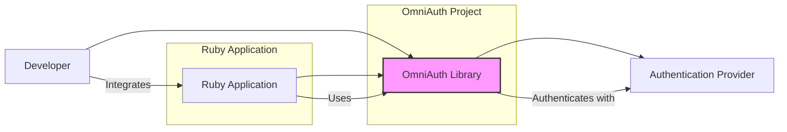
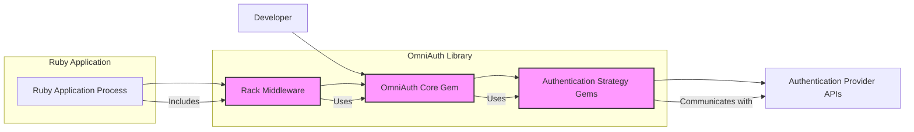
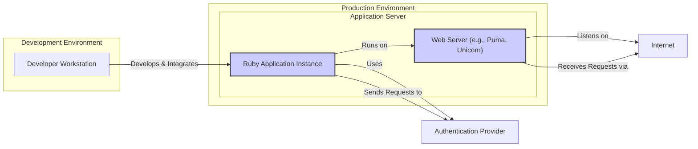

# BUSINESS POSTURE

This project, represented by the GitHub repository `omniauth/omniauth`, aims to provide a flexible and standardized authentication library for Ruby applications.

- Business Priorities and Goals:
  - Simplify the integration of various authentication providers (e.g., Google, Facebook, OAuth 2.0, SAML) into Ruby web applications.
  - Provide a consistent and easy-to-use API for developers to handle authentication flows.
  - Support a wide range of authentication strategies and protocols.
  - Maintain a secure and reliable authentication process.
  - Foster a community-driven approach to expand and maintain authentication strategies.

- Business Risks:
  - Security vulnerabilities in the core library or individual authentication strategies could compromise applications using Omniauth.
  - Incompatibility with new authentication protocols or changes in provider APIs could require ongoing maintenance and updates.
  - Poorly implemented or outdated authentication strategies could introduce security weaknesses.
  - Complexity in configuration or usage could lead to developer errors and misconfigurations, resulting in security vulnerabilities.
  - Dependency on external authentication providers introduces risks related to provider availability, security, and policy changes.

# SECURITY POSTURE

- Existing Security Controls:
  - security control: Ruby on Rails Security Practices - Omniauth is often used within Ruby on Rails applications, leveraging Rails' built-in security features. (Implemented within integrating applications)
  - security control: Gem Security Scanning - RubyGems ecosystem and platforms like GitHub may perform automated security scans on published gems. (Potentially implemented by RubyGems and GitHub)
  - security control: Community Review - As an open-source project, the code is subject to community review and scrutiny, which can help identify potential security issues. (Implemented by the open-source community)

- Accepted Risks:
  - accepted risk: Reliance on Third-Party Providers - Omniauth depends on external authentication providers, inheriting risks associated with their security and availability.
  - accepted risk: Misconfiguration by Users - Developers integrating Omniauth might misconfigure it, leading to security vulnerabilities in their applications.
  - accepted risk: Vulnerabilities in Dependencies - Omniauth and its strategies may depend on other gems, which could have their own vulnerabilities.

- Recommended Security Controls:
  - security control: Regular Security Audits - Conduct periodic security audits of the Omniauth core and popular strategies by security professionals.
  - security control: Dependency Scanning - Implement automated dependency scanning to identify and address vulnerabilities in Omniauth's dependencies.
  - security control: Static Application Security Testing (SAST) - Integrate SAST tools into the development process to automatically detect potential security flaws in the code.
  - security control: Clear Security Documentation - Provide comprehensive security documentation for developers, including best practices for configuration and usage, and guidance on handling sensitive data.
  - security control: Vulnerability Disclosure Policy - Establish a clear vulnerability disclosure policy to allow security researchers to report issues responsibly.
  - security control: Two-Factor Authentication (2FA) for Maintainers - Enforce 2FA for maintainers of the repository and RubyGems package to protect against account compromise.

- Security Requirements:
  - Authentication:
    - requirement: Securely handle authentication flows with various providers (OAuth 1.0a, OAuth 2.0, SAML, OpenID Connect, etc.).
    - requirement: Support different authentication strategies and allow developers to easily add new ones.
    - requirement: Protect against common authentication attacks such as replay attacks, session fixation, and cross-site request forgery (CSRF).

  - Authorization:
    - requirement: Facilitate the retrieval of user authorization and permissions from authentication providers.
    - requirement: Allow applications to control access based on user roles or permissions obtained from providers.
    - requirement: Ensure that authorization tokens and credentials are handled securely and not exposed.

  - Input Validation:
    - requirement: Validate all inputs received from authentication providers to prevent injection attacks and data corruption.
    - requirement: Sanitize and encode user data appropriately before storing or displaying it.
    - requirement: Handle error responses from providers gracefully and securely, avoiding information leakage.

  - Cryptography:
    - requirement: Use strong cryptography for handling sensitive data such as API keys, secrets, and tokens.
    - requirement: Securely store and manage cryptographic keys and secrets.
    - requirement: Implement HTTPS for all communication involving sensitive data and authentication flows.

# DESIGN

## C4 CONTEXT



- Context Diagram Elements:
  - - Name: Ruby Application
    - Type: Software System
    - Description: The Ruby web application that needs to authenticate users.
    - Responsibilities: Integrate Omniauth to handle user authentication, manage user sessions, and authorize access to resources.
    - Security controls: Application-level security controls, session management, authorization logic, input validation.

  - - Name: OmniAuth Library
    - Type: Software System
    - Description: The Omniauth Ruby gem, providing a framework and strategies for authentication.
    - Responsibilities: Provide a consistent API for authentication, handle communication with authentication providers, manage authentication flows, and return user information to the application.
    - Security controls: Input validation, secure handling of credentials and tokens, protection against common authentication vulnerabilities.

  - - Name: Developer
    - Type: Person
    - Description: A software developer who integrates Omniauth into a Ruby application.
    - Responsibilities: Configure Omniauth correctly, choose appropriate authentication strategies, handle user authentication within the application, and ensure secure integration.
    - Security controls: Secure development practices, configuration management, code review.

  - - Name: Authentication Provider
    - Type: External System
    - Description: Third-party services like Google, Facebook, Twitter, or enterprise identity providers that handle user authentication and authorization.
    - Responsibilities: Authenticate users, authorize access to user data, provide user information to Omniauth, and manage user accounts.
    - Security controls: Provider-specific security controls, authentication protocols, authorization mechanisms, data protection policies.

## C4 CONTAINER



- Container Diagram Elements:
  - - Name: OmniAuth Core Gem
    - Type: Library
    - Description: The core Omniauth gem, providing the main framework, API, and request handling logic.
    - Responsibilities: Manage authentication flows, dispatch requests to appropriate strategies, handle callbacks, and provide a consistent interface for applications.
    - Security controls: Input validation, secure session management, protection against common web vulnerabilities, secure handling of secrets.

  - - Name: Authentication Strategy Gems
    - Type: Library
    - Description: Separate gems or modules within the Omniauth project that implement specific authentication strategies for different providers (e.g., omniauth-google-oauth2, omniauth-facebook).
    - Responsibilities: Handle provider-specific authentication protocols, communicate with provider APIs, parse responses, and extract user information.
    - Security controls: Secure implementation of authentication protocols, input validation of provider responses, secure handling of provider-specific credentials and tokens.

  - - Name: Rack Middleware
    - Type: Library
    - Description: Rack middleware component that integrates Omniauth into Ruby web applications. It intercepts requests and routes authentication requests to Omniauth.
    - Responsibilities: Mount Omniauth routes within the application, handle request routing for authentication callbacks, and integrate Omniauth into the Rack application stack.
    - Security controls: Protection against middleware-related vulnerabilities, secure routing configuration.

  - - Name: Authentication Provider APIs
    - Type: External API
    - Description: APIs provided by authentication providers (e.g., Google OAuth 2.0 API, Facebook Graph API) that Omniauth strategies interact with.
    - Responsibilities: Authenticate users, authorize access, provide user information, and manage API access.
    - Security controls: Provider-specific API security controls, authentication and authorization mechanisms, rate limiting, and API usage policies.

  - - Name: Ruby Application Process
    - Type: Application Runtime
    - Description: The running Ruby process of the web application that utilizes Omniauth.
    - Responsibilities: Execute the Ruby application code, including Omniauth middleware and application logic, handle user requests, and manage application resources.
    - Security controls: Application-level security controls, web server security, operating system security, network security.

## DEPLOYMENT



- Deployment Diagram Elements:
  - - Name: Developer Workstation
    - Type: Development Environment
    - Description: The local machine used by developers to write code, test, and integrate Omniauth into Ruby applications.
    - Responsibilities: Code development, local testing, running development servers, and managing development dependencies.
    - Security controls: Workstation security practices, code version control, secure development tools.

  - - Name: Web Server (e.g., Puma, Unicorn)
    - Type: Application Server Component
    - Description: The web server that handles incoming HTTP requests and serves the Ruby application.
    - Responsibilities: Receive requests from the internet, route requests to the Ruby application instance, serve static assets, and manage connections.
    - Security controls: Web server configuration, TLS/SSL configuration, access controls, security updates.

  - - Name: Ruby Application Instance
    - Type: Application Server Component
    - Description: A running instance of the Ruby application that includes the Omniauth library and application-specific code.
    - Responsibilities: Execute application logic, handle authentication requests via Omniauth, manage user sessions, and interact with databases and other services.
    - Security controls: Application-level security controls, framework security features, input validation, authorization logic, secure session management.

  - - Name: Authentication Provider
    - Type: External Service
    - Description: The external authentication provider service (e.g., Google, Facebook) accessed over the internet.
    - Responsibilities: Authenticate users, authorize access, and provide user information to the application.
    - Security controls: Provider-specific security controls, authentication protocols, API security.

  - - Name: Internet
    - Type: Network
    - Description: The public internet network connecting users, applications, and authentication providers.
    - Responsibilities: Provide network connectivity and routing for communication between different components.
    - Security controls: Network security controls, firewalls, intrusion detection systems, and secure network protocols (HTTPS).

## BUILD

```mermaid
flowchart LR
    A["Developer"] --> B("Code Changes");
    B --> C{Version Control (e.g., Git)};
    C --> D["CI/CD Pipeline (e.g., GitHub Actions)"];
    D --> E["Build & Test"];
    E --> F["Security Checks (SAST, Dependency Scan)"];
    F --> G{Artifact Repository (e.g., RubyGems)};
    G --> H["Published Gem"];
    style D fill:#ccf,stroke:#333,stroke-width:2px
    style G fill:#ccf,stroke:#333,stroke-width:2px
```

- Build Process Elements:
  - - Name: Developer
    - Type: Person
    - Description: Software developer contributing to the Omniauth project.
    - Responsibilities: Write code, fix bugs, implement new features, and submit code changes.
    - Security controls: Secure coding practices, code review, workstation security.

  - - Name: Version Control (e.g., Git)
    - Type: Software System
    - Description: Git repository hosted on platforms like GitHub, used for source code management and collaboration.
    - Responsibilities: Track code changes, manage versions, facilitate collaboration, and provide a history of code modifications.
    - Security controls: Access controls, branch protection, commit signing, audit logs.

  - - Name: CI/CD Pipeline (e.g., GitHub Actions)
    - Type: Automation System
    - Description: Automated pipeline for building, testing, and publishing the Omniauth gem.
    - Responsibilities: Automate the build process, run tests, perform security checks, and publish the gem to the artifact repository.
    - Security controls: Secure pipeline configuration, access controls, secret management, build environment security.

  - - Name: Build & Test
    - Type: Build Process Step
    - Description: Compilation, packaging, and running automated tests to ensure code quality and functionality.
    - Responsibilities: Compile code, package the gem, execute unit tests, integration tests, and other automated tests.
    - Security controls: Test coverage, automated testing frameworks, secure build environment.

  - - Name: Security Checks (SAST, Dependency Scan)
    - Type: Security Process Step
    - Description: Automated security scans performed during the build process, including Static Application Security Testing (SAST) and dependency vulnerability scanning.
    - Responsibilities: Identify potential security vulnerabilities in the code and dependencies, generate reports, and fail the build if critical issues are found.
    - Security controls: SAST tools, dependency scanning tools, vulnerability databases, automated security gates.

  - - Name: Artifact Repository (e.g., RubyGems)
    - Type: Software System
    - Description: Repository for storing and distributing Ruby gems, such as RubyGems.org.
    - Responsibilities: Host and distribute the Omniauth gem, manage gem versions, and provide access to developers for installation.
    - Security controls: Access controls, gem signing, vulnerability scanning, and repository security policies.

  - - Name: Published Gem
    - Type: Software Artifact
    - Description: The packaged and published Omniauth gem available for download and installation by Ruby developers.
    - Responsibilities: Provide a reusable and distributable authentication library for Ruby applications.
    - Security controls: Gem signing, version control, and vulnerability reporting mechanisms.

# RISK ASSESSMENT

- Critical Business Processes:
  - Secure authentication of users for Ruby applications.
  - Maintaining the integrity and availability of the Omniauth library.
  - Protecting the reputation and trust associated with the Omniauth project.

- Data to Protect and Sensitivity:
  - Indirectly handles user credentials during authentication flows, although Omniauth itself does not typically store them persistently.
  - API keys and secrets for authentication providers, which are highly sensitive and must be protected from unauthorized access.
  - User data retrieved from authentication providers (e.g., email addresses, names), which may have varying levels of sensitivity depending on the provider and application context. Sensitivity: Medium to High.
  - Source code of the Omniauth library, which if compromised could lead to widespread security vulnerabilities. Sensitivity: High.

# QUESTIONS & ASSUMPTIONS

- Questions:
  - What is the intended target audience for Omniauth? (e.g., startups, enterprises, specific industries)
  - Are there any specific compliance requirements that Omniauth needs to adhere to? (e.g., GDPR, PCI DSS, HIPAA)
  - What is the process for handling security vulnerabilities reported in Omniauth?
  - Are there any plans for formal security audits or penetration testing of Omniauth?
  - What is the strategy for managing and updating dependencies to address security vulnerabilities?

- Assumptions:
  - Omniauth is primarily used in Ruby on Rails web applications.
  - The project is community-driven and relies on open-source principles.
  - Security is a high priority for the Omniauth project maintainers and community.
  - Developers integrating Omniauth are expected to follow security best practices in their applications.
  - The project aims to support a wide range of authentication providers and protocols.