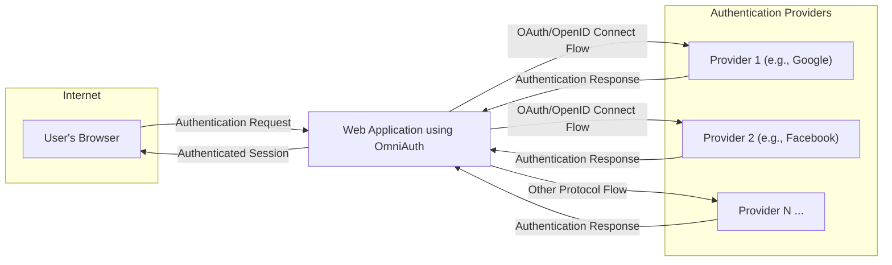
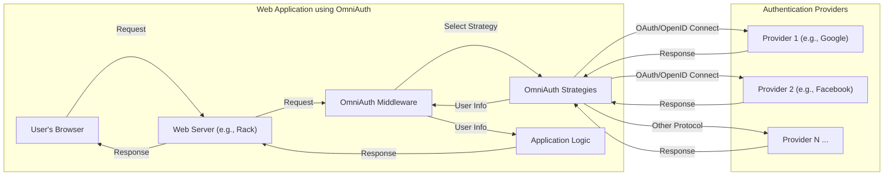
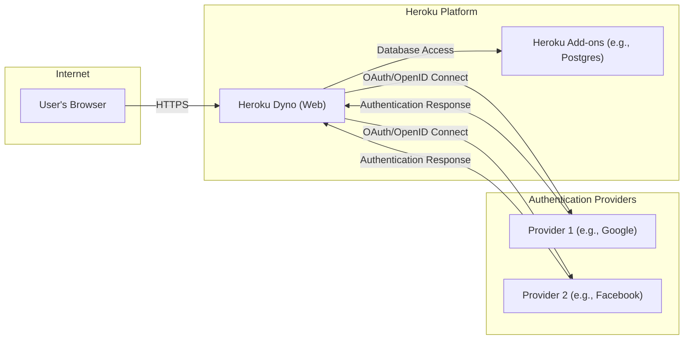
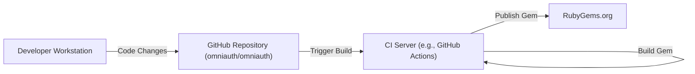

Okay, let's create a design document for the OmniAuth project.

# BUSINESS POSTURE

OmniAuth is a popular open-source library that standardizes multi-provider authentication for web applications. It's designed to be flexible and modular, allowing developers to easily integrate various authentication providers (like Google, Facebook, Twitter, etc.) without having to deeply understand the specifics of each provider's API.

Priorities:

*   Ease of Integration: Minimize the effort required for developers to add authentication to their applications.
*   Flexibility: Support a wide range of authentication providers (strategies).
*   Maintainability: Keep the codebase clean, well-documented, and easy to update.
*   Security: Provide a secure way to handle user authentication and protect against common web vulnerabilities.
*   Community: Foster a strong and active community of users and contributors.

Goals:

*   Become the de-facto standard for multi-provider authentication in Ruby web applications.
*   Reduce the barrier to entry for developers implementing authentication.
*   Provide a consistent and reliable authentication experience for end-users.

Business Risks:

*   Security Vulnerabilities: Flaws in OmniAuth could expose applications using it to significant security risks, including account takeover and data breaches. This is the most critical risk.
*   Lack of Maintenance: If the project is not actively maintained, it could become incompatible with newer versions of Ruby, Rails, or authentication provider APIs.
*   Competition: Other authentication libraries could emerge and surpass OmniAuth in popularity or functionality.
*   Strategy Compatibility: Keeping up with changes in external authentication provider APIs (e.g., OAuth updates, deprecations) can be challenging.
*   Reputation Damage: Security vulnerabilities or significant bugs could damage the reputation of the project and its maintainers.

# SECURITY POSTURE

Existing Security Controls:

*   security control: Modular Design: OmniAuth's strategy-based architecture isolates the authentication logic for each provider, reducing the risk of a vulnerability in one strategy affecting others. (Described in the project's README and overall architecture).
*   security control: Community Vetting: As an open-source project, OmniAuth benefits from community scrutiny, with developers around the world reviewing the code and reporting potential issues. (Implicit in the open-source nature of the project).
*   security control: Reliance on External Libraries: OmniAuth often relies on well-established OAuth libraries for specific providers, delegating some of the security-critical implementation details to these libraries. (Visible in the Gemfile and strategy implementations).
*   security control: Regular Updates: The project maintainers and community regularly update the library and its dependencies to address security vulnerabilities and maintain compatibility. (Visible in the commit history and release notes).

Accepted Risks:

*   accepted risk: Third-Party Strategy Risk: OmniAuth's flexibility allows developers to use third-party strategies, which may not have undergone the same level of scrutiny as the officially maintained strategies. The quality and security of these strategies are outside the direct control of the OmniAuth core project.
*   accepted risk: Configuration Errors: The security of an OmniAuth integration heavily relies on the correct configuration by the application developer. Misconfiguration (e.g., exposing client secrets, incorrect callback URLs) can lead to vulnerabilities.
*   accepted risk: Dependence on External Providers: OmniAuth's functionality is inherently dependent on the security and availability of the external authentication providers it integrates with. Issues with these providers (e.g., outages, API changes) are outside of OmniAuth's control.

Recommended Security Controls:

*   security control: Implement a Security Policy: A clear security policy (e.g., a SECURITY.md file) should outline how to report vulnerabilities and the process for handling them.
*   security control: Conduct Regular Security Audits: Periodic security audits, both internal and external, can help identify potential vulnerabilities before they are exploited.
*   security control: Provide Security Best Practices Documentation: Clear documentation should guide developers on how to securely configure and use OmniAuth, minimizing the risk of misconfiguration.
*   security control: Strategy Vetting Process: Establish a process for reviewing and vetting third-party strategies to ensure a minimum level of quality and security.

Security Requirements:

*   Authentication:
    *   Support multiple authentication providers (OAuth 1.0a, OAuth 2.0, LDAP, etc.).
    *   Securely handle and store user credentials and tokens.
    *   Provide mechanisms to prevent replay attacks.
    *   Protect against common web authentication vulnerabilities (e.g., session fixation, cross-site request forgery).

*   Authorization:
    *   Provide a standardized way to access user information from different providers.
    *   Allow developers to define authorization rules based on user attributes.

*   Input Validation:
    *   Validate all input received from authentication providers.
    *   Sanitize user data before using it in the application.

*   Cryptography:
    *   Use strong cryptographic algorithms and protocols for secure communication (HTTPS).
    *   Securely store sensitive data (e.g., client secrets, access tokens).

# DESIGN

## C4 CONTEXT

Element Descriptions:

1.  Name: User's Browser
    *   Type: Web Browser
    *   Description: The user's web browser, used to access the web application.
    *   Responsibilities: Initiates authentication requests, displays web pages, handles redirects.
    *   Security Controls: Browser security settings, HTTPS.

2.  Name: Web Application using OmniAuth
    *   Type: Web Application
    *   Description: The web application that integrates OmniAuth for user authentication.
    *   Responsibilities: Handles user requests, manages sessions, interacts with authentication providers via OmniAuth.
    *   Security Controls: OmniAuth library, application-level security measures (e.g., input validation, output encoding), secure coding practices.

3.  Name: Provider 1 (e.g., Google)
    *   Type: Authentication Provider
    *   Description: An external authentication provider (e.g., Google) using OAuth 2.0.
    *   Responsibilities: Authenticates users, provides user information.
    *   Security Controls: OAuth 2.0 implementation, provider-specific security measures.

4.  Name: Provider 2 (e.g., Facebook)
    *   Type: Authentication Provider
    *   Description: An external authentication provider (e.g., Facebook) using OAuth 2.0.
    *   Responsibilities: Authenticates users, provides user information.
    *   Security Controls: OAuth 2.0 implementation, provider-specific security measures.

5.  Name: Provider N ...
    *   Type: Authentication Provider
    *   Description: Represents any other authentication provider that OmniAuth might support.
    *   Responsibilities: Authenticates users, provides user information.
    *   Security Controls: Protocol-specific security measures (OAuth 1.0a, LDAP, etc.), provider-specific security measures.

## C4 CONTAINER

Element Descriptions:

1.  Name: User's Browser
    *   Type: Web Browser
    *   Description: The user's web browser.
    *   Responsibilities: Initiates requests, displays responses.
    *   Security Controls: Browser security settings, HTTPS.

2.  Name: Web Server (e.g., Rack)
    *   Type: Web Server
    *   Description: The web server that hosts the application (e.g., Puma, Unicorn).
    *   Responsibilities: Receives requests, routes them to the appropriate middleware/application logic, sends responses.
    *   Security Controls: Web server security configuration, HTTPS.

3.  Name: OmniAuth Middleware
    *   Type: Middleware
    *   Description: The core OmniAuth middleware component.
    *   Responsibilities: Intercepts authentication requests, routes them to the appropriate strategy, handles callbacks, extracts user information.
    *   Security Controls: Secure coding practices, input validation.

4.  Name: OmniAuth Strategies
    *   Type: Library/Module
    *   Description: A collection of OmniAuth strategies for different providers.
    *   Responsibilities: Implements the authentication logic for specific providers (OAuth, OpenID Connect, etc.).
    *   Security Controls: Strategy-specific security measures, reliance on secure OAuth libraries.

5.  Name: Application Logic
    *   Type: Application Code
    *   Description: The application's core logic.
    *   Responsibilities: Handles authenticated user data, performs application-specific tasks.
    *   Security Controls: Application-level security measures, secure coding practices.

6.  Name: Provider 1 (e.g., Google)
    *   Type: Authentication Provider
    *   Description: External authentication provider.
    *   Responsibilities: Authenticates users.
    *   Security Controls: Provider security.

7.  Name: Provider 2 (e.g., Facebook)
    *   Type: Authentication Provider
    *   Description: External authentication provider.
    *   Responsibilities: Authenticates users.
    *   Security Controls: Provider security.

8.  Name: Provider N ...
    *   Type: Authentication Provider
    *   Description: External authentication provider.
    *   Responsibilities: Authenticates users.
    *   Security Controls: Provider security.

## DEPLOYMENT

Possible Deployment Solutions:

1.  RubyGems: OmniAuth is primarily distributed as a RubyGem, making it easy to include in Ruby projects using Bundler.
2.  Docker: Applications using OmniAuth can be containerized using Docker for consistent deployment across different environments.
3.  Cloud Platforms: OmniAuth can be deployed on various cloud platforms (Heroku, AWS, Google Cloud, etc.) that support Ruby applications.

Chosen Deployment Solution (Heroku Example):

Element Descriptions:

1.  Name: Heroku Dyno (Web)
    *   Type: Cloud Instance
    *   Description: A Heroku Dyno running the web application.
    *   Responsibilities: Executes the application code, handles web requests.
    *   Security Controls: Heroku platform security, application-level security measures.

2.  Name: Heroku Add-ons (e.g., Postgres)
    *   Type: Cloud Service
    *   Description: Heroku Add-ons used by the application (e.g., a PostgreSQL database).
    *   Responsibilities: Provides services to the application (e.g., data storage).
    *   Security Controls: Heroku Add-on security, secure configuration.

3.  Name: Provider 1 (e.g., Google)
    *   Type: Authentication Provider
    *   Description: External authentication provider.
    *   Responsibilities: Authenticates users.
    *   Security Controls: Provider security.

4.  Name: Provider 2 (e.g., Facebook)
    *   Type: Authentication Provider
    *   Description: External authentication provider.
    *   Responsibilities: Authenticates users.
    *   Security Controls: Provider security.

5.  Name: User's Browser
    *   Type: Web Browser
    *   Description: User Browser.
    *   Responsibilities: Access application.
    *   Security Controls: Browser security.

## BUILD

Build Process Description:

1.  Developer: Developers make code changes on their local workstations.
2.  GitHub Repository: Changes are pushed to the OmniAuth GitHub repository.
3.  CI Server (GitHub Actions): A continuous integration (CI) server (e.g., GitHub Actions) is triggered by the push.
4.  Run Tests: The CI server runs the test suite to ensure code quality and prevent regressions.
5.  Lint Code: The CI server runs linters to enforce code style and identify potential issues.
6.  Build Gem: If the tests and linters pass, the CI server builds the RubyGem package.
7.  Publish Gem: The CI server publishes the new Gem version to RubyGems.org, making it available for others to use.

Security Controls:

*   security control: Version Control (Git): All code changes are tracked in a Git repository, providing an audit trail and allowing for easy rollback if necessary.
*   security control: CI/CD (GitHub Actions): Automated builds and tests ensure that all code changes are thoroughly tested before being released.
*   security control: Automated Testing: A comprehensive test suite helps prevent security regressions and ensures that the code behaves as expected.
*   security control: Code Linters: Linters enforce code style and identify potential code quality issues, which can indirectly improve security.
*   security control: Dependency Management (Bundler): Bundler manages project dependencies, ensuring that the correct versions of libraries are used and helping to prevent supply chain attacks.
*   security control: Signed Commits: Developers can sign their commits using GPG keys, verifying the authenticity of the code changes.
*   security control: Two-Factor Authentication (2FA): Requiring 2FA for access to the GitHub repository and RubyGems.org adds an extra layer of security.

# RISK ASSESSMENT

Critical Business Processes:

*   User Authentication: The core process of verifying user identity is critical. Any compromise here could lead to unauthorized access to user accounts and sensitive data.
*   Secure Access to Application Features: Protecting access to application features based on user roles and permissions is essential.

Data Sensitivity:

*   Personally Identifiable Information (PII): OmniAuth handles user data obtained from authentication providers, which may include PII such as names, email addresses, and profile information. The sensitivity of this data depends on the specific providers and the information requested by the application.
*   Authentication Tokens: OmniAuth handles access tokens and refresh tokens, which are highly sensitive and must be protected from unauthorized access.
*   Client Secrets: Application developers must securely manage client secrets used to authenticate with providers. These secrets are highly sensitive.

# QUESTIONS & ASSUMPTIONS

Questions:

*   What specific authentication providers are considered highest priority for support and security?
*   What level of assurance is required for user authentication (e.g., NIST AAL levels)?
*   Are there any specific regulatory compliance requirements (e.g., GDPR, CCPA) that need to be considered?
*   What is the expected volume of authentication requests?
*   Are there any existing security tools or infrastructure that should be integrated with OmniAuth?

Assumptions:

*   BUSINESS POSTURE: The primary goal is to provide a secure and easy-to-use authentication library for Ruby web applications.
*   SECURITY POSTURE: Developers using OmniAuth are responsible for securely configuring their applications and managing client secrets.
*   DESIGN: The core OmniAuth library will remain modular and strategy-based. The deployment environment will be a typical Ruby web application stack. The build process will continue to use GitHub Actions and RubyGems.