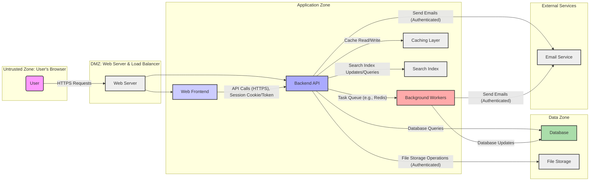

# Project Design Document: OpenProject for Threat Modeling - Improved

**Version:** 2.0
**Date:** October 26, 2023
**Author:** AI Software Architect

## 1. Introduction

This document provides an enhanced architectural overview of the OpenProject application, specifically tailored for comprehensive threat modeling. Building upon the previous version, this document offers more granular details about the system's components, their interactions, data flow with security considerations, and deployment scenarios. The aim is to provide a robust foundation for identifying and analyzing potential security threats.

### 1.1. Purpose

The primary purpose of this document remains to serve as a detailed blueprint for identifying and analyzing potential security threats within the OpenProject application. The added details facilitate a more in-depth and effective threat modeling exercise.

### 1.2. Scope

This document expands on the core components of the OpenProject application, providing more specific details about the technologies and functionalities involved. It continues to focus on the logical architecture and key interactions relevant to security, with added emphasis on data flow across security zones and deployment considerations.

### 1.3. Target Audience

The target audience remains security engineers, threat modelers, developers, and operations personnel involved in assessing and securing the OpenProject application. The increased detail caters to those requiring a deeper understanding of the system's inner workings for security analysis.

## 2. System Overview

OpenProject is a robust, web-based, open-source project management software designed for team collaboration. Key features include:

*   Comprehensive project planning and scheduling capabilities.
*   Detailed task management and progress tracking.
*   Efficient issue tracking and bug reporting mechanisms.
*   Support for Agile and Scrum methodologies.
*   Integrated time tracking functionalities.
*   Centralized document management system.
*   Enhanced team collaboration features including forums and wikis.
*   Granular user and permission management system.
*   Advanced reporting and analytics dashboards.

## 3. Architectural Design

OpenProject adheres to a well-defined three-tier web application architecture:

*   **Presentation Tier (Frontend):**  The user interface, typically accessed through a web browser, provides the user experience. This layer is responsible for rendering information and handling user interactions.
*   **Application Tier (Backend API):**  This layer houses the core business logic, manages data processing, and facilitates communication between the frontend and the data tier. It enforces security policies and handles authentication and authorization.
*   **Data Tier (Database):**  The persistent storage layer for all application data. It ensures data integrity and availability.

### 3.1. Components

*   **Web Frontend:**
    *   Primarily implemented using a modern JavaScript framework, likely **React** or **Angular**.
    *   Utilizes HTML, CSS, and JavaScript for rendering dynamic UI elements and handling user interactions.
    *   Communicates with the Backend API via asynchronous HTTP requests (e.g., AJAX).
    *   Performs client-side input validation and basic presentation logic.
*   **Backend API:**
    *   Built using a robust server-side framework, predominantly **Ruby on Rails**.
    *   Exposes a RESTful API for the frontend and potentially other clients to interact with application resources.
    *   Handles user authentication (e.g., using sessions, JWT).
    *   Enforces authorization rules based on user roles and permissions.
    *   Implements core business logic for project management, task handling, etc.
    *   Interacts with the Database for data persistence and retrieval.
    *   Communicates with Background Workers for asynchronous tasks.
*   **Database:**
    *   A relational database management system (RDBMS), commonly **PostgreSQL** or **MySQL**.
    *   Stores persistent data including user accounts, project details, tasks, issues, work packages, attachments, and other application-specific information.
    *   Ensures data integrity through constraints and transactions.
*   **Background Workers:**
    *   Processes asynchronous and deferred tasks, such as sending email notifications, generating reports, and handling resource-intensive operations.
    *   Often implemented using a background processing library like **Sidekiq** (for Ruby) and a message queue system like **Redis**.
*   **Web Server:**
    *   Handles incoming HTTP/HTTPS requests and routes them to the appropriate application components.
    *   Commonly uses **Nginx** or **Apache HTTP Server**.
    *   May handle SSL/TLS termination for secure communication.
*   **Caching Layer:**
    *   Improves application performance by storing frequently accessed data in memory.
    *   Typically utilizes in-memory data stores like **Redis** or **Memcached**.
    *   Reduces the load on the database.
*   **Search Index:**
    *   Provides efficient full-text search capabilities across project data.
    *   Likely implemented using a dedicated search engine such as **Elasticsearch** or **Solr**.
    *   Data is indexed from the database.
*   **File Storage:**
    *   Manages the storage of uploaded files and attachments associated with projects and work packages.
    *   Can be local file system storage or a cloud-based object storage service like **AWS S3**, **Azure Blob Storage**, or **Google Cloud Storage**.
*   **Email Service:**
    *   Handles the sending of email notifications for various events within the application (e.g., task assignments, issue updates).
    *   Often integrates with an external SMTP service or a dedicated email delivery platform.

### 3.2. Component Interactions with Security Zones

### 3.3. Data Flow with Security Considerations

1. **User Authentication:**
    *   User submits login credentials (username/password) through the **Web Frontend** (Untrusted Zone).
    *   The **Web Frontend** sends the credentials over HTTPS to the **Backend API** (Application Zone).
    *   The **Backend API** verifies the credentials against the stored user data in the **Database** (Data Zone). Password hashes are compared, not plain text passwords.
    *   Upon successful authentication, the **Backend API** creates a session and issues a session cookie or a JWT (JSON Web Token). This token is sent back to the **Web Frontend**.
    *   Subsequent requests from the **Web Frontend** include this session cookie or JWT in the HTTP headers for authentication and authorization.
2. **Creating a Project:**
    *   User interacts with the **Web Frontend** (Untrusted Zone) to input project details.
    *   The **Web Frontend** sends the project data via an HTTPS API call to the **Backend API** (Application Zone).
    *   The **Backend API** validates the input data to prevent injection attacks and ensures the user has the necessary permissions.
    *   The **Backend API** creates a new project record in the **Database** (Data Zone).
    *   The **Backend API** might enqueue a job for **Background Workers** (Application Zone) to perform tasks like sending notifications to project members.
3. **Uploading a File:**
    *   User uploads a file through the **Web Frontend** (Untrusted Zone).
    *   The **Web Frontend** sends the file content via an HTTPS POST request to the **Backend API** (Application Zone).
    *   The **Backend API** performs checks on the file (e.g., size limits, file type validation, malware scanning if implemented).
    *   The **Backend API** stores the file in **File Storage** (Data Zone), potentially using authenticated access to the storage service. Metadata about the file is stored in the **Database**.
4. **Searching for Tasks:**
    *   User enters search terms in the **Web Frontend** (Untrusted Zone).
    *   The **Web Frontend** sends a search request to the **Backend API** (Application Zone).
    *   The **Backend API** queries the **Search Index** (Application Zone) for matching tasks.
    *   The **Search Index** returns a list of relevant task IDs.
    *   The **Backend API** retrieves the full task data from the **Database** (Data Zone) based on the IDs, ensuring the user has permission to view these tasks.
    *   The **Backend API** sends the search results back to the **Web Frontend**.

## 4. Infrastructure

OpenProject's deployment infrastructure significantly impacts its security posture. Common deployment scenarios include:

*   **Self-Hosted:**
    *   OpenProject is deployed on the organization's own infrastructure, providing maximum control but also requiring significant security responsibilities.
    *   Security considerations include physical security of servers, network security (firewalls, intrusion detection), operating system hardening, and database security.
*   **Cloud-Based (IaaS, PaaS):**
    *   Leveraging cloud providers like AWS, Azure, or Google Cloud shifts some security responsibilities to the provider (e.g., physical security, infrastructure availability).
    *   Organizations are still responsible for securing the application itself, configuring cloud services securely (e.g., network configurations, access controls for storage), and managing user identities.
*   **Containerized (Docker, Kubernetes):**
    *   Containerization simplifies deployment and scaling but introduces new security considerations.
    *   Securing container images, managing container orchestration platforms securely, and implementing network policies within the container environment are crucial.

## 5. Data Management

### 5.1. Data Storage

*   **Relational Database (e.g., PostgreSQL):** Stores structured data with defined schemas, enforcing data integrity. Access is controlled through database user accounts and permissions.
*   **Object Storage (e.g., AWS S3):** Stores unstructured data like file attachments. Access is typically controlled through access keys, IAM roles, and bucket policies.
*   **In-Memory Cache (e.g., Redis):** Stores frequently accessed data for performance. Security considerations include securing access to the Redis instance and the sensitivity of cached data.
*   **Search Index (e.g., Elasticsearch):** Stores indexed data for search functionality. Security involves controlling access to the Elasticsearch cluster and securing the data being indexed.

### 5.2. Data Sensitivity

OpenProject handles various categories of sensitive data requiring appropriate protection:

*   **Authentication Credentials:** Usernames, password hashes (using strong hashing algorithms like bcrypt).
*   **Personal Identifiable Information (PII):** User profiles, email addresses, contact details.
*   **Project Intellectual Property:** Project plans, task descriptions, design documents, code snippets, and other project-related files.
*   **Financial Information (Potentially):** Depending on the use case, project budgets, cost estimates, or billing information might be stored.
*   **Communication Data:** Forum posts, comments, and potentially email content if integrated.

## 6. Security Considerations

This section expands on general security considerations, providing more specific examples:

*   **Authentication and Authorization:**
    *   Enforce strong password policies and multi-factor authentication (MFA).
    *   Use secure session management techniques (e.g., HTTP-only and secure cookies, proper session invalidation).
    *   Implement role-based access control (RBAC) to manage user permissions.
    *   Protect API endpoints with authentication mechanisms like JWT or OAuth 2.0.
*   **Input Validation and Output Encoding:**
    *   Sanitize and validate all user inputs on both the client-side and server-side to prevent injection attacks (SQL injection, XSS, command injection).
    *   Encode output data appropriately before rendering it in the browser to prevent XSS.
*   **Data Protection (Encryption):**
    *   Use HTTPS for all communication to encrypt data in transit.
    *   Encrypt sensitive data at rest in the database and file storage. Consider using database encryption features or encryption at the application level.
*   **API Security:**
    *   Implement rate limiting to prevent denial-of-service attacks.
    *   Use secure authentication and authorization mechanisms for API endpoints.
    *   Validate API request parameters and payloads.
    *   Implement proper error handling to avoid leaking sensitive information.
*   **Dependency Management:**
    *   Regularly update third-party libraries and dependencies to patch known vulnerabilities.
    *   Use dependency scanning tools to identify and address vulnerabilities.
*   **Secure Configuration:**
    *   Harden the web server, database, and operating systems by following security best practices.
    *   Disable unnecessary services and ports.
    *   Configure appropriate firewall rules.
*   **Logging and Monitoring:**
    *   Implement comprehensive logging of security-related events (e.g., login attempts, access violations).
    *   Monitor system logs for suspicious activity and security incidents.
    *   Set up alerts for critical security events.
*   **File Upload Security:**
    *   Validate file types and sizes.
    *   Sanitize file names.
    *   Store uploaded files outside the webroot to prevent direct access.
    *   Consider using anti-malware scanning for uploaded files.

## 7. Potential Threat Areas

This section provides a more granular breakdown of potential threats:

*   **Authentication and Authorization Vulnerabilities:**
    *   Brute-force attacks against login forms.
    *   Credential stuffing attacks.
    *   Session hijacking through cookie theft or session fixation.
    *   Insecure password reset mechanisms.
    *   Privilege escalation due to flaws in authorization logic.
    *   Missing or weak authentication on API endpoints.
*   **Injection Attacks:**
    *   SQL injection through unsanitized user input in database queries.
    *   Cross-site scripting (XSS) vulnerabilities allowing attackers to inject malicious scripts into web pages.
    *   Cross-site request forgery (CSRF) attacks exploiting authenticated sessions.
    *   Command injection through insecure handling of external commands.
    *   LDAP injection if the application interacts with LDAP directories.
*   **Data Breaches and Data Leaks:**
    *   Unauthorized access to the database due to weak credentials or vulnerabilities.
    *   Exposure of sensitive data through insecure API endpoints or error messages.
    *   Data leakage through insecure logging practices.
    *   Compromise of file storage leading to unauthorized access to uploaded files.
*   **API Security Flaws:**
    *   Lack of rate limiting leading to denial-of-service.
    *   Mass assignment vulnerabilities allowing attackers to modify unintended data.
    *   Insecure direct object references (IDOR) allowing access to unauthorized resources.
    *   Exposure of sensitive information in API responses.
*   **Supply Chain Vulnerabilities:**
    *   Exploiting known vulnerabilities in third-party libraries and dependencies.
    *   Compromise of development tools or infrastructure.
*   **Denial of Service (DoS) and Distributed Denial of Service (DDoS):**
    *   Overwhelming the application with malicious traffic.
    *   Exploiting application-level vulnerabilities to cause resource exhaustion.
*   **Insecure File Handling:**
    *   Uploading malicious files that can be executed on the server.
    *   Path traversal vulnerabilities allowing access to arbitrary files on the server.
    *   Information disclosure through file metadata.

## 8. Diagrams

The component interaction diagram with security zones in section 3.2 provides a visual representation. Additional diagrams that could be beneficial for threat modeling include:

*   **Deployment Diagram:** Illustrating the different deployment environments (self-hosted, cloud) and the components within each.
*   **Authentication Flow Diagram:** Detailing the steps involved in user authentication, including interactions between components.
*   **Authorization Flow Diagram:** Showing how access control decisions are made based on user roles and permissions.

## 9. Conclusion

This improved design document provides a more detailed and security-focused overview of the OpenProject architecture. By elaborating on components, interactions, data flow with security zones, and potential threat areas, it offers a stronger foundation for comprehensive threat modeling activities. This document will be instrumental in identifying and mitigating security risks, ultimately contributing to a more secure OpenProject application.