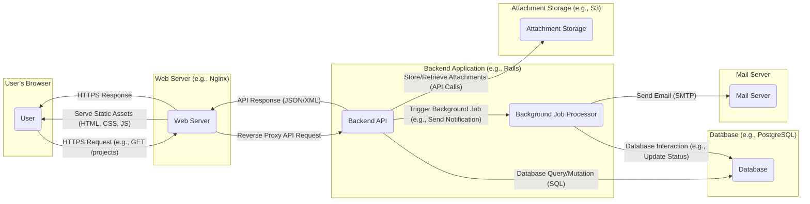

# Project Design Document: OpenProject

**Version:** 1.1
**Date:** October 26, 2023
**Author:** AI Software Architect

## 1. Introduction

This document provides an enhanced and more detailed architectural design overview of the OpenProject application. It aims to offer a comprehensive understanding of the system's components, their interactions, and the underlying technologies. This refined document will serve as a robust foundation for subsequent threat modeling activities, providing greater clarity and context for security analysis.

## 2. System Overview

OpenProject is a sophisticated, open-source, web-based project management software platform. It delivers a rich set of features essential for effective project management, encompassing task management, collaborative team workspaces, comprehensive time tracking, and support for various agile methodologies. Designed for self-hosting, OpenProject empowers users with full control over their data and the underlying infrastructure.

## 3. Architectural Design

OpenProject adopts a well-established multi-tier architecture, primarily structured around a distinct frontend, a robust backend, and a persistent data storage layer.

### 3.1. Components

*   **Frontend (User Interface):**
    *   Primary responsibility is the dynamic rendering of the user interface and the seamless handling of user interactions.
    *   Built using a modern, component-based JavaScript framework (likely React or potentially AngularJS, requiring codebase verification for definitive confirmation). This framework facilitates a modular and maintainable UI.
    *   Communicates with the backend API, typically via asynchronous HTTP requests (e.g., AJAX), to fetch, update, and manipulate application data.
    *   Manages client-side user authentication state and enforces basic authorization rules before sending requests to the backend.
    *   May include a build process involving tools like Webpack or Parcel for bundling and optimization.
*   **Backend (Application Logic & API):**
    *   Implements the core business logic of OpenProject, encompassing workflows, data validation, and feature implementations.
    *   Exposes a well-defined RESTful API (or potentially GraphQL) for the frontend to consume and for potential integrations with other systems. This API acts as the primary interface for data access and manipulation.
    *   Likely built using the Ruby on Rails framework, a common and mature choice for web applications, known for its convention-over-configuration approach.
    *   Enforces comprehensive user authentication and authorization, ensuring that only authenticated and authorized users can access specific resources and perform actions. This is crucial for data security and integrity.
    *   Manages data persistence, interacting with the database to store and retrieve information. This includes handling database migrations and ensuring data consistency.
    *   Handles background tasks and asynchronous operations, such as sending notifications or processing large datasets, often using a message queue system.
*   **Database:**
    *   Serves as the persistent storage for all application data, including detailed project information, user credentials and profiles, task specifications, and application settings.
    *   Primarily supports relational database management systems (RDBMS), with PostgreSQL being the recommended and often preferred option due to its robustness and feature set. MySQL is also likely supported.
    *   Crucially responsible for maintaining data integrity through constraints, transactions, and backups.
*   **Web Server:**
    *   Acts as the entry point for all incoming requests, serving static frontend assets (HTML, CSS, JavaScript, images) and acting as a reverse proxy for requests destined for the backend application server.
    *   Common and robust choices include Nginx or Apache, both known for their performance and security features.
    *   Handles TLS/SSL termination, ensuring secure encrypted communication (HTTPS) between the user's browser and the server. This is critical for protecting sensitive data in transit.
*   **Background Job Processor:**
    *   Dedicated to managing and executing asynchronous tasks that do not require immediate user interaction. This improves the responsiveness of the main application.
    *   Likely utilizes a robust background processing library like Sidekiq, a popular choice in the Ruby on Rails ecosystem, which relies on Redis for job queuing.
    *   Handles tasks such as sending email notifications, processing file uploads, generating reports, and performing other time-consuming operations.
*   **Mail Server Integration:**
    *   Enables the sending of email notifications triggered by various events within the application, keeping users informed about project updates, task assignments, and other relevant activities.
    *   Integrates with external Simple Mail Transfer Protocol (SMTP) servers or email service providers. Secure configuration and handling of email credentials are vital security considerations.
*   **Attachment Storage:**
    *   Manages the storage and retrieval of files uploaded by users as attachments to projects, tasks, and other entities.
    *   Can be configured to utilize local filesystem storage for simpler setups or leverage cloud-based object storage services like Amazon S3, Azure Blob Storage, or Google Cloud Storage for scalability and durability. The choice of storage impacts data backup and security strategies.

### 3.2. Interactions and Data Flow

**Data Flow Description:**

*   A user interacts with the OpenProject frontend through their web browser, initiating actions such as viewing projects or creating tasks.
*   The browser sends HTTPS requests to the web server, specifying the desired resource or action (e.g., fetching project details).
*   The web server efficiently serves static frontend assets (HTML, CSS, JavaScript) required to render the user interface.
*   For API requests (those requiring data processing or manipulation), the web server acts as a reverse proxy, forwarding these requests to the backend application.
*   The backend API receives the request, authenticates and authorizes the user, and then processes the request according to the application's business logic.
*   To fulfill the request, the backend often interacts with the database, performing queries to retrieve data or mutations to update or create data. Communication with the database typically involves SQL.
*   If the operation requires asynchronous processing (e.g., sending an email notification after a task is updated), the backend triggers a background job.
*   The background job processor picks up these jobs and executes them. These jobs may also interact with the database to update statuses or retrieve information needed for the task.
*   Background jobs can send emails via the configured mail server using the SMTP protocol.
*   When users upload or download files, the backend interacts with the configured attachment storage to store or retrieve these files. This interaction often involves API calls specific to the storage service.
*   The backend API constructs a response, typically in JSON or XML format, containing the requested data or the status of the operation.
*   The web server receives the API response and forwards it back to the user's browser via an HTTPS response.
*   The frontend JavaScript then processes the response and updates the user interface accordingly.

### 3.3. Deployment Model

OpenProject is primarily architected for self-hosted deployments, granting organizations significant control over their environment. Common deployment models include:

*   **On-Premises Deployment:** Installing and running OpenProject directly on the organization's physical or virtualized infrastructure within their own data centers. This model offers maximum control but requires significant in-house expertise for maintenance and security.
*   **Cloud Infrastructure (IaaS - Infrastructure as a Service):** Deploying OpenProject on virtual machines provided by cloud platforms like AWS EC2, Azure Virtual Machines, or Google Compute Engine. This provides scalability and flexibility while still requiring management of the underlying operating system and application.
*   **Containerized Deployment (Docker, Kubernetes):** Packaging OpenProject and its dependencies into Docker containers and orchestrating them using Kubernetes. This approach enhances portability, scalability, and simplifies deployment and management, especially in complex environments.

## 4. Key Technologies

*   **Backend Programming Language:** Ruby
*   **Backend Framework:** Ruby on Rails (provides structure, conventions, and tools for rapid development)
*   **Frontend Programming Language:** JavaScript (for interactive elements and dynamic content)
*   **Frontend Framework:** Likely React or AngularJS (provides a component-based architecture for building the user interface)
*   **Database System:** PostgreSQL (recommended for its robustness, features, and open-source nature), MySQL (another common relational database option)
*   **Web Server Software:** Nginx (known for its performance and efficiency), Apache HTTP Server (a widely used and mature web server)
*   **Background Job Processing Library:** Sidekiq (a popular and efficient background processing library for Ruby, using Redis)
*   **Caching Mechanism:** Potentially Redis or Memcached (for improving performance by storing frequently accessed data in memory)
*   **Search Engine:** Potentially Elasticsearch or a similar full-text search engine (for enabling efficient searching within project data)
*   **Containerization Technology:** Docker (for packaging the application and its dependencies into portable containers)
*   **Container Orchestration Platform:** Kubernetes (for managing and scaling containerized deployments)

## 5. User Roles and Permissions

OpenProject employs a granular role-based access control (RBAC) system to manage user permissions and access to different functionalities and data. This ensures that users only have access to the resources necessary for their tasks. Common user roles include:

*   **Administrator:** Possesses full, unrestricted access to all features, settings, and data within the OpenProject instance. Responsible for overall system configuration and user management.
*   **Project Manager:** Holds administrative privileges within specific projects, allowing them to manage project members, assign tasks, track progress, and configure project-specific settings.
*   **Member:** Can contribute to projects they are assigned to, work on assigned tasks, and access project information according to their assigned permissions.
*   **Viewer/Reporter:** Has read-only access to project information, allowing them to monitor progress and generate reports without the ability to make changes.

Permissions are highly configurable and can be defined at both the global level (affecting the entire OpenProject instance) and at the individual project level, providing fine-grained control over access to specific features and data. Adhering to the principle of least privilege is crucial for security.

## 6. Security Considerations (Detailed for Threat Modeling)

This section expands upon the initial security considerations, providing more specific examples of potential threats and areas requiring careful attention during threat modeling.

*   **Authentication Mechanisms:**
    *   **Threats:** Brute-force attacks on login forms, credential stuffing, insecure storage of password hashes, session hijacking.
    *   **Considerations:** Strength of password hashing algorithms (e.g., bcrypt, Argon2), implementation of multi-factor authentication (MFA), protection against brute-force attacks (e.g., rate limiting, account lockout), secure session management (e.g., HTTPOnly and Secure flags on cookies).
*   **Authorization and Access Control:**
    *   **Threats:** Privilege escalation, unauthorized access to sensitive data or functionalities, insecure API endpoints allowing unauthorized actions.
    *   **Considerations:** Proper implementation and enforcement of RBAC, secure API design with appropriate authentication and authorization checks on every endpoint, prevention of insecure direct object references (IDOR).
*   **Session Management:**
    *   **Threats:** Session fixation, session hijacking, replay attacks.
    *   **Considerations:** Use of strong session IDs, secure storage and transmission of session identifiers, proper session invalidation upon logout or timeout, protection against cross-site scripting (XSS) attacks that could steal session cookies.
*   **Input Validation and Output Encoding:**
    *   **Threats:** Cross-site scripting (XSS), SQL injection, command injection, other injection vulnerabilities.
    *   **Considerations:** Strict input validation on all user-provided data (both on the frontend and backend), proper output encoding to prevent interpretation of malicious scripts, use of parameterized queries or ORM features to prevent SQL injection.
*   **Data Protection at Rest:**
    *   **Threats:** Unauthorized access to the database or attachment storage, data breaches.
    *   **Considerations:** Encryption of sensitive data in the database (e.g., using database encryption features or application-level encryption), encryption of data at rest in attachment storage, secure configuration of database and storage access controls.
*   **Data Protection in Transit:**
    *   **Threats:** Man-in-the-middle (MITM) attacks, eavesdropping on sensitive data.
    *   **Considerations:** Enforce HTTPS for all communication, proper configuration of TLS/SSL certificates, use of secure protocols for communication between internal components.
*   **Dependency Management:**
    *   **Threats:** Exploitation of vulnerabilities in third-party libraries and dependencies.
    *   **Considerations:** Regularly scanning dependencies for known vulnerabilities, keeping dependencies up-to-date, using dependency management tools to track and manage dependencies.
*   **Rate Limiting and Abuse Prevention:**
    *   **Threats:** Denial-of-service (DoS) attacks, brute-force attacks, API abuse.
    *   **Considerations:** Implementing rate limiting on API endpoints and login attempts, using CAPTCHA or similar mechanisms to prevent automated abuse.
*   **Logging and Auditing:**
    *   **Threats:** Lack of visibility into security events, difficulty in detecting and responding to incidents.
    *   **Considerations:** Comprehensive logging of security-relevant events (e.g., login attempts, access to sensitive data, administrative actions), secure storage and management of logs, implementation of alerting mechanisms for suspicious activity.
*   **Password Policies:**
    *   **Threats:** Weak user passwords susceptible to cracking.
    *   **Considerations:** Enforcing strong password complexity requirements, encouraging the use of password managers, implementing account lockout policies after multiple failed login attempts.
*   **Vulnerability Management:**
    *   **Considerations:** Regular security assessments and penetration testing, participation in bug bounty programs, having a process for addressing reported vulnerabilities.

## 7. Assumptions and Constraints

*   This design document is based on a general understanding of web application architectures and the typical features of project management software. Specific implementation details within the OpenProject codebase may differ.
*   The exact frontend framework (React or AngularJS) requires confirmation by inspecting the project's source code.
*   The specific configuration of the deployment environment (e.g., operating system, web server configuration, database settings) can significantly influence the architecture and security considerations.
*   It is assumed that standard security best practices will be followed during the development and deployment of OpenProject.

## 8. Future Considerations

*   **Detailed API Specification (e.g., OpenAPI/Swagger):**  Essential for seamless integrations with other systems and for security analysis of API endpoints.
*   **Scalability and Performance Optimization Strategies:**  Designing for high-load environments, including considerations for load balancing, caching, and database optimization.
*   **Implementation of Specific Security Controls:**  Detailed plans for implementing security features like Content Security Policy (CSP), Subresource Integrity (SRI), and HTTP Strict Transport Security (HSTS).
*   **Integration with External Authentication Providers (e.g., SAML, OAuth 2.0):**  Supporting single sign-on (SSO) for enterprise environments.
*   **Data Backup and Disaster Recovery Planning:**  Strategies for ensuring data availability and resilience in case of failures.

This improved document provides a more comprehensive and detailed architectural overview of OpenProject, specifically tailored for effective threat modeling. It offers greater clarity on components, interactions, and security considerations, facilitating a more thorough and insightful security analysis.
