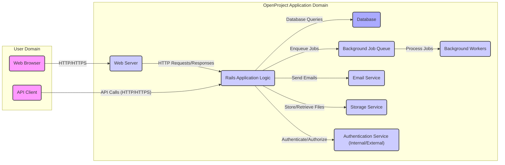
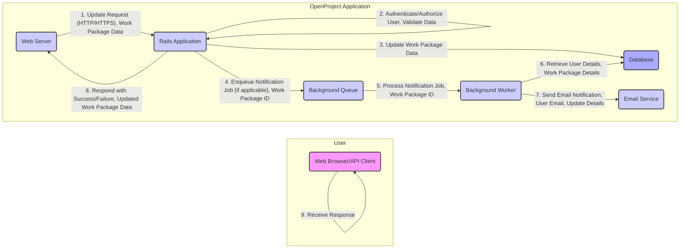

# Project Design Document: OpenProject

**Version:** 1.1
**Date:** October 26, 2023
**Author:** AI Software Architect

## 1. Introduction

This document provides an enhanced architectural design of the OpenProject application, drawing insights from the public GitHub repository: [https://github.com/opf/openproject](https://github.com/opf/openproject). The primary aim is to offer a detailed view of the system's components, their interactions, and data flows, specifically tailored for effective threat modeling exercises.

## 2. Goals and Objectives

The central goal remains to provide a clear and comprehensive architectural description of OpenProject to facilitate thorough threat modeling. Key objectives include:

*   Clearly identifying core components and their specific responsibilities within the system.
*   Precisely mapping the interactions and data flow pathways between these components.
*   Establishing a clear understanding of the underlying technologies and frameworks employed.
*   Describing common deployment architectures and their implications.
*   Explicitly highlighting security-relevant aspects of the design to guide threat identification.

## 3. Target Audience

This document is intended for a technical audience involved in the security and development of OpenProject:

*   Security engineers tasked with performing threat modeling, security assessments, and penetration testing.
*   Development teams actively contributing to the OpenProject codebase.
*   Operations teams responsible for the deployment, maintenance, and monitoring of OpenProject instances.
*   Technical stakeholders requiring a comprehensive understanding of the OpenProject system architecture.

## 4. System Architecture

### 4.1. High-Level Architecture Diagram

### 4.2. Component Breakdown

*   **Web Browser:** The user's primary interface for accessing and interacting with OpenProject's web-based features. It renders the HTML, CSS, and JavaScript delivered by the web server.
*   **API Client:**  External applications, scripts, or services that interact with OpenProject programmatically through its RESTful API.
*   **Web Server:**  Receives incoming HTTP/HTTPS requests from users and API clients and routes them to the Rails application. Examples include Puma or Unicorn. Responsible for handling TLS termination.
*   **Rails Application Logic:** The core of OpenProject, implemented using the Ruby on Rails framework. Key responsibilities include:
    *   Handling request routing and processing based on defined routes.
    *   Implementing business logic for project management, task tracking, etc.
    *   Performing data validation and sanitization.
    *   Enforcing authentication and authorization policies.
    *   Interacting with the database to persist and retrieve data.
    *   Managing background job enqueueing.
    *   Rendering HTML views and JSON/XML API responses.
*   **Database:**  The persistent data store for OpenProject, typically a relational database system such as PostgreSQL or MySQL. It stores:
    *   User account information, roles, and permissions.
    *   Project details, work packages, attachments, and related metadata.
    *   System configuration settings and preferences.
    *   Audit logs and activity history.
*   **Background Job Queue:** A message queue system (e.g., Sidekiq, backed by Redis) used to asynchronously process tasks that are not time-critical or could potentially block the main application thread.
*   **Background Workers:** Processes that consume and execute jobs from the background job queue. Common tasks include sending email notifications, processing large data imports/exports, and performing scheduled maintenance tasks.
*   **Email Service:**  An external service or an internal SMTP server used by OpenProject to send email notifications to users regarding project updates, task assignments, and other relevant events.
*   **Storage Service:**  Used for storing user-uploaded files and attachments. This can be a local filesystem, a network-attached storage (NAS), or a cloud-based object storage service like AWS S3 or Azure Blob Storage.
*   **Authentication Service:**  Handles user authentication and potentially authorization. This might be an internal mechanism or integration with external identity providers via protocols like OAuth 2.0 or SAML.

### 4.3. Data Flow Diagram (Example: Updating a Work Package)

## 5. Technology Stack

*   **Core Language:** Ruby
*   **Web Application Framework:** Ruby on Rails
*   **Web Server Options:** Puma (default), Unicorn, Passenger
*   **Database Support:** PostgreSQL (recommended), MySQL
*   **Background Job Processing:** Sidekiq (typically uses Redis as a message broker)
*   **Frontend Technologies:**  A combination of server-rendered HTML with sprinkles of JavaScript. While historically using AngularJS, newer versions likely incorporate more modern JavaScript practices and potentially components.
*   **Testing Frameworks:** RSpec, potentially others
*   **Version Control System:** Git

## 6. Deployment Architecture

OpenProject offers flexible deployment options:

*   **Self-Hosted Deployments:**
    *   **On-Premises:** Deployed directly on physical servers within an organization's data center.
    *   **Virtual Machines (VMs):** Deployed on virtualized infrastructure using platforms like VMware, Hyper-V, or cloud-based VM services (e.g., AWS EC2, Azure Virtual Machines, Google Compute Engine).
    *   **Containerized Deployments:** Using Docker and container orchestration platforms like Kubernetes or Docker Swarm for easier management and scalability.
*   **Cloud-Based Deployments:**
    *   **Infrastructure-as-a-Service (IaaS):** Deploying OpenProject components (web servers, database, etc.) on cloud provider's IaaS offerings.
    *   **Platform-as-a-Service (PaaS):** Utilizing PaaS solutions that provide managed environments for Ruby on Rails applications (e.g., Heroku, AWS Elastic Beanstalk).
    *   **Managed OpenProject Hosting:** Utilizing third-party providers that offer managed OpenProject hosting services.

A typical robust deployment might involve:

*   **Load Balancer:** Distributes incoming traffic across multiple web server instances for high availability and scalability.
*   **Multiple Web Server Instances:** Running the Rails application behind the load balancer.
*   **Dedicated Database Server:**  A separate server instance for the database to handle data persistence and retrieval. May involve replication for high availability.
*   **Redis Server:**  Used by Sidekiq for managing the background job queue. May be clustered for resilience.
*   **Background Worker Instances:** One or more dedicated instances for processing background jobs.
*   **Storage Service (Object Storage):**  Utilizing services like AWS S3 or Azure Blob Storage for scalable and durable storage of file uploads.
*   **Email Service Integration:** Configuration to use an external SMTP service (e.g., SendGrid, Mailgun) or an internal mail server.
*   **Monitoring and Logging Infrastructure:**  Tools for monitoring application performance, server health, and security logs.

## 7. Security Considerations

This section outlines key security considerations relevant to the OpenProject architecture:

*   **Authentication Vulnerabilities:**
    *   Brute-force attacks against login forms.
    *   Weak password policies.
    *   Vulnerabilities in multi-factor authentication (if implemented).
    *   Session fixation or hijacking vulnerabilities.
*   **Authorization Flaws:**
    *   Inadequate role-based access control leading to privilege escalation.
    *   Bypassable authorization checks allowing unauthorized access to resources or actions.
    *   Inconsistent authorization enforcement across different parts of the application.
*   **Data Security Risks:**
    *   SQL injection vulnerabilities allowing unauthorized database access.
    *   Cross-site scripting (XSS) vulnerabilities enabling malicious script injection.
    *   Exposure of sensitive data in transit (lack of HTTPS or insecure TLS configuration).
    *   Insecure storage of sensitive data at rest (e.g., passwords not properly hashed and salted).
    *   Insufficient protection of user-uploaded files, potentially leading to malware hosting or information disclosure.
*   **API Security Concerns:**
    *   Lack of proper authentication and authorization for API endpoints.
    *   Exposure of sensitive data through API responses.
    *   API rate limiting not implemented or insufficient, leading to potential abuse.
    *   Mass assignment vulnerabilities allowing attackers to modify unintended data.
*   **Infrastructure Security:**
    *   Vulnerabilities in the underlying operating system or web server software.
    *   Misconfigured firewalls or security groups allowing unauthorized access.
    *   Lack of regular security patching of system components and dependencies.
*   **Background Job Security:**
    *   Potential for sensitive data exposure in background job arguments or processing.
    *   Risk of denial-of-service if the background job queue is overwhelmed.
*   **Dependency Vulnerabilities:**
    *   Using outdated or vulnerable versions of Ruby gems or JavaScript libraries.
*   **Cross-Site Request Forgery (CSRF):**
    *   Lack of or improper implementation of CSRF protection mechanisms.
*   **Content Security Policy (CSP):**
    *   Missing or misconfigured CSP headers, increasing the risk of XSS attacks.

## 8. Assumptions and Constraints

*   This design document is based on publicly available information and general knowledge of web application architectures. Specific implementation details within the OpenProject codebase may differ.
*   The security considerations are a general overview and require further in-depth analysis and testing to identify specific vulnerabilities.
*   Deployment architectures can vary significantly, impacting security considerations. This document outlines common scenarios.
*   The technology stack and specific versions of components are subject to change.

## 9. Future Considerations

*   Adoption of a more service-oriented or microservices architecture to enhance scalability and maintainability.
*   Further development and hardening of the REST API for broader integration capabilities.
*   Integration with more external authentication and authorization providers.
*   Enhancements to real-time collaboration features.
*   Improvements in performance and scalability to handle larger user bases and data volumes.
*   Increased focus on security automation and DevSecOps practices.