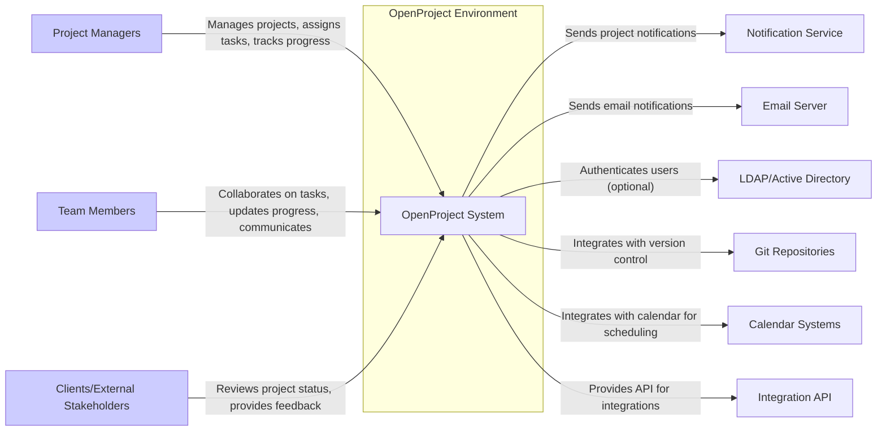
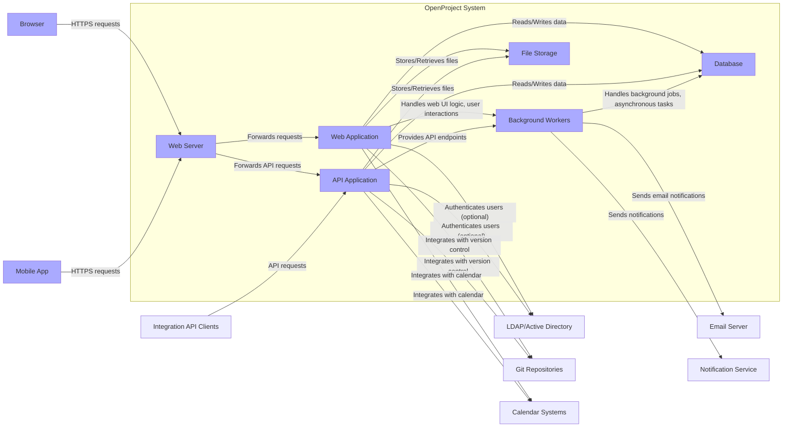
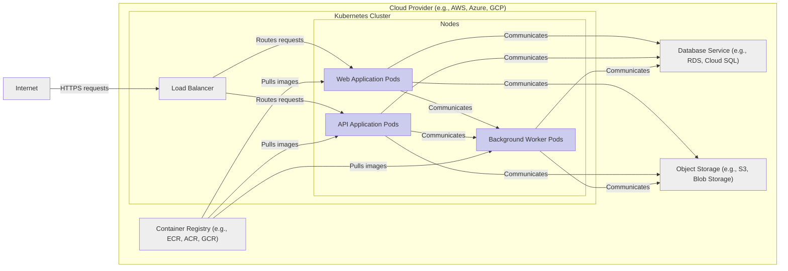

# BUSINESS POSTURE

This project, OpenProject, aims to provide a comprehensive open-source platform for project management and collaboration. It seeks to offer a feature-rich alternative to proprietary project management tools, catering to organizations of various sizes and industries.

Business Priorities and Goals:
- Provide a robust and versatile project management platform.
- Foster collaboration and communication within project teams.
- Offer a transparent and customizable solution through open-source licensing.
- Build a sustainable community around the project for continuous improvement and support.
- Enable efficient project execution and delivery.

Business Risks:
- Data breaches compromising sensitive project information.
- Service disruptions impacting project timelines and productivity.
- Loss of user trust due to security vulnerabilities or data loss.
- Difficulty in attracting and retaining users compared to established proprietary solutions.
- Community fragmentation and lack of consistent contributions.

# SECURITY POSTURE

Existing Security Controls:
- security control: HTTPS enforcement for web traffic (Assumed based on standard web application practices).
- security control: Role-Based Access Control (RBAC) for managing user permissions within projects (Inferred from project management software functionality).
- security control: Input validation on user inputs to prevent common web vulnerabilities (Assumed based on standard web application development practices).
- security control: Regular security updates and patches (Inferred from open-source project maintenance).

Accepted Risks:
- accepted risk: Potential vulnerabilities in third-party dependencies.
- accepted risk: Security misconfigurations by self-hosting users.
- accepted risk: Social engineering attacks targeting project users.

Recommended Security Controls:
- security control: Implement a comprehensive vulnerability scanning process for code and dependencies.
- security control: Conduct regular penetration testing to identify and address security weaknesses.
- security control: Establish a security incident response plan to handle security breaches effectively.
- security control: Provide security awareness training for developers and users.
- security control: Implement static and dynamic application security testing (SAST/DAST) in the CI/CD pipeline.

Security Requirements:
- Authentication:
    - security requirement: Secure user authentication mechanisms (e.g., password-based, multi-factor authentication).
    - security requirement: Protection against brute-force attacks and account takeover.
    - security requirement: Session management to securely handle user sessions.
- Authorization:
    - security requirement: Fine-grained authorization controls to manage access to project resources and functionalities based on user roles and permissions.
    - security requirement: Principle of least privilege applied to user access.
    - security requirement: Audit logging of authorization decisions and access attempts.
- Input Validation:
    - security requirement: Robust input validation and sanitization to prevent injection attacks (e.g., SQL injection, cross-site scripting).
    - security requirement: Input validation implemented on both client-side and server-side.
    - security requirement: Use of parameterized queries or ORM to prevent SQL injection.
- Cryptography:
    - security requirement: Encryption of sensitive data at rest (e.g., database encryption, file system encryption).
    - security requirement: Encryption of sensitive data in transit (HTTPS enforced).
    - security requirement: Secure storage and management of cryptographic keys.
    - security requirement: Use of strong and up-to-date cryptographic algorithms and libraries.

# DESIGN

## C4 CONTEXT

Context Diagram Elements:

- Element:
    - Name: OpenProject System
    - Type: Software System
    - Description: The core project management platform, providing features for task management, project planning, collaboration, and reporting.
    - Responsibilities: Manages project data, user accounts, access control, workflows, and integrations.
    - Security controls: security control: Authentication, security control: Authorization, security control: Input validation, security control: Data encryption, security control: Audit logging.

- Element:
    - Name: Project Managers
    - Type: Person
    - Description: Users responsible for initiating, planning, executing, and closing projects within OpenProject.
    - Responsibilities: Project creation, task assignment, resource allocation, progress monitoring, reporting.
    - Security controls: security control: Strong password management, security control: Multi-factor authentication (optional).

- Element:
    - Name: Team Members
    - Type: Person
    - Description: Users who contribute to project tasks and activities within OpenProject.
    - Responsibilities: Task completion, progress updates, communication, collaboration.
    - Security controls: security control: Strong password management, security control: Multi-factor authentication (optional).

- Element:
    - Name: Clients/External Stakeholders
    - Type: Person
    - Description: External users who may need to access project information or provide feedback.
    - Responsibilities: Project status review, feedback provision, limited access to project details.
    - Security controls: security control: Limited access permissions, security control: Authentication.

- Element:
    - Name: Email Server
    - Type: External System
    - Description: System responsible for sending and receiving email notifications related to project activities.
    - Responsibilities: Email delivery, handling email communication.
    - Security controls: security control: SMTP authentication, security control: TLS encryption for email transmission.

- Element:
    - Name: Notification Service
    - Type: External System
    - Description: System for delivering real-time notifications within the OpenProject platform or via other channels (e.g., push notifications).
    - Responsibilities: Real-time notification delivery, managing notification channels.
    - Security controls: security control: Secure API for sending notifications, security control: Access control for notification management.

- Element:
    - Name: LDAP/Active Directory
    - Type: External System
    - Description: Optional directory service for user authentication and management.
    - Responsibilities: User authentication, user directory synchronization.
    - Security controls: security control: Secure LDAP/AD integration, security control: Password policy enforcement.

- Element:
    - Name: Git Repositories
    - Type: External System
    - Description: Version control systems (e.g., GitHub, GitLab, Bitbucket) integrated with OpenProject for code management and project tracking.
    - Responsibilities: Code repository hosting, version control, integration with project tasks.
    - Security controls: security control: Secure API integration, security control: Access control to repositories.

- Element:
    - Name: Calendar Systems
    - Type: External System
    - Description: Calendar applications (e.g., Google Calendar, Outlook Calendar) integrated with OpenProject for scheduling and task management.
    - Responsibilities: Calendar synchronization, event scheduling.
    - Security controls: security control: Secure API integration, security control: Data synchronization security.

- Element:
    - Name: Integration API
    - Type: External System
    - Description: API provided by OpenProject to allow integration with other systems and services.
    - Responsibilities: API access for external applications, data exchange.
    - Security controls: security control: API authentication and authorization, security control: Rate limiting, security control: Input validation on API requests.

## C4 CONTAINER

Container Diagram Elements:

- Element:
    - Name: Web Application
    - Type: Container
    - Description: Ruby on Rails application serving the web user interface for OpenProject. Handles user interactions, business logic for web UI, and communication with other containers.
    - Responsibilities: Rendering web pages, handling user requests, managing user sessions, orchestrating workflows, interacting with API Application and Database.
    - Security controls: security control: Web application firewall (WAF), security control: Input validation, security control: Session management, security control: Authentication and authorization, security control: Protection against common web vulnerabilities (OWASP Top 10).

- Element:
    - Name: API Application
    - Type: Container
    - Description: Ruby on Rails application providing a RESTful API for OpenProject functionalities. Used by the web application, mobile apps, and external integrations.
    - Responsibilities: Exposing API endpoints, handling API requests, business logic for API, authentication and authorization for API access, interacting with Database and Background Workers.
    - Security controls: security control: API authentication and authorization (e.g., OAuth 2.0), security control: API rate limiting, security control: Input validation, security control: API security best practices.

- Element:
    - Name: Background Workers
    - Type: Container
    - Description: Background processing system (e.g., Sidekiq) for handling asynchronous tasks such as sending email notifications, processing large datasets, and scheduled jobs.
    - Responsibilities: Asynchronous task execution, email sending, background job processing, scheduled tasks.
    - Security controls: security control: Secure job queuing mechanism, security control: Monitoring of background job execution, security control: Input validation for job parameters.

- Element:
    - Name: Database
    - Type: Container
    - Description: Relational database (e.g., PostgreSQL, MySQL) storing project data, user information, and application configuration.
    - Responsibilities: Data persistence, data retrieval, data integrity, data consistency.
    - Security controls: security control: Database access control, security control: Database encryption at rest, security control: Regular database backups, security control: Database vulnerability scanning.

- Element:
    - Name: File Storage
    - Type: Container
    - Description: Storage system for user-uploaded files and attachments (e.g., local file system, object storage like AWS S3, Azure Blob Storage).
    - Responsibilities: File storage, file retrieval, file management.
    - Security controls: security control: Access control for file storage, security control: Encryption of files at rest, security control: Virus scanning for uploaded files.

- Element:
    - Name: Web Server
    - Type: Container
    - Description: Web server (e.g., Nginx, Apache) acting as a reverse proxy, handling HTTPS termination, load balancing, and serving static assets.
    - Responsibilities: HTTPS termination, request routing, load balancing, serving static content, security headers.
    - Security controls: security control: HTTPS configuration, security control: Web server hardening, security control: Security headers configuration, security control: DDoS protection.

- Element:
    - Name: Browser
    - Type: Container
    - Description: User's web browser accessing the OpenProject web application.
    - Responsibilities: Rendering web UI, user interaction, sending requests to the web server.
    - Security controls: security control: Browser security features, security control: User awareness of phishing and social engineering attacks.

- Element:
    - Name: Mobile App
    - Type: Container
    - Description: Native mobile application (if any) for accessing OpenProject functionalities.
    - Responsibilities: Mobile UI, user interaction, API communication with the API Application.
    - Security controls: security control: Mobile app security best practices, security control: Secure storage of credentials, security control: Protection against mobile-specific vulnerabilities.

- Element:
    - Name: Email Server
    - Type: External System
    - Description: (Same as Context Diagram)
    - Responsibilities: (Same as Context Diagram)
    - Security controls: (Same as Context Diagram)

- Element:
    - Name: Notification Service
    - Type: External System
    - Description: (Same as Context Diagram)
    - Responsibilities: (Same as Context Diagram)
    - Security controls: (Same as Context Diagram)

- Element:
    - Name: LDAP/Active Directory
    - Type: External System
    - Description: (Same as Context Diagram)
    - Responsibilities: (Same as Context Diagram)
    - Security controls: (Same as Context Diagram)

- Element:
    - Name: Git Repositories
    - Type: External System
    - Description: (Same as Context Diagram)
    - Responsibilities: (Same as Context Diagram)
    - Security controls: (Same as Context Diagram)

- Element:
    - Name: Calendar Systems
    - Type: External System
    - Description: (Same as Context Diagram)
    - Responsibilities: (Same as Context Diagram)
    - Security controls: (Same as Context Diagram)

- Element:
    - Name: Integration API Clients
    - Type: External System
    - Description: External applications or services that integrate with OpenProject via its API.
    - Responsibilities: Interacting with OpenProject API, data exchange, extending OpenProject functionalities.
    - Security controls: security control: API client authentication, security control: Secure API key management, security control: Adherence to API security guidelines.

## DEPLOYMENT

Deployment Architecture: Cloud Deployment (Kubernetes)

Deployment Diagram Elements:

- Element:
    - Name: Web Application Pods
    - Type: Deployment Node (Kubernetes Pod)
    - Description: Instances of the Web Application container running within Kubernetes pods. Scaled horizontally for high availability and performance.
    - Responsibilities: Serving web UI, handling user requests, web application logic.
    - Security controls: security control: Container image security scanning, security control: Network policies to restrict pod communication, security control: Resource limits and quotas.

- Element:
    - Name: API Application Pods
    - Type: Deployment Node (Kubernetes Pod)
    - Description: Instances of the API Application container running within Kubernetes pods. Scaled horizontally for high availability and performance.
    - Responsibilities: Serving API endpoints, handling API requests, API application logic.
    - Security controls: security control: Container image security scanning, security control: Network policies to restrict pod communication, security control: Resource limits and quotas.

- Element:
    - Name: Background Worker Pods
    - Type: Deployment Node (Kubernetes Pod)
    - Description: Instances of the Background Worker container running within Kubernetes pods. Scaled based on background job load.
    - Responsibilities: Asynchronous task processing, background jobs.
    - Security controls: security control: Container image security scanning, security control: Network policies to restrict pod communication, security control: Resource limits and quotas.

- Element:
    - Name: Load Balancer
    - Type: Deployment Element
    - Description: Cloud provider's load balancer distributing incoming HTTPS traffic across Web Application and API Application pods.
    - Responsibilities: Load balancing, HTTPS termination, traffic routing.
    - Security controls: security control: DDoS protection, security control: TLS configuration, security control: Access logs.

- Element:
    - Name: Database Service (e.g., RDS, Cloud SQL)
    - Type: Deployment Element
    - Description: Managed database service provided by the cloud provider, offering scalability, high availability, and backups.
    - Responsibilities: Data persistence, database management.
    - Security controls: security control: Database access control lists (ACLs), security control: Database encryption at rest and in transit, security control: Automated backups, security control: Vulnerability scanning.

- Element:
    - Name: Object Storage (e.g., S3, Blob Storage)
    - Type: Deployment Element
    - Description: Cloud provider's object storage service for storing user-uploaded files and attachments.
    - Responsibilities: File storage, scalability, durability.
    - Security controls: security control: Access control policies, security control: Encryption at rest, security control: Versioning, security control: Audit logging.

- Element:
    - Name: Container Registry (e.g., ECR, ACR, GCR)
    - Type: Deployment Element
    - Description: Cloud provider's container registry for storing and managing container images.
    - Responsibilities: Container image storage, image versioning, access control.
    - Security controls: security control: Access control policies, security control: Image scanning for vulnerabilities, security control: Image signing.

- Element:
    - Name: Internet
    - Type: Deployment Element
    - Description: Public internet through which users access the OpenProject application.
    - Responsibilities: Public network access.
    - Security controls: security control: HTTPS encryption, security control: DDoS mitigation at the load balancer.

## BUILD

```mermaid
flowchart LR
    A["Developer"]:::build_element -- "Code changes, commits" --> B["Git Repository"]:::build_element
    B -- "Webhook trigger" --> C["CI/CD System (e.g., GitHub Actions)"]:::build_element
    C -- "Build, Test, Scan" --> D["Build Artifacts (Container Images, Packages)"]:::build_element
    D -- "Push Images" --> E["Container Registry"]:::build_element

    subgraph "CI/CD System (e.g., GitHub Actions)"
        C1["Source Code Checkout"]:::build_step
        C2["Dependency Resolution"]:::build_step
        C3["Compilation/Build"]:::build_step
        C4["Unit Tests"]:::build_step
        C5["SAST Scanning"]:::build_step
        C6["Dependency Scanning"]:::build_step
        C7["Container Image Build"]:::build_step
        C8["DAST Scanning (Optional)"]:::build_step
    end
    C --> C1 --> C2 --> C3 --> C4 --> C5 --> C6 --> C7 --> C8 --> D

    classDef build_element fill:#eef
    classDef build_step fill:#dde
```

Build Process Description:

The build process for OpenProject is assumed to be automated using a CI/CD system like GitHub Actions, triggered by code changes pushed to the Git repository.

Build Process Steps:
1. Source Code Checkout: The CI/CD system checks out the latest source code from the Git repository.
2. Dependency Resolution: Dependencies are resolved and downloaded (e.g., Ruby gems, Node.js modules).
3. Compilation/Build: The application code is compiled and built into executable artifacts.
4. Unit Tests: Automated unit tests are executed to verify code functionality.
5. SAST Scanning: Static Application Security Testing (SAST) tools are used to scan the source code for potential security vulnerabilities.
6. Dependency Scanning: Dependency scanning tools are used to identify known vulnerabilities in third-party dependencies.
7. Container Image Build: Container images (e.g., Docker images) are built for the Web Application, API Application, and Background Workers.
8. DAST Scanning (Optional): Dynamic Application Security Testing (DAST) tools may be used to scan a deployed instance of the application for vulnerabilities (this step might be part of a separate deployment pipeline).
9. Build Artifacts: Build artifacts, including container images and packages, are generated.
10. Push Images: Container images are pushed to a container registry.

Build Process Security Controls:
- security control: Automated build process to ensure consistency and repeatability.
- security control: Source code repository access control to protect code integrity.
- security control: SAST scanning to identify and remediate code-level vulnerabilities early in the development cycle.
- security control: Dependency scanning to identify and update vulnerable dependencies.
- security control: Container image scanning for vulnerabilities before deployment.
- security control: Secure storage of build artifacts and container images in the container registry.
- security control: Code signing and image signing to ensure artifact integrity and authenticity.
- security control: Access control to the CI/CD system and build pipelines.

Build Diagram Elements:

- Element:
    - Name: Developer
    - Type: Build Element
    - Description: Software developers writing and committing code changes.
    - Responsibilities: Writing code, committing changes, code reviews.
    - Security controls: security control: Secure development environment, security control: Code review process, security control: Security awareness training.

- Element:
    - Name: Git Repository
    - Type: Build Element
    - Description: Version control system (e.g., GitHub) hosting the OpenProject source code.
    - Responsibilities: Source code management, version control, code history.
    - Security controls: security control: Access control, security control: Branch protection, security control: Audit logging.

- Element:
    - Name: CI/CD System (e.g., GitHub Actions)
    - Type: Build Element
    - Description: Automated CI/CD pipeline for building, testing, and scanning the application.
    - Responsibilities: Build automation, testing, security scanning, artifact generation.
    - Security controls: security control: Access control, security control: Secure pipeline configuration, security control: Audit logging.

- Element:
    - Name: Build Artifacts (Container Images, Packages)
    - Type: Build Element
    - Description: Output of the build process, including container images and installable packages.
    - Responsibilities: Application distribution, deployment.
    - Security controls: security control: Artifact signing, security control: Secure storage.

- Element:
    - Name: Container Registry
    - Type: Build Element
    - Description: Registry for storing and managing container images.
    - Responsibilities: Container image storage, image distribution.
    - Security controls: security control: Access control, security control: Image scanning, security control: Image signing.

- Element:
    - Name: Source Code Checkout
    - Type: Build Step
    - Description: Step in CI/CD pipeline to retrieve source code.
    - Responsibilities: Code retrieval.
    - Security controls: security control: Secure connection to repository.

- Element:
    - Name: Dependency Resolution
    - Type: Build Step
    - Description: Step in CI/CD pipeline to download dependencies.
    - Responsibilities: Dependency management.
    - Security controls: security control: Dependency source verification, security control: Vulnerability scanning of dependencies.

- Element:
    - Name: Compilation/Build
    - Type: Build Step
    - Description: Step in CI/CD pipeline to compile and build application.
    - Responsibilities: Code compilation, artifact creation.
    - Security controls: security control: Secure build environment.

- Element:
    - Name: Unit Tests
    - Type: Build Step
    - Description: Step in CI/CD pipeline to execute unit tests.
    - Responsibilities: Code quality assurance.
    - Security controls: security control: Test environment isolation.

- Element:
    - Name: SAST Scanning
    - Type: Build Step
    - Description: Step in CI/CD pipeline to perform static application security testing.
    - Responsibilities: Vulnerability detection in code.
    - Security controls: security control: SAST tool configuration, security control: Remediation tracking.

- Element:
    - Name: Dependency Scanning
    - Type: Build Step
    - Description: Step in CI/CD pipeline to scan dependencies for vulnerabilities.
    - Responsibilities: Vulnerability detection in dependencies.
    - Security controls: security control: Dependency scanning tool configuration, security control: Remediation tracking.

- Element:
    - Name: Container Image Build
    - Type: Build Step
    - Description: Step in CI/CD pipeline to build container images.
    - Responsibilities: Container image creation.
    - Security controls: security control: Base image security, security control: Minimal image construction.

- Element:
    - Name: DAST Scanning (Optional)
    - Type: Build Step
    - Description: Step in CI/CD pipeline to perform dynamic application security testing.
    - Responsibilities: Vulnerability detection in running application.
    - Security controls: security control: DAST tool configuration, security control: Test environment isolation.

# RISK ASSESSMENT

Critical Business Processes:
- Project Planning and Management: Core functionality of OpenProject, essential for organizing and executing projects.
- Task Management and Collaboration: Enables team members to work together effectively and track progress.
- Time Tracking and Reporting: Provides insights into project timelines and resource utilization.
- User and Access Management: Controls who can access and modify project information.
- Integrations with External Systems: Extends OpenProject's functionality and connects it with other tools.

Data Sensitivity:
- Project Data: Contains project plans, tasks, documents, communications, and progress updates. Sensitivity: Confidential, potentially sensitive depending on project context.
- User Data: Includes user accounts, profiles, roles, and permissions. Sensitivity: Personally Identifiable Information (PII), confidential.
- Financial Data (if applicable): May include project budgets, costs, and billing information. Sensitivity: Highly confidential, financial data.
- Authentication Credentials: Passwords, API keys, session tokens. Sensitivity: Highly confidential, critical for security.

Data to Protect:
- Confidentiality: Protect project data, user data, and financial data from unauthorized access.
- Integrity: Ensure the accuracy and completeness of project data and prevent unauthorized modifications.
- Availability: Maintain the availability of the OpenProject platform for users to access and manage their projects.

# QUESTIONS & ASSUMPTIONS

Questions:
- What is the specific deployment architecture used by OpenProject (e.g., cloud provider, on-premise, hybrid)?
- Is there a publicly available security policy or security documentation for OpenProject?
- What specific SAST, DAST, and dependency scanning tools are used in the build process?
- Are there any specific compliance requirements (e.g., GDPR, HIPAA) that OpenProject needs to adhere to?
- What is the process for handling security vulnerabilities reported by the community or security researchers?

Assumptions:
- OpenProject is deployed in a cloud environment using Kubernetes for container orchestration.
- Standard web application security best practices are followed in the development of OpenProject.
- HTTPS is enforced for all web traffic.
- Role-Based Access Control (RBAC) is implemented for authorization.
- Input validation is performed to prevent common web vulnerabilities.
- A CI/CD pipeline is used for building and deploying OpenProject.
- The project is actively maintained and receives regular security updates.