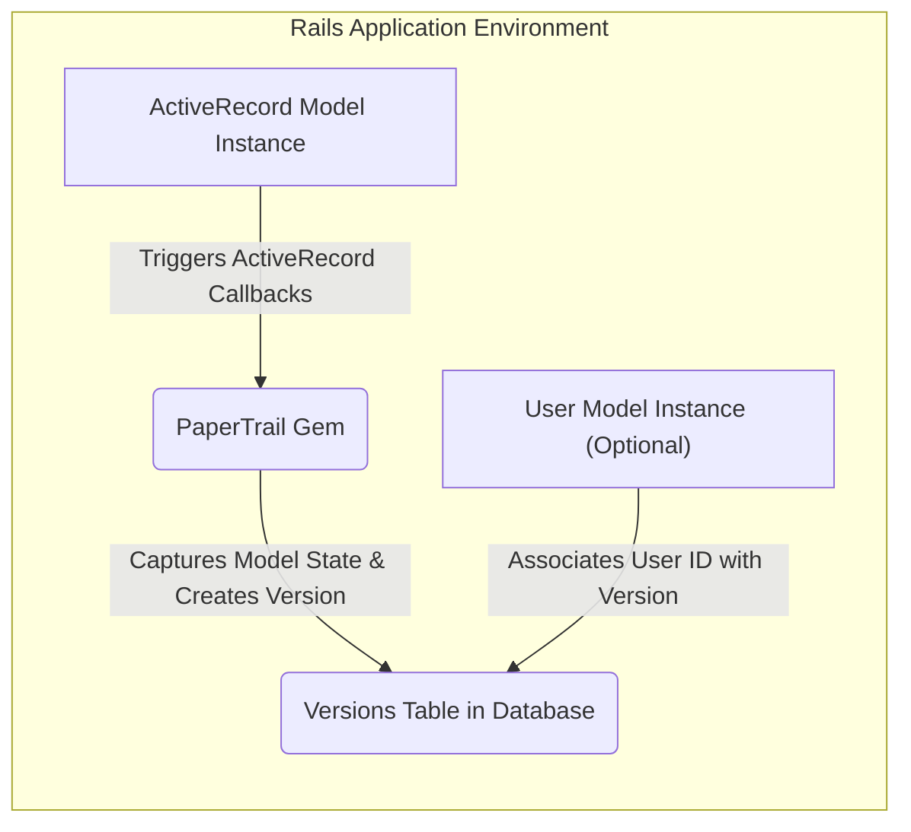
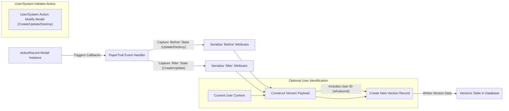

# Project Design Document: PaperTrail Gem

**Version:** 1.1
**Date:** October 26, 2023
**Author:** AI Software Architect

## 1. Introduction

This document provides an enhanced and more detailed design overview of the PaperTrail gem (available at [https://github.com/paper-trail-gem/paper_trail](https://github.com/paper-trail-gem/paper_trail)). This revised document is specifically tailored to facilitate comprehensive threat modeling activities. It offers a deeper understanding of the gem's components, data flow, and interactions within a Ruby on Rails application.

## 2. Goals and Scope

The primary goal of PaperTrail is to provide robust auditing and versioning capabilities for ActiveRecord models within a Ruby on Rails application. This includes meticulously tracking creations, updates, and destructions of records, ensuring a comprehensive history of changes. The gem's design allows for detailed insight into who made changes, when they occurred, and the specific attributes that were modified.

This design document comprehensively covers the core functionality of PaperTrail, including:

*   Seamlessly tracking changes to designated ActiveRecord models.
*   Persistently storing version history within a dedicated database table named `versions`.
*   Optionally associating each version with the specific user responsible for the change, enhancing accountability.
*   Providing a rich set of methods to efficiently access, query, and analyze the stored version history.
*   Offering extensive configuration options to customize which models and attributes are tracked, and the methodology for associating changes with users.

The scope of this document explicitly excludes:

*   Granular, line-by-line code-level implementation details within the PaperTrail gem.
*   In-depth performance benchmarking analyses or specific optimization strategies for the gem.
*   Detailed integration procedures with other Ruby gems or external services beyond its core functionality.
*   Specific user interface (UI) elements or designs for visualizing version history, as PaperTrail primarily operates on the backend.

## 3. System Overview

PaperTrail functions as an integral middleware component within a Ruby on Rails application's request lifecycle. Upon configuration for a particular ActiveRecord model, it strategically intercepts create, update, and destroy operations. Subsequently, it diligently persists the details of these changes as a new, immutable record within the `versions` table.

Key aspects of the system architecture include:

*   **Deep ActiveRecord Integration:** PaperTrail leverages ActiveRecord's powerful callback system and association mechanisms for seamless operation.
*   **Dedicated Database Storage:** Version information is consistently stored in a dedicated database table, conventionally named `versions`, ensuring data integrity and separation.
*   **Optional User Tracking:** The gem provides the capability to optionally track the user responsible for each change by establishing a relationship with a `user` model, enhancing audit trails.
*   **Flexible Configuration:** PaperTrail offers a wide array of configuration options, enabling developers to precisely specify which models and attributes to monitor, and how to accurately associate changes with the responsible users.

## 4. Architectural Design

### 4.1. Component Diagram

### 4.2. Component Descriptions

*   **ActiveRecord Model Instance:** A specific instance of a Ruby on Rails model that has been configured to be versioned by PaperTrail. This is the object whose changes are being tracked.
*   **PaperTrail Gem:** The core library responsible for intercepting model modification events. It encapsulates the logic for capturing model state, serializing changes, and persisting version records. It acts as the central processing unit for versioning.
*   **Versions Table in Database:** The persistent storage mechanism for version history. This table, typically within the application's primary database, stores records detailing each tracked change. Each row represents a distinct version of a tracked model.
*   **User Model Instance (Optional):**  An instance of the Ruby on Rails model representing a user of the application. When user tracking is enabled, PaperTrail uses this model to associate changes with the user who initiated them. This association is crucial for audit trails and accountability.

### 4.3. Interactions

The fundamental interaction flow within PaperTrail is as follows:

1. An actor (either a user interacting through the application's UI or an internal system process) initiates a create, update, or destroy operation on an ActiveRecord model that is under PaperTrail's monitoring.
2. ActiveRecord's callback mechanism, which PaperTrail has registered with, intercepts this operation and triggers the relevant logic within the PaperTrail gem. These callbacks are the entry point for PaperTrail's functionality.
3. PaperTrail meticulously captures the state of the model both before and after the change occurs. For 'update' and 'destroy' events, the 'before' state is crucial for understanding what was changed. For 'create' and 'update', the 'after' state represents the new version of the data.
4. A new record is then created within the `versions` table. This record meticulously stores comprehensive information about the change, including:
    *   The `item_type`: A string denoting the class name of the ActiveRecord model that was modified.
    *   The `item_id`: An integer representing the primary key of the specific model instance that was changed.
    *   The `event`: A string indicating the type of operation performed ('create', 'update', or 'destroy').
    *   The `object`: A serialized representation (typically YAML or JSON) of the model's attributes *after* the change for 'create' and 'update' events.
    *   The `object_changes`: A serialized representation detailing the specific attributes that were modified and their previous values for 'update' events.
    *   Timestamps (`created_at` and `updated_at`) indicating when the version record was created.
    *   Optionally, the `whodunnit`:  The identifier (typically the primary key) of the user who was responsible for initiating the change, if user tracking is enabled.
5. The application's normal operation flow continues without interruption, as PaperTrail's operations are designed to be non-blocking.
6. Developers can subsequently leverage PaperTrail's API to query the `versions` table and retrieve the complete history of changes for specific models or individual records, enabling auditing, rollback capabilities, and historical analysis.

## 5. Data Flow

### 5.1. Data Flow Diagram

### 5.2. Data Elements

Key data elements involved in the PaperTrail data flow:

*   **Model Attributes (Pre-Change):** The values of the tracked ActiveRecord model's attributes *before* a change occurs (relevant for 'update' and 'destroy' operations).
*   **Model Attributes (Post-Change):** The values of the tracked ActiveRecord model's attributes *after* a change has been applied (relevant for 'create' and 'update' operations).
*   **Version Record Data:** The structured data that is ultimately persisted in a row of the `versions` table. This includes:
    *   `item_type`:  A string representing the class name of the versioned model.
    *   `item_id`: An integer indicating the primary key of the specific model instance.
    *   `event`: A string specifying the type of change ('create', 'update', 'destroy').
    *   `whodunnit`: A string or integer (depending on configuration) identifying the user responsible for the change. This often references the primary key of the `User` model.
    *   `object`: A serialized text representation (e.g., YAML or JSON) of the model's attributes *after* the change for 'create' and 'update' events. This provides a snapshot of the model's state.
    *   `object_changes`: A serialized text representation detailing the specific attributes that were modified and their original values for 'update' events. This allows for precise tracking of changes.
    *   `created_at`: A timestamp indicating when the version record was created, reflecting the time of the change.
    *   `updated_at`: A timestamp that is typically the same as `created_at` for version records.
*   **User Identifier:** The unique identifier of the user performing the action. This is typically retrieved from the application's authentication system or session.

## 6. Security Considerations (Detailed for Threat Modeling)

This section elaborates on potential security considerations, providing a more detailed analysis to inform the threat modeling process.

*   **Data Integrity of Version History:** Maintaining the integrity of the `versions` table is paramount for reliable auditing. Unauthorized modification or deletion of records within this table could severely compromise the audit trail, hindering investigations and potentially masking malicious activity.
    *   **Threat:** Malicious actors or compromised accounts could attempt to directly manipulate `versions` table data to cover their tracks.
    *   **Mitigation Considerations:** Implement strict access controls on the `versions` table at the database level, limiting modification and deletion privileges to authorized services or administrators. Explore using database features like audit logging or temporal tables for an additional layer of tamper-evidence. Consider data signing or checksums for version records.
*   **Access Control to Version Data:** The `versions` table may contain sensitive information within the `object` and `object_changes` fields. Unauthorized access to this data could lead to privacy breaches and exposure of confidential information.
    *   **Threat:** Unauthorized users or applications could gain access to version history, potentially revealing sensitive personal data, financial information, or business secrets.
    *   **Mitigation Considerations:** Implement robust authorization mechanisms within the application to control who can access and query version data. This might involve role-based access control (RBAC) or attribute-based access control (ABAC). Consider encrypting sensitive data at rest within the `object` and `object_changes` columns. Explore data masking or redaction techniques for specific attributes when displaying version history to users with lower privileges.
*   **Data Privacy Compliance:** The version history might inadvertently store personally identifiable information (PII) or other sensitive data subject to privacy regulations (e.g., GDPR, CCPA).
    *   **Threat:** Failure to properly manage and secure PII within the version history could lead to violations of privacy regulations, resulting in fines and reputational damage.
    *   **Mitigation Considerations:** Implement data minimization strategies to avoid tracking unnecessary sensitive attributes. Establish clear data retention policies for version history, including secure deletion mechanisms. Provide users with mechanisms to access, rectify, and erase their data from the version history where applicable and compliant with regulations.
*   **SQL Injection Vulnerabilities:** If user-supplied input is directly incorporated into queries against the `versions` table without proper sanitization, it could create opportunities for SQL injection attacks.
    *   **Threat:** Attackers could inject malicious SQL code to bypass security controls, potentially gaining unauthorized access to data, modifying version history, or even compromising the entire database.
    *   **Mitigation Considerations:**  Strictly adhere to secure coding practices, ensuring all database queries against the `versions` table utilize parameterized queries or prepared statements to prevent SQL injection. Regularly perform static and dynamic code analysis to identify potential vulnerabilities.
*   **Denial of Service (DoS) Attacks:**  Malicious actors could potentially trigger excessive version creation through rapid or automated changes to tracked models, leading to performance degradation or storage exhaustion.
    *   **Threat:** Attackers could overwhelm the system by generating a large volume of version records, impacting application performance and potentially leading to service outages.
    *   **Mitigation Considerations:** Implement rate limiting on actions that trigger version creation. Monitor the size and growth of the `versions` table. Consider implementing mechanisms to throttle or block users or IP addresses exhibiting suspicious versioning activity. Explore asynchronous processing of version creation to minimize impact on the main application thread.
*   **Information Disclosure through Errors and Logs:**  Error messages or application logs might unintentionally expose sensitive information contained within the version history.
    *   **Threat:** Attackers could exploit verbose error messages or insecure logging practices to gain insights into the structure and content of version data.
    *   **Mitigation Considerations:** Implement secure logging practices, ensuring that sensitive data from version records is not included in application logs. Configure error handling to avoid displaying detailed error messages to end-users, opting instead for generic error responses. Regularly review application logs for sensitive information and potential security issues.
*   **Authentication and Authorization Weaknesses related to `whodunnit`:** If the mechanism for identifying the user responsible for a change (`whodunnit`) is flawed or relies on insecure authentication methods, the integrity of the audit trail can be compromised.
    *   **Threat:** Attackers could potentially forge or manipulate the `whodunnit` information, attributing actions to innocent users or masking their own malicious activities.
    *   **Mitigation Considerations:** Ensure the application's authentication and authorization mechanisms are robust and secure. Use reliable methods for identifying the current user, such as secure session management or token-based authentication. Avoid relying on easily spoofed information for user identification.

## 7. Deployment Considerations

Deploying PaperTrail within a Ruby on Rails application involves several key considerations:

*   **Database Compatibility:** PaperTrail requires a relational database system that is compatible with ActiveRecord. Common choices include PostgreSQL, MySQL, and SQLite. Ensure the database is properly configured and accessible to the Rails application.
*   **Database Migrations:**  Running PaperTrail's provided database migrations is essential to create the necessary `versions` table and any associated indexes. These migrations should be executed as part of the application deployment process.
*   **Model Configuration:** Developers need to explicitly configure which ActiveRecord models should be versioned by including the `has_paper_trail` directive in the model definition. Careful consideration should be given to which models truly require versioning to avoid unnecessary overhead.
*   **User Context Configuration:** If tracking the user responsible for changes, the application needs a reliable mechanism to identify the current user. PaperTrail typically integrates with common authentication solutions like Devise or acts_as_authentic. The `config.whodunnit` method in an initializer is often used to specify how to retrieve the current user.
*   **Serialization Configuration:** PaperTrail uses serialization (typically YAML or JSON) to store the `object` and `object_changes`. Consider the security implications of the chosen serialization format and ensure it is not vulnerable to deserialization attacks if user-controlled data is involved.
*   **Storage Considerations:** The `versions` table can grow significantly over time, especially in applications with frequent data changes. Plan for adequate storage capacity and consider strategies for archiving or partitioning older version data if necessary.
*   **Performance Impact:** While PaperTrail is generally efficient, excessive versioning of frequently updated models can have a performance impact. Monitor database performance and consider optimizing queries against the `versions` table if performance issues arise.

## 8. Future Considerations

Potential future enhancements and areas for further exploration of PaperTrail include:

*   **Pluggable Version Storage:**  Allowing developers to choose alternative storage mechanisms for version data beyond the standard relational database table. This could include options like NoSQL databases or dedicated audit logging systems.
*   **Event-Driven Versioning Triggers:** Expanding the ability to trigger version creation based on specific application events beyond the standard ActiveRecord CRUD operations. This would allow for more fine-grained control over what actions are audited.
*   **Integration with External Audit Logging Systems:** Providing built-in mechanisms to stream version data to external, dedicated audit logging services for enhanced security and compliance. This would provide a more robust and centralized audit trail.
*   **More Granular Change Tracking Capabilities:** Implementing the ability to track changes at a more granular level, such as specific array element modifications or changes within nested attributes.
*   **Asynchronous Version Creation:**  Introducing asynchronous processing of version record creation to further minimize the performance impact on the main application request/response cycle. This could involve using background job processing.
*   **Data Retention Policies within the Gem:**  Providing built-in features for automatically purging or archiving older version records based on configurable retention policies, simplifying compliance with data retention requirements.

This enhanced design document provides a more comprehensive understanding of the PaperTrail gem's architecture, data flow, and security considerations. This detailed information serves as a strong foundation for conducting thorough threat modeling exercises to proactively identify and mitigate potential security risks.