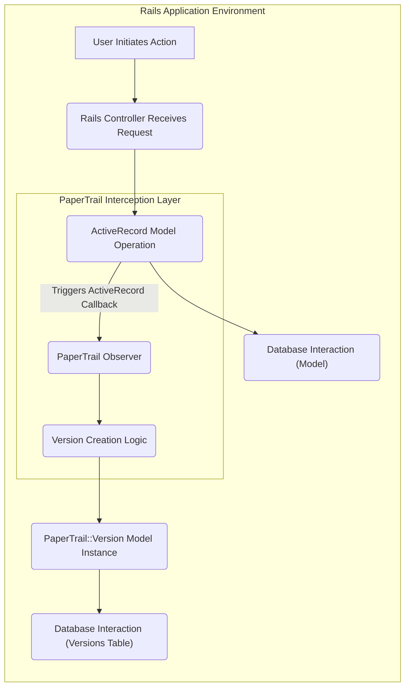
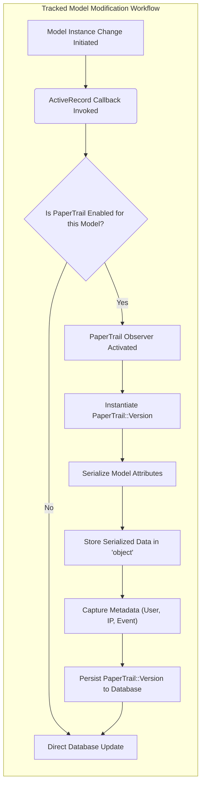
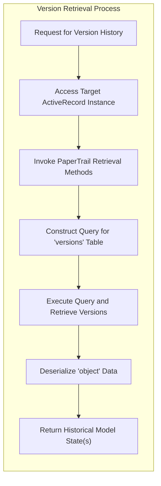

# Project Design Document: PaperTrail Gem

**Version:** 1.1
**Date:** October 26, 2023
**Author:** AI Software Architect

## 1. Introduction

This document provides an enhanced and detailed design overview of the PaperTrail gem, a robust Ruby on Rails library designed for comprehensive tracking of changes to your application's data. This document aims to furnish a deep understanding of the gem's architecture, intricate data flow mechanisms, and the responsibilities of its key components. This detailed information is crucial for conducting thorough threat modeling and ensuring the secure and reliable operation of applications utilizing PaperTrail.

## 2. Goals and Objectives

The core goals underpinning the design and functionality of the PaperTrail gem are:

*   To offer a straightforward yet highly effective method for meticulously tracking modifications applied to ActiveRecord model instances.
*   To facilitate the seamless retrieval of historical states of model records, enabling rollback and comparison capabilities.
*   To empower auditing and in-depth historical analysis of data modifications, providing valuable insights into data evolution.
*   To maintain a high degree of configurability and adaptability, catering to the diverse requirements of various application environments and use cases.

## 3. Target Audience

This document is specifically tailored for:

*   Security engineers and architects tasked with performing comprehensive threat modeling and security assessments.
*   Software developers actively engaged in working with or integrating the PaperTrail gem into their applications.
*   Operations and infrastructure teams responsible for the deployment, maintenance, and monitoring of applications leveraging PaperTrail.

## 4. Scope

The focus of this design document is strictly confined to the internal architecture and operational functionalities of the PaperTrail gem itself. It deliberately excludes the broader application ecosystem or the underlying infrastructure within which PaperTrail might be integrated.

## 5. High-Level Architecture

PaperTrail operates as an integral middleware component within a Ruby on Rails application. It strategically intercepts ActiveRecord model lifecycle events to capture and record data changes.

*   **User Initiates Action:** A user interaction triggers a data modification within the application (e.g., submitting a form, API call).
*   **Rails Controller Receives Request:** The Rails controller handles the incoming user request.
*   **ActiveRecord Model Operation:** The controller interacts with an ActiveRecord model instance to perform a create, update, or destroy operation.
*   **Triggers ActiveRecord Callback:** ActiveRecord lifecycle callbacks (e.g., `before_save`, `after_create`) are triggered by the model operation.
*   **PaperTrail Observer:** The core component of PaperTrail, acting as an event listener, intercepts these ActiveRecord callbacks.
*   **Version Creation Logic:** The observer initiates the process of creating a new version record.
*   **Database Interaction (Model):** The original model's data is persisted or updated in its corresponding database table.
*   **PaperTrail::Version Model Instance:** A new instance of the `PaperTrail::Version` model is created to store the version information.
*   **Database Interaction (Versions Table):** The `PaperTrail::Version` instance is saved to the designated `versions` table in the database.

## 6. Data Flow

The following details the sequence of actions during a typical modification of a tracked ActiveRecord model:

*   **Model Instance Change Initiated:** An attribute of a versioned ActiveRecord model is altered.
*   **ActiveRecord Callback Invoked:**  Relevant ActiveRecord callbacks such as `before_create`, `before_update`, `before_destroy`, `after_create`, `after_update`, `after_destroy` are triggered.
*   **Is PaperTrail Enabled for this Model?:** PaperTrail checks its configuration to determine if the current model is designated for version tracking.
*   **PaperTrail Observer Activated:** If versioning is enabled, the PaperTrail observer intercepts the callback.
*   **Direct Database Update:** If versioning is not enabled, the model changes are directly persisted to the database.
*   **Instantiate PaperTrail::Version:** A new `PaperTrail::Version` record is created in memory.
*   **Serialize Model Attributes:** The relevant attributes of the modified model are serialized, typically using YAML or JSON, to capture their state before the change.
*   **Store Serialized Data in 'object':** The serialized attributes are stored in the `object` column of the `versions` table.
*   **Capture Metadata (User, IP, Event):**  Optional metadata, including the user responsible for the change (if available), the originating IP address, and the type of event (create, update, destroy), are captured and stored in corresponding columns of the `versions` table.
*   **Persist PaperTrail::Version to Database:** The newly created `PaperTrail::Version` record, containing the serialized data and metadata, is saved to the database.

The process for retrieving previous versions is as follows:

*   **Request for Version History:** The application requires access to the historical versions of a specific model record.
*   **Access Target ActiveRecord Instance:** The relevant ActiveRecord model instance for which version history is needed is accessed.
*   **Invoke PaperTrail Retrieval Methods:** PaperTrail provides methods like `versions`, `previous_version`, `next_version`, and `version_at` to facilitate interaction with the version history.
*   **Construct Query for 'versions' Table:** PaperTrail dynamically constructs database queries to retrieve the relevant records from the `versions` table based on the model's `item_type` and `item_id`.
*   **Execute Query and Retrieve Versions:** The database query is executed, and the matching `PaperTrail::Version` records are retrieved.
*   **Deserialize 'object' Data:** The serialized model attributes stored in the `object` column of the retrieved version records are deserialized back into their original data structure.
*   **Return Historical Model State(s):** The deserialized data representing the previous state(s) of the model is returned to the application.

## 7. Key Components

*   **`PaperTrail::Model::InstanceMethods`:**  These methods are dynamically injected into ActiveRecord models that are configured for versioning. They provide functionalities such as:
    *   `versions`: Returns an ordered list of all versions for the model instance.
    *   `previous_version`: Retrieves the version immediately preceding the current state.
    *   `next_version`: Retrieves the version immediately following the current state.
    *   `undo!`: Reverts the model instance to its previous version.
    *   `redo!`: Reapplies the changes from the next version.
*   **`PaperTrail::Model::ClassMethods`:**  Class-level methods added to versioned models, primarily the `has_paper_trail` method, which is used to declare that a model should be versioned and to configure versioning options.
*   **`PaperTrail::Version` Model:**  A dedicated ActiveRecord model provided by PaperTrail to persist version information. Its typical schema includes:
    *   `item_type`:  A string storing the class name of the versioned model.
    *   `item_id`:  An integer representing the ID of the versioned model instance.
    *   `event`:  A string indicating the type of event that triggered the version creation (e.g., 'create', 'update', 'destroy').
    *   `whodunnit`:  A string or integer identifying the user responsible for the change. This is configurable and can be based on the current user in the application.
    *   `object`:  A text or JSON column containing the serialized attributes of the model *before* the change occurred.
    *   `object_changes`: An optional text or JSON column storing the specific attributes that were changed, along with their old and new values.
    *   `created_at`: A timestamp indicating when the version record was created.
    *   Additional metadata columns:  Configurable columns to store extra information, such as the user's IP address (`ip`), user agent (`user_agent`), or any other relevant context.
*   **Configuration Options:** PaperTrail offers a rich set of configuration options to tailor its behavior:
    *   `only` and `ignore`:  Specify which attributes should be tracked or explicitly ignored during versioning.
    *   `version_limit`:  Limit the number of versions stored for each record to manage storage.
    *   `on`:  Define which lifecycle events should trigger version creation (e.g., `:create`, `:update`, `:destroy`).
    *   `serializer`:  Choose the serialization method for storing object data (e.g., `YAML`, `JSON`).
    *   `track_associations`: Configure whether changes to associated models should also trigger version creation.
    *   `save_changes`:  Enable or disable the storage of the `object_changes` column.
    *   `whodunnit_attribute_name`: Customize the name of the attribute used to store the user identifier.
*   **Observers/Callbacks:** PaperTrail leverages ActiveRecord's observer pattern and callback mechanisms to intercept model lifecycle events. When a tracked model is created, updated, or destroyed, these callbacks trigger the creation of a corresponding `PaperTrail::Version` record.

## 8. Security Considerations

*   **Integrity of Version History Data:** Maintaining the integrity of the `versions` table is paramount. Unauthorized modification or deletion of version records would severely compromise the audit trail and potentially mask malicious activities. Implement strict access controls and consider write-only access for the application.
*   **Access Control to Version Data:** Access to the `versions` table should be restricted to authorized personnel only. The `object` and `object_changes` columns may contain sensitive information that requires protection. Implement robust role-based access control (RBAC) at the database level.
*   **Handling Sensitive Data:** Exercise caution when tracking attributes that contain highly sensitive information (e.g., passwords, API keys). Employ attribute whitelisting to explicitly define what is tracked and consider encrypting sensitive data before it is stored in the version history.
*   **Security of User Identification (`whodunnit`):** The mechanism for identifying the user responsible for changes must be secure and reliable. Ensure that the application's authentication and authorization mechanisms are robust and that the `whodunnit` attribute accurately reflects the authenticated user. Avoid relying on client-provided information for user identification.
*   **Performance Implications:** The process of creating version records on every change can introduce performance overhead, particularly for high-volume applications. Consider implementing asynchronous processing of version creation using background job queues to minimize impact on request latency.
*   **Serialization Vulnerabilities:** If using YAML for serialization, be aware of potential deserialization vulnerabilities if the data source is compromised or if untrusted data is processed. JSON is generally considered a safer alternative in terms of deserialization security. Sanitize data before serialization to prevent injection attacks.
*   **Information Disclosure Risks:** Ensure that error messages, logs, and debugging information related to PaperTrail do not inadvertently expose sensitive information about the application's data, structure, or internal workings. Implement secure logging practices and avoid verbose error reporting in production environments.
*   **Dependency Management:** Regularly update the PaperTrail gem and its dependencies to patch known security vulnerabilities. Implement a process for monitoring and addressing security advisories related to the gem and its dependencies.

## 9. Deployment Considerations

*   **Database Schema Migrations:** Deploying PaperTrail necessitates running database migrations to create the `versions` table and any associated indexes. Ensure that migration scripts are properly managed and applied during deployment.
*   **Configuration Management:**  Properly configure PaperTrail within the application's initializers or configuration files. This includes specifying which models to track, setting up user tracking, and configuring serialization options. Use environment variables or secure configuration management tools to manage sensitive configuration parameters.
*   **User Tracking Implementation:** Ensure that the application correctly identifies the current user and makes this information available to PaperTrail for populating the `whodunnit` attribute. This typically involves accessing the current user from the request context.
*   **Storage Capacity Planning:** The `versions` table can grow significantly over time, especially for frequently updated models. Plan for sufficient database storage capacity and implement data retention policies to archive or purge older version records as needed. Consider using database partitioning or archiving strategies for large `versions` tables.
*   **Performance Monitoring:** Monitor the performance of database write operations related to version creation. Identify and address any performance bottlenecks that may arise due to PaperTrail's activity.
*   **Backup and Recovery:** Include the `versions` table in regular database backups to ensure that the audit trail can be recovered in case of data loss or system failure.

## 10. Future Considerations

*   **Integration with External Audit Logging Systems:** Explore options for seamless integration with dedicated external audit logging systems (e.g., Splunk, ELK stack) to centralize audit logs and enhance security monitoring and compliance efforts.
*   **Data Masking and Redaction:** Implement mechanisms to automatically mask or redact sensitive data before it is persisted in the version history. This could involve defining rules for specific attributes or data patterns.
*   **Asynchronous Version Record Creation Enhancements:** Further optimize asynchronous version creation by exploring more robust background processing solutions and implementing error handling and retry mechanisms.
*   **More Granular Change Tracking Options:** Investigate the feasibility of providing more granular options for tracking changes, such as tracking changes at the attribute level with detailed diffs, beyond the current `object_changes` functionality.
*   **Versioning of Non-ActiveRecord Data:** Explore potential extensions or integrations to enable version tracking for data sources beyond ActiveRecord models.
*   **Enhanced Search and Filtering Capabilities:**  Consider adding more advanced search and filtering capabilities to the version history to facilitate easier auditing and analysis.