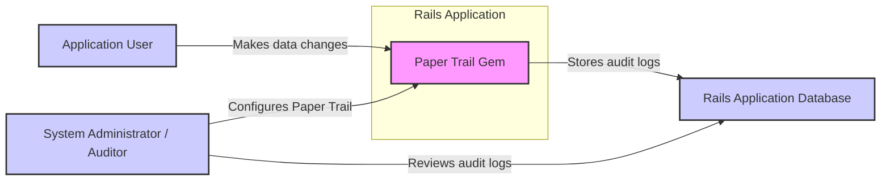

# BUSINESS POSTURE

This project is the `paper_trail` Ruby gem, a library designed to track changes to data within Ruby on Rails applications. It provides an audit trail of modifications made to models, enabling features like version history, rollback, and activity logging.

* Business Priorities and Goals:
  - Data Integrity: Ensuring that changes to application data are reliably recorded and can be reviewed.
  - Accountability: Providing a clear audit trail of who made what changes and when.
  - Compliance: Meeting regulatory or internal requirements for data change tracking and auditing.
  - Debugging and Troubleshooting: Assisting in identifying the root cause of issues by reviewing historical data changes.
  - Feature Enhancement: Enabling features like undo/redo, version comparison, and activity feeds based on tracked changes.

* Business Risks:
  - Data Loss or Corruption in Audit Logs: If the audit trail itself is compromised or unreliable, the benefits of using `paper_trail` are negated.
  - Performance Overhead: Tracking changes can introduce performance overhead to the application, potentially impacting user experience.
  - Storage Costs: Storing audit logs can consume significant storage space, especially in applications with high data modification rates.
  - Security Breaches via Audit Logs: If audit logs contain sensitive information and are not properly secured, they could become a target for attackers.
  - Compliance Failures: If `paper_trail` is not configured or used correctly, it may not meet the required compliance standards, leading to penalties or reputational damage.

# SECURITY POSTURE

* Existing Security Controls:
  - security control: Dependency Management: Relies on RubyGems.org for gem distribution and dependency resolution. (Implemented by: RubyGems infrastructure)
  - security control: Code Review:  Project is open source and hosted on GitHub, allowing for community code review. (Implemented by: GitHub community and maintainers)
  - security control: Version Control: Uses Git for version control, providing history and traceability of code changes. (Implemented by: Git and GitHub)
  - accepted risk: Vulnerabilities in Dependencies:  The gem depends on other Ruby gems, which may contain security vulnerabilities. Risk is mitigated by regular dependency updates and security scanning (if implemented by the consuming application).
  - accepted risk: Configuration Errors: Misconfiguration of `paper_trail` in the consuming application could lead to incomplete or inaccurate audit logs, or potential security issues.
  - accepted risk: Data Exposure in Logs: Audit logs may inadvertently capture sensitive data if not configured carefully.

* Recommended Security Controls:
  - security control: Input Validation and Sanitization: Implement input validation and sanitization within `paper_trail` to prevent injection attacks when storing data in audit logs.
  - security control: Secure Configuration Guidance: Provide clear documentation and best practices for securely configuring `paper_trail`, including guidance on what data to track and how to protect audit logs.
  - security control: Regular Security Audits: Conduct periodic security audits of the `paper_trail` gem code to identify and address potential vulnerabilities.
  - security control: Automated Security Scanning: Integrate automated security scanning tools (SAST, dependency scanning) into the development and release process of `paper_trail`.

* Security Requirements:
  - Authentication: `paper_trail` itself does not handle authentication. It relies on the authentication mechanisms of the consuming Rails application to determine the current user making changes.
  - Authorization: `paper_trail` should respect the authorization policies of the consuming Rails application. Access to audit logs should be restricted to authorized users only. The gem itself does not enforce authorization, this is responsibility of consuming application.
  - Input Validation: `paper_trail` must validate and sanitize data before storing it in the audit trail to prevent injection vulnerabilities (e.g., SQL injection, XSS if audit logs are displayed in a web interface). This is especially important for user-provided data that is being tracked.
  - Cryptography: Consider using encryption for sensitive data stored in audit logs, especially if the database itself is not encrypted at rest. This could involve encrypting specific attributes or the entire audit log data. Data masking or redaction techniques should also be considered to minimize the storage of sensitive data in audit logs.

# DESIGN

The `paper_trail` gem is designed as a library that integrates directly into Ruby on Rails applications. It leverages Rails' ActiveRecord models to intercept data changes and store them in audit logs.

## C4 CONTEXT



* Context Diagram Elements:
  - Element:
    * Name: Paper Trail Gem
    * Type: Software System / Library
    * Description: A Ruby gem that provides audit logging and version tracking for Rails ActiveRecord models.
    * Responsibilities:
      - Intercepting data changes in Rails models.
      - Storing audit logs in a database.
      - Providing APIs to query and retrieve audit logs.
    * Security controls:
      - Input validation and sanitization (recommended).
      - Secure configuration options (recommended).

  - Element:
    * Name: Application User
    * Type: Person
    * Description: Users of the Rails application that utilizes `paper_trail`.
    * Responsibilities:
      - Interacting with the Rails application, causing data changes that are tracked by `paper_trail`.
    * Security controls:
      - Authenticated by the Rails application.
      - Authorized by the Rails application.

  - Element:
    * Name: Rails Application Database
    * Type: Data Store
    * Description: The database used by the Rails application to store application data and audit logs generated by `paper_trail`.
    * Responsibilities:
      - Storing application data.
      - Storing audit logs from `paper_trail`.
      - Providing data persistence.
    * Security controls:
      - Database access controls (authentication and authorization).
      - Data encryption at rest (if configured).
      - Regular backups.

  - Element:
    * Name: System Administrator / Auditor
    * Type: Person
    * Description: Individuals responsible for configuring `paper_trail`, reviewing audit logs for compliance, security monitoring, or debugging purposes.
    * Responsibilities:
      - Configuring `paper_trail` within the Rails application.
      - Reviewing audit logs for various purposes.
      - Ensuring the integrity and security of audit logs.
    * Security controls:
      - Access to audit logs should be restricted based on roles and responsibilities.
      - Audit logging of access to audit logs (if required for compliance).

## C4 CONTAINER

```mermaid
flowchart LR
    subgraph "Rails Application"
        A["Paper Trail Gem" ]
        B["Rails Application Code"]
        C["Rails Web Server"]
    end
    D["Rails Application Database"]

    B --> A & C: "Uses"
    C --> D: "Reads/Writes"
    A --> D: "Writes Audit Logs"

    style A fill:#f9f,stroke:#333,stroke-width:2px
    style B fill:#ccf,stroke:#333,stroke-width:2px
    style C fill:#ccf,stroke:#333,stroke-width:2px
    style D fill:#ccf,stroke:#333,stroke-width:2px
```

* Container Diagram Elements:
  - Element:
    * Name: Paper Trail Gem
    * Type: Library / Container
    * Description: Ruby gem integrated into the Rails application. Provides the core logic for tracking changes and storing audit logs.
    * Responsibilities:
      - Intercepting ActiveRecord model changes.
      - Generating audit log records.
      - Interacting with the database to store audit logs.
      - Providing APIs for querying audit logs.
    * Security controls:
      - Input validation and sanitization (recommended).
      - Secure configuration handling (recommended).

  - Element:
    * Name: Rails Application Code
    * Type: Application Code / Container
    * Description: The custom Ruby code of the Rails application that utilizes the `paper_trail` gem.
    * Responsibilities:
      - Defining models to be tracked by `paper_trail`.
      - Configuring `paper_trail` settings.
      - Utilizing `paper_trail` APIs to access audit logs (if needed).
    * Security controls:
      - Application-level authorization to control access to features that use audit logs.
      - Secure coding practices to prevent vulnerabilities in application logic.

  - Element:
    * Name: Rails Web Server
    * Type: Web Server / Container
    * Description: The web server (e.g., Puma, Unicorn) that hosts the Rails application and handles incoming user requests.
    * Responsibilities:
      - Handling HTTP requests from users.
      - Executing Rails application code.
      - Interacting with the database.
    * Security controls:
      - Web server security configuration (e.g., TLS/SSL, security headers).
      - Protection against web application attacks (handled by Rails framework and application code).

  - Element:
    * Name: Rails Application Database
    * Type: Database / Container
    * Description: The relational database (e.g., PostgreSQL, MySQL) used by the Rails application to store both application data and audit logs.
    * Responsibilities:
      - Persisting application data.
      - Persisting audit logs.
      - Providing data access and querying capabilities.
    * Security controls:
      - Database access controls (authentication and authorization).
      - Database hardening and security configuration.
      - Data encryption at rest (if configured).
      - Regular backups and disaster recovery.

## DEPLOYMENT

`paper_trail` is deployed as part of the Rails application deployment. There is no separate deployment process for the gem itself. The Rails application can be deployed in various environments, such as cloud platforms (AWS, Azure, GCP), containerized environments (Docker, Kubernetes), or traditional server infrastructure.

Let's consider a typical cloud deployment using a Platform-as-a-Service (PaaS) like Heroku or AWS Elastic Beanstalk.

```mermaid
flowchart LR
    subgraph "Cloud Environment (e.g., AWS, Heroku)"
        subgraph "Web Tier"
            A["Load Balancer"]
            B["Rails Web Server Instance 1"]
            C["Rails Web Server Instance 2"]
            D["Rails Web Server Instance N"]
        end
        E["Application Database (e.g., RDS, Heroku Postgres)"]
    end
    F["User Browser"]

    F --> A: "HTTPS Requests"
    A --> B & C & D: "HTTP Requests"
    B & C & D --> E: "Database Queries (including audit log writes)"

    style A fill:#ccf,stroke:#333,stroke-width:2px
    style B fill:#ccf,stroke:#333,stroke-width:2px
    style C fill:#ccf,stroke:#333,stroke-width:2px
    style D fill:#ccf,stroke:#333,stroke-width:2px
    style E fill:#ccf,stroke:#333,stroke-width:2px
    style F fill:#ccf,stroke:#333,stroke-width:2px
```

* Deployment Diagram Elements:
  - Element:
    * Name: Load Balancer
    * Type: Infrastructure Component
    * Description: Distributes incoming HTTPS traffic across multiple Rails web server instances for scalability and high availability.
    * Responsibilities:
      - Load balancing incoming requests.
      - TLS/SSL termination.
      - Health checks for web server instances.
    * Security controls:
      - HTTPS/TLS encryption.
      - DDoS protection (provided by cloud platform).
      - Access control lists (ACLs) to restrict access.

  - Element:
    * Name: Rails Web Server Instance (1, 2, N)
    * Type: Compute Instance
    * Description: Virtual machines or containers running the Rails application code, including the `paper_trail` gem and the Rails web server.
    * Responsibilities:
      - Hosting and running the Rails application.
      - Processing user requests.
      - Executing application logic, including `paper_trail` functionality.
    * Security controls:
      - Operating system and application security hardening.
      - Security groups/firewalls to restrict network access.
      - Regular security patching.
      - Intrusion detection/prevention systems (IDS/IPS) (potentially provided by cloud platform).

  - Element:
    * Name: Application Database
    * Type: Managed Database Service
    * Description: A managed database service provided by the cloud platform, used to store application data and audit logs.
    * Responsibilities:
      - Data persistence and storage.
      - Database management and maintenance.
      - Data backup and recovery.
    * Security controls:
      - Database access controls (authentication and authorization).
      - Data encryption at rest and in transit (provided by managed service).
      - Regular security patching and updates (managed by cloud provider).
      - Database monitoring and auditing (provided by managed service).

  - Element:
    * Name: User Browser
    * Type: Client Application
    * Description: The web browser used by application users to access the Rails application.
    * Responsibilities:
      - Rendering the user interface.
      - Sending HTTP requests to the application.
      - Receiving and displaying responses.
    * Security controls:
      - Browser security features (e.g., same-origin policy, content security policy).
      - User awareness of phishing and other web-based attacks.

## BUILD

The build process for `paper_trail` gem typically involves standard Ruby gem development practices and tools.

```mermaid
flowchart LR
    A["Developer"] --> B["Code Changes (Git)"];
    B --> C["GitHub Repository"];
    C --> D["GitHub Actions (CI)"];
    D --> E["Build & Test"];
    E --> F["Security Checks (Linters, SAST)"];
    F --> G["Package Gem"];
    G --> H["RubyGems.org"];
    H --> I["Users (Rails Developers)"];

    style A fill:#ccf,stroke:#333,stroke-width:2px
    style B fill:#ccf,stroke:#333,stroke-width:2px
    style C fill:#ccf,stroke:#333,stroke-width:2px
    style D fill:#ccf,stroke:#333,stroke-width:2px
    style E fill:#ccf,stroke:#333,stroke-width:2px
    style F fill:#ccf,stroke:#333,stroke-width:2px
    style G fill:#ccf,stroke:#333,stroke-width:2px
    style H fill:#ccf,stroke:#333,stroke-width:2px
    style I fill:#ccf,stroke:#333,stroke-width:2px
```



* Build Process Elements:
  - Element:
    * Name: Developer
    * Type: Person
    * Description: Software developer contributing to the `paper_trail` gem.
    * Responsibilities:
      - Writing and testing code.
      - Committing code changes to the Git repository.
    * Security controls:
      - Secure development practices.
      - Code review process.
      - Access control to the code repository.

  - Element:
    * Name: Code Changes (Git)
    * Type: Artifact
    * Description: Code modifications made by developers, tracked using Git version control.
    * Responsibilities:
      - Version control of source code.
      - Tracking changes and history.
      - Collaboration and branching.
    * Security controls:
      - Git repository access controls.
      - Branch protection policies.
      - Commit signing (optional).

  - Element:
    * Name: GitHub Repository
    * Type: Code Repository
    * Description: The central repository hosted on GitHub where the `paper_trail` gem's source code is stored and managed.
    * Responsibilities:
      - Hosting the source code.
      - Managing issues and pull requests.
      - Triggering CI/CD pipelines.
    * Security controls:
      - GitHub access controls and permissions.
      - Security scanning features provided by GitHub (e.g., Dependabot).

  - Element:
    * Name: GitHub Actions (CI)
    * Type: CI/CD System
    * Description: GitHub's built-in CI/CD service used to automate the build, test, and release process of `paper_trail`.
    * Responsibilities:
      - Automated build and test execution.
      - Running security checks (linters, SAST).
      - Packaging and publishing the gem.
    * Security controls:
      - Secure configuration of CI/CD pipelines.
      - Secrets management for API keys and credentials.
      - Isolation of build environments.

  - Element:
    * Name: Build & Test
    * Type: Build Stage
    * Description: Stage in the CI/CD pipeline where the gem is built, dependencies are resolved, and automated tests are executed.
    * Responsibilities:
      - Compiling or building the gem (if necessary).
      - Running unit and integration tests.
      - Ensuring code quality and functionality.
    * Security controls:
      - Dependency scanning to identify vulnerable dependencies.
      - Test coverage to ensure security-related code is tested.

  - Element:
    * Name: Security Checks (Linters, SAST)
    * Type: Build Stage
    * Description: Stage in the CI/CD pipeline where automated security checks are performed, including code linters and Static Application Security Testing (SAST) tools.
    * Responsibilities:
      - Identifying potential code quality issues.
      - Detecting potential security vulnerabilities in the code.
      - Enforcing coding standards and security best practices.
    * Security controls:
      - SAST tools to scan for code-level vulnerabilities.
      - Linters to enforce code style and identify potential issues.

  - Element:
    * Name: Package Gem
    * Type: Build Stage
    * Description: Stage in the CI/CD pipeline where the gem is packaged into a `.gem` file, ready for distribution.
    * Responsibilities:
      - Packaging the gem files.
      - Generating metadata for the gem.
    * Security controls:
      - Ensuring the integrity of the packaged gem.
      - Signing the gem (optional, but recommended for supply chain security).

  - Element:
    * Name: RubyGems.org
    * Type: Package Registry
    * Description: The public registry for Ruby gems, where `paper_trail` gem is published and distributed.
    * Responsibilities:
      - Hosting and distributing Ruby gems.
      - Providing gem installation and dependency management.
    * Security controls:
      - RubyGems.org security infrastructure.
      - Gem signing and verification (if implemented).

  - Element:
    * Name: Users (Rails Developers)
    * Type: Person
    * Description: Rails developers who consume and use the `paper_trail` gem in their applications.
    * Responsibilities:
      - Integrating `paper_trail` into their Rails applications.
      - Configuring and using `paper_trail` features.
    * Security controls:
      - Securely configuring and using `paper_trail`.
      - Keeping dependencies up to date.

# RISK ASSESSMENT

* Critical Business Processes:
  - Auditing Data Changes: The core business process is reliably tracking and auditing changes to application data. This is critical for compliance, accountability, and debugging.
  - Accessing Audit Logs:  Authorized personnel need to be able to access and review audit logs for various purposes (security investigations, compliance audits, etc.).

* Data Sensitivity:
  - Audit Logs: The sensitivity of data within audit logs depends on what is being tracked. It can range from low sensitivity (e.g., tracking status changes) to high sensitivity (e.g., tracking financial transactions, personal information, configuration changes).  If configured to track sensitive attributes, the audit logs themselves become highly sensitive.
  - Application Data being Tracked: The sensitivity of the original application data being tracked by `paper_trail` is also relevant, as changes to sensitive data will be recorded in the audit logs.

# QUESTIONS & ASSUMPTIONS

* Questions:
  - What types of applications are intended to use `paper_trail`? Are they handling sensitive data (PII, financial data, etc.)?
  - What are the specific compliance requirements for applications using `paper_trail` (e.g., GDPR, HIPAA, PCI DSS)?
  - What is the expected volume of audit logs? What are the storage and performance considerations?
  - What are the typical use cases for accessing and reviewing audit logs? Who are the authorized users?
  - Are there any specific security requirements or concerns for audit logs in the target applications?

* Assumptions:
  - `paper_trail` is primarily used in web applications built with Ruby on Rails.
  - Security of audit logs is a concern, especially if sensitive data is tracked.
  - Consuming applications are responsible for implementing authorization and access control for audit logs.
  - Performance overhead of audit logging is acceptable for typical use cases.
  - Standard Ruby gem development and security practices are followed for `paper_trail` development.