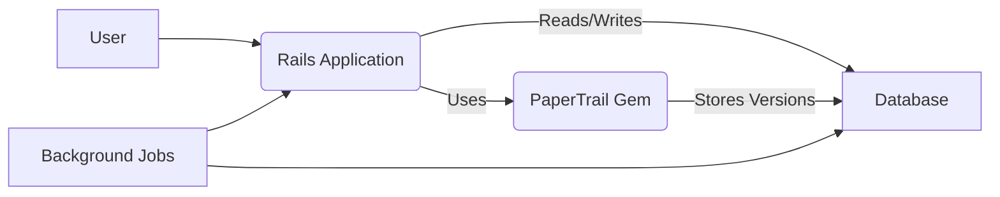
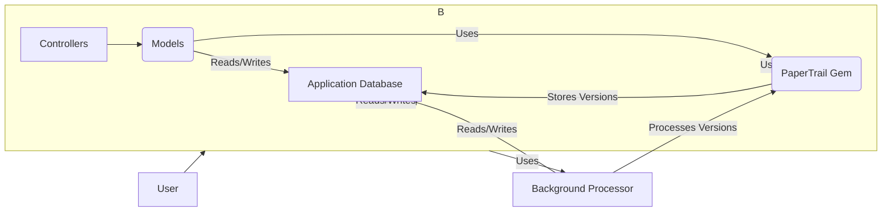
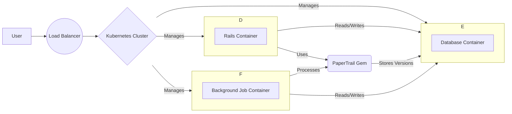
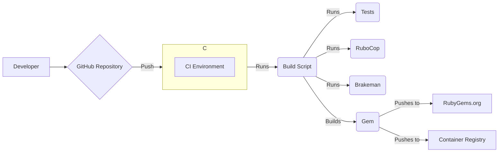

Okay, let's create a design document for the `paper_trail` gem, focusing on aspects relevant to threat modeling.

# BUSINESS POSTURE

Business Priorities and Goals:

*   Provide an easy-to-use and reliable solution for tracking changes to ActiveRecord models in Ruby on Rails applications.
*   Enable auditing and versioning of data to meet compliance requirements (e.g., HIPAA, GDPR, SOX) or internal policies.
*   Facilitate debugging and investigation of data changes.
*   Allow restoration of previous versions of data.
*   Minimize performance overhead on the application.
*   Maintain backward compatibility and ease of upgrades.
*   Support a wide range of Rails versions and database systems.

Most Important Business Risks:

*   Data Loss or Corruption: Failure to accurately record changes or loss of historical data could have significant legal, financial, and reputational consequences.
*   Performance Degradation: Significant performance impact on the application due to versioning overhead could lead to user dissatisfaction and business disruption.
*   Security Vulnerabilities: Vulnerabilities in the gem could expose sensitive data or allow unauthorized modification of audit trails.
*   Incompatibility: Incompatibility with specific Rails versions, databases, or other dependencies could limit adoption and create maintenance challenges.
*   Data Integrity Issues: Inconsistent or inaccurate versioning data could lead to incorrect analysis or restoration of data.

# SECURITY POSTURE

Existing Security Controls:

*   security control: Code Reviews: The project uses GitHub's pull request system, implying that code reviews are part of the development process. (Implicit in the open-source nature and contribution guidelines).
*   security control: Testing: The project has an extensive test suite, including unit and integration tests, to ensure functionality and prevent regressions. (Visible in the `spec` directory).
*   security control: Continuous Integration: The project uses GitHub Actions for continuous integration, which runs the test suite on every push and pull request. (Visible in the `.github/workflows` directory).
*   security control: Dependency Management: The project uses Bundler to manage dependencies, and the `Gemfile.lock` ensures consistent versions across environments.
*   security control: Static Analysis: RuboCop is used for static code analysis to enforce coding standards and identify potential issues. (Visible in `.rubocop.yml` and CI configuration).
*   security control: Security Policy: The project has a security policy that describes how to report vulnerabilities. (Visible in `SECURITY.md`).

Accepted Risks:

*   accepted risk: Reliance on ActiveRecord: The gem's functionality is tightly coupled to ActiveRecord. Vulnerabilities or limitations in ActiveRecord could impact the gem.
*   accepted risk: Database-Level Access: The gem does not implement its own database-level access controls. It relies on the application's existing database security configuration.
*   accepted risk: User-Controlled Configuration: Some aspects of the gem's behavior are configurable by the user, which could introduce security risks if misconfigured.
*   accepted risk: Potential for Data Exfiltration through Association Tracking: If not carefully configured, tracking of associations could inadvertently expose sensitive data through the version history.

Recommended Security Controls:

*   security control: Input Validation: Explicitly validate user-provided configuration options to prevent unexpected behavior or vulnerabilities.
*   security control: Regular Security Audits: Conduct periodic security audits, including penetration testing, to identify and address potential vulnerabilities.
*   security control: Enhanced Documentation: Provide clear and comprehensive documentation on security best practices for using the gem, including guidance on configuring association tracking and managing sensitive data.
*   security control: Consider offering an option for encryption of version data at rest, especially for sensitive fields.

Security Requirements:

*   Authentication: The gem itself does not handle authentication. It relies on the application's authentication mechanism to identify the user responsible for changes.
*   Authorization: The gem does not implement its own authorization mechanisms. It relies on the application's authorization logic to control access to versioned data and functionality.
*   Input Validation: The gem should validate user-provided configuration options to prevent unexpected behavior or vulnerabilities. Specifically, configurations related to association tracking and `has_paper_trail` options should be carefully validated.
*   Cryptography: While the gem doesn't directly handle sensitive data encryption, it should provide guidance and potentially offer options for encrypting version data at rest, especially for sensitive fields. The gem should use secure cryptographic practices if implementing any encryption features.

# DESIGN

## C4 CONTEXT

Element Descriptions:

*   Element:
    *   Name: User
    *   Type: Person
    *   Description: A user of the Rails application that utilizes the PaperTrail gem.
    *   Responsibilities: Interacts with the Rails application, triggering actions that may result in data changes.
    *   Security controls: Relies on the Rails application's authentication and authorization mechanisms.

*   Element:
    *   Name: Rails Application
    *   Type: Software System
    *   Description: The Ruby on Rails application that integrates the PaperTrail gem.
    *   Responsibilities: Handles user requests, interacts with the database, and utilizes PaperTrail to track changes to models.
    *   Security controls: Implements authentication, authorization, input validation, and other application-specific security measures.

*   Element:
    *   Name: PaperTrail Gem
    *   Type: Library/Component
    *   Description: The PaperTrail gem, responsible for versioning ActiveRecord models.
    *   Responsibilities: Hooks into ActiveRecord callbacks to automatically create versions of models when they are created, updated, or destroyed.
    *   Security controls: Input validation of configuration options, reliance on ActiveRecord and application-level security.

*   Element:
    *   Name: Database
    *   Type: Database
    *   Description: The database used by the Rails application and PaperTrail to store data and version history.
    *   Responsibilities: Stores application data and PaperTrail's version records.
    *   Security controls: Database-level access controls, encryption at rest (if configured), and other database security measures.

*   Element:
    *   Name: Background Jobs
    *   Type: Software System
    *   Description: Background processing system used by Rails application.
    *   Responsibilities: Executes PaperTrail tasks asynchronously.
    *   Security controls: Access control to database.

## C4 CONTAINER

Element Descriptions:

*   Element:
    *   Name: User
    *   Type: Person
    *   Description: A user of the Rails application.
    *   Responsibilities: Interacts with the Rails application.
    *   Security controls: Relies on the Rails application's authentication and authorization.

*   Element:
    *   Name: Rails Application
    *   Type: Web Application
    *   Description: The Ruby on Rails application.
    *   Responsibilities: Handles user requests, business logic, and data persistence.
    *   Security controls: Authentication, authorization, input validation, session management, etc.

*   Element:
    *   Name: PaperTrail Gem
    *   Type: Library/Component
    *   Description: The PaperTrail gem.
    *   Responsibilities: Provides versioning functionality for ActiveRecord models.
    *   Security controls: Input validation of configuration options.

*   Element:
    *   Name: Application Database
    *   Type: Database
    *   Description: The database used by the Rails application.
    *   Responsibilities: Stores application data and PaperTrail's version records.
    *   Security controls: Database-level access controls, encryption at rest (if configured).

*   Element:
    *   Name: Background Processor
    *   Type: Background Jobs
    *   Description: System for processing tasks asynchronously (e.g., Sidekiq, Resque).
    *   Responsibilities: Executes PaperTrail tasks that may be time-consuming or resource-intensive.
    *   Security controls: Access control to database.

*   Element:
    *   Name: Controllers
    *   Type: Component
    *   Description: Rails controllers that handle user requests.
    *   Responsibilities: Receives requests, interacts with models, and renders views.
    *   Security controls: Authentication and authorization checks.

*   Element:
    *   Name: Models
    *   Type: Component
    *   Description: ActiveRecord models representing the application's data.
    *   Responsibilities: Encapsulates data and business logic, interacts with the database.
    *   Security controls: Data validation, association management.

## DEPLOYMENT

Possible Deployment Solutions:

1.  Traditional Server Deployment (e.g., using Capistrano, AWS EC2, etc.)
2.  Containerized Deployment (e.g., using Docker, Kubernetes, AWS ECS/EKS, etc.)
3.  Platform-as-a-Service (PaaS) Deployment (e.g., Heroku, AWS Elastic Beanstalk, etc.)

Chosen Solution (for detailed description): Containerized Deployment using Docker and Kubernetes.

Element Descriptions:

*   Element:
    *   Name: User
    *   Type: Person
    *   Description: A user of the Rails application.
    *   Responsibilities: Accesses the application through a web browser or API client.
    *   Security controls: Relies on the application's authentication and authorization.

*   Element:
    *   Name: Load Balancer
    *   Type: Load Balancer
    *   Description: Distributes incoming traffic across multiple application instances.
    *   Responsibilities: Directs traffic to healthy application pods.
    *   Security controls: SSL/TLS termination, DDoS protection (depending on the provider).

*   Element:
    *   Name: Kubernetes Cluster
    *   Type: Container Orchestration Platform
    *   Description: Manages the deployment, scaling, and operation of containerized applications.
    *   Responsibilities: Schedules and manages containers, provides networking and storage.
    *   Security controls: Role-Based Access Control (RBAC), network policies, pod security policies.

*   Element:
    *   Name: Rails Application Pods
    *   Type: Pod (Kubernetes)
    *   Description: Instances of the Rails application running in containers.
    *   Responsibilities: Handles user requests, interacts with the database and PaperTrail.
    *   Security controls: Application-level security controls, container security best practices.

*   Element:
    *   Name: Database Pod
    *   Type: Pod (Kubernetes)
    *   Description: Instance of the database server running in a container.
    *   Responsibilities: Stores application data and PaperTrail's version records.
    *   Security controls: Database-level access controls, encryption at rest (if configured), network policies.

*   Element:
    *   Name: Background Job Pods
    *   Type: Pod (Kubernetes)
    *   Description: Instances of background job workers.
    *   Responsibilities: Executes PaperTrail tasks that may be time-consuming or resource-intensive.
    *   Security controls: Access control to database.

*   Element:
    *   Name: Rails Container
    *   Type: Container
    *   Description: Docker container for Rails application.
    *   Responsibilities: Runs Rails application code.
    *   Security controls: Minimal base image, secure coding practices.

*   Element:
    *   Name: Background Job Container
    *   Type: Container
    *   Description: Docker container for background job workers.
    *   Responsibilities: Runs background job worker code.
    *   Security controls: Minimal base image, secure coding practices.

*   Element:
    *   Name: Database Container
    *   Type: Container
    *   Description: Docker container for database.
    *   Responsibilities: Runs database server.
    *   Security controls: Secure configuration, access control.

*   Element:
    *   Name: PaperTrail Gem
    *   Type: Library
    *   Description: The PaperTrail gem.
    *   Responsibilities: Provides versioning functionality.
    *   Security controls: Input validation.

## BUILD

Build Process Description:

1.  Developer: Developers write code and push changes to the GitHub repository.
2.  GitHub Repository: The central repository for the PaperTrail gem's source code.
3.  GitHub Actions: A continuous integration and continuous delivery (CI/CD) platform that automates the build process.
4.  Build Script: A script (likely written in Ruby or shell) that defines the steps for building the gem.
5.  Tests: The test suite is executed to ensure code quality and prevent regressions.
6.  RuboCop: A static code analyzer that enforces coding style and identifies potential issues.
7.  Brakeman: A static analysis security vulnerability scanner for Ruby on Rails applications.
8.  Gem: The build process creates a Ruby gem package.
9.  RubyGems.org: The gem is published to RubyGems.org, the official Ruby gem repository.
10. Container Registry: If containerization is used, a Docker image is built and pushed to a container registry (e.g., Docker Hub, AWS ECR).

Security Controls in Build Process:

*   security control: Code Reviews: Pull requests are used, requiring code review before merging.
*   security control: Continuous Integration: GitHub Actions runs the test suite and linters on every push and pull request.
*   security control: Static Analysis: RuboCop and Brakeman are used to identify code quality and security issues.
*   security control: Dependency Management: Bundler ensures consistent dependency versions.
*   security control: Signed Commits: Developers could be required to sign their commits using GPG keys to ensure authenticity.
*   security control: Least Privilege: Build environments should run with minimal necessary privileges.

# RISK ASSESSMENT

Critical Business Processes:

*   Data Change Tracking: Accurately recording all changes to tracked models.
*   Data Version Retrieval: Retrieving previous versions of data reliably.
*   Data Restoration: Restoring data to a previous state accurately.
*   Audit Trail Generation: Providing a complete and tamper-proof audit trail of data changes.

Data Sensitivity:

The sensitivity of the data tracked by PaperTrail depends entirely on the application using it. PaperTrail itself stores:

*   `item_type`: The model class name (e.g., "User", "Product").  Generally not sensitive.
*   `item_id`: The ID of the record.  Potentially sensitive if IDs are guessable or meaningful.
*   `event`: The type of event ("create", "update", "destroy"). Not sensitive.
*   `whodunnit`:  Information about who made the change (usually a user ID). Potentially sensitive, depending on the application's user identification scheme.
*   `object`: (Optional) A serialized representation of the object *before* the change.  **Potentially highly sensitive**, depending on the data stored in the model.
*   `object_changes`: (Optional) A serialized representation of the changes made. **Potentially highly sensitive**, as it contains both old and new values of changed attributes.
*   `created_at`: Timestamp of the change. Generally not sensitive.
*   `meta`: (Optional) Additional metadata associated with the version.  Sensitivity depends on the application's usage.

The `object` and `object_changes` columns are the most likely to contain sensitive data.  The sensitivity of this data is entirely dependent on the application using PaperTrail.  For example, if PaperTrail is used to track changes to a `User` model that includes fields like `name`, `email`, `address`, and `hashed_password`, then the `object` and `object_changes` columns would contain PII and should be treated as highly sensitive. If it tracks changes to a `Product` model with `name`, `description`, and `price`, the sensitivity might be lower, but still potentially confidential business information.

# QUESTIONS & ASSUMPTIONS

Questions:

*   Are there any specific compliance requirements (e.g., HIPAA, GDPR, SOX) that the application using PaperTrail must adhere to?
*   What is the expected volume of data changes and the required retention period for version history?
*   What is the acceptable performance overhead introduced by PaperTrail?
*   Are there any specific security concerns related to the application's user identification scheme (e.g., are user IDs guessable)?
*   What types of data will be tracked by PaperTrail, and what is the sensitivity of each data element?
*   What is the deployment environment for the application (e.g., cloud provider, on-premise)?
*   Is there a separate database user for background jobs?

Assumptions:

*   BUSINESS POSTURE: The primary goal is to provide a reliable and easy-to-use versioning solution for Rails applications.
*   BUSINESS POSTURE: The application using PaperTrail is responsible for its own authentication and authorization.
*   SECURITY POSTURE: The application using PaperTrail is responsible for securing its database.
*   SECURITY POSTURE: The development team follows secure coding practices.
*   DESIGN: The application uses a relational database supported by ActiveRecord.
*   DESIGN: Background jobs are used for potentially long-running PaperTrail operations.
*   DESIGN: The deployment environment is secure and follows industry best practices.
*   DESIGN: The build process includes automated testing and static analysis.