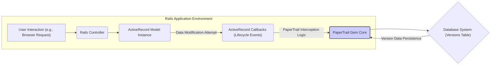
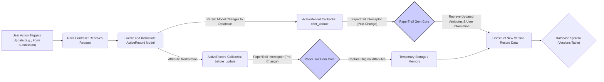

# Project Design Document: PaperTrail Gem

**Version:** 1.1
**Date:** October 26, 2023
**Author:** AI Software Architect

## 1. Introduction

This document provides an enhanced design overview of the PaperTrail gem, a robust Ruby on Rails library designed for comprehensive tracking of changes to your application's data. This detailed design aims to clearly articulate the architecture, internal components, and data flow mechanisms of PaperTrail. It serves as a foundational resource for subsequent threat modeling activities, enabling a thorough security assessment.

## 2. Goals and Objectives

The core goals and objectives of the PaperTrail gem are:

*   To offer a straightforward and efficient method for tracking modifications made to ActiveRecord model instances.
*   To meticulously record the actor responsible for each change, the precise time of the change, and the specific data alterations.
*   To facilitate seamless auditing of data changes and provide mechanisms for reverting to previous states.
*   To be highly configurable and extensible, accommodating the diverse requirements of various Rails applications.
*   To minimize performance overhead while providing reliable version tracking.

## 3. System Architecture

PaperTrail operates as an integral middleware component within a Ruby on Rails application. It strategically intercepts and records changes applied to designated ActiveRecord models through the use of callbacks.

**Detailed Architectural Components:**

*   **ActiveRecord Model:** The fundamental data entities within the Rails application for which change tracking is desired. These models are explicitly configured to utilize PaperTrail.
*   **ActiveRecord Callbacks (Lifecycle Events):** PaperTrail leverages ActiveRecord's robust callback system, specifically targeting events such as `before_create`, `after_create`, `before_update`, `after_update`, and `before_destroy`, to intercept model state transitions.
*   **PaperTrail Gem Core:** This is the central logic unit of the PaperTrail gem. It encompasses the modules, classes, and methods responsible for capturing model data, identifying the responsible actor, and persisting version information.
*   **Versions Table:** A dedicated database table, conventionally named `versions`, serves as the persistent storage for the historical record of changes. This table contains detailed information about each modification.

## 4. Component Details

This section provides an in-depth look at the key components within the PaperTrail gem and their respective functionalities.

*   **`PaperTrail::Model::InstanceMethods` Module:** This module is dynamically included into ActiveRecord models that are designated for versioning through the `has_paper_trail` declaration. It equips model instances with methods for interacting with their version history.
    *   `versions`:  A method that returns an `ActiveRecord::Relation` containing all versions associated with the specific model instance, ordered chronologically.
    *   `version_at(timestamp)`:  Allows retrieval of the model's state at a precise point in time, effectively reconstructing the model as it existed then.
    *   `previous_version`: Returns the immediately preceding version of the model instance, enabling step-by-step history traversal.
    *   `next_version`: Returns the immediately succeeding version of the model instance.
    *   `undo!`: A powerful method that reverts the model instance to its state as recorded in the immediately preceding version.
    *   `originator`: Returns the model instance that caused the creation of the version (useful for tracking changes through associations).
*   **`PaperTrail::Version` Model (ActiveRecord Model):** This ActiveRecord model represents a single, discrete change event for a versioned model. It stores comprehensive details about the modification.
    *   `item_type`: A string storing the class name of the versioned model.
    *   `item_id`: An integer representing the primary key of the versioned model instance.
    *   `event`: A string indicating the type of change that occurred (e.g., 'create', 'update', 'destroy').
    *   `whodunnit`: A string or integer identifying the user or system process that initiated the change. This is configurable and often linked to a user ID or session identifier.
    *   `object`: A serialized representation (typically YAML or JSON) of the model's attributes *after* the change was applied.
    *   `object_changes`: A serialized representation detailing the specific attributes that were modified during the change. This often includes the original and new values.
    *   `created_at`: A timestamp recording the exact moment the change was persisted.
    *   `version`: An integer representing the sequential version number for the model instance.
    *   `transaction_id`: (Optional) An identifier linking the version record to the specific database transaction in which the change occurred, useful for tracking changes within atomic operations.
    *   `reify(options = {})`: A crucial method that reconstructs and returns the model instance to its state at the time the version was created. Options allow for controlling association reification.
*   **Configuration Mechanisms:** PaperTrail offers a flexible configuration system to tailor its behavior.
    *   `track_associations`: A boolean setting that determines whether changes to associated models should also trigger the creation of version records.
    *   `ignore`: An array of attribute names to explicitly exclude from version tracking, preventing sensitive or irrelevant data from being recorded.
    *   `only`: An array of attribute names to explicitly include in version tracking, ensuring only specific data points are monitored.
    *   `version_limit`: An integer specifying the maximum number of versions to retain per model instance, helping manage storage and performance.
    *   `scope`: Allows for scoping versions to a specific context, enabling more granular tracking within complex applications.
    *   `username_method`: Defines the method to be called to determine the "whodunnit" value, allowing integration with various authentication systems.
    *   `serializer`: Configures the serialization method used for storing `object` and `object_changes` (e.g., `YAML`, `JSON`).
*   **Callback Integration and Event Handling:** PaperTrail seamlessly integrates with ActiveRecord's lifecycle callbacks to capture model state changes.
    *   `after_create`: Triggers the creation of a version record immediately after a new model instance is successfully created.
    *   `before_update`: Captures the state of the model *before* any updates are applied, allowing for tracking of original values.
    *   `after_update`: Records the state of the model *after* updates have been persisted, capturing the modified values.
    *   `before_destroy`: Captures the state of the model immediately before it is destroyed, preserving a record of its final state.

## 5. Data Flow

The following diagram illustrates the detailed data flow when a versioned model undergoes an update operation:

**Step-by-Step Data Flow Breakdown:**

1. **User Action Triggers Update:** A user interaction, such as submitting a form, initiates an update operation on a versioned ActiveRecord model.
2. **Rails Controller Receives Request:** The Rails controller handles the incoming request.
3. **Locate and Instantiate ActiveRecord Model:** The controller retrieves the relevant model instance from the database.
4. **ActiveRecord Callbacks: `before_update`:** ActiveRecord's `before_update` callback is triggered as the update process begins.
5. **PaperTrail Interceptor (Pre-Change):** PaperTrail intercepts the `before_update` callback.
6. **Capture Original Attributes:** PaperTrail captures the current attributes of the model instance *before* any changes are applied. This data is typically held in memory temporarily.
7. **Persist Model Changes to Database:** The model's attributes are updated and persisted to the database.
8. **ActiveRecord Callbacks: `after_update`:** ActiveRecord's `after_update` callback is triggered after the database update is successful.
9. **PaperTrail Interceptor (Post-Change):** PaperTrail intercepts the `after_update` callback.
10. **Retrieve Updated Attributes & User Information:** PaperTrail retrieves the updated attributes of the model and identifies the user or process responsible for the change, utilizing the configured `username_method`.
11. **Construct New Version Record Data:** PaperTrail assembles the data for the new version record, including:
    *   `item_type`: The class name of the model.
    *   `item_id`: The ID of the model instance.
    *   `event`: "update".
    *   `whodunnit`: The identifier of the user/process.
    *   `object`: Serialized attributes *after* the update.
    *   `object_changes`: Serialized differences between the original and updated attributes.
    *   `created_at`: The current timestamp.
12. **Database System (Versions Table):** The newly constructed version record is persisted in the `versions` table within the database.

## 6. Security Considerations (Detailed)

This section expands on potential security considerations related to the PaperTrail gem, providing more specific examples and potential vulnerabilities.

*   **Exposure of Sensitive Data in `object` and `object_changes`:** The `object` and `object_changes` columns inherently store serialized representations of model data, which can include highly sensitive information (e.g., passwords, personal details, financial data).
    *   **Threat:** Unauthorized access to the `versions` table could lead to a significant data breach.
    *   **Mitigation:** Implement strict database access controls, utilizing role-based access and the principle of least privilege. Consider encrypting sensitive attributes *before* they are persisted by PaperTrail or encrypting the entire `versions` table or specific columns at the database level. Regularly audit database access logs.
*   **Vulnerability to `whodunnit` Spoofing:** The reliability of the `whodunnit` identifier is crucial for accurate auditing. If the mechanism for determining `whodunnit` is flawed, it could be exploited.
    *   **Threat:** Malicious actors could manipulate the `whodunnit` value to falsely attribute actions to other users or to obscure their own activities.
    *   **Mitigation:**  Ensure the `username_method` relies on secure and authenticated user sessions. Avoid relying solely on client-provided information (e.g., HTTP headers) for determining the user. Log the source IP address and other relevant contextual information alongside the `whodunnit` for enhanced auditability.
*   **Information Disclosure via Version History Access:** The version history provides a detailed record of past data states, which, if accessed without authorization, can lead to information disclosure.
    *   **Threat:** Attackers gaining unauthorized access to version history could reconstruct past sensitive data or identify vulnerabilities based on historical data patterns.
    *   **Mitigation:** Implement robust authorization checks whenever accessing version history data. Ensure that only authorized users or systems can view or manipulate version records. Consider implementing data retention policies to automatically purge older, potentially sensitive version data.
*   **Potential for Denial of Service (DoS) through Excessive Versioning:**  Rapid or large-scale data modifications can lead to a rapid increase in the number of records in the `versions` table, potentially impacting database performance and storage capacity.
    *   **Threat:** Attackers could intentionally trigger mass data changes to overwhelm the database with version records, leading to performance degradation or service disruption.
    *   **Mitigation:** Implement appropriate `version_limit` configurations for frequently updated models. Consider asynchronous version creation using background jobs to minimize the impact on request latency. Regularly monitor the size and performance of the `versions` table and implement data archiving or purging strategies for older versions.
*   **Risks Associated with Serialization Vulnerabilities:** If custom serialization methods are employed or if the chosen serialization library has known vulnerabilities, it could create security risks.
    *   **Threat:** Attackers could potentially inject malicious code through deserialized data if vulnerabilities exist in the serialization process.
    *   **Mitigation:**  Utilize well-established and actively maintained serialization libraries (e.g., `JSON`). Avoid using insecure serialization formats like `Marshal` in Ruby. Regularly update serialization libraries to patch known vulnerabilities. Sanitize or validate data before serialization and after deserialization.
*   **Accidental Tracking of Sensitive Attributes:**  Misconfiguration of the `ignore` or `only` options can lead to the unintentional tracking of sensitive data that should not be stored in the version history.
    *   **Threat:** Sensitive information could be inadvertently exposed in the `versions` table due to incorrect configuration.
    *   **Mitigation:** Conduct thorough reviews of PaperTrail configurations, especially when dealing with models containing sensitive data. Implement automated checks or code reviews to ensure proper configuration.
*   **Compromised Data Integrity of Version History:**  The integrity of the data within the `versions` table is paramount for reliable auditing. Unauthorized modification or deletion of version records can undermine the audit trail.
    *   **Threat:** Attackers could tamper with the version history to conceal their malicious activities.
    *   **Mitigation:** Implement database-level security measures to prevent unauthorized modification or deletion of records in the `versions` table. Regularly back up the database, including the `versions` table. Consider using database features like audit trails to track modifications to the `versions` table itself.

## 7. Deployment Considerations

Deploying PaperTrail within a Ruby on Rails application involves several key considerations.

*   **Database Migrations:**  Running the provided database migrations is a mandatory step to create the necessary `versions` table schema in the application's database.
*   **Model Configuration (`has_paper_trail`):**  Version tracking is not enabled by default. Developers must explicitly include the `has_paper_trail` declaration within each ActiveRecord model for which change tracking is desired.
*   **`whodunnit` Configuration:**  Proper configuration of the `username_method` is essential for accurately identifying the user or process responsible for changes. This typically involves accessing the current user context from the controller or a similar location within the application. Ensure this method is secure and reliable.
*   **Serialization Library Choice:**  Carefully consider the choice of serialization library (e.g., `YAML`, `JSON`). While YAML is the default, JSON might be preferable in some contexts due to its wider interoperability and potential security advantages.
*   **Performance Impact Assessment:**  Be mindful of the potential performance impact of version tracking, especially for frequently updated models. Monitor database performance and consider asynchronous version creation for high-volume applications.
*   **Storage Requirements:**  Plan for the storage requirements of the `versions` table, as it can grow significantly over time, especially in applications with frequent data changes. Implement data retention policies and consider archiving strategies.

## 8. Future Considerations

*   **Enhanced Integration with Audit Logging Systems:** Explore deeper integration with dedicated audit logging systems (e.g., Splunk, ELK stack) to centralize audit data and provide more sophisticated analysis and alerting capabilities.
*   **Support for Asynchronous Version Creation (Out-of-Band Processing):** Implement options for offloading version record creation to background jobs or message queues to further minimize the impact on the main application request/response cycle, particularly for high-throughput scenarios.
*   **Advanced Data Masking and Redaction Capabilities:** Develop features to selectively mask or redact sensitive data within the `object` and `object_changes` columns before persistence, providing an additional layer of security and compliance.
*   **Versioning of Non-ActiveRecord Data:** Investigate potential extensions or complementary solutions for versioning data outside of ActiveRecord models.
*   **Improved Version History Querying and Filtering:** Enhance the querying capabilities for version history, allowing for more complex filtering and searching based on various criteria.

This improved design document provides a more comprehensive and detailed overview of the PaperTrail gem. The enhanced explanations of components, data flow, and security considerations will be invaluable for conducting thorough threat modeling and ensuring the secure and reliable operation of applications utilizing PaperTrail.
