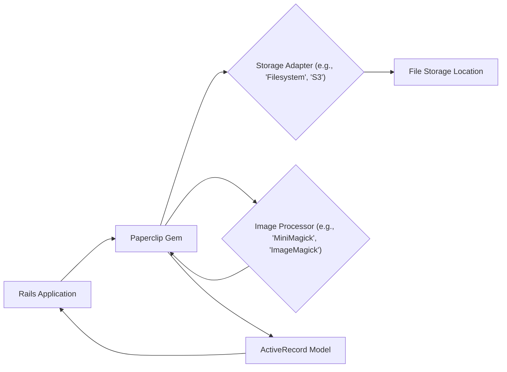
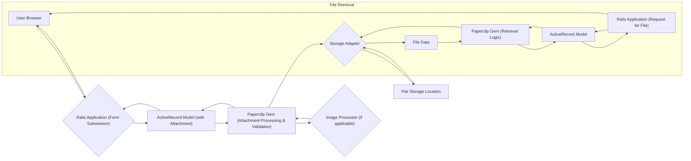

## Project Design Document: Paperclip File Attachment Library (Improved)

**1. Introduction**

This document provides an enhanced design overview of the Paperclip gem, a widely used Ruby on Rails library for managing file attachments. The purpose of this document is to offer a clear and detailed understanding of Paperclip's architecture, components, and data flow, specifically tailored to facilitate comprehensive threat modeling. A thorough grasp of Paperclip's internal mechanisms and interactions is essential for identifying and mitigating potential security vulnerabilities.

**2. Goals and Objectives**

The primary goal of Paperclip is to streamline the management of file uploads and attachments within Ruby on Rails applications. Key objectives include:

*   Providing an intuitive and efficient API for associating files with ActiveRecord models.
*   Offering flexibility in storage options, encompassing local filesystems and various cloud storage providers.
*   Enabling image manipulation functionalities such as resizing, cropping, and thumbnail generation.
*   Facilitating robust validation of attached files based on criteria like size, content type, and presence.
*   Supporting the management of multiple versions or "styles" of a single attached file.
*   Simplifying the generation of URLs for accessing attached files.

**3. System Architecture**

Paperclip functions as an integral middleware component within a Ruby on Rails application. It augments ActiveRecord models with file attachment capabilities. The core architecture involves interactions between the Rails application, the Paperclip gem itself, any configured image processing libraries, and the designated storage backend.

*   **Rails Application:** The encompassing web application where the Paperclip gem is integrated. It interacts with Paperclip through extensions added to ActiveRecord models.
*   **Paperclip Gem:** The central library responsible for orchestrating file attachment management, including processing, validation, and storage interactions.
*   **Storage Adapter:** An abstraction layer that provides a consistent interface for interacting with different storage mechanisms. Examples include adapters for the local filesystem, Amazon S3, Google Cloud Storage, and others. The choice of adapter is configurable.
*   **File Storage Location:** The physical location where the uploaded files are stored. This is determined by the selected storage adapter and its configuration.
*   **Image Processor:** An optional but commonly used component (such as MiniMagick or ImageMagick) that performs image manipulation tasks like resizing, creating thumbnails, and format conversion.
*   **ActiveRecord Model:** The specific model within the Rails application to which the file attachment is associated. Paperclip extends this model with attachment-related attributes and methods.

**4. Data Flow (Detailed)**

The following outlines a more detailed data flow during a file upload and subsequent retrieval process using Paperclip:

*   **User Browser:** The user interacts with the application via a web browser, typically submitting an HTML form containing a file upload input field.
*   **Rails Application (Form Submission):** The Rails application receives the HTTP request, including the uploaded file data.
*   **ActiveRecord Model (with Attachment):** The relevant ActiveRecord model instance receives the file data through its attachment attribute.
*   **Paperclip Gem (Attachment Processing & Validation):** Paperclip intercepts the file upload. It performs configured validations (e.g., content type, size). If image processing is configured, it invokes the image processor.
*   **Storage Adapter:** Paperclip utilizes the configured storage adapter to interact with the chosen storage backend. This involves transferring the file data to the storage location.
*   **File Storage Location:** The uploaded file is written to the designated storage location based on the storage adapter's implementation.
*   **Image Processor (if applicable):** If image processing is configured (e.g., for creating thumbnails), Paperclip sends the file to the image processor and receives the processed versions.
*   **File Retrieval (Subgraph):**
    *   **Rails Application (Request for File):** The application receives a request to access the attached file.
    *   **ActiveRecord Model:** The application queries the ActiveRecord model to retrieve information about the attachment.
    *   **Paperclip Gem (Retrieval Logic):** Paperclip uses the configured storage adapter to determine the file's location.
    *   **File Data:** The storage adapter retrieves the file data from the storage location.
    *   The file data is then served to the user, often through a direct send or a redirect to the storage location's URL.

**5. Components (Detailed)**

Paperclip's functionality is structured around several key components:

*   **Attachment DSL (Domain Specific Language):** The `has_attached_file` declaration within an ActiveRecord model defines the attachment and its associated configurations. This includes specifying storage options, processors, validations, and styles.
*   **Processors:** These are Ruby modules responsible for manipulating uploaded files. They take the original file as input and produce processed versions. Common built-in processors include:
    *   `Thumbnail`: For generating resized versions of images.
    *   `Geometry`: For more advanced image manipulation based on geometry strings.
    *   Custom processors can be created to implement specific file transformations.
*   **Storage Adapters:** These provide an abstraction layer, allowing Paperclip to support various storage backends without significant code changes. Key adapters include:
    *   `Filesystem`: Stores files directly on the server's local filesystem. Configuration includes specifying the storage directory.
    *   `S3`: Leverages Amazon Simple Storage Service (S3) for scalable cloud storage. Requires AWS credentials and bucket configuration.
    *   `Google Cloud Storage`: Integrates with Google Cloud Storage. Requires Google Cloud credentials and bucket configuration.
    *   Other community-developed adapters exist for services like Azure Blob Storage.
*   **Interpolations:** Paperclip uses interpolations (e.g., `:class`, `:id`, `:style`) within file paths and URLs to dynamically generate unique and organized storage locations. This helps prevent naming conflicts and improves organization.
*   **Validators:** Paperclip provides a set of built-in validators to enforce constraints on uploaded files:
    *   `attachment_presence`: Ensures a file has been uploaded.
    *   `attachment_content_type`: Validates the file's MIME type against a specified list.
    *   `attachment_size`: Validates the file's size against minimum and maximum limits.
    *   Custom validators can be implemented for more specific validation logic.
*   **Configuration Options:** Paperclip offers extensive configuration options, typically set within the `has_attached_file` declaration. These options control aspects like:
    *   `storage`: Specifies the storage adapter to use.
    *   `path`: Defines the storage path using interpolations.
    *   `url`: Defines the URL for accessing the attached file.
    *   `processors`: Specifies the processors to apply to the uploaded file.
    *   `validations`: Defines the validation rules for the attachment.
    *   `styles`: For defining different processed versions of an image (e.g., thumbnails).

**6. Security Considerations (Detailed)**

This section expands on potential security considerations relevant to Paperclip:

*   **Unrestricted File Upload Vulnerabilities:**
    *   **Malicious Executables:** Without proper content type validation, attackers could upload executable files (e.g., `.exe`, `.sh`) that could be executed on the server if accessed directly or indirectly.
    *   **Web Shells:** Uploading scripts (e.g., `.php`, `.jsp`, `.py`) could grant attackers remote control over the server.
    *   **HTML with Embedded Scripts:** Uploading seemingly harmless HTML files containing malicious JavaScript could lead to Cross-Site Scripting (XSS) attacks if served directly.
    *   **Large File Uploads (DoS):**  Lack of size limits can allow attackers to upload extremely large files, consuming server resources (disk space, bandwidth) and potentially causing denial of service.
*   **Server-Side Request Forgery (SSRF):** If Paperclip is configured to fetch files from external URLs (less common but possible with custom processors or configurations), vulnerabilities in the URL handling could allow attackers to make arbitrary requests from the server, potentially accessing internal resources.
*   **Path Traversal Vulnerabilities:**
    *   **Insecure Interpolations:** If interpolations are not carefully managed or if user-controlled data is used in path generation, attackers might manipulate file paths to access or overwrite files outside the intended storage directory.
    *   **Direct Access to Storage:** If the storage location (especially local filesystem storage) is directly accessible via web URLs without proper access controls, attackers could bypass the application and access or modify files directly.
*   **Exposure of Sensitive Information:**
    *   **Publicly Accessible Storage:** Incorrectly configured cloud storage buckets (e.g., public S3 buckets) can expose uploaded files containing sensitive user data or application secrets to unauthorized access.
    *   **Insecure Permissions:**  Insufficiently restrictive permissions on local filesystem storage could allow unauthorized users or processes to access uploaded files.
*   **Image Processing Vulnerabilities:**
    *   **ImageMagick/MiniMagick Exploits:** Vulnerabilities in the underlying image processing libraries (like ImageMagick, as seen in past incidents) can be exploited by uploading specially crafted image files, potentially leading to remote code execution.
    *   **DoS through Image Processing:** Uploading complex or very large images can consume significant server resources during processing, leading to denial of service.
*   **Cross-Site Scripting (XSS):**
    *   **Unsanitized Filenames:** If filenames or metadata associated with uploaded files are not properly sanitized before being displayed in the application, attackers could inject malicious scripts that execute in other users' browsers.
*   **Insecure Temporary File Handling:**  Improper management of temporary files created during the upload or processing stages could potentially expose sensitive data.

**7. Deployment Considerations**

Deploying Paperclip involves the following key steps and considerations:

*   **Gem Installation:** Adding the `paperclip` gem to the application's `Gemfile` and running `bundle install`.
*   **Dependency Management:** Ensuring that any required image processing libraries (e.g., `mini_magick`) are also included in the `Gemfile` and installed.
*   **Model Configuration:**  Using the `has_attached_file` declaration in the relevant ActiveRecord models to define attachments and their configurations.
*   **Storage Backend Configuration:**
    *   **Filesystem:** Ensuring appropriate directory permissions are set for the storage location.
    *   **Cloud Storage (e.g., S3, Google Cloud Storage):** Configuring the necessary credentials (API keys, access keys), bucket names, and regions. Securely managing these credentials is crucial.
*   **Database Migrations:** Running database migrations to add the required columns (e.g., `image_file_name`, `image_content_type`, `image_file_size`, `image_updated_at`) to the associated database table.
*   **Environment-Specific Configuration:**  Using environment variables or configuration files to manage different settings for development, staging, and production environments (e.g., different S3 buckets).
*   **Security Hardening:** Implementing security best practices for the chosen storage backend (e.g., using IAM roles for S3 access, enabling bucket policies).

**8. Assumptions and Constraints**

*   This design document assumes the use of a standard Ruby on Rails application framework.
*   The specific storage backend and image processing library used can vary, influencing implementation details and security considerations.
*   The version of the Paperclip gem in use can affect available features and potential vulnerabilities.
*   The security posture of the overall application and its infrastructure significantly impacts the security of file uploads managed by Paperclip.
*   Proper configuration and adherence to security best practices are essential for mitigating potential risks associated with file uploads.

This improved design document provides a more detailed and comprehensive understanding of the Paperclip gem, specifically focusing on aspects relevant to security. This information will be crucial for conducting a thorough threat modeling exercise and implementing appropriate security measures.
