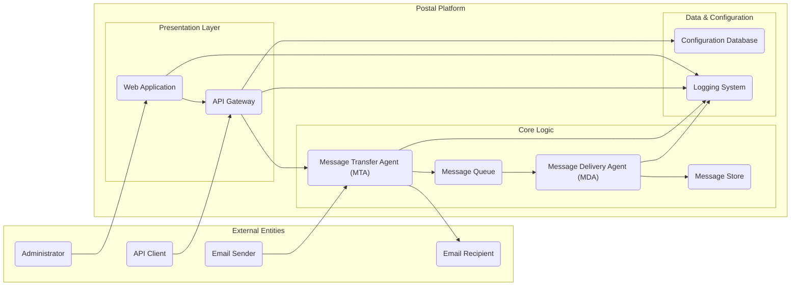

# Project Design Document: Postal - A Complete and Extensible Mail Platform

**Version:** 1.1
**Date:** October 26, 2023
**Author:** AI Software Architect

## 1. Introduction

This document provides an enhanced and more detailed design overview of the Postal mail platform, an open-source mail server solution. This document aims to clearly articulate the system's architecture, components, data flows, and key considerations for security, providing a robust foundation for subsequent threat modeling activities.

### 1.1. Purpose

The primary purpose of this document is to provide a comprehensive and granular architectural understanding of the Postal project. This detailed understanding is crucial for effectively identifying potential security vulnerabilities, understanding attack surfaces, and designing appropriate mitigation strategies during the threat modeling process.

### 1.2. Scope

This document covers the core components and functionalities of the Postal platform as represented in the provided GitHub repository, with a focus on elements relevant to security. It delves deeper into the logical architecture, data flows (including variations and error handling where relevant), and key interactions between different parts of the system. While specific implementation details within individual modules remain largely outside the scope, key architectural decisions and their security implications are highlighted.

### 1.3. Goals

* Clearly define the major components of the Postal platform with greater detail on their responsibilities.
* Illustrate the interactions and data flow between these components, including different scenarios.
* Identify key technologies and dependencies, providing context for potential vulnerabilities.
* Highlight areas critically relevant to security, including authentication, authorization, and data protection mechanisms.
* Provide a robust and detailed foundation for effective threat modeling, enabling the identification of a wider range of potential threats.

## 2. High-Level Architecture

The Postal platform is composed of several interconnected components that work in concert to provide a comprehensive mail server solution.

## 3. Component Details

This section provides a more detailed description of each component, emphasizing their roles and responsibilities within the Postal platform.

* **Email Sender:** An external entity, such as another mail server or an application, initiating the process of sending an email. This interaction typically occurs over SMTP.
* **Email Recipient:** An external entity, either another mail server or a user with a mailbox on a different server, who is the intended recipient of an email.
* **Administrator:** A privileged user responsible for managing and configuring the Postal platform. This includes tasks like managing domains, users, setting up routing rules, and monitoring system health, typically accessed through the web interface.
* **API Client:** An external application or service that interacts with the Postal platform programmatically via the provided API. This allows for automation and integration with other systems.
* **Web Application:** The user interface for administrators, providing a visual way to interact with and manage the Postal platform. This component handles user authentication, authorization, and presents data from the backend systems. It likely uses a web framework and interacts with the API Gateway.
* **API Gateway:** The central entry point for all programmatic interactions with the Postal platform. It handles authentication (verifying the identity of the API client), authorization (ensuring the client has permission to perform the requested action), rate limiting, and request routing to the appropriate backend services.
* **Message Transfer Agent (MTA):** The core component responsible for handling the reception and delivery of emails.
    * **Receiving:** Listens for incoming SMTP connections, authenticates senders (where applicable), performs initial checks (e.g., spam filtering, anti-virus), and accepts emails for delivery.
    * **Routing:** Determines the next hop for an email, either to a local mailbox (handled by the MDA) or to an external mail server.
    * **Sending:** Establishes SMTP connections with destination mail servers and attempts to deliver outgoing emails.
* **Message Delivery Agent (MDA):** Responsible for the final delivery of emails to local user mailboxes within the Postal system. This involves:
    * **Mailbox Determination:** Identifying the correct mailbox for the recipient.
    * **Storage:** Interacting with the Message Store to save the email content.
    * **Mail Delivery Protocols:** Potentially handling protocols like POP3 or IMAP for local user access (though not explicitly shown in the high-level diagram, it's a likely function).
* **Message Store:** The persistent storage mechanism for email messages. This component is responsible for:
    * **Storing Email Content:** Saving the raw content of emails.
    * **Metadata Storage:** Storing associated metadata like sender, recipient, timestamps, and flags.
    * **Retrieval:** Providing mechanisms for the MDA and potentially other components to retrieve email messages. This could involve a file system, object storage, or a specialized database.
* **Message Queue:** A temporary buffer for email messages as they are being processed. This component ensures:
    * **Asynchronous Processing:** Decoupling the reception of emails from their delivery, improving responsiveness and resilience.
    * **Reliability:** Ensuring that emails are not lost if a component fails. Technologies like Redis or RabbitMQ are commonly used for this.
* **Configuration Database:** Stores the configuration settings for the Postal platform. This includes:
    * **Domain and User Information:** Details about managed domains, user accounts, and their associated settings.
    * **Routing Rules:** Defining how emails should be routed within the system and to external servers.
    * **Security Policies:** Configuration related to authentication, authorization, and spam filtering.
    * **System Settings:**  Parameters controlling the behavior of various components.
* **Logging System:**  A centralized system for collecting, storing, and managing logs from all components of the Postal platform. This is crucial for:
    * **Auditing:** Tracking actions performed within the system for security and compliance purposes.
    * **Monitoring:** Observing system behavior and identifying potential issues.
    * **Troubleshooting:** Diagnosing errors and resolving problems.

## 4. Data Flow

This section describes the typical flow of data through the Postal platform for key operations, providing more detail than the previous version.

### 4.1. Sending an Email (External to Postal)

1. An **Email Sender** establishes an SMTP connection with the **MTA**.
2. The **MTA** authenticates the sender (if required) and negotiates encryption (TLS).
3. The **Email Sender** transmits the email message to the **MTA**.
4. The **MTA** performs checks (e.g., SPF, DKIM, DMARC verification, spam/virus scanning).
5. If the email is accepted, the **MTA** places the message (or a representation of it) into the **Message Queue**.
6. A worker process retrieves the message from the **Message Queue**.
7. The **MTA** (or a dedicated sending process) resolves the recipient's mail server address (MX lookup).
8. The **MTA** establishes an SMTP connection with the recipient's mail server.
9. The **MTA** attempts to deliver the email.
10. Delivery status (success or failure, including error codes) is logged in the **Logging System**.

### 4.2. Receiving an Email (External to Postal)

1. An external mail server (acting as an **Email Sender**) establishes an SMTP connection with the **MTA**.
2. The **MTA** performs checks on the sender (e.g., reverse DNS lookup, blacklists).
3. The external mail server transmits the email message to the **MTA**.
4. The **MTA** performs checks on the recipient address and potentially applies spam and virus filtering.
5. If the email is destined for a local user, the **MTA** places the message into the **Message Queue**.
6. A worker process retrieves the message from the **Message Queue**.
7. The **MDA** retrieves the email from the queue.
8. The **MDA** determines the recipient's mailbox location based on information in the **Configuration Database**.
9. The **MDA** stores the email message in the **Message Store**.
10. Delivery information (including success or failure) is logged in the **Logging System**.

### 4.3. Administrator Login and Configuration Change

1. The **Administrator** accesses the **Web Application** through a web browser (HTTPS).
2. The **Web Application** authenticates the administrator (likely against user credentials stored in the **Configuration Database**). This might involve multi-factor authentication.
3. The **Administrator** interacts with the **Web Application** to view or modify configuration settings.
4. The **Web Application** sends API requests to the **API Gateway** to perform actions.
5. The **API Gateway** authenticates and authorizes the administrator's request.
6. The **API Gateway** routes the request to the appropriate **Core Logic** component (e.g., updating the **Configuration Database**).
7. Configuration changes are persisted in the **Configuration Database**.
8. Actions are logged in the **Logging System**, including the administrator's identity and the changes made.

### 4.4. API Client Interaction

1. An **API Client** sends an API request to the **API Gateway** (typically over HTTPS).
2. The **API Gateway** authenticates the **API Client** (e.g., using API keys, OAuth 2.0 tokens).
3. The **API Gateway** authorizes the request, ensuring the client has the necessary permissions.
4. The **API Gateway** routes the request to the appropriate **Core Logic** component.
5. The **Core Logic** component processes the request (e.g., retrieving data from the **Configuration Database**, triggering an email send via the **MTA**).
6. The **Core Logic** component returns a response to the **API Gateway**.
7. The **API Gateway** returns the response to the **API Client**.
8. All API interactions, including authentication attempts and request details, are logged in the **Logging System**.

## 5. Security Considerations

This section expands on the initial security considerations, providing more specific examples and relating them to the components and data flows.

* **Authentication and Authorization:**
    * **Administrator Access:** The **Web Application** and **API Gateway** must implement strong authentication mechanisms (e.g., password policies, multi-factor authentication) and role-based access control to restrict administrative actions.
    * **API Access:** The **API Gateway** needs robust authentication (e.g., API keys, OAuth 2.0) and authorization to control access to API endpoints and prevent unauthorized actions.
    * **SMTP Authentication:** The **MTA** should support SMTP authentication (AUTH) to verify senders and prevent relaying. SPF, DKIM, and DMARC records should be used to verify the legitimacy of sending domains.
* **Data Encryption:**
    * **In Transit:** All communication, especially involving sensitive data like email content and credentials, must be encrypted using TLS (HTTPS for web and API, STARTTLS for SMTP).
    * **At Rest:** Sensitive data stored in the **Message Store** and **Configuration Database** should be encrypted. This might involve database encryption features or file system encryption.
* **Input Validation:** All components that receive external input (**MTA**, **Web Application**, **API Gateway**) must rigorously validate and sanitize data to prevent injection attacks (e.g., SMTP header injection, SQL injection, cross-site scripting).
* **Rate Limiting and Abuse Prevention:**
    * The **MTA** should implement rate limiting to prevent denial-of-service attacks and spamming.
    * The **API Gateway** should also implement rate limiting to protect against API abuse.
    * The **Web Application** should have measures to prevent brute-force login attempts.
* **Secure Configuration:** Default configurations should be secure. Administrators should be guided towards secure practices, such as strong password policies and disabling unnecessary features.
* **Dependency Management:** Regularly updating dependencies is crucial to patch known vulnerabilities in underlying libraries and frameworks used by all components.
* **Logging and Monitoring:** Comprehensive and secure logging is essential. Logs should be protected from unauthorized access and tampering. Monitoring systems should be in place to detect suspicious activity.
* **Message Queue Security:** Access to the **Message Queue** should be restricted to authorized components to prevent unauthorized access or manipulation of queued messages.
* **Web Interface Security:** Standard web security practices are necessary for the **Web Application**, including protection against CSRF, XSS, and other common web vulnerabilities.
* **API Security:** Secure API design principles, including proper input validation, output encoding, and protection against common API vulnerabilities (e.g., mass assignment), are crucial for the **API Gateway** and backend services.

## 6. Deployment Considerations

The security posture of the Postal platform can be significantly influenced by its deployment environment.

* **Cloud Providers (AWS, Azure, Google Cloud):** Leveraging cloud provider security features like firewalls, network segmentation, and managed security services is crucial. Proper configuration of IAM roles and permissions is essential.
* **On-Premises:** Requires careful attention to network security (firewalls, intrusion detection/prevention systems), physical security of the servers, and operating system hardening.
* **Containerized Environments (Docker, Kubernetes):**  Security considerations include container image security, secure orchestration platform configuration, and network policies between containers. Secrets management within the container environment is also critical.

## 7. Technologies Used (More Specific)

Based on common mail server implementations and the project's likely architecture:

* **Programming Language:** Ruby (highly likely, given the GitHub repository).
* **Web Framework:** Ruby on Rails or a similar MVC framework for the **Web Application**.
* **API Framework:** Potentially part of the web framework or a separate framework like Grape for the **API Gateway**.
* **Database:** PostgreSQL (a robust and feature-rich open-source database commonly used in Ruby on Rails applications) or MySQL.
* **Message Queue:** Redis or RabbitMQ (both popular choices for asynchronous task processing).
* **SMTP/IMAP Server:** Likely built using Ruby libraries like `mail` or leveraging existing Ruby-based SMTP server implementations.
* **Web Server:** Nginx or Apache (acting as reverse proxies in front of the web application).
* **Operating System:** Linux (the most common operating system for server deployments).
* **Email Protocols:** SMTP (for sending and receiving), IMAP/POP3 (for user access to mailboxes, though not explicitly detailed in the core architecture).

## 8. Future Considerations

Security should be a primary consideration in future development. Potential areas for future enhancement with security implications include:

* **Improved Webmail Interface Security:** Implementing robust security measures to protect user mailboxes accessed via the web.
* **Advanced Spam Filtering and Anti-Virus Integration:**  Integrating with more sophisticated third-party services to enhance email security.
* **Clustering and High Availability Security:** Ensuring that security measures are maintained and consistent across a clustered environment.
* **More Granular Access Controls:** Implementing attribute-based access control (ABAC) for more fine-grained permissions.
* **Integration with Security Information and Event Management (SIEM) Systems:**  Improving threat detection and incident response capabilities.

This enhanced design document provides a more detailed and security-focused understanding of the Postal platform's architecture. This level of detail is crucial for conducting a comprehensive threat modeling exercise and identifying a wider range of potential security risks and vulnerabilities.