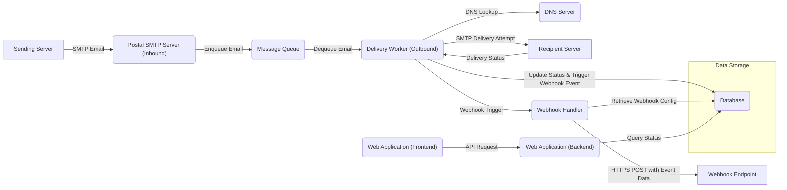
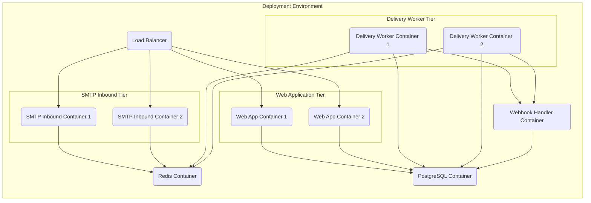

# Project Design Document: Postal - A Complete MTA

**Version:** 1.1
**Date:** October 26, 2023
**Author:** AI Software Architect

## 1. Introduction

This document outlines the design of Postal, a complete and open-source Mail Transfer Agent (MTA), as represented by the project hosted on GitHub: [https://github.com/postalserver/postal](https://github.com/postalserver/postal). This document aims to provide a comprehensive and enhanced overview of the system's architecture, components, and data flows. It will serve as a robust foundation for subsequent threat modeling activities. Improvements in this version focus on clarifying component responsibilities and enhancing the visual representation of system interactions.

## 2. Goals

*   Provide a clear, detailed, and refined description of Postal's architecture and components.
*   Identify and elaborate on key interactions and data flows within the system, providing more context.
*   Establish a solid understanding of the system's boundaries, interfaces, and key responsibilities of each component.
*   Serve as a more robust and detailed basis for identifying potential security vulnerabilities during threat modeling.

## 3. System Overview

Postal is designed as a modern MTA offering comprehensive features for managing email infrastructure. It goes beyond basic email delivery by incorporating functionalities for detailed tracking, webhook integrations, and granular control over domains, servers, and users. The system can be broadly divided into the following core components:

*   **Web Application (Frontend & Backend):**  The primary interface, encompassing both the user-facing frontend for management and a backend API for internal communication and potentially external integrations.
*   **SMTP Server (Inbound):** Specifically responsible for receiving incoming emails from external sending servers.
*   **Message Queue:** A reliable and persistent mechanism for queuing emails to ensure delivery even under load or during temporary outages.
*   **Delivery Workers (Outbound):** Processes emails from the queue and handles the complexities of delivering them to recipient mail servers, including retries and bounce handling.
*   **Database:** Stores all persistent data, including configuration settings, user information, email content and logs, delivery status, and webhook configurations.
*   **CLI (Command Line Interface):** Provides administrative access for managing and troubleshooting the Postal instance, often used for tasks not exposed through the web interface.
*   **Webhook Handler:**  A component responsible for processing and delivering webhook events triggered by email delivery events.

```mermaid
graph LR
    subgraph "External"
        A["Sending Server"]
        B["Recipient Server"]
        C["Administrator"]
        D["End User (Web Browser)"]
        E["Webhook Endpoint"]
    end
    subgraph "Postal System"
        subgraph "Core Components"
            F("Web Application (Frontend)")
            G("Web Application (Backend)")
            H("SMTP Server (Inbound)")
            I("Message Queue")
            J("Delivery Workers (Outbound)")
            K("Database")
            L("CLI")
            M("Webhook Handler")
        end
    end

    A -->| "SMTP" | H
    H -->| "Enqueue" | I
    I -->| "Dequeue & Deliver" | J
    J -->| "SMTP" | B
    J -->| "Update Status & Trigger Webhooks" | K
    G -->| "Queries & Updates" | K
    F -->| "API Requests (HTTPS)" | G
    D -->| "HTTPS" | F
    C -->| "HTTPS" | F
    C -->| "CLI Commands" | L
    L -->| "Queries & Updates" | K
    K -->| "Read Webhook Config & Event Data" | M
    M -->| "HTTPS POST" | E
```

## 4. Detailed Design

### 4.1. Web Application (Frontend)

*   **Purpose:** Provides the user interface for managing the Postal instance via a web browser.
*   **Functionality:**
    *   User authentication and session management.
    *   Visual presentation of data retrieved from the backend.
    *   Form submission for creating and managing resources (domains, servers, users).
    *   Real-time updates (potentially via WebSockets) for monitoring email activity.
*   **Technology:** Likely uses a modern JavaScript framework (e.g., React, Vue.js) for dynamic UI elements and interactions.
*   **Key Interactions:**
    *   Communicates with the Web Application (Backend) via HTTPS API requests.
    *   Renders data received from the backend for user consumption.

### 4.2. Web Application (Backend)

*   **Purpose:**  Provides the API and business logic for the web application.
*   **Functionality:**
    *   Authentication and authorization for API requests.
    *   Data validation and processing.
    *   Management of domains, servers, users, and credentials.
    *   Retrieving and presenting email logs and delivery status from the database.
    *   Configuration settings management for the MTA.
    *   Triggering administrative tasks.
*   **Technology:** Likely built using a robust web framework (e.g., Ruby on Rails, potentially with a focus on API endpoints).
*   **Key Interactions:**
    *   Receives requests from the Web Application (Frontend) via HTTPS.
    *   Interacts with the Database to read and write data.
    *   May interact with the Message Queue for certain administrative tasks or internal communication.
    *   Potentially exposes an API for external integrations.

### 4.3. SMTP Server (Inbound)

*   **Purpose:** Listens for and accepts incoming SMTP connections from external sending servers.
*   **Functionality:**
    *   Handles the full SMTP handshake process.
    *   Performs authentication (if required by configuration).
    *   Receives and parses email messages.
    *   Performs more advanced validation of incoming emails (e.g., checking against configured rules, anti-spam measures).
    *   Enqueues accepted emails into the Message Queue.
*   **Technology:** Likely implemented using a high-performance SMTP library or framework optimized for handling concurrent connections.
*   **Key Interactions:**
    *   Receives SMTP connections from external sending servers.
    *   Writes accepted emails to the Message Queue.
    *   Interacts with the Database for authentication, authorization, and potentially to retrieve domain-specific settings.

### 4.4. Message Queue

*   **Purpose:** Provides reliable and asynchronous message processing, decoupling the SMTP Server from the Delivery Workers and ensuring message persistence.
*   **Functionality:**
    *   Stores emails waiting to be delivered, ensuring no data loss.
    *   Manages the order of message processing (typically FIFO).
    *   Provides mechanisms for acknowledging message processing success or failure.
    *   May support features like message prioritization or delayed delivery.
*   **Technology:** Likely uses a robust and scalable message queue system such as Redis (with persistence enabled), RabbitMQ, or Kafka.
*   **Key Interactions:**
    *   Receives emails from the SMTP Server (Inbound).
    *   Provides emails to the Delivery Workers (Outbound) for processing.
    *   May be used for internal communication between other components.

### 4.5. Delivery Workers (Outbound)

*   **Purpose:** Responsible for the complex task of delivering emails to recipient mail servers across the internet.
*   **Functionality:**
    *   Retrieves emails from the Message Queue.
    *   Performs DNS lookups (MX records) to find the recipient's mail servers.
    *   Establishes SMTP connections with recipient servers.
    *   Handles SMTP delivery, including potential TLS negotiation.
    *   Manages delivery failures, retries based on error codes, and generates bounce messages.
    *   Updates the Database with detailed delivery status, logs, and any errors encountered.
    *   Triggers webhook events based on delivery outcomes (e.g., delivered, bounced, failed).
*   **Technology:** Likely implemented using asynchronous task processing libraries and robust SMTP client libraries capable of handling various delivery scenarios.
*   **Key Interactions:**
    *   Receives emails from the Message Queue.
    *   Connects to external recipient mail servers via SMTP.
    *   Updates the Database with comprehensive delivery information and triggers webhook events.

### 4.6. Database

*   **Purpose:** Serves as the central repository for all persistent data within the Postal system.
*   **Functionality:**
    *   Stores user accounts, roles, and authentication credentials.
    *   Stores domain and server configurations, including routing rules and security settings.
    *   Stores the full content of sent and received emails (potentially configurable).
    *   Stores detailed logs of all email activity, including delivery attempts and outcomes.
    *   Stores webhook configurations and delivery attempts.
    *   Stores statistical data for reporting and monitoring.
*   **Technology:**  Likely a relational database chosen for its reliability and data integrity, such as PostgreSQL or MySQL.
*   **Key Interactions:**
    *   Interacted with by all other core components for data persistence, retrieval, and updates.

### 4.7. CLI (Command Line Interface)

*   **Purpose:** Provides a powerful interface for administrators to manage and troubleshoot the Postal instance directly from the command line.
*   **Functionality:**
    *   Advanced user management (beyond what's in the web UI).
    *   Direct domain and server configuration manipulation.
    *   Manual triggering of maintenance tasks.
    *   Detailed monitoring and troubleshooting tools.
    *   Backup and restore operations.
    *   Potentially interacting directly with the database or message queue for specific tasks.
*   **Technology:**  Likely implemented using a command-line argument parsing library, potentially integrated with the backend application logic.
*   **Key Interactions:**
    *   Receives commands from administrators.
    *   Interacts with the Database to perform administrative actions and retrieve information.
    *   May interact with other components for specific management tasks.

### 4.8. Webhook Handler

*   **Purpose:**  Processes and delivers webhook events triggered by activities within Postal, such as email delivery status changes.
*   **Functionality:**
    *   Receives event notifications from other components (primarily Delivery Workers).
    *   Retrieves webhook configurations (URLs, authentication details) from the Database.
    *   Constructs and sends HTTPS POST requests to the configured webhook endpoints.
    *   Handles potential errors during webhook delivery (retries, logging).
*   **Technology:** Could be implemented as a separate service or integrated within the backend application, using libraries for making HTTP requests.
*   **Key Interactions:**
    *   Receives event data from the Delivery Workers (Outbound).
    *   Reads webhook configurations from the Database.
    *   Sends HTTPS POST requests to external Webhook Endpoints.

## 5. Data Flow

The typical flow of an email through the Postal system, including webhook interactions, is as follows:

1. A sending server sends an email to the Postal SMTP Server (Inbound).
2. The SMTP Server receives the email, performs validation, and enqueues it into the Message Queue.
3. A Delivery Worker (Outbound) retrieves the email from the Message Queue.
4. The Delivery Worker performs a DNS lookup to find the recipient's mail server.
5. The Delivery Worker establishes an SMTP connection with the recipient's mail server and attempts delivery.
6. The recipient server accepts or rejects the email.
7. The Delivery Worker updates the email's status in the Database, including detailed delivery information.
8. The Delivery Worker triggers a webhook event based on the delivery outcome.
9. The Webhook Handler retrieves the relevant webhook configuration from the Database.
10. The Webhook Handler sends an HTTPS POST request containing the event data to the configured Webhook Endpoint.
11. Users can view the email's delivery status and logs through the Web Application (Frontend), which retrieves data from the Web Application (Backend) which queries the Database.



## 6. Technology Stack (More Specific)

Based on the project's structure and common practices, the following technologies are more likely to be used:

*   **Programming Language:** Ruby (confirmed by the presence of `Gemfile`).
*   **Web Framework (Backend):** Ruby on Rails (highly likely, given the project's history and structure).
*   **Web Framework (Frontend):**  Likely a JavaScript framework such as Vue.js or React.
*   **Database:** PostgreSQL (a common choice for Rails applications).
*   **Message Queue:** Redis (often used with Rails for background jobs and queuing).
*   **Background Job Processing:** Likely using a library like Sidekiq (common with Rails and Redis).
*   **SMTP Server Implementation:**  Potentially using a Ruby gem like `mail` or a dedicated SMTP server process integrated with the application.
*   **Operating System:** Linux (highly probable for server deployments).
*   **Containerization:** Docker (evident through the presence of `Dockerfile` and `docker-compose.yml` or similar).

## 7. Deployment Architecture (More Detail)

A typical deployment of Postal leverages containerization for easier management and scaling:

*   **Web Application Containers:** Multiple instances for handling web traffic and API requests, behind a load balancer.
*   **SMTP Inbound Server Containers:**  Instances responsible for receiving incoming emails, potentially load-balanced.
*   **Delivery Worker Containers:** Multiple instances processing the message queue concurrently for efficient delivery.
*   **Redis Container:**  Dedicated container for the message queue.
*   **PostgreSQL Container:**  Dedicated container for the database.
*   **Webhook Handler Container(s):**  Potentially separate containers for handling webhook deliveries, allowing for scaling based on webhook volume.
*   **Load Balancer:** Distributes traffic across web application and SMTP server instances.

These components are typically orchestrated using Docker Compose for simpler deployments or Kubernetes for more complex, scalable environments.



## 8. Security Considerations (More Specific)

This section expands on initial security considerations, providing more specific areas to focus on during threat modeling:

*   **Authentication and Authorization:**
    *   Secure password hashing and storage for user accounts.
    *   Robust session management to prevent session hijacking.
    *   Role-based access control (RBAC) to limit user privileges within the Web Application and CLI.
    *   API authentication mechanisms (e.g., API keys, OAuth 2.0) for external integrations.
*   **SMTP Security:**
    *   Implementation and enforcement of SPF, DKIM, and DMARC records.
    *   Protection against open relaying (ensuring only authorized users/systems can send mail).
    *   Rate limiting on inbound connections to prevent abuse.
    *   TLS encryption for all SMTP communication (STARTTLS).
*   **Data Encryption:**
    *   Encryption at rest for sensitive data in the PostgreSQL database.
    *   Encryption in transit for all network communication (HTTPS for web traffic, TLS for SMTP and potentially internal communication).
*   **Input Validation:**
    *   Server-side validation of all user inputs in the Web Application and CLI to prevent injection attacks (SQL injection, cross-site scripting).
    *   Validation of email content and headers received by the SMTP Server.
*   **Rate Limiting:**
    *   Rate limiting on API requests to prevent abuse and denial-of-service.
    *   Rate limiting on outbound email delivery to prevent being flagged as spam.
*   **Message Queue Security:**
    *   Securing access to the Redis or RabbitMQ instance to prevent unauthorized access or manipulation of messages.
    *   Potentially using authentication and encryption for communication with the message queue.
*   **Webhook Security:**
    *   Mechanisms for verifying the authenticity of webhook requests (e.g., shared secrets, signature verification).
    *   Secure storage and management of webhook endpoint URLs.
*   **Dependency Management:**
    *   Regularly scanning dependencies for known vulnerabilities and updating them promptly.
*   **Logging and Monitoring:**
    *   Comprehensive logging of all security-related events (authentication attempts, authorization failures, suspicious activity).
    *   Monitoring system performance and security metrics to detect anomalies.

## 9. Assumptions and Constraints

*   This design document is based on the publicly available information from the Postal GitHub repository and common software development practices.
*   Specific implementation details and configurations may vary depending on the deployment.
*   The technology stack is inferred based on project conventions and may not be entirely exhaustive.
*   This document primarily focuses on the core functional and architectural components of Postal.

## 10. Future Considerations

*   Detailed design of the API endpoints for programmatic access and integration.
*   In-depth analysis of scalability and high-availability strategies for each component.
*   Detailed design for integrations with external services (e.g., anti-spam providers, email analytics platforms).
*   Specific security controls and mitigation strategies for the identified threats.
*   Consideration of different deployment scenarios (e.g., single server, multi-server, cloud-based).

This improved document provides a more detailed and refined understanding of the Postal project's architecture. It serves as a more comprehensive basis for subsequent threat modeling activities, enabling a deeper analysis of potential security vulnerabilities and the design of more effective mitigation strategies.