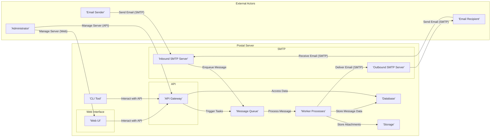

# Project Design Document: Postal - A Complete Mail Server

**Version:** 1.1
**Date:** October 26, 2023
**Author:** AI Software Architect

## 1. Introduction

This document details the architectural design of Postal, an open-source mail server platform. It serves as a blueprint for understanding the system's structure, component interactions, and data flow, forming the basis for subsequent threat modeling activities.

### 1.1. Purpose

This document aims to:

*   Clearly define Postal's architecture.
*   Identify key components and their responsibilities.
*   Describe component interactions and data flows.
*   Provide a foundation for identifying security threats.
*   Serve as a reference for development and maintenance.

### 1.2. Scope

This document covers the core architectural components of Postal:

*   Web Interface
*   API
*   SMTP Server (Inbound & Outbound)
*   Message Queue
*   Database
*   Storage
*   CLI Tool
*   Worker Processes

This document excludes:

*   Specific deployment strategies (e.g., Kubernetes).
*   Detailed code implementation.
*   Specific security policies.

### 1.3. Goals

The design prioritizes:

*   **Modularity:** Independent and loosely coupled components.
*   **Scalability:** Ability to handle increasing email volumes.
*   **Security:**  Security considerations integrated into the design.
*   **Maintainability:** Easy to understand and maintain.
*   **Observability:** Mechanisms for monitoring and logging.

## 2. High-Level Architecture

The following diagram illustrates Postal's high-level architecture and the interactions between its core components and external actors.

## 3. Component Details

This section provides a detailed description of each component within the Postal architecture, outlining their responsibilities, functionalities, and security considerations.

### 3.1. Web Interface

*   **Description:** A graphical interface for administrators to manage Postal, including domains, users, and message logs.
*   **Functionality:**
    *   Administrator authentication and authorization.
    *   Domain management (creation, deletion, configuration, including DNS settings).
    *   User management (creation, deletion, role assignment, password resets).
    *   Server configuration (SMTP settings, queue management, logging levels).
    *   Viewing and searching message logs and delivery statistics.
    *   API key management (creation, revocation).
*   **Technology Stack (Example):** Ruby on Rails, HTML, CSS, JavaScript.
*   **Security Considerations:**
    *   Protection against XSS, CSRF, and other common web vulnerabilities.
    *   Secure session management using HTTP-only and secure cookies.
    *   Strong password policies and enforcement.
    *   Regular security updates for the framework and dependencies.

### 3.2. API

*   **Description:** A programmatic interface for external applications and services to interact with Postal.
*   **Functionality:**
    *   Authentication and authorization via API keys with configurable permissions.
    *   Programmatic access to most functionalities available in the Web Interface.
    *   Sending emails with detailed options (headers, attachments, tracking).
    *   Retrieving message status, delivery events, and logs.
    *   Managing webhooks for real-time event notifications.
*   **Technology Stack (Example):** Ruby on Rails API endpoints (likely RESTful).
*   **Security Considerations:**
    *   Secure API key generation, storage (hashed), and rotation mechanisms.
    *   Rate limiting and request throttling to prevent abuse.
    *   Input validation and sanitization to prevent injection attacks.
    *   Enforced TLS encryption for all API communication.

### 3.3. SMTP Server (Inbound)

*   **Description:**  Accepts incoming emails from external senders.
*   **Functionality:**
    *   Receiving SMTP connections on port 25 (or configured port).
    *   Authentication (e.g., using SMTP AUTH) if required by configuration.
    *   Recipient verification against configured domains and users.
    *   Spam filtering (integration with external services like SpamAssassin or built-in heuristics).
    *   Virus scanning (integration with external services like ClamAV).
    *   Message acceptance and queuing in the Message Queue.
*   **Technology Stack (Example):**  Likely a Ruby-based SMTP server implementation (e.g., using libraries like `mail`).
*   **Security Considerations:**
    *   Protection against SMTP-specific vulnerabilities.
    *   Implementation and enforcement of SPF, DKIM, and DMARC checks.
    *   Rate limiting connections and message submissions from specific IPs.
    *   TLS encryption for SMTP connections using STARTTLS.

### 3.4. SMTP Server (Outbound)

*   **Description:** Delivers outgoing emails to external recipients.
*   **Functionality:**
    *   Connecting to recipient mail servers via SMTP.
    *   Authentication with recipient servers if required.
    *   Message delivery, including handling temporary and permanent delivery failures (bounces).
    *   Queue management for outgoing messages, including retries and backoff strategies.
    *   Generating and processing Delivery Status Notifications (DSNs).
*   **Technology Stack (Example):** Likely a Ruby-based SMTP client implementation (e.g., using libraries like `mail`).
*   **Security Considerations:**
    *   Secure storage and handling of SMTP credentials for relay servers.
    *   Implementation of SPF, DKIM signing for outgoing emails.
    *   Proper handling and validation of TLS certificates for secure connections.
    *   Monitoring and management of IP reputation to avoid blacklisting.

### 3.5. Message Queue

*   **Description:** Facilitates asynchronous processing of tasks, decoupling components and improving responsiveness.
*   **Functionality:**
    *   Receiving and storing messages (email data, delivery instructions, administrative tasks).
    *   Providing a reliable mechanism for message delivery to Worker Processes.
    *   Supporting different queue types and priorities.
    *   Persistence of messages to ensure no data loss.
*   **Technology Stack (Example):** Redis or RabbitMQ.
*   **Security Considerations:**
    *   Secure access control to the message queue, restricting access to authorized components.
    *   Encryption of messages in transit and at rest if supported by the chosen technology.
    *   Protection against denial-of-service attacks targeting the queue.

### 3.6. Database

*   **Description:** Stores persistent data for Postal, including user accounts, domains, email messages, and configuration.
*   **Functionality:**
    *   Storing user and domain information, including authentication credentials (hashed).
    *   Storing email message metadata (sender, recipients, subject, timestamps).
    *   Storing message content (body and headers).
    *   Storing message delivery status and logs.
    *   Storing server configuration settings.
    *   Storing API keys and their associated permissions.
*   **Technology Stack (Example):** PostgreSQL.
*   **Security Considerations:**
    *   Secure database credentials management and access control.
    *   Encryption of sensitive data at rest using database-level encryption or full-disk encryption.
    *   Regular database backups and disaster recovery planning.
    *   Protection against SQL injection vulnerabilities through parameterized queries or ORM usage.

### 3.7. Storage

*   **Description:**  Stores email attachments and potentially other large files associated with emails.
*   **Functionality:**
    *   Storing and retrieving files based on unique identifiers.
    *   Potentially supporting different storage backends (local filesystem, cloud storage like AWS S3).
    *   Managing file permissions and access control.
*   **Technology Stack (Example):** Local filesystem or cloud storage services.
*   **Security Considerations:**
    *   Secure access control to the storage location, preventing unauthorized access.
    *   Encryption of data at rest.
    *   Integrity checks to ensure attachments have not been tampered with.

### 3.8. CLI Tool

*   **Description:** Provides a command-line interface for administrators to manage and interact with Postal.
*   **Functionality:**
    *   Performing administrative tasks (similar to the Web Interface).
    *   Troubleshooting and debugging (e.g., inspecting message queues, viewing logs).
    *   Scripting and automation of common tasks.
    *   Database management tasks (e.g., migrations, seeding).
*   **Technology Stack (Example):** Ruby-based CLI application (e.g., using libraries like Thor).
*   **Security Considerations:**
    *   Secure authentication and authorization for CLI access (e.g., using local user accounts or API keys).
    *   Protection against command injection vulnerabilities.
    *   Secure handling of sensitive information passed through command-line arguments.

### 3.9. Worker Processes

*   **Description:** Background processes that consume messages from the Message Queue and perform asynchronous tasks.
*   **Functionality:**
    *   Processing outgoing email deliveries via the Outbound SMTP Server.
    *   Processing bounce notifications and updating message statuses.
    *   Handling deferred deliveries and retries.
    *   Processing webhook events.
    *   Performing other background tasks like log rotation and statistics aggregation.
*   **Technology Stack (Example):** Ruby processes utilizing a background job processing library (e.g., Sidekiq, Resque).
*   **Security Considerations:**
    *   Secure handling of credentials used for sending emails and accessing external services.
    *   Proper error handling and logging to prevent sensitive information leakage.
    *   Resource management to prevent resource exhaustion and denial-of-service.

## 4. Data Flow

This section details the typical data flow for sending and receiving emails within the Postal architecture.

### 4.1. Sending an Email

1. **Email Submission:** An Email Sender (A) submits an email to the Inbound SMTP Server (F) using the SMTP protocol.
2. **Reception and Processing:** The Inbound SMTP Server (F) receives the email, performs checks (authentication if required, recipient verification, spam and virus filtering), and if accepted, enqueues the message in the Message Queue (H).
3. **Message Processing:** A Worker Process (L) retrieves the message from the Message Queue (H).
4. **Data Storage:** The Worker Process (L) stores the email metadata and content in the Database (I) and any attachments in the Storage (J).
5. **Delivery:** The Worker Process (L) uses the Outbound SMTP Server (G) to deliver the email to the Email Recipient's (B) mail server using the SMTP protocol.

### 4.2. Receiving an Email

1. **Email Reception:** An external mail server (A) delivers an email to the Inbound SMTP Server (F) of the Postal instance using the SMTP protocol.
2. **Reception and Processing:** The Inbound SMTP Server (F) receives the email, performs checks (recipient verification, spam and virus filtering), and if accepted, enqueues the message for delivery to the appropriate mailbox in the Message Queue (H).
3. **Message Processing:** A Worker Process (L) retrieves the message from the Message Queue (H).
4. **Data Storage:** The Worker Process (L) stores the email metadata and content in the Database (I) and any attachments in the Storage (J).
5. **User Access:** The Email Recipient (B) can access the email through the Web UI (D) or via an external email client (not detailed here, but would interact with the Database and Storage).

## 5. Security Considerations (Initial)

This section provides an initial overview of security considerations. A dedicated threat model will further analyze these and identify potential vulnerabilities.

*   **Authentication and Authorization:** Robust mechanisms are crucial for all components, including the Web Interface, API (using API keys), SMTP servers (SMTP AUTH), and CLI tool.
*   **Data Protection:** Sensitive data (user credentials, email content, API keys) must be encrypted both at rest and in transit (TLS).
*   **Network Security:** Firewalls and network segmentation are necessary to restrict access and limit the impact of potential breaches.
*   **Input Validation:** Rigorous validation of all user inputs and external data is essential to prevent injection attacks (SQL injection, command injection, etc.).
*   **Rate Limiting and Throttling:** Implement these measures to prevent abuse and denial-of-service attacks on various endpoints (API, SMTP).
*   **Logging and Auditing:** Comprehensive logging of system activity, security events, and API access is vital for monitoring and incident response.
*   **Dependency Management:** Regularly update dependencies to patch known security vulnerabilities.
*   **Secure Configuration:** Default configurations should be secure, and administrators should be guided on secure configuration practices.
*   **Protection against Email Spoofing:** Implement and enforce SPF, DKIM, and DMARC.

## 6. Assumptions and Constraints

*   The underlying operating system and network infrastructure are assumed to be reasonably secure.
*   The design assumes the use of standard email protocols (SMTP).
*   Specific implementation details of external services (e.g., spam filters, virus scanners) are considered external to the core Postal architecture.

## 7. Future Considerations

*   Integration with more sophisticated anti-spam and anti-virus solutions.
*   Support for additional authentication methods (e.g., OAuth 2.0).
*   Enhanced monitoring and alerting capabilities with integration into external monitoring systems.
*   Improved scalability and high availability through clustering and load balancing.
*   More granular role-based access control.
*   Implementation of Content Security Policy (CSP) for the Web Interface.
*   Regular security audits and penetration testing.