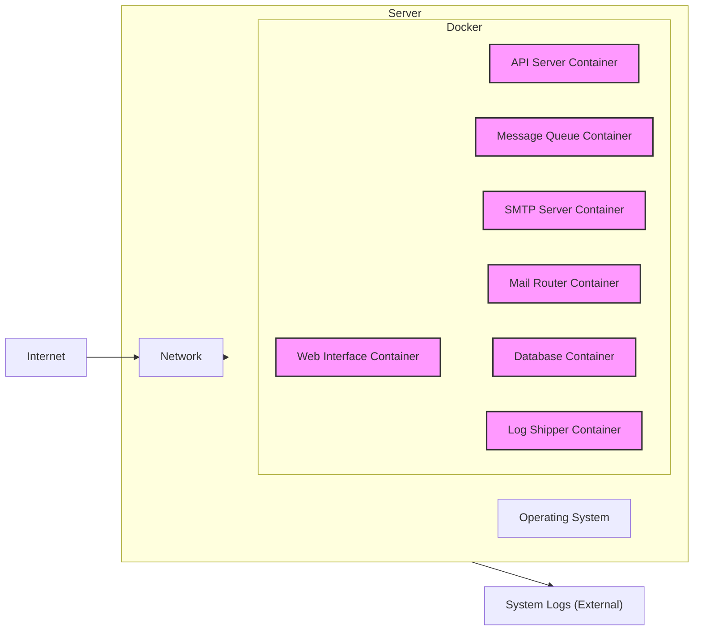
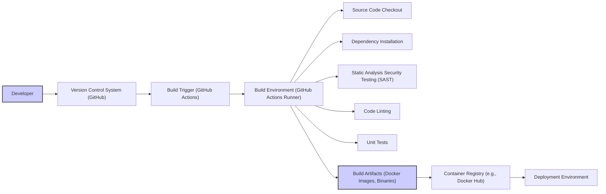

# BUSINESS POSTURE

Postal is a self-hosted mail server solution designed for developers and businesses who require a robust and feature-rich platform for sending and receiving emails. The primary business goal is to provide an alternative to cloud-based email sending services, offering greater control, privacy, and potentially cost-effectiveness for users who prefer to manage their own email infrastructure.

Business priorities include:
- Reliability and stability of the mail server to ensure consistent email delivery.
- Feature completeness to meet the diverse needs of users, including SMTP, web interface, API, and management tools.
- Performance and scalability to handle varying email volumes.
- Security to protect user data and prevent misuse of the mail server.
- Ease of deployment and management to lower the barrier to entry for self-hosting.

Most important business risks:
- Data breaches and unauthorized access to sensitive email data.
- Service disruption due to misconfiguration, attacks, or infrastructure failures, leading to email delivery issues and business impact.
- Reputation damage if the mail server is used for spam or malicious activities due to inadequate security controls.
- Compliance violations if data privacy regulations are not met.
- Complexity of self-hosting and management leading to user dissatisfaction and churn.

# SECURITY POSTURE

Existing security controls:
- security control: HTTPS for web interface and API access (standard practice for web applications).
- security control: Authentication and authorization for web interface and API access (user accounts, roles, permissions).
- security control: Input validation on web interface and API endpoints to prevent common web vulnerabilities.
- security control: Rate limiting to mitigate brute-force attacks and abuse.
- security control: Regular software updates to patch vulnerabilities in dependencies and the Postal application itself.
- security control: Configuration options for TLS/SSL settings for SMTP and other protocols.
- security control: DKIM, SPF, and DMARC support to improve email deliverability and prevent spoofing.
- security control: Security scanning of dependencies (likely through standard dependency management tools).
- accepted risk: Reliance on underlying operating system and infrastructure security.
- accepted risk: Security configuration is the responsibility of the user/administrator.

Recommended security controls:
- security control: Implement automated security scanning (SAST/DAST) in the CI/CD pipeline.
- security control: Conduct regular penetration testing to identify vulnerabilities.
- security control: Implement a robust logging and monitoring system for security events.
- security control: Provide security hardening guidelines for deployment environments.
- security control: Implement multi-factor authentication (MFA) for administrative access to the web interface and API.
- security control: Regularly review and update security configurations based on best practices and threat landscape.

Security requirements:
- Authentication:
    - requirement: Secure authentication mechanisms for web interface users (passwords, potentially SSO).
    - requirement: API authentication (API keys, tokens).
    - requirement: SMTP authentication (username/password, SASL).
- Authorization:
    - requirement: Role-based access control (RBAC) for web interface and API to manage permissions.
    - requirement: Authorization checks at all critical access points in the application.
    - requirement: Principle of least privilege applied to user roles and system components.
- Input validation:
    - requirement: Comprehensive input validation for all user-supplied data across web interface, API, and SMTP.
    - requirement: Protection against common injection attacks (SQL injection, command injection, cross-site scripting).
    - requirement: Input sanitization and encoding to prevent output encoding vulnerabilities.
- Cryptography:
    - requirement: Use of strong encryption algorithms for sensitive data at rest and in transit.
    - requirement: Secure storage of cryptographic keys and secrets.
    - requirement: Proper implementation of TLS/SSL for all network communication.
    - requirement: Hashing of passwords using strong one-way hash functions with salt.

# DESIGN

## C4 CONTEXT

```mermaid
flowchart LR
    subgraph "Postal System"
        P("Postal")
    end
    U("Users") --> P
    WA("Web Applications") --> P
    MS("Mail Servers (Internet)") <-- P
    MUA("Mail User Agents (e.g., Outlook, Thunderbird)") <-- P
    MA("Monitoring Agents") --> P
    SL("System Logs") <-- P
    DB("Database Server") <-- P

    style P fill:#f9f,stroke:#333,stroke-width:2px
```

Context Diagram Elements:

- Name: Users
    - Type: Person
    - Description: End-users who interact with web applications that use Postal to send emails, and administrators who manage the Postal system.
    - Responsibilities: Use web applications, manage Postal server, monitor email delivery.
    - Security controls: Strong passwords, MFA (for administrators), secure access to web applications.
- Name: Web Applications
    - Type: Software System
    - Description: External web applications that integrate with Postal to send transactional and marketing emails.
    - Responsibilities: Generate email content, use Postal API or SMTP to send emails.
    - Security controls: API key management, secure communication with Postal API (HTTPS), input validation of data sent to Postal.
- Name: Mail Servers (Internet)
    - Type: Software System
    - Description: External mail servers on the internet that receive emails sent by Postal.
    - Responsibilities: Receive emails, perform spam filtering, deliver emails to recipient mailboxes.
    - Security controls: Standard internet mail server security practices, SPF, DKIM, DMARC validation.
- Name: Mail User Agents (e.g., Outlook, Thunderbird)
    - Type: Software System
    - Description: Email clients used by recipients to read emails delivered by Postal.
    - Responsibilities: Receive and display emails.
    - Security controls: Client-side email security features (spam filters, phishing detection).
- Name: Monitoring Agents
    - Type: Software System
    - Description: External monitoring systems that track the health and performance of the Postal system.
    - Responsibilities: Monitor uptime, resource usage, email delivery metrics, and security events.
    - Security controls: Secure API access to Postal metrics, secure storage of monitoring data.
- Name: System Logs
    - Type: Software System
    - Description: Centralized logging system where Postal writes its logs for auditing and troubleshooting.
    - Responsibilities: Aggregate and store logs from Postal components.
    - Security controls: Secure log storage, access control to logs, log integrity checks.
- Name: Database Server
    - Type: Software System
    - Description: Database system used by Postal to store configuration, user data, email queues, and logs.
    - Responsibilities: Persist Postal data, provide data access to Postal components.
    - Security controls: Database access control, encryption at rest, regular backups, database hardening.
- Name: Postal
    - Type: Software System
    - Description: Self-hosted mail server solution.
    - Responsibilities: Sending and receiving emails, managing email queues, providing web interface and API for management, logging and monitoring.
    - Security controls: Authentication, authorization, input validation, cryptography, rate limiting, security logging, secure configuration.

## C4 CONTAINER

```mermaid
flowchart LR
    subgraph "Postal System"
        WB("Web Interface")
        API("API Server")
        MQ("Message Queue (e.g., RabbitMQ)")
        MS("SMTP Server")
        MR("Mail Router")
        DB("Database (PostgreSQL)")
        LS("Log Shipper")
    end
    U("Users") --> WB
    WA("Web Applications") --> API
    WA --> MS
    MS --> MQ
    MR --> MS
    MR --> DB
    MR --> LS
    MQ --> MR
    API --> DB
    WB --> API
    MA("Monitoring Agents") --> API
    SL("System Logs") <-- LS
    DB <-- DB

    style WB fill:#f9f,stroke:#333,stroke-width:2px
    style API fill:#f9f,stroke:#333,stroke-width:2px
    style MQ fill:#f9f,stroke:#333,stroke-width:2px
    style MS fill:#f9f,stroke:#333,stroke-width:2px
    style MR fill:#f9f,stroke:#333,stroke-width:2px
    style DB fill:#f9f,stroke:#333,stroke-width:2px
    style LS fill:#f9f,stroke:#333,stroke-width:2px
```

Container Diagram Elements:

- Name: Web Interface
    - Type: Web Application
    - Description: Provides a user interface for administrators to manage Postal, configure settings, view logs, and monitor performance.
    - Responsibilities: User authentication and authorization, configuration management, monitoring dashboard, log viewing.
    - Security controls: HTTPS, session management, input validation, authorization checks, protection against web vulnerabilities, MFA for admin login.
- Name: API Server
    - Type: Web Application
    - Description: Provides a RESTful API for external applications to interact with Postal, primarily for sending emails and managing domains/servers.
    - Responsibilities: API endpoint management, authentication and authorization (API keys), request handling, data validation, interaction with other Postal components.
    - Security controls: HTTPS, API key management, rate limiting, input validation, authorization checks, protection against API vulnerabilities.
- Name: Message Queue (e.g., RabbitMQ)
    - Type: Data Store
    - Description: Asynchronous message queue used for decoupling components and handling email processing tasks.
    - Responsibilities: Queue management, message delivery, message persistence.
    - Security controls: Access control to the message queue, secure communication between components and the queue (TLS if supported), queue monitoring.
- Name: SMTP Server
    - Type: Application
    - Description: Handles incoming and outgoing SMTP connections for sending and receiving emails.
    - Responsibilities: SMTP protocol handling, email parsing, authentication (SMTP AUTH), TLS encryption, interaction with message queue for outgoing emails, delivery of incoming emails to mail router.
    - Security controls: TLS/SSL encryption, SMTP AUTH, rate limiting, connection limits, spam filtering integration, input validation of email headers and content.
- Name: Mail Router
    - Type: Application
    - Description: Core component responsible for routing emails, processing delivery logic, managing queues, and interacting with the database.
    - Responsibilities: Email routing, delivery retries, bounce handling, queue management, logging, interaction with database for email data and configuration.
    - Security controls: Input validation, secure interaction with database and message queue, logging of security events, rate limiting for processing tasks.
- Name: Database (PostgreSQL)
    - Type: Data Store
    - Description: PostgreSQL database used to store Postal configuration, user data, email queues, logs, and other persistent data.
    - Responsibilities: Data persistence, data retrieval, data integrity.
    - Security controls: Database access control, encryption at rest, regular backups, database hardening, least privilege access for Postal components.
- Name: Log Shipper
    - Type: Application
    - Description: Component responsible for collecting logs from different Postal components and shipping them to a centralized logging system.
    - Responsibilities: Log aggregation, log formatting, log shipping to external system.
    - Security controls: Secure log shipping protocol, log integrity, access control to log shipper configuration.

## DEPLOYMENT

Deployment Solution: Docker Compose on a single server (for simplicity and development/small deployments).

Other possible solutions:
- Kubernetes cluster for scalability and high availability.
- Virtual Machines or Bare Metal servers with manual installation.
- Cloud provider managed services (e.g., AWS ECS, Google Kubernetes Engine) for managed infrastructure.

Detailed Deployment (Docker Compose):



Deployment Diagram Elements:

- Name: Server
    - Type: Infrastructure Node
    - Description: A single physical or virtual server hosting the Postal system.
    - Responsibilities: Provide compute resources, network connectivity, and storage for Postal containers.
    - Security controls: Operating system hardening, firewall configuration, intrusion detection system, regular security patching, access control to the server.
- Name: Docker
    - Type: Container Runtime Environment
    - Description: Docker engine used to run and manage Postal containers.
    - Responsibilities: Container orchestration, resource isolation, container lifecycle management.
    - Security controls: Docker security best practices, container image scanning, resource limits for containers, secure container runtime configuration.
- Name: Web Interface Container
    - Type: Container
    - Description: Docker container running the Web Interface application.
    - Responsibilities: Serve the web interface, handle user requests.
    - Security controls: Same as Web Interface Container security controls in Container Diagram.
- Name: API Server Container
    - Type: Container
    - Description: Docker container running the API Server application.
    - Responsibilities: Serve the API, handle API requests.
    - Security controls: Same as API Server Container security controls in Container Diagram.
- Name: Message Queue Container
    - Type: Container
    - Description: Docker container running the Message Queue service (e.g., RabbitMQ).
    - Responsibilities: Message queuing and delivery.
    - Security controls: Same as Message Queue Container security controls in Container Diagram.
- Name: SMTP Server Container
    - Type: Container
    - Description: Docker container running the SMTP Server application.
    - Responsibilities: Handle SMTP connections, send and receive emails.
    - Security controls: Same as SMTP Server Container security controls in Container Diagram.
- Name: Mail Router Container
    - Type: Container
    - Description: Docker container running the Mail Router application.
    - Responsibilities: Email routing and processing.
    - Security controls: Same as Mail Router Container security controls in Container Diagram.
- Name: Database Container
    - Type: Container
    - Description: Docker container running the Database service (PostgreSQL).
    - Responsibilities: Data storage and retrieval.
    - Security controls: Same as Database Container security controls in Container Diagram.
- Name: Log Shipper Container
    - Type: Container
    - Description: Docker container running the Log Shipper application.
    - Responsibilities: Log aggregation and shipping.
    - Security controls: Same as Log Shipper Container security controls in Container Diagram.
- Name: Operating System
    - Type: Software
    - Description: Operating system running on the server (e.g., Linux).
    - Responsibilities: Provide base system functionalities, resource management.
    - Security controls: OS hardening, security updates, access control, auditing.
- Name: Network
    - Type: Infrastructure
    - Description: Network infrastructure connecting the server to the internet and other systems.
    - Responsibilities: Network connectivity, routing, firewalling.
    - Security controls: Firewall rules, network segmentation, intrusion detection/prevention systems.
- Name: Internet
    - Type: Infrastructure
    - Description: Public internet.
    - Responsibilities: Global network connectivity.
    - Security controls: N/A (external entity).
- Name: System Logs (External)
    - Type: Software System
    - Description: External centralized logging system.
    - Responsibilities: Log storage and analysis.
    - Security controls: Secure log storage, access control to logs.

## BUILD

Build Process: GitHub Actions CI/CD (example).



Build Process Elements:

- Name: Developer
    - Type: Person
    - Description: Software developer contributing to the Postal project.
    - Responsibilities: Write code, commit changes, create pull requests.
    - Security controls: Secure development environment, code review process, secure coding practices.
- Name: Version Control System (GitHub)
    - Type: Software System
    - Description: GitHub repository hosting the Postal source code.
    - Responsibilities: Source code management, version control, collaboration.
    - Security controls: Access control to repository, branch protection, audit logs.
- Name: Build Trigger (GitHub Actions)
    - Type: Automation System
    - Description: GitHub Actions workflow triggered by code changes in the repository.
    - Responsibilities: Initiate the build process automatically.
    - Security controls: Secure workflow configuration, access control to workflows.
- Name: Build Environment (GitHub Actions Runner)
    - Type: Infrastructure
    - Description: GitHub Actions runner environment where the build process executes.
    - Responsibilities: Provide compute resources for build execution.
    - Security controls: Secure runner environment, isolation of build jobs, access control to runner.
- Name: Source Code Checkout
    - Type: Build Step
    - Description: Step in the build process to checkout the source code from the VCS.
    - Responsibilities: Retrieve the latest code version.
    - Security controls: Secure access to VCS, integrity checks of checked-out code.
- Name: Dependency Installation
    - Type: Build Step
    - Description: Step to install project dependencies.
    - Responsibilities: Install required libraries and packages.
    - Security controls: Dependency vulnerability scanning, use of trusted dependency sources, dependency lock files.
- Name: Static Analysis Security Testing (SAST)
    - Type: Build Step
    - Description: Automated SAST tools to scan the source code for security vulnerabilities.
    - Responsibilities: Identify potential security flaws in the code.
    - Security controls: Regularly updated SAST tools, configuration of relevant security rules, fail build on critical findings.
- Name: Code Linting
    - Type: Build Step
    - Description: Automated code linters to check code style and potential issues.
    - Responsibilities: Enforce code quality and identify potential bugs.
    - Security controls: Configuration of linters for security-related checks.
- Name: Unit Tests
    - Type: Build Step
    - Description: Execution of unit tests to verify code functionality.
    - Responsibilities: Ensure code correctness and prevent regressions.
    - Security controls: Well-designed unit tests covering security-relevant functionalities.
- Name: Build Artifacts (Docker Images, Binaries)
    - Type: Build Output
    - Description: Output of the build process, including Docker images and binaries.
    - Responsibilities: Package the application for deployment.
    - Security controls: Image scanning for vulnerabilities, signing of artifacts, secure storage of artifacts.
- Name: Container Registry (e.g., Docker Hub)
    - Type: Software System
    - Description: Container registry to store and distribute Docker images.
    - Responsibilities: Image storage, image distribution, access control to images.
    - Security controls: Access control to registry, image scanning, vulnerability management for stored images.
- Name: Deployment Environment
    - Type: Infrastructure
    - Description: Target environment where Postal is deployed.
    - Responsibilities: Run the Postal application.
    - Security controls: Deployment environment security controls (as described in Deployment section).

# RISK ASSESSMENT

Critical business processes we are trying to protect:
- Email sending and receiving: Ensuring reliable and secure email communication for users and applications.
- System availability and integrity: Maintaining the operational status and correct functioning of the Postal system.
- Data confidentiality and privacy: Protecting sensitive email content and user data from unauthorized access and disclosure.
- Reputation: Preventing misuse of the mail server for spam or malicious activities that could damage the reputation of the Postal system and its users.

Data we are trying to protect and their sensitivity:
- Email content: Highly sensitive, contains personal and business communications. Requires confidentiality and integrity.
- User credentials (passwords, API keys): Highly sensitive, used for authentication and authorization. Requires confidentiality and integrity.
- Configuration data: Sensitive, contains settings that could impact security and functionality. Requires integrity and confidentiality.
- Logs: Potentially sensitive, may contain user activity and system events. Requires integrity and confidentiality.
- Email queues: Potentially sensitive, may contain email content in transit. Requires integrity and confidentiality.

# QUESTIONS & ASSUMPTIONS

Questions:
- What is the expected scale of deployment (number of users, email volume)?
- What are the specific compliance requirements (e.g., GDPR, HIPAA)?
- What is the organization's risk appetite?
- Are there any existing security policies or standards that need to be followed?
- What is the budget and timeline for implementing security controls?
- What are the preferred technologies for security controls (e.g., specific SAST/DAST tools, SIEM system)?

Assumptions:
- BUSINESS POSTURE: The primary business goal is to provide a secure and reliable self-hosted mail server solution. Security and reliability are high priorities.
- SECURITY POSTURE: Basic security controls are assumed to be in place (HTTPS, authentication, input validation). There is a need to enhance security posture with more proactive and automated security measures.
- DESIGN: A containerized deployment using Docker Compose on a single server is a reasonable starting point for design consideration. The system is composed of standard components for a mail server (web interface, API, SMTP server, message queue, database). The build process can be automated using CI/CD pipelines like GitHub Actions.