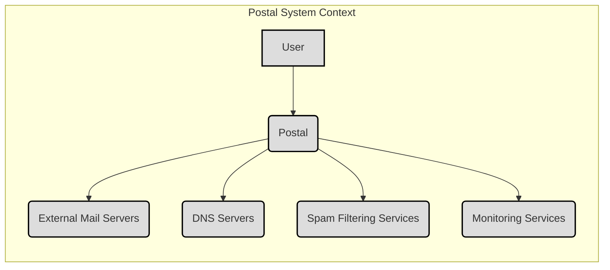
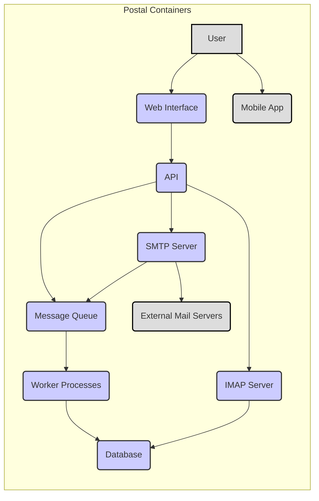
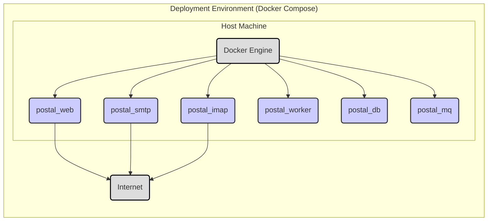
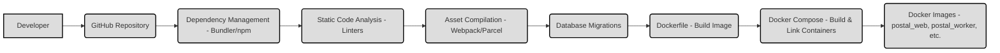

Okay, let's create a design document for the Postal project, focusing on aspects relevant to threat modeling.

# BUSINESS POSTURE

Postal is an open-source mail server.  It aims to provide a complete and functional mail server solution, replacing commercial offerings like SendGrid or Mailgun.  This implies a focus on reliability, scalability, and data privacy.  The target audience includes businesses of all sizes, from small startups to larger enterprises, as well as individual users who want more control over their email infrastructure.

Business Priorities:

*   Provide a reliable and functional mail server.
*   Ensure the confidentiality, integrity, and availability of user email data.
*   Offer a cost-effective alternative to commercial mail services.
*   Maintain a strong reputation for security and privacy.
*   Foster a vibrant open-source community.
*   Provide easy to use and well documented solution.

Business Goals:

*   Become a leading open-source mail server solution.
*   Attract a large and active user base.
*   Gain adoption by businesses of all sizes.
*   Continuously improve the software based on user feedback.

Most Important Business Risks:

*   Data breaches leading to exposure of sensitive email data.
*   Service disruptions causing email delivery failures.
*   Reputational damage due to security vulnerabilities or privacy violations.
*   Inability to scale to meet the demands of a growing user base.
*   Lack of adoption due to complexity or poor documentation.
*   Compromise of the mail server, leading to its use for spam or phishing campaigns.
*   Legal and regulatory non-compliance (e.g., GDPR, CCPA).

# SECURITY POSTURE

Existing Security Controls (based on the GitHub repository and general knowledge of mail servers):

*   security control: Web application firewall (WAF) capabilities, potentially through a reverse proxy like Nginx or a dedicated WAF solution. (Not explicitly mentioned in the repository, but standard practice for web applications).
*   security control: TLS/SSL encryption for all communication channels (SMTP, IMAP, HTTP). (Mentioned in documentation and configuration examples).
*   security control: Authentication mechanisms for SMTP, IMAP, and the web interface. (Mentioned in documentation).
*   security control: SPF, DKIM, and DMARC support for email authentication and anti-spoofing. (Mentioned in documentation).
*   security control: Rate limiting to prevent abuse and denial-of-service attacks. (Mentioned in documentation).
*   security control: Input validation to prevent injection attacks (e.g., SQL injection, cross-site scripting). (Implied, but should be explicitly verified in the codebase).
*   security control: Regular security updates and patching. (Implied by the active development and release cycle).
*   security control: Access controls to restrict access to sensitive data and functionality. (Implied by the user and administrative roles).
*   security control: Logging and monitoring to detect and respond to security incidents. (Mentioned in documentation).
*   security control: Data sanitization and escaping to prevent cross-site scripting (XSS) vulnerabilities. (Implied, but should be explicitly verified in the codebase).
*   security control: Use of a database with appropriate security configurations (e.g., parameterized queries, strong passwords, limited privileges). (Implied, but should be explicitly verified).

Accepted Risks:

*   accepted risk: Complexity of configuration may lead to misconfigurations by users, potentially exposing the server to vulnerabilities.
*   accepted risk: Reliance on third-party libraries and dependencies, which may introduce vulnerabilities.
*   accepted risk: Open-source nature of the project means that vulnerabilities may be discovered and exploited before patches are available.
*   accepted risk: Potential for zero-day exploits against the underlying operating system, mail server software, or other components.

Recommended Security Controls:

*   Implement a comprehensive security auditing program, including regular penetration testing and code reviews.
*   Provide detailed security hardening guides and best practices for users.
*   Implement a bug bounty program to incentivize security researchers to report vulnerabilities.
*   Integrate with intrusion detection and prevention systems (IDS/IPS).
*   Implement two-factor authentication (2FA) for administrative access.
*   Implement data loss prevention (DLP) measures to prevent sensitive data from leaving the system.
*   Use a dedicated, hardened operating system for the mail server.
*   Implement network segmentation to isolate the mail server from other systems.
*   Regularly review and update the threat model for the project.

Security Requirements:

*   Authentication:
    *   All users must be authenticated before accessing the system.
    *   Strong password policies must be enforced.
    *   Support for multi-factor authentication should be considered.
    *   Administrative accounts must have separate, strong credentials.
*   Authorization:
    *   Access to resources must be granted based on the principle of least privilege.
    *   Users should only have access to the data and functionality they need.
    *   Administrative roles should be clearly defined and enforced.
*   Input Validation:
    *   All input from users and external systems must be validated to prevent injection attacks.
    *   Input validation should be performed on both the client-side and server-side.
    *   Use a whitelist approach to input validation whenever possible.
*   Cryptography:
    *   All sensitive data must be encrypted in transit and at rest.
    *   Strong cryptographic algorithms and key lengths must be used.
    *   Key management practices must be secure.
    *   TLS/SSL certificates must be properly managed and renewed.
*   Auditing:
    *   All security-relevant events must be logged.
    *   Logs must be securely stored and protected from tampering.
    *   Logs should be regularly reviewed for suspicious activity.

# DESIGN

## C4 CONTEXT

Context Diagram Element Description:

*   Element:
    *   Name: User
    *   Type: Person
    *   Description: Represents a user sending or receiving email through Postal.
    *   Responsibilities: Sending email, receiving email, managing their account.
    *   Security controls: Authentication, authorization, rate limiting.

*   Element:
    *   Name: Postal
    *   Type: Software System
    *   Description: The Postal mail server itself.
    *   Responsibilities: Receiving email from users, sending email to external mail servers, managing mailboxes, providing a web interface.
    *   Security controls: All listed in the "Security Posture" section.

*   Element:
    *   Name: External Mail Servers
    *   Type: Software System
    *   Description: Other mail servers on the internet.
    *   Responsibilities: Receiving email from Postal, delivering email to recipients.
    *   Security controls: TLS/SSL encryption, SPF, DKIM, DMARC.

*   Element:
    *   Name: DNS Servers
    *   Type: Software System
    *   Description: Domain Name System servers used for resolving domain names.
    *   Responsibilities: Providing MX records for email routing, providing SPF, DKIM, and DMARC records.
    *   Security controls: DNSSEC.

*   Element:
    *   Name: Spam Filtering Services
    *   Type: Software System
    *   Description: External services used for spam filtering (e.g., SpamAssassin, Rspamd).
    *   Responsibilities: Analyzing incoming email for spam characteristics.
    *   Security controls: Regularly updated spam definitions.

*   Element:
    *   Name: Monitoring Services
    *   Type: Software System
    *   Description: External services used for monitoring the health and performance of Postal.
    *   Responsibilities: Monitoring uptime, resource usage, and error rates.
    *   Security controls: Secure communication with the Postal server.

## C4 CONTAINER

Container Diagram Element Description:

*   Element:
    *   Name: User
    *   Type: Person
    *   Description: Represents a user sending or receiving email through Postal.
    *   Responsibilities: Sending email, receiving email, managing their account.
    *   Security controls: Authentication, authorization, rate limiting.

*   Element:
    *   Name: Mobile App
    *   Type: Mobile Application
    *   Description: Represents a mobile application that interacts with Postal API.
    *   Responsibilities: Sending email, receiving email, managing their account.
    *   Security controls: Authentication, authorization, rate limiting, secure communication with API.

*   Element:
    *   Name: Web Interface
    *   Type: Web Application
    *   Description: The web-based user interface for managing Postal.
    *   Responsibilities: Providing access to mailboxes, settings, and administrative functions.
    *   Security controls: Authentication, authorization, input validation, XSS prevention, CSRF protection.

*   Element:
    *   Name: API
    *   Type: API
    *   Description: The application programming interface (API) for interacting with Postal.
    *   Responsibilities: Providing programmatic access to Postal's functionality.
    *   Security controls: Authentication, authorization, input validation, rate limiting.

*   Element:
    *   Name: SMTP Server
    *   Type: Application
    *   Description: The component responsible for receiving email via SMTP.
    *   Responsibilities: Receiving email from users and external mail servers, queuing messages for delivery.
    *   Security controls: TLS/SSL encryption, authentication, rate limiting, spam filtering.

*   Element:
    *   Name: IMAP Server
    *   Type: Application
    *   Description: The component responsible for providing access to mailboxes via IMAP.
    *   Responsibilities: Allowing users to access and manage their email.
    *   Security controls: TLS/SSL encryption, authentication, authorization.

*   Element:
    *   Name: Message Queue
    *   Type: Message Queue
    *   Description: A queue for storing messages that need to be processed.
    *   Responsibilities: Decoupling message reception from message processing.
    *   Security controls: Access controls, message encryption (if sensitive data is stored in the queue).

*   Element:
    *   Name: Worker Processes
    *   Type: Application
    *   Description: Background processes that handle tasks such as sending email, processing spam, and updating statistics.
    *   Responsibilities: Performing asynchronous tasks.
    *   Security controls: Access controls, input validation (if processing data from the queue).

*   Element:
    *   Name: Database
    *   Type: Database
    *   Description: The database used to store user data, mailboxes, and other information.
    *   Responsibilities: Storing and retrieving data.
    *   Security controls: Access controls, encryption at rest, parameterized queries, strong passwords, limited privileges.

*   Element:
    *   Name: External Mail Servers
    *   Type: Software System
    *   Description: Other mail servers on the internet.
    *   Responsibilities: Receiving email from Postal, delivering email to recipients.
    *   Security controls: TLS/SSL encryption, SPF, DKIM, DMARC.

## DEPLOYMENT

Possible Deployment Solutions:

1.  Single Server Deployment: All Postal components (web interface, API, SMTP server, IMAP server, message queue, worker processes, database) are deployed on a single server. This is the simplest option, suitable for small deployments.
2.  Multi-Server Deployment: Components are distributed across multiple servers. This provides better scalability and resilience. For example, the database could be on a separate server, and multiple worker processes could be running on different machines.
3.  Containerized Deployment (Docker): Postal components are packaged as Docker containers and deployed using Docker Compose or Kubernetes. This offers portability, scalability, and ease of management.
4.  Cloud-Based Deployment (AWS, Google Cloud, Azure): Postal is deployed on a cloud platform using virtual machines, containers, or managed services. This provides scalability, resilience, and access to cloud-specific features.

Chosen Solution (for detailed description): Containerized Deployment (Docker) using Docker Compose. This is a common and recommended approach for Postal.

Deployment Diagram Element Description:

*   Element:
    *   Name: Host Machine
    *   Type: Server
    *   Description: The physical or virtual machine hosting the Docker Engine.
    *   Responsibilities: Providing the underlying infrastructure for the containers.
    *   Security controls: Operating system hardening, firewall, intrusion detection/prevention.

*   Element:
    *   Name: Docker Engine
    *   Type: Container Runtime
    *   Description: The software responsible for running and managing Docker containers.
    *   Responsibilities: Creating, starting, stopping, and managing containers.
    *   Security controls: Docker security best practices, regular updates.

*   Element:
    *   Name: postal_web
    *   Type: Container
    *   Description: The container running the Postal web interface.
    *   Responsibilities: Serving the web interface to users.
    *   Security controls: See "Web Interface" in the Container Diagram section.

*   Element:
    *   Name: postal_smtp
    *   Type: Container
    *   Description: The container running the Postal SMTP server.
    *   Responsibilities: Receiving email via SMTP.
    *   Security controls: See "SMTP Server" in the Container Diagram section.

*   Element:
    *   Name: postal_imap
    *   Type: Container
    *   Description: The container running the Postal IMAP server.
    *   Responsibilities: Providing access to mailboxes via IMAP.
    *   Security controls: See "IMAP Server" in the Container Diagram section.

*   Element:
    *   Name: postal_worker
    *   Type: Container
    *   Description: The container running the Postal worker processes.
    *   Responsibilities: Handling asynchronous tasks.
    *   Security controls: See "Worker Processes" in the Container Diagram section.

*   Element:
    *   Name: postal_db
    *   Type: Container
    *   Description: The container running the Postal database (e.g., MySQL, PostgreSQL).
    *   Responsibilities: Storing and retrieving data.
    *   Security controls: See "Database" in the Container Diagram section.

*   Element:
    *   Name: postal_mq
    *   Type: Container
    *   Description: The container running the Postal message queue (e.g., RabbitMQ).
    *   Responsibilities: Queuing messages for processing.
    *   Security controls: See "Message Queue" in the Container Diagram section.

*   Element:
    *   Name: Internet
    *   Type: Network
    *   Description: The external network.
    *   Responsibilities: Connecting Postal to users and other mail servers.
    *   Security controls: Firewall, intrusion detection/prevention.

## BUILD

The Postal project utilizes a combination of build processes, primarily centered around Ruby (for the core application) and Node.js (for frontend assets).  While the repository doesn't explicitly define a CI/CD pipeline in a standard file (like .github/workflows), the documentation and project structure suggest the following:

Build Process:

1.  Developer commits code changes to the GitHub repository.
2.  Ruby dependencies are managed using Bundler (Gemfile and Gemfile.lock).  `bundle install` is likely used to install these dependencies.
3.  Node.js dependencies are managed using npm or yarn (package.json and package-lock.json or yarn.lock). `npm install` or `yarn install` is used to install these.
4.  Frontend assets (JavaScript, CSS) are likely compiled and minified using a build tool like Webpack or Parcel (though this isn't explicitly shown in the repository root, it's common practice).
5.  Database migrations are managed using a migration system (likely part of the Ruby framework).
6.  Docker images are built using Dockerfiles.  There are likely separate Dockerfiles for the different components (web, worker, etc.).
7.  The `docker-compose.yml` file orchestrates the building and linking of the various Docker containers.

Security Controls in the Build Process:

*   Dependency Management: Bundler and npm/yarn help manage dependencies and ensure consistent versions.  Tools like `bundler-audit` and `npm audit` can be used to check for known vulnerabilities in dependencies.
*   Static Code Analysis: Linters (like Rubocop for Ruby and ESLint for JavaScript) are likely used (though not explicitly enforced in the repository) to identify potential code quality and security issues.
*   Database Migrations: A controlled migration process helps ensure database schema changes are applied consistently and securely.
*   Docker Images: Building from source using Dockerfiles allows for greater control over the environment and reduces the risk of using pre-built images with unknown contents.
*   Containerization: Docker provides isolation between the different components of the application, limiting the impact of potential vulnerabilities.

Build Process Diagram:

# RISK ASSESSMENT

Critical Business Processes to Protect:

*   Email delivery and reception: Ensuring that emails are delivered reliably and without interruption.
*   User account management: Protecting user accounts from unauthorized access and modification.
*   Data backup and recovery: Ensuring that data can be recovered in case of a disaster or system failure.
*   System administration: Protecting the administrative interface and preventing unauthorized access to server configurations.

Data to Protect and Sensitivity:

*   Email content: Highly sensitive. Contains personal and business communications.
*   Email metadata (sender, recipient, subject, timestamps): Sensitive. Can reveal communication patterns and relationships.
*   User account information (usernames, passwords, email addresses): Sensitive.  Must be protected from unauthorized access.
*   Server configuration files: Highly sensitive.  Contain credentials and other sensitive information.
*   Logs: Potentially sensitive.  May contain email addresses, IP addresses, and other information that could be used to track users or identify vulnerabilities.

# QUESTIONS & ASSUMPTIONS

Questions:

*   What specific security auditing procedures are currently in place?
*   Are there any existing penetration testing reports?
*   What is the process for handling security vulnerabilities reported by users or researchers?
*   What are the specific requirements for compliance with data privacy regulations (e.g., GDPR, CCPA)?
*   What are the plans for implementing two-factor authentication?
*   What are the specific tools and configurations used for spam filtering?
*   What are the specific monitoring tools and dashboards used?
*   Is there a documented incident response plan?
*   Are there any plans to integrate with a SIEM system?
*   How are database backups performed and secured?
*   How is secret material managed? (API keys, database passwords, etc.)
*   What is the process for reviewing and updating the threat model?
*   Is there a dedicated security team or individual responsible for the security of Postal?
*   What is the process for ensuring the security of third-party libraries and dependencies?
*   What is the process for applying security patches and updates?

Assumptions:

*   BUSINESS POSTURE: The project prioritizes security and data privacy, given its nature as a mail server.
*   BUSINESS POSTURE: The project aims to be a viable alternative to commercial mail services, implying a need for reliability and scalability.
*   SECURITY POSTURE: Basic security controls (TLS/SSL, authentication, rate limiting) are in place, as is standard for mail servers.
*   SECURITY POSTURE: The development team is responsive to security issues and releases updates regularly.
*   SECURITY POSTURE: Users are responsible for configuring and maintaining their own Postal instances securely.
*   DESIGN: The architecture is modular and allows for scaling individual components.
*   DESIGN: Docker is used for containerization, simplifying deployment and management.
*   DESIGN: A message queue is used to decouple message reception and processing.
*   DESIGN: The database is properly secured and protected from unauthorized access.
*   DESIGN: Build process is automated at least partially.