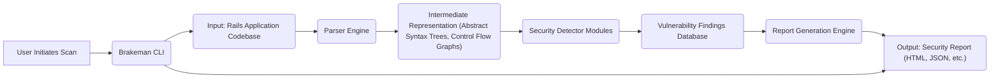

# Project Design Document: Brakeman - Static Analysis Security Scanner

**Version:** 1.1
**Date:** October 26, 2023
**Author:** Gemini (AI Language Model)

## 1. Project Overview

Brakeman is a static analysis security vulnerability scanner specifically designed for Ruby on Rails applications. It operates by examining the application's source code, configuration files, and related assets to identify potential security weaknesses without executing the code. The core objective of Brakeman is to empower developers to proactively discover and remediate security vulnerabilities early in the software development lifecycle, thereby reducing the risk of exploitation in production environments. This document details Brakeman's design to facilitate comprehensive threat modeling.

## 2. Goals

* To provide a detailed and accurate representation of Brakeman's architecture and operational flow.
* To clearly identify the key components within Brakeman and elucidate their interactions and responsibilities.
* To meticulously describe the data flow through the system, highlighting transformations and potential security implications.
* To outline the typical deployment models for Brakeman.
* To provide sufficient technical detail to enable thorough and effective threat modeling.

## 3. System Architecture

Brakeman functions as a command-line tool that accepts a file system path pointing to a Ruby on Rails application. Upon invocation, Brakeman initiates a multi-stage process: parsing the application's codebase and configuration, constructing an internal representation of the application's structure and logic, applying a suite of security checks (detectors) against this representation, and finally, generating a report summarizing the identified potential vulnerabilities.

## 4. Key Components

* **Brakeman CLI:** The primary interface through which users interact with Brakeman. It handles command-line argument parsing, configuration loading, and orchestrates the overall scanning process. It acts as the entry point and coordinator for all other components.
* **Input: Rails Application Codebase:** This encompasses the entirety of the target Ruby on Rails application's source code, including:
    * Ruby files (controllers, models, helpers, etc.)
    * ERB/HAML/Slim templates (views)
    * Configuration files (e.g., `routes.rb`, `database.yml`)
    * Gemfile and Gemfile.lock
    * JavaScript and CSS assets (for certain detectors)
* **Parser Engine:** This component is responsible for dissecting the various file types within the Rails application and converting them into structured, machine-readable formats. Key functionalities include:
    * **Ruby Code Parsing:** Utilizing libraries like `parser` to generate Abstract Syntax Trees (ASTs) representing the structure and logic of Ruby code.
    * **Template Parsing:** Processing ERB, HAML, and Slim templates to identify dynamic content and potential injection points.
    * **Configuration File Parsing:** Reading and interpreting configuration files to understand application settings and dependencies.
* **Intermediate Representation (Abstract Syntax Trees, Control Flow Graphs):** This is the internal data structure that Brakeman uses to represent the parsed application code. It provides a structured and normalized view of the application, making it easier for the security detectors to analyze. This representation may include:
    * **Abstract Syntax Trees (ASTs):** Hierarchical representations of the code's syntactic structure.
    * **Control Flow Graphs (CFGs):** Representations of the execution paths within the code.
    * **Call Graphs:**  Representations of function calls and relationships between different parts of the application.
* **Security Detector Modules:** This is a collection of independent, specialized modules, each designed to identify a specific category of security vulnerability. Each detector analyzes the intermediate representation for patterns and characteristics indicative of flaws. Examples include:
    * **SQL Injection Detector:** Analyzes database interactions for potentially unsafe user input usage.
    * **Cross-Site Scripting (XSS) Detector:** Examines view templates and controller logic for potential injection points for malicious scripts.
    * **Insecure Redirect Detector:** Identifies cases where user-controlled input is used in redirects, potentially leading to phishing attacks.
    * **Mass Assignment Detector:** Checks for vulnerabilities related to improperly protected model attributes.
    * **Command Injection Detector:** Looks for instances where user input is directly used in system commands.
    * **Unsafe Reflection Detector:** Identifies potentially dangerous uses of methods like `send` or `constantize`.
    * **Weak Cryptography Detector:**  Searches for the use of insecure cryptographic algorithms or practices.
    * **Authentication and Authorization Detectors:**  Examine code related to user authentication and authorization for potential bypasses or weaknesses.
* **Vulnerability Findings Database:** A temporary storage mechanism for the vulnerabilities identified by the Security Detector Modules. Each finding typically includes:
    * Vulnerability type
    * Location in the code (file and line number)
    * Confidence level
    * Short message describing the issue
    * Link to relevant security information
* **Report Generation Engine:** This component takes the vulnerability findings from the database and formats them into a user-friendly report. It supports various output formats, including:
    * HTML (for easy browsing)
    * JSON (for machine readability and integration with other tools)
    * CSV (for spreadsheet analysis)
    * Text-based formats
* **Configuration:** Allows users to customize Brakeman's behavior through command-line flags or a configuration file (e.g., `.brakeman.yml`). Configuration options include:
    * Selecting specific detectors to run or exclude.
    * Ignoring specific warnings or files.
    * Configuring output format and destination.
    * Setting thresholds for vulnerability confidence levels.

## 5. Data Flow

1. **User Initiates Scan:** The user executes the `brakeman` command in their terminal, providing the path to the target Rails application directory.
2. **CLI Processing and Configuration Loading:** The Brakeman CLI parses the command-line arguments and loads any configuration settings from a configuration file or environment variables.
3. **Codebase Input and Parsing:** The Parser Engine reads and parses the relevant files from the specified application directory. This involves:
    * Reading Ruby files and generating ASTs.
    * Reading template files (ERB, HAML, Slim) and identifying dynamic content.
    * Reading configuration files (e.g., `routes.rb`) to understand application structure and routing.
4. **Intermediate Representation Construction:** The Parser Engine constructs the internal representation of the application (ASTs, CFGs, etc.) based on the parsed code and configuration.
5. **Security Analysis by Detectors:** The Security Detector Modules iterate through the intermediate representation, applying their specific vulnerability detection logic. Each detector examines relevant parts of the representation for patterns matching known security weaknesses.
6. **Vulnerability Finding Generation:** When a Security Detector identifies a potential vulnerability, it creates a "finding" object containing detailed information about the issue and stores it in the Vulnerability Findings Database.
7. **Report Generation:** The Report Generation Engine retrieves the vulnerability findings from the database and formats them according to the user's specified output format (or the default format if none is specified).
8. **Output Generation:** Brakeman outputs the generated security report to the console, a specified file, or integrates with other tools based on the chosen output format.

## 6. Deployment Model

Brakeman is primarily deployed as a command-line tool. Typical deployment scenarios include:

* **Local Development Environment:** Developers install Brakeman on their development machines to perform ad-hoc security scans during the coding process.
* **Continuous Integration/Continuous Deployment (CI/CD) Pipelines:** Brakeman is frequently integrated into CI/CD pipelines to automatically scan the codebase for vulnerabilities with every commit, pull request, or build. This enables early detection and prevention of security issues before they reach production.
* **Security Audits:** Security teams or external auditors use Brakeman to perform comprehensive security assessments of Rails applications.
* **Git Hooks:** Brakeman can be configured as a pre-commit or pre-push hook to prevent developers from committing code with identified vulnerabilities.

## 7. Technologies Used

* **Ruby:** The core programming language in which Brakeman is developed.
* **Parser Gems (e.g., `parser`):**  Essential for parsing Ruby code into Abstract Syntax Trees.
* **Template Engines (ERB, HAML, Slim):** Brakeman needs to understand and parse these template languages.
* **File System Access Libraries:** Used for reading files from the target application's directory.
* **Output Formatting Libraries (e.g., for HTML or JSON generation):** Facilitate the creation of reports in various formats.
* **YAML/JSON Parsing Libraries:** For reading configuration files.

## 8. Security Considerations

This section outlines potential security considerations related to Brakeman itself:

* **Input Validation Vulnerabilities:**
    * **Maliciously Crafted Ruby Code:**  If the Parser Engine has vulnerabilities, specially crafted Ruby code in the target application could potentially exploit them, leading to arbitrary code execution within Brakeman.
    * **Exploiting Template Parsers:** Vulnerabilities in the template parsing logic could be exploited through malicious content in ERB, HAML, or Slim files.
    * **Path Traversal:**  Insufficient validation of the input application path could allow an attacker to access files outside the intended application directory.
* **Dependency Vulnerabilities:** Brakeman relies on various Ruby gems. Vulnerabilities in these dependencies could introduce security risks if not regularly updated.
* **Information Disclosure:**
    * **Report Contents:** Security reports contain sensitive information about potential vulnerabilities. Unauthorized access to these reports could expose weaknesses in the application.
    * **Error Messages:**  Verbose error messages could inadvertently reveal information about Brakeman's internal workings or the target application's structure.
* **Denial of Service (DoS):**
    * **Resource Exhaustion:** Processing extremely large or complex applications, or applications with deeply nested structures, could potentially exhaust Brakeman's resources (CPU, memory).
    * ** специально crafted input:**  Maliciously crafted code could be designed to cause the parser or detectors to enter infinite loops or consume excessive resources.
* **Code Injection (Internal):** Although less likely, vulnerabilities in Brakeman's core logic could theoretically allow for the injection and execution of arbitrary code within the Brakeman process.
* **Configuration Security:** If configuration files are used, their integrity is crucial. If an attacker can modify the configuration, they could potentially disable detectors or ignore critical vulnerabilities.
* **Output Security:** If Brakeman is integrated into automated systems, the security of the output destination (e.g., a CI/CD system's artifact storage) needs to be considered.

## 9. Assumptions and Constraints

* It is assumed that the user provides a valid file system path to a Ruby on Rails application.
* Brakeman's analysis is limited to static analysis; it does not execute the application code and therefore cannot detect runtime-specific vulnerabilities.
* The effectiveness of Brakeman depends on the quality and coverage of its Security Detector Modules. False positives and false negatives are possible.
* The performance of Brakeman can be affected by the size and complexity of the target application.
* Brakeman assumes a standard Rails application structure. Non-standard or heavily customized applications might not be fully analyzed.

This improved design document provides a more detailed and nuanced understanding of Brakeman's architecture and operation, which is essential for conducting a thorough and effective threat modeling exercise. The expanded descriptions of components, the refined data flow, and the more specific security considerations offer a solid foundation for identifying potential attack vectors and developing appropriate mitigation strategies.
