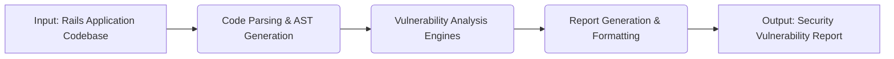
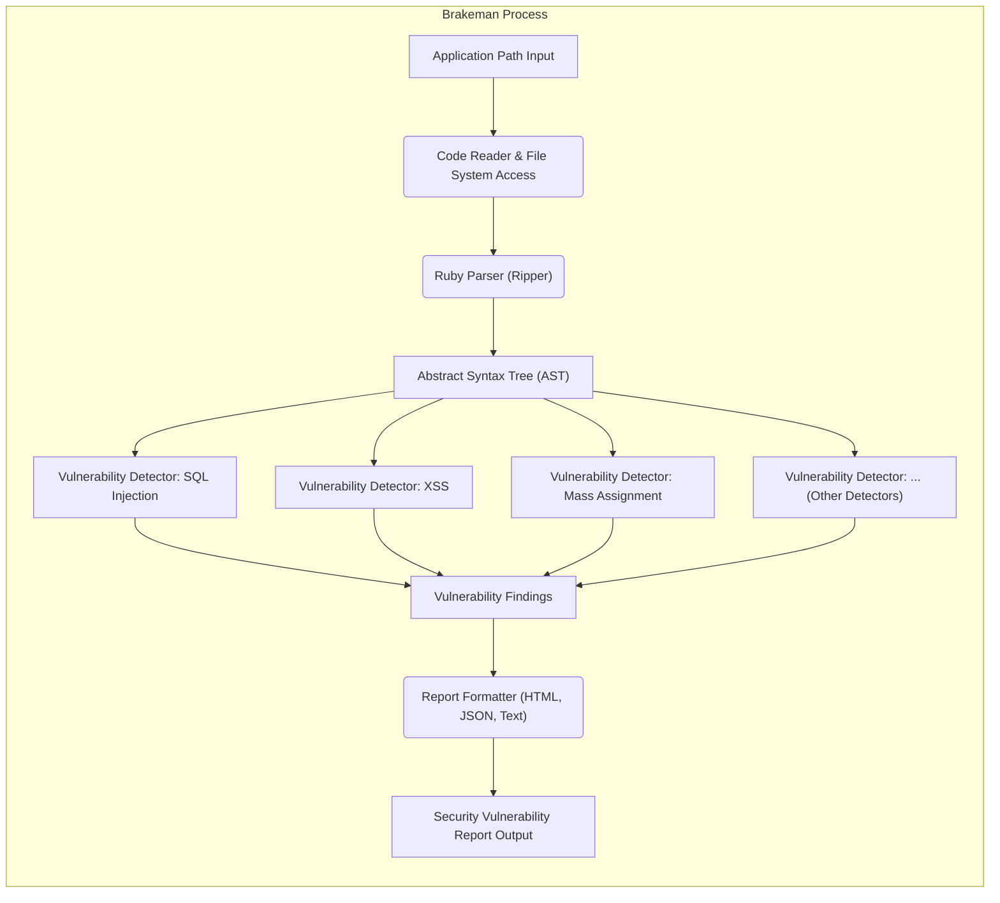

# Project Design Document: Brakeman Static Analysis Tool

**Version:** 1.1
**Date:** October 26, 2023
**Author:** AI Software Architect

## 1. Introduction

This document provides an enhanced and detailed design overview of Brakeman, a static analysis security scanner specifically designed for Ruby on Rails applications. The primary purpose of this document is to clearly articulate Brakeman's system architecture, internal components, and data flow. This detailed description will serve as a foundation for subsequent threat modeling activities, enabling a comprehensive assessment of potential security risks associated with the tool itself and its operation.

## 2. Goals and Objectives

The overarching goals for Brakeman's design are:

*   **Accurate Vulnerability Detection:** To reliably identify a wide range of common security vulnerabilities present in Ruby on Rails applications with a low false-positive rate.
*   **Actionable Reporting:** To provide developers with clear, concise, and actionable information about detected vulnerabilities, including their location in the code and suggested remediation strategies.
*   **Seamless Integration:** To facilitate easy integration into various development workflows, including local command-line usage, Continuous Integration/Continuous Deployment (CI/CD) pipelines, and potentially Git hooks.
*   **Maintainability and Extensibility:** To create a codebase that is well-structured, modular, and easy to maintain and extend with new vulnerability detectors and features.
*   **Performance Efficiency:** To perform static analysis efficiently without causing excessive delays in development workflows.

## 3. System Architecture

Brakeman operates as a command-line tool that takes the source code of a Ruby on Rails application as input and produces a security report as output. The high-level architecture can be visualized as a sequential process:

### 3.1. Detailed Architecture

The Brakeman system is composed of several interconnected components working in concert:

*   **Input Handling Module:**
    *   Responsible for receiving the path to the target Rails application, either as a command-line argument or through configuration.
    *   Handles the initial loading and validation of the application's directory structure.
*   **Code Parsing and Abstract Syntax Tree (AST) Generation Module:**
    *   Utilizes a Ruby parser library (typically `Ripper`, a standard library in Ruby) to parse the Ruby code files within the Rails application.
    *   Constructs an Abstract Syntax Tree (AST) representation of the parsed code. The AST provides a hierarchical and structured representation of the code's syntax, making it suitable for programmatic analysis.
*   **Vulnerability Analysis Engines:**
    *   This is the core of Brakeman, consisting of a collection of independent vulnerability detectors.
    *   Each detector is responsible for identifying a specific class or type of security vulnerability.
    *   Detectors analyze the AST, looking for specific patterns, code constructs, and data flow patterns that are indicative of potential security weaknesses. Examples include:
        *   SQL Injection Detector: Analyzes database interactions for unsanitized user input.
        *   Cross-Site Scripting (XSS) Detector: Identifies potential injection points in views and controllers.
        *   Mass Assignment Detector: Checks for vulnerabilities related to uncontrolled attribute assignment in models.
        *   Remote Code Execution (RCE) Detector: Looks for patterns that could lead to arbitrary code execution.
        *   File System Access Detector: Analyzes file system operations for potential vulnerabilities.
        *   Authentication and Authorization Detectors: Examines authentication and authorization logic for weaknesses.
*   **Report Generation and Formatting Module:**
    *   Gathers the findings (vulnerability warnings) generated by the vulnerability analysis engines.
    *   Formats these findings into a user-friendly and informative report.
    *   Supports various output formats, such as HTML, JSON, and text, to cater to different user needs and integration scenarios.
    *   Includes details like vulnerability description, severity level, code location (file and line number), and potential remediation advice.
*   **Configuration Management Module:**
    *   Allows users to customize Brakeman's behavior through configuration files or command-line options.
    *   Provides options to:
        *   Ignore specific warnings based on various criteria (e.g., warning code, file path).
        *   Adjust the severity thresholds for different vulnerability types.
        *   Potentially enable or disable specific vulnerability detectors.
*   **Dependency Analysis Module (Optional):**
    *   Can optionally analyze the application's dependencies (gems) declared in the `Gemfile` or `Gemfile.lock`.
    *   May integrate with external vulnerability databases or APIs (e.g., the Ruby Advisory Database) to identify known vulnerabilities in the application's dependencies.

## 4. Data Flow

The flow of data through the Brakeman system can be visualized as follows:

**Detailed Data Flow Steps:**

1. The user provides the path to the target Rails application as input to the Brakeman command-line tool.
2. The **Code Reader & File System Access** module reads the Ruby source code files from the specified application directory. This involves interacting with the operating system's file system.
3. The **Ruby Parser (Ripper)** module parses the raw Ruby code from the files and generates an **Abstract Syntax Tree (AST)**. The AST represents the code's structure in a tree-like format.
4. The generated **AST** is then passed as input to multiple independent **Vulnerability Detector** modules. Each detector focuses on identifying specific types of vulnerabilities.
5. Each **Vulnerability Detector** analyzes the **AST** for patterns and code constructs that match known vulnerability signatures.
6. When a vulnerability is detected, the corresponding **Vulnerability Detector** creates **Vulnerability Findings**. These findings typically include:
    *   A unique identifier for the vulnerability type.
    *   A descriptive message explaining the vulnerability.
    *   The file path and line number where the vulnerability was found.
    *   A severity level indicating the potential impact of the vulnerability.
    *   Optional metadata or context related to the vulnerability.
7. All **Vulnerability Findings** from the various detectors are collected.
8. The **Report Formatter** module takes the collected **Vulnerability Findings** and formats them into a structured **Security Vulnerability Report**. The format can be HTML for easy viewing in a browser, JSON for machine parsing, or plain text for simple output.
9. The formatted **Security Vulnerability Report** is then presented to the user, typically printed to the console or saved to a file.

## 5. Key Components and their Interactions

*   **Code Reader & File System Access:** Reads Ruby files from the file system. Interacts directly with the operating system's file system API. Passes the raw file content to the Ruby Parser.
*   **Ruby Parser (Ripper):** Takes raw Ruby code as input (strings) and outputs an Abstract Syntax Tree (AST) data structure. This is a core dependency on the Ruby standard library.
*   **Abstract Syntax Tree (AST):** An in-memory data structure representing the parsed code. Serves as the primary data source for the vulnerability detectors.
*   **Vulnerability Detectors (e.g., SQL Injection, XSS):** Independent modules that receive the AST as input. Each detector implements specific logic to traverse and analyze the AST, looking for patterns indicative of vulnerabilities. They output structured vulnerability findings.
*   **Report Formatter:** Receives a collection of vulnerability findings as input. Transforms these findings into a formatted report (HTML, JSON, text). Interacts with string manipulation and file writing functionalities.
*   **Configuration Manager:** Reads configuration settings from files or command-line arguments. Provides these settings to other components, particularly the vulnerability detectors, to customize their behavior (e.g., enabling/disabling checks, setting severity thresholds).
*   **Dependency Analysis Module (Optional):** Reads the `Gemfile` and `Gemfile.lock` files. May interact with external APIs or databases to retrieve vulnerability information for the listed dependencies. Outputs findings related to dependency vulnerabilities.

## 6. Security Considerations (for Threat Modeling)

When considering Brakeman for threat modeling, it's crucial to analyze potential vulnerabilities within Brakeman itself:

*   **Input Validation Vulnerabilities:**
    *   **Maliciously Crafted Application Code:** Brakeman's parser could be vulnerable to specially crafted Ruby code designed to exploit weaknesses in the parsing logic, potentially leading to crashes, unexpected behavior, or even code execution within the Brakeman process.
    *   **Exploiting Parser Bugs:**  Bugs in the underlying Ruby parser (`Ripper`) could be indirectly exploitable through Brakeman.
    *   **Malicious Configuration Files:** If Brakeman relies on configuration files, these files could be maliciously crafted to alter Brakeman's behavior in unintended ways or introduce malicious code if the configuration parsing is not secure.
*   **Output Handling Vulnerabilities:**
    *   **Report Injection (Cross-Site Scripting in Reports):** If vulnerability data (especially user-controlled data from the analyzed application) is not properly sanitized before being included in generated reports (particularly HTML reports), it could lead to Cross-Site Scripting (XSS) vulnerabilities when the report is viewed in a web browser.
    *   **Sensitive Information Disclosure in Reports:** Reports might inadvertently include sensitive information extracted from the analyzed application's code or configuration that should not be exposed.
*   **Dependency Vulnerabilities:**
    *   **Vulnerable Gems:** Brakeman relies on various Ruby gems. Vulnerabilities in these dependencies could potentially be exploited to compromise Brakeman's functionality or the system where it's running. This includes both direct and transitive dependencies.
*   **Code Execution Risks:**
    *   While primarily a static analysis tool, certain features or custom detectors might involve limited code execution or the use of `eval()`-like constructs. If not carefully implemented, this could introduce Remote Code Execution (RCE) vulnerabilities within Brakeman itself.
*   **Resource Exhaustion:**
    *   Processing extremely large or complex applications with deeply nested code structures could potentially lead to excessive resource consumption (CPU, memory), causing denial-of-service or performance issues for the Brakeman process.
*   **Integrity of Analysis Results:**
    *   Attackers might attempt to obfuscate code within the target application in ways that specifically evade Brakeman's detection mechanisms, leading to false negatives.
*   **Access Control and Privilege Escalation:**
    *   In scenarios where Brakeman is run in shared environments or as part of automated pipelines, improper access controls or insufficient privilege separation could lead to unauthorized access or privilege escalation.

## 7. Deployment

Brakeman is commonly deployed and utilized in several ways:

*   **Local Command-Line Execution:** Developers directly execute the `brakeman` command from their terminal against the codebase of a local Rails application. This is the most common usage scenario for individual developers.
*   **Continuous Integration/Continuous Deployment (CI/CD) Pipelines:** Brakeman is integrated as a step within CI/CD pipelines (e.g., GitHub Actions, GitLab CI, Jenkins). This allows for automated security scans to be performed whenever code changes are pushed or merged, providing early feedback on potential vulnerabilities.
*   **Git Hooks (Pre-commit/Pre-push):** Brakeman can be configured as a Git hook to automatically run security scans before code is committed or pushed to a remote repository. This helps prevent the introduction of vulnerable code into the codebase.
*   **Containerized Environments (Docker):** Brakeman can be run within Docker containers, providing a consistent and isolated environment for analysis. This is particularly useful for CI/CD pipelines and ensuring consistent results across different environments.

## 8. Future Considerations

Potential areas for future development and improvement include:

*   **Enhanced Vulnerability Detection:** Continuously expanding the set of vulnerability detectors to cover new attack vectors, emerging threats, and specific framework features. This includes improving the accuracy and reducing false positives/negatives.
*   **Improved Reporting and Remediation Guidance:** Providing more detailed and context-aware information in reports, including potential impact assessments, step-by-step remediation instructions, and links to relevant security resources.
*   **Integration with Integrated Development Environments (IDEs):** Developing plugins or extensions for popular IDEs to provide real-time security feedback to developers as they write code.
*   **Support for Additional Frameworks and Languages:** Expanding Brakeman's capabilities to support other web frameworks beyond Ruby on Rails or potentially other programming languages.
*   **Machine Learning Integration:** Exploring the use of machine learning techniques to improve the accuracy of vulnerability detection, identify more complex patterns, and potentially prioritize findings based on risk.
*   **Interactive Analysis and Exploration:** Developing features that allow users to interactively explore the analysis results, understand the data flow related to vulnerabilities, and potentially perform manual code review guided by Brakeman's findings.

This enhanced design document provides a more in-depth understanding of Brakeman's architecture and functionality, serving as a valuable resource for comprehensive threat modeling and future development efforts.