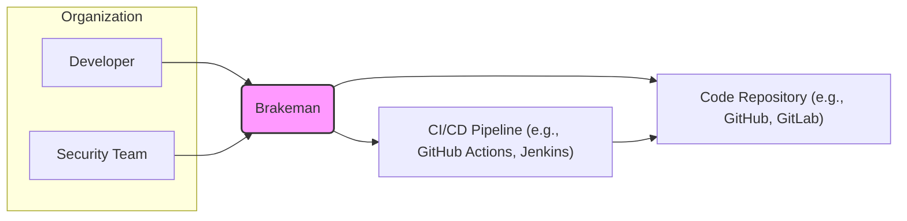
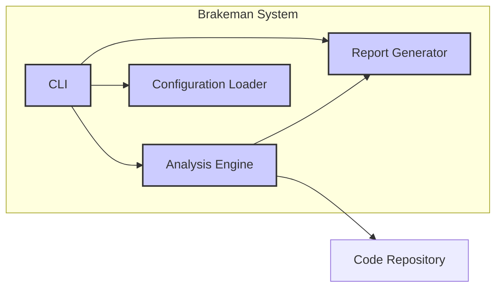
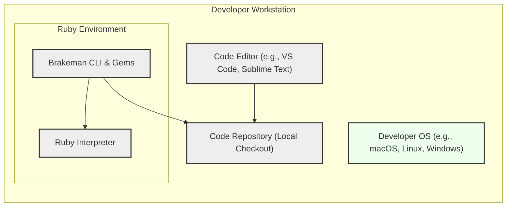

# BUSINESS POSTURE

- Business Priorities and Goals:
  - Goal: Improve the security of Ruby on Rails applications by identifying potential vulnerabilities early in the development lifecycle.
  - Priority: Provide a reliable, accurate, and easy-to-use static analysis tool that helps developers and security teams proactively address security issues.
  - Goal: Reduce the risk of security breaches and vulnerabilities in production Rails applications.
  - Priority: Minimize false positives and false negatives to ensure developers trust and effectively use the tool.
  - Goal: Integrate seamlessly into existing development workflows and CI/CD pipelines.
  - Priority: Support various configuration options and reporting formats to accommodate different project needs and environments.

- Business Risks:
  - Risk: False positives can lead to wasted developer time investigating non-issues, reducing productivity and trust in the tool.
  - Risk: False negatives can result in undetected vulnerabilities reaching production, leading to potential security breaches and reputational damage.
  - Risk: Lack of adoption by developers due to complexity, poor documentation, or integration challenges can limit the tool's effectiveness.
  - Risk: Vulnerabilities in Brakeman itself could be exploited, although less likely for a static analysis tool, it's still a consideration in supply chain security.
  - Risk: Outdated vulnerability signatures or analysis techniques can reduce the tool's effectiveness over time.

# SECURITY POSTURE

- Existing Security Controls:
  - security control: Code review process for contributions to the Brakeman project (GitHub pull requests). Implemented in: GitHub repository contribution guidelines and workflow.
  - security control: Static analysis of Brakeman's own code using standard Ruby linters and security scanners. Implemented in: Development and CI processes (likely, though not explicitly stated in input).
  - security control: Open source nature of the project allows for community review and scrutiny. Implemented in: Project's open GitHub repository.
  - security control: Dependency management using Bundler to manage and potentially audit dependencies. Implemented in: `Gemfile` and Bundler usage in Ruby projects.
  - security control: Regular updates to vulnerability signatures and analysis rules. Implemented in: Ongoing development and releases of Brakeman.

- Accepted Risks:
  - accepted risk: Potential for false positives and false negatives in vulnerability detection, inherent to static analysis tools.
  - accepted risk: Reliance on community contributions for vulnerability signatures and rule updates, which might have delays or gaps.
  - accepted risk: Exposure of Brakeman's source code as an open source project, potentially revealing analysis techniques to attackers (though this is generally considered a benefit for security transparency).

- Recommended Security Controls:
  - security control: Implement automated security scanning of Brakeman's code in CI/CD pipeline, including SAST and dependency vulnerability scanning.
  - security control: Formalize a process for regular review and update of vulnerability signatures and analysis rules, potentially with dedicated security researchers or community contributions.
  - security control: Provide clear documentation and guidelines for users on how to interpret and remediate findings, including best practices for secure Rails development.
  - security control: Implement input validation and sanitization within Brakeman itself to prevent potential vulnerabilities if Brakeman processes untrusted input (e.g., configuration files, project code).
  - security control: Consider signing releases to ensure integrity and prevent tampering during distribution.

- Security Requirements:
  - Authentication: Not directly applicable to Brakeman as a static analysis tool. Brakeman itself does not authenticate users. Authentication is relevant to the systems where Brakeman is used (e.g., CI/CD pipelines, developer workstations).
  - Authorization: Not directly applicable to Brakeman itself. Authorization is relevant to the systems where Brakeman is used. Access control to the code repository being scanned and the Brakeman tool itself is managed by the underlying systems.
  - Input Validation: Brakeman needs robust input validation to handle potentially malicious or malformed code and configuration files without crashing or being exploited. This is crucial for the security of Brakeman itself.
  - Cryptography: Cryptography is not a primary security requirement for Brakeman's core functionality. However, if Brakeman were to handle sensitive data (which it ideally should not), or if secure communication were needed (e.g., for reporting), cryptography would become relevant. For now, it's less critical but should be considered for future features (e.g., secure reporting mechanisms).

# DESIGN

## C4 CONTEXT

- Context Diagram Elements:
  - - Name: Developer
    - Type: Person
    - Description: Software developers who write and maintain Ruby on Rails applications.
    - Responsibilities: Develop and maintain Rails applications, review Brakeman findings, and remediate identified vulnerabilities.
    - Security controls: Local workstation security controls, code repository access controls (authentication and authorization).
  - - Name: Security Team
    - Type: Person
    - Description: Security professionals responsible for ensuring the security of applications.
    - Responsibilities: Review Brakeman findings, define security policies, and oversee vulnerability remediation efforts.
    - Security controls: Access control to security reports and dashboards, security awareness training.
  - - Name: Brakeman
    - Type: Software System
    - Description: Static analysis security vulnerability scanner for Ruby on Rails applications.
    - Responsibilities: Analyze Ruby on Rails code, identify potential security vulnerabilities, and generate reports.
    - Security controls: Input validation, secure coding practices in Brakeman development, dependency management, build process security.
  - - Name: Code Repository (e.g., GitHub, GitLab)
    - Type: Software System
    - Description: Version control system where the Ruby on Rails application code is stored and managed.
    - Responsibilities: Store and manage application code, provide access control, track code changes.
    - Security controls: Authentication, authorization, access control lists, audit logging, encryption at rest and in transit.
  - - Name: CI/CD Pipeline (e.g., GitHub Actions, Jenkins)
    - Type: Software System
    - Description: Automated system for building, testing, and deploying applications.
    - Responsibilities: Automate the build, test, and deployment process, integrate security checks like Brakeman, and manage deployment environments.
    - Security controls: Authentication, authorization, secure pipeline configuration, secret management, access control to pipeline configurations and logs.

## C4 CONTAINER

- Container Diagram Elements:
  - - Name: CLI
    - Type: Container - Command-Line Interface Application
    - Description: Provides a command-line interface for users to interact with Brakeman, configure scans, and view results. Written in Ruby.
    - Responsibilities: Accept user commands, parse arguments, invoke analysis engine, and display reports.
    - Security controls: Input validation of command-line arguments, secure handling of configuration files, output sanitization for reports.
  - - Name: Analysis Engine
    - Type: Container - Ruby Application (Core Logic)
    - Description: The core component of Brakeman responsible for parsing Ruby on Rails code, applying vulnerability detection rules, and identifying potential security issues. Written in Ruby.
    - Responsibilities: Code parsing, vulnerability analysis, rule execution, and generation of findings.
    - Security controls: Secure coding practices, input validation of code being analyzed, protection against code injection vulnerabilities within the analysis engine itself, dependency vulnerability scanning.
  - - Name: Report Generator
    - Type: Container - Ruby Application (Reporting)
    - Description: Generates reports in various formats (e.g., HTML, JSON, CSV) based on the findings from the analysis engine. Written in Ruby.
    - Responsibilities: Format and output analysis results into user-friendly reports.
    - Security controls: Output sanitization to prevent injection vulnerabilities in reports, secure handling of report data.
  - - Name: Configuration Loader
    - Type: Container - Ruby Application (Configuration)
    - Description: Loads and parses configuration files (e.g., brakeman.yml) to customize Brakeman's behavior and analysis rules. Written in Ruby.
    - Responsibilities: Load and parse configuration files, validate configuration parameters.
    - Security controls: Input validation of configuration files, secure parsing of YAML or other configuration formats, preventing arbitrary code execution through configuration.

## DEPLOYMENT

Deployment Scenario: Developer Local Workstation

- Deployment Diagram Elements (Developer Workstation):
  - - Name: Developer OS (e.g., macOS, Linux, Windows)
    - Type: Infrastructure - Operating System
    - Description: The operating system running on the developer's local machine.
    - Responsibilities: Provide the underlying environment for running Ruby and Brakeman.
    - Security controls: Operating system security controls (firewall, antivirus, patching, user access control), disk encryption.
  - - Name: Ruby Interpreter
    - Type: Software - Runtime Environment
    - Description: The Ruby interpreter required to execute Brakeman, typically installed using a Ruby version manager (e.g., rvm, rbenv).
    - Responsibilities: Execute Ruby code, including Brakeman.
    - Security controls: Keeping Ruby interpreter updated with security patches, using trusted Ruby version managers.
  - - Name: Brakeman CLI & Gems
    - Type: Software - Application
    - Description: Brakeman application and its dependencies installed as Ruby gems.
    - Responsibilities: Perform static analysis of Rails applications.
    - Security controls: Installing Brakeman and gems from trusted sources (e.g., rubygems.org), verifying gem integrity (if possible), keeping Brakeman and gems updated.
  - - Name: Code Editor (e.g., VS Code, Sublime Text)
    - Type: Software - Development Tool
    - Description: Code editor used by developers to write and edit Ruby on Rails code.
    - Responsibilities: Code editing, integration with development tools (including Brakeman via CLI).
    - Security controls: Code editor security features (plugin security, update mechanisms), secure configuration of editor.
  - - Name: Code Repository (Local Checkout)
    - Type: Data - File System
    - Description: Local copy of the Ruby on Rails application code checked out from a remote repository.
    - Responsibilities: Store application code locally for development and analysis.
    - Security controls: File system permissions, access control to the local file system, potentially disk encryption.

## BUILD

```mermaid
flowchart LR
    A["Developer"] --> B("Code Commit & Push")
    B --> C["GitHub Repository"]
    C --> D["GitHub Actions Workflow (CI)"]
    D --> E["Build & Test"]
    E --> F["Security Scans (e.g., Brakeman on Brakeman's code, Dependency Check)"]
    F --> G["Artifacts (e.g., Gem Package)"]
    G --> H["rubygems.org (Publish)"]

    style C fill:#ccf,stroke:#333,stroke-width:2px
    style D fill:#ccf,stroke:#333,stroke-width:2px
    style E fill:#ccf,stroke:#333,stroke-width:2px
    style F fill:#ccf,stroke:#333,stroke-width:2px
    style G fill:#ccf,stroke:#333,stroke-width:2px
```

- Build Process Elements:
  - - Name: Developer
    - Type: Person
    - Description: Developer contributing to the Brakeman project.
    - Responsibilities: Write code, commit changes, and push to the repository.
    - Security controls: Developer workstation security, code review process.
  - - Name: Code Commit & Push
    - Type: Process
    - Description: Developer commits code changes and pushes them to the remote repository.
    - Responsibilities: Version control and code contribution.
    - Security controls: Authenticated access to the repository, commit signing (optional).
  - - Name: GitHub Repository
    - Type: Software System - Version Control
    - Description: GitHub repository hosting the Brakeman project source code.
    - Responsibilities: Store and manage source code, trigger CI workflows.
    - Security controls: Access control, branch protection, audit logging, vulnerability scanning of repository infrastructure.
  - - Name: GitHub Actions Workflow (CI)
    - Type: Software System - CI/CD
    - Description: Automated CI workflow defined in GitHub Actions to build, test, and publish Brakeman.
    - Responsibilities: Automate build, test, security scans, and publishing processes.
    - Security controls: Secure workflow definition, secret management, access control to workflow configurations and logs, isolation of build environments.
  - - Name: Build & Test
    - Type: Process
    - Description: Compilation, packaging, and running automated tests for Brakeman.
    - Responsibilities: Create build artifacts and ensure code quality through testing.
    - Security controls: Build environment security, dependency management, secure build scripts.
  - - Name: Security Scans (e.g., Brakeman on Brakeman's code, Dependency Check)
    - Type: Process
    - Description: Automated security scans performed during the build process, including scanning Brakeman's own code and dependencies for vulnerabilities.
    - Responsibilities: Identify security vulnerabilities in Brakeman and its dependencies before release.
    - Security controls: SAST tools, dependency vulnerability scanners, configuration of security scans, reporting and remediation process for findings.
  - - Name: Artifacts (e.g., Gem Package)
    - Type: Data - Build Output
    - Description: Build artifacts, such as the packaged Ruby gem for Brakeman.
    - Responsibilities: Package and store build outputs for distribution.
    - Security controls: Integrity checks (e.g., checksums, signatures) for artifacts, secure storage of artifacts.
  - - Name: rubygems.org (Publish)
    - Type: Software System - Package Registry
    - Description: RubyGems.org, the public registry for Ruby gems, where Brakeman is published.
    - Responsibilities: Host and distribute Brakeman gem package.
    - Security controls: Account security for publishing gems, integrity checks on published gems, vulnerability scanning of rubygems.org platform.

# RISK ASSESSMENT

- Critical Business Processes:
  - Protecting the security of Ruby on Rails applications developed by users of Brakeman.
  - Maintaining the reputation and trust in Brakeman as a reliable security tool.
  - Ensuring the integrity and availability of Brakeman as an open-source project.

- Data to Protect and Sensitivity:
  - Source code of Ruby on Rails applications being analyzed by Brakeman. Sensitivity: High to Confidential, as source code often contains business logic, sensitive data access patterns, and potential vulnerabilities. Exposure could lead to security breaches or intellectual property theft.
  - Brakeman's own source code. Sensitivity: Medium to Confidential, as vulnerabilities in Brakeman could undermine its effectiveness and potentially be exploited.
  - Brakeman's vulnerability signatures and analysis rules. Sensitivity: Medium to Confidential, as these represent the core intelligence of the tool. Public disclosure of very specific, unpatched vulnerability detection logic could be misused.
  - Security findings and reports generated by Brakeman. Sensitivity: Medium to Confidential, as these reports contain information about potential vulnerabilities in applications. Access should be controlled to prevent unauthorized disclosure.

# QUESTIONS & ASSUMPTIONS

- Questions:
  - What is the intended deployment environment for Brakeman? (Local developer machines, CI/CD pipelines, security team infrastructure?) - *Assumption made: Primarily developer workstations and CI/CD pipelines.*
  - What are the specific reporting formats required? (HTML, JSON, SARIF, etc.) - *Assumption made: Common formats like HTML and JSON are sufficient.*
  - Are there any specific compliance requirements that Brakeman needs to adhere to? (e.g., OWASP, PCI DSS, HIPAA) - *Assumption made: General security best practices are the primary focus, rather than specific compliance mandates.*
  - What is the process for updating vulnerability signatures and analysis rules? - *Assumption made: Community contributions and maintainer updates are the primary mechanisms.*
  - Is there a formal security incident response plan for Brakeman itself? - *Assumption made: Standard open-source project security practices apply, relying on GitHub security features and community reporting.*

- Assumptions:
  - BUSINESS POSTURE: The primary business goal is to improve the security of Ruby on Rails applications and reduce security risks for organizations using Rails.
  - SECURITY POSTURE: Brakeman follows standard secure software development practices for open-source projects, with a focus on code review, dependency management, and community contributions.
  - DESIGN: Brakeman is designed as a command-line tool that can be easily integrated into developer workflows and CI/CD pipelines. The architecture is relatively simple, focused on static analysis and reporting.
  - DEPLOYMENT: The primary deployment scenarios are developer workstations for local analysis and CI/CD pipelines for automated security checks.
  - BUILD: Brakeman uses a standard open-source build process, likely leveraging GitHub Actions for CI/CD and RubyGems for distribution.