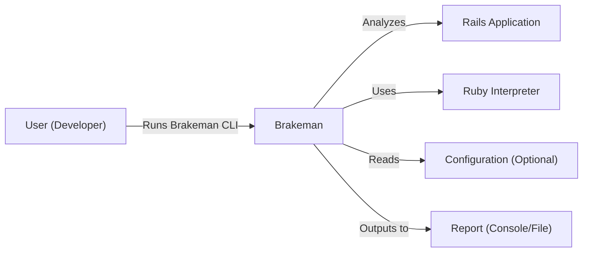
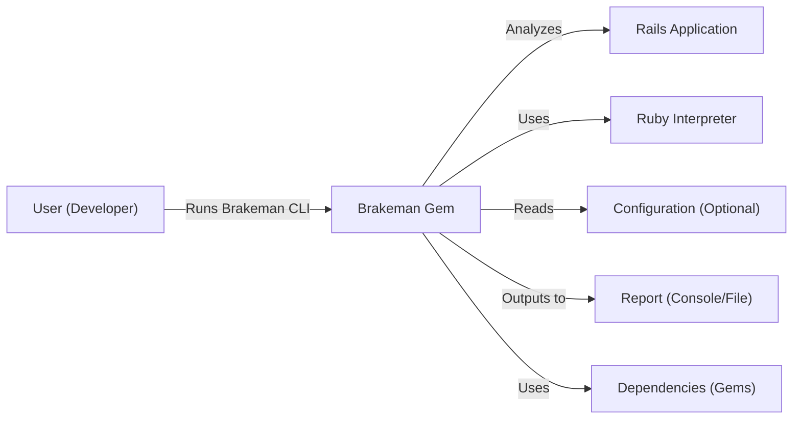
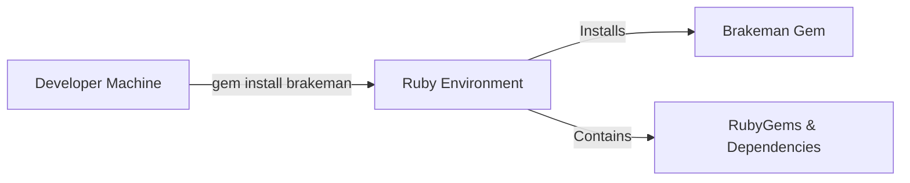
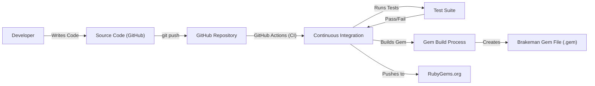

# BUSINESS POSTURE

Business Priorities and Goals:

*   Provide a free, open-source static analysis tool for Ruby on Rails applications.
*   Help developers identify potential security vulnerabilities early in the development lifecycle.
*   Improve the overall security posture of Ruby on Rails applications.
*   Maintain a low barrier to entry for users (easy to install and use).
*   Provide fast and accurate scan results.
*   Maintain a comprehensive and up-to-date set of security checks.
*   Foster a community around the project, encouraging contributions and feedback.

Business Risks:

*   Reputational Risk: If Brakeman produces inaccurate results (false positives or false negatives), it could damage the reputation of the tool and its maintainers.
*   Liability Risk: While Brakeman is provided "as is," there could be potential legal risks if a vulnerability is missed and exploited, leading to damages. This is mitigated by the open-source nature and disclaimers, but the risk is not zero.
*   Maintenance Risk: The project relies on ongoing maintenance and updates to keep up with changes in the Rails framework and emerging security threats. If maintenance ceases, the tool's effectiveness will diminish.
*   Competition Risk: Other static analysis tools (free or commercial) could emerge and offer superior features or performance, reducing Brakeman's user base.
*   Adoption Risk: Developers may not adopt the tool due to lack of awareness, perceived complexity, or integration challenges with existing workflows.

# SECURITY POSTURE

Existing Security Controls:

*   security control: Static Analysis: Brakeman itself is a static analysis tool, designed to identify security vulnerabilities in code. (Implemented in the core logic of the Brakeman gem).
*   security control: Open Source: The project's open-source nature allows for community review and contributions, potentially leading to faster identification and resolution of vulnerabilities within Brakeman itself. (Described in the GitHub repository).
*   security control: Test Suite: Brakeman includes a test suite to ensure the accuracy and reliability of its checks. (Implemented in the `test/` directory of the repository).
*   security control: Regular Updates: The project maintainers regularly update Brakeman to address new vulnerabilities and Rails updates. (Described in the release history and commit logs).
*   security control: Secure Development Practices: While not explicitly documented, it can be assumed that the maintainers follow secure development practices to minimize vulnerabilities in Brakeman itself.

Accepted Risks:

*   accepted risk: False Positives: Brakeman, like any static analysis tool, may produce false positives (reporting a vulnerability where none exists).
*   accepted risk: False Negatives: Brakeman may not detect all possible vulnerabilities in a Rails application.
*   accepted risk: Limited Scope: Brakeman focuses on security vulnerabilities; it does not address all aspects of application security (e.g., infrastructure security, network security).
*   accepted risk: Dependency Vulnerabilities: Brakeman relies on third-party libraries, which may themselves contain vulnerabilities.

Recommended Security Controls:

*   security control: Dependency Scanning: Integrate a dependency scanning tool (e.g., bundler-audit) to identify known vulnerabilities in Brakeman's dependencies.
*   security control: Code Coverage Analysis: Measure and improve the code coverage of the test suite to ensure that all critical code paths are tested.
*   security control: Fuzz Testing: Implement fuzz testing to identify unexpected behavior and potential vulnerabilities in Brakeman's parsing and analysis logic.
*   security control: Security Documentation: Create dedicated security documentation outlining secure development practices followed for Brakeman, reporting procedures for vulnerabilities found in Brakeman, and guidance for users on interpreting and addressing Brakeman's findings.

Security Requirements:

*   Authentication: Not directly applicable to Brakeman itself, as it's a command-line tool. However, if Brakeman were to be integrated into a web service or CI/CD pipeline, authentication would be required for access control.
*   Authorization: Not directly applicable to Brakeman itself. Similar to authentication, if integrated into a larger system, authorization would be needed to control access to features and data.
*   Input Validation: Brakeman must properly handle various forms of input (Ruby code, configuration files) to prevent vulnerabilities like code injection or denial-of-service. This is crucial for the security of Brakeman itself.
*   Cryptography: Not directly applicable to Brakeman's core functionality. However, if Brakeman were to handle sensitive data (e.g., API keys, credentials), secure storage and transmission using appropriate cryptographic techniques would be required.

# DESIGN

## C4 CONTEXT

Element Descriptions:

*   Element:
    *   Name: User (Developer)
    *   Type: Person
    *   Description: A software developer who uses Brakeman to analyze their Rails application.
    *   Responsibilities: Runs Brakeman, reviews the report, and fixes identified vulnerabilities.
    *   Security controls: N/A - This is the user of the system.

*   Element:
    *   Name: Brakeman
    *   Type: Software System
    *   Description: A static analysis security scanner for Ruby on Rails applications.
    *   Responsibilities: Analyzes Ruby code, identifies potential security vulnerabilities, and generates reports.
    *   Security controls: Static Analysis, Test Suite, Regular Updates.

*   Element:
    *   Name: Rails Application
    *   Type: Software System
    *   Description: The Ruby on Rails application being analyzed by Brakeman.
    *   Responsibilities: The target of the analysis. It is not actively involved in the Brakeman process.
    *   Security controls: N/A - This is the system being analyzed.

*   Element:
    *   Name: Ruby Interpreter
    *   Type: Software System
    *   Description: The Ruby interpreter used to execute Brakeman and the Rails application.
    *   Responsibilities: Executes Ruby code.
    *   Security controls: Relies on the security of the installed Ruby version.

*   Element:
    *   Name: Configuration (Optional)
    *   Type: Data
    *   Description: Optional configuration files that can customize Brakeman's behavior.
    *   Responsibilities: Provides settings to control Brakeman's analysis.
    *   Security controls: Input Validation (Brakeman must handle configuration files securely).

*   Element:
    *   Name: Report (Console/File)
    *   Type: Data
    *   Description: The output of Brakeman's analysis, containing a list of identified vulnerabilities.
    *   Responsibilities: Presents the findings to the user.
    *   Security controls: N/A - This is the output of the system.

## C4 CONTAINER

Since Brakeman is a relatively simple command-line tool, the Container diagram is very similar to the Context diagram. The main "container" is the Brakeman gem itself.

Element Descriptions:

*   Element:
    *   Name: User (Developer)
    *   Type: Person
    *   Description: A software developer.
    *   Responsibilities: Runs Brakeman, reviews reports, fixes vulnerabilities.
    *   Security controls: N/A

*   Element:
    *   Name: Brakeman Gem
    *   Type: Container (Ruby Gem)
    *   Description: The packaged Brakeman application.
    *   Responsibilities: Parses Ruby code, performs security analysis, generates reports.
    *   Security controls: Static Analysis, Test Suite, Regular Updates.

*   Element:
    *   Name: Rails Application
    *   Type: Software System
    *   Description: The Ruby on Rails application being analyzed.
    *   Responsibilities: The target of the analysis.
    *   Security controls: N/A

*   Element:
    *   Name: Ruby Interpreter
    *   Type: Software System
    *   Description: The Ruby interpreter.
    *   Responsibilities: Executes Ruby code.
    *   Security controls: Relies on the security of the installed Ruby version.

*   Element:
    *   Name: Configuration (Optional)
    *   Type: Data
    *   Description: Optional configuration files.
    *   Responsibilities: Provides settings to control Brakeman.
    *   Security controls: Input Validation.

*   Element:
    *   Name: Report (Console/File)
    *   Type: Data
    *   Description: The output of the analysis.
    *   Responsibilities: Presents findings to the user.
    *   Security controls: N/A

*   Element:
    *   Name: Dependencies (Gems)
    *   Type: Container (Ruby Gems)
    *   Description: Third-party libraries used by Brakeman.
    *   Responsibilities: Provide supporting functionality.
    *   Security controls: Dependency Scanning (recommended).

## DEPLOYMENT

Brakeman is typically deployed as a Ruby gem, installed locally on a developer's machine or within a CI/CD environment.

Possible Deployment Solutions:

1.  Local Installation: `gem install brakeman`
2.  Bundler Integration: Add `gem 'brakeman'` to the Gemfile and run `bundle install`.
3.  Docker Container: A Docker image could be created to provide a consistent and isolated environment for running Brakeman.
4.  CI/CD Integration: Brakeman can be integrated into CI/CD pipelines (e.g., GitHub Actions, Jenkins, CircleCI) to automatically scan code on every commit or pull request.

Chosen Deployment Solution (Local Installation):

Element Descriptions:

*   Element:
    *   Name: Developer Machine
    *   Type: Infrastructure Node
    *   Description: The developer's local workstation.
    *   Responsibilities: Hosts the Ruby environment and Brakeman.
    *   Security controls: Relies on the security of the developer's machine.

*   Element:
    *   Name: Ruby Environment
    *   Type: Software System
    *   Description: The Ruby installation and associated tools (e.g., RubyGems).
    *   Responsibilities: Manages Ruby gems and dependencies.
    *   Security controls: Relies on the security of the installed Ruby version and RubyGems.

*   Element:
    *   Name: Brakeman Gem
    *   Type: Container (Ruby Gem)
    *   Description: The installed Brakeman gem.
    *   Responsibilities: Provides the Brakeman functionality.
    *   Security controls: Static Analysis, Test Suite, Regular Updates.

*   Element:
    *   Name: RubyGems & Dependencies
    *   Type: Container
    *   Description: RubyGems and all dependencies installed.
    *   Responsibilities: Provides the Brakeman functionality.
    *   Security controls: Dependency Scanning (recommended).

## BUILD

Brakeman's build process involves packaging the Ruby code into a gem and publishing it to RubyGems.org.

Build Process Description:

1.  Developers write and commit code to the GitHub repository.
2.  A `git push` triggers the GitHub Actions CI workflow.
3.  The CI workflow runs the test suite.
4.  If the tests pass, the gem build process is initiated.
5.  The gem build process packages the code into a `.gem` file.
6.  The CI workflow pushes the `.gem` file to RubyGems.org, making it available for installation.

Security Controls in Build Process:

*   security control: Version Control (GitHub): The use of Git and GitHub provides version control, allowing for tracking changes and reverting to previous versions if necessary.
*   security control: Continuous Integration (GitHub Actions): Automates the build and testing process, ensuring that tests are run consistently.
*   security control: Test Suite: The test suite helps to ensure the quality and security of the code.
*   security control: Authenticated Gem Push: Pushing to RubyGems.org requires authentication, preventing unauthorized releases.
*   security control: (Recommended) Dependency Scanning: Integrate a dependency scanning tool into the CI workflow to identify vulnerabilities in dependencies.
*   security control: (Recommended) Code Signing: Sign the gem file to ensure its integrity and authenticity.

# RISK ASSESSMENT

Critical Business Processes:

*   Providing accurate and reliable security analysis for Ruby on Rails applications.
*   Maintaining the trust and reputation of the Brakeman project.

Data:

*   Source Code of Ruby on Rails Applications (Input): Sensitivity varies depending on the application. Could contain sensitive business logic, credentials (if improperly stored), or personally identifiable information (PII). Brakeman itself does not store this data persistently.
*   Brakeman Configuration Files (Input): Generally low sensitivity, but could potentially contain sensitive information if misconfigured.
*   Brakeman Reports (Output): Sensitivity depends on the vulnerabilities found in the analyzed application. Could reveal sensitive information about the application's security posture.
*   Brakeman Source Code (Public): Publicly available on GitHub. Not sensitive in itself, but vulnerabilities in Brakeman's code could be exploited.

# QUESTIONS & ASSUMPTIONS

Questions:

*   Are there any specific compliance requirements (e.g., PCI DSS, HIPAA) that Brakeman users are typically subject to? This would help prioritize certain types of vulnerability checks.
*   What is the expected level of security expertise of the typical Brakeman user? This would inform the design of the user interface and documentation.
*   What are the most common CI/CD platforms used by Brakeman users? This would help prioritize integrations with those platforms.
*   Are there plans to expand Brakeman's capabilities beyond security scanning (e.g., code quality analysis, performance analysis)?

Assumptions:

*   BUSINESS POSTURE: The primary goal of Brakeman is to improve the security of Ruby on Rails applications.
*   BUSINESS POSTURE: The project maintainers are committed to maintaining and updating Brakeman.
*   SECURITY POSTURE: Users are responsible for securing their own development environments and CI/CD pipelines.
*   SECURITY POSTURE: Users are responsible for interpreting and addressing the vulnerabilities reported by Brakeman.
*   DESIGN: Brakeman will continue to be primarily a command-line tool, with potential for integration into other systems.
*   DESIGN: The Ruby on Rails application being scanned is accessible to the Brakeman process.