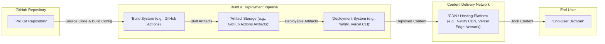
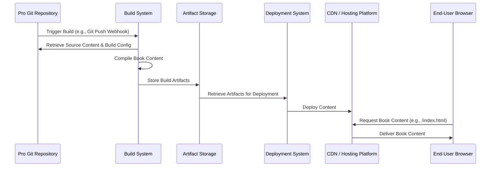

# Project Design Document: Pro Git Book Delivery System

**Version:** 1.1
**Date:** October 26, 2023
**Author:** AI Software Architect

## 1. Introduction

This document details the design of the system responsible for delivering the Pro Git book content, as hosted on the GitHub repository [https://github.com/progit/progit](https://github.com/progit/progit). This document serves as a foundation for subsequent threat modeling activities by providing a comprehensive overview of the system's architecture, components, and data flow.

## 2. Goals

*   Provide a clear and detailed description of the Pro Git book delivery system's architecture.
*   Identify and describe the key components involved in the content delivery process, including their technologies and responsibilities.
*   Illustrate the flow of data within the system, highlighting key interactions between components.
*   Establish a solid basis for identifying and analyzing potential security threats and vulnerabilities within the system.

## 3. Scope

This design document focuses on the technical infrastructure and processes involved in making the Pro Git book content available to end-users. This includes:

*   The source repository hosted on GitHub.
*   The automated build and deployment pipelines.
*   The content delivery network (CDN) or hosting platform serving the book content.
*   The methods by which end-users access the content (primarily web browsers).

This document explicitly excludes:

*   The actual content of the Pro Git book itself (text, images, etc.).
*   The internal workings and security of the Git version control system.
*   The detailed operational procedures for maintaining the system.
*   The intricacies of GitHub's platform beyond its role as the source repository.
*   Specific configurations of individual software components (e.g., web server configurations).

## 4. System Architecture

The Pro Git book delivery system employs a static site generation and deployment model. The source content, typically in Markdown or AsciiDoc, is processed by a build system to generate static output files (HTML, PDF, EPUB). These files are then deployed to a hosting platform for end-user access.

## 5. Components

This section provides a detailed description of the key components within the Pro Git book delivery system.

*   **Pro Git Repository (GitHub):**
    *   Description: The authoritative source code repository for the Pro Git book. It contains the book's content files, build scripts, configuration files, and potentially other assets.
    *   Technology: Git, GitHub.
    *   Function: Serves as the version-controlled storage for all book-related source materials. It also provides mechanisms for collaboration and triggering automated processes.

*   **Build System (e.g., GitHub Actions):**
    *   Description: An automated system responsible for compiling the book's source content into various distributable formats. This typically involves a series of steps defined in a workflow.
    *   Technology: Likely GitHub Actions, potentially utilizing tools like static site generators (e.g., Jekyll, Hugo), Pandoc, or custom scripts.
    *   Function: Executes build scripts upon triggers (e.g., code commits), processes the source files, and generates output artifacts (HTML, PDF, EPUB).

*   **Artifact Storage (e.g., GitHub Actions Artifacts):**
    *   Description: A temporary or persistent storage location used to hold the generated build artifacts before they are deployed.
    *   Technology:  Could be GitHub Actions built-in artifact storage, or an external storage service depending on the deployment setup.
    *   Function: Provides a staging area for the built book files, ensuring they are available for the deployment process.

*   **Deployment System (e.g., Netlify, Vercel CLI):**
    *   Description: The system responsible for taking the built artifacts and deploying them to the hosting platform. This might involve command-line interface tools or platform-specific deployment mechanisms.
    *   Technology: Examples include Netlify CLI, Vercel CLI, `git push` to a connected platform, or custom deployment scripts.
    *   Function: Transfers the built artifacts from the artifact storage to the CDN/Hosting Platform, making them accessible to end-users.

*   **CDN / Hosting Platform (e.g., Netlify CDN, Vercel Edge Network):**
    *   Description: The infrastructure that hosts the static book content and serves it to end-users. This often includes a Content Delivery Network (CDN) for improved performance and availability.
    *   Technology: Web servers (e.g., Nginx, Apache), CDN infrastructure (e.g., Cloudflare, Akamai, platform-specific CDNs), static file hosting services.
    *   Function: Stores the static HTML, PDF, EPUB files and delivers them to users' browsers upon request, often leveraging caching mechanisms for efficiency.

*   **End-User Browser:**
    *   Description: The web browser application used by readers to access and view the Pro Git book content.
    *   Technology: Web browsers such as Chrome, Firefox, Safari, Edge.
    *   Function: Sends requests for book content to the CDN/Hosting Platform and renders the received HTML, PDF, or other formats for the user.

## 6. Data Flow

This section describes the movement of data through the Pro Git book delivery system, outlining the interactions between the components.

*   **Content Update:**
    *   A developer or author commits changes to the Pro Git Repository on GitHub. These changes include source files, build scripts, or configuration updates.

*   **Build Trigger:**
    *   The commit to the repository triggers the Build System (e.g., GitHub Actions) based on configured webhooks or triggers.

*   **Source Code Retrieval:**
    *   The Build System retrieves the latest version of the source code and necessary files from the Pro Git Repository.

*   **Content Compilation:**
    *   The Build System executes the defined build steps, processing the source content using tools like static site generators or document converters to generate HTML, PDF, and EPUB files.

*   **Artifact Storage:**
    *   The generated build artifacts (HTML, PDF, EPUB files, and potentially other assets) are stored in the Artifact Storage.

*   **Deployment Initiation:**
    *   The Deployment System is triggered, either automatically after a successful build or manually.

*   **Artifact Retrieval for Deployment:**
    *   The Deployment System retrieves the built artifacts from the Artifact Storage.

*   **Content Deployment:**
    *   The Deployment System uploads or synchronizes the retrieved artifacts to the CDN / Hosting Platform.

*   **User Content Request:**
    *   An End-User Browser sends a request to the CDN / Hosting Platform for a specific page or file of the Pro Git book.

*   **Content Delivery:**
    *   The CDN / Hosting Platform locates the requested content (potentially from a cache) and delivers it to the End-User Browser.

## 7. Security Considerations (For Threat Modeling)

This section outlines potential security considerations and areas of concern that should be further investigated during the threat modeling process. These are categorized by the component they primarily affect.

*   **Pro Git Repository (GitHub):**
    *   **Threats:**
        *   Unauthorized modification of source content leading to the introduction of malicious information or links.
        *   Compromise of developer accounts leading to unauthorized code changes.
        *   Exposure of sensitive information (e.g., API keys, credentials) within the repository.
    *   **Considerations:**
        *   Implement strong access controls and authentication mechanisms (e.g., multi-factor authentication).
        *   Enforce branch protection rules and code review processes.
        *   Utilize secret scanning tools to prevent accidental exposure of sensitive data.

*   **Build System (e.g., GitHub Actions):**
    *   **Threats:**
        *   Compromised build environment leading to the injection of malicious code into the build artifacts.
        *   Supply chain attacks through compromised dependencies used during the build process.
        *   Unauthorized access to build logs or artifacts.
    *   **Considerations:**
        *   Harden the build environment and limit access.
        *   Implement dependency scanning and vulnerability management.
        *   Securely manage secrets and credentials used during the build process.

*   **Artifact Storage (e.g., GitHub Actions Artifacts):**
    *   **Threats:**
        *   Unauthorized access to stored artifacts, potentially allowing for the distribution of compromised versions of the book.
        *   Tampering with artifacts before deployment.
    *   **Considerations:**
        *   Implement appropriate access controls for the artifact storage.
        *   Consider using checksums or digital signatures to verify artifact integrity.

*   **Deployment System (e.g., Netlify, Vercel CLI):**
    *   **Threats:**
        *   Compromise of deployment credentials leading to unauthorized deployments of malicious content.
        *   Man-in-the-middle attacks during the deployment process.
    *   **Considerations:**
        *   Securely store and manage deployment credentials.
        *   Utilize secure communication protocols (e.g., HTTPS) for deployment.
        *   Implement multi-factor authentication for deployment accounts.

*   **CDN / Hosting Platform (e.g., Netlify CDN, Vercel Edge Network):**
    *   **Threats:**
        *   Vulnerabilities in the web server or CDN configuration leading to data breaches or defacement.
        *   Denial-of-service (DoS) or distributed denial-of-service (DDoS) attacks impacting availability.
        *   Misconfiguration of security headers leading to client-side vulnerabilities (e.g., XSS).
    *   **Considerations:**
        *   Regularly update and patch the hosting platform and web server software.
        *   Implement robust security configurations, including firewalls and intrusion detection systems.
        *   Utilize CDN features for DDoS protection and security.
        *   Configure appropriate security headers (e.g., Content Security Policy, HTTP Strict Transport Security).

*   **End-User Browser:**
    *   **Threats:**
        *   Cross-site scripting (XSS) vulnerabilities if the website is not properly secured.
        *   Exposure to malicious content if the CDN is compromised.
    *   **Considerations:**
        *   Implement robust input validation and output encoding to prevent XSS.
        *   Utilize Content Security Policy (CSP) to mitigate XSS risks.
        *   Ensure all content is served over HTTPS to prevent man-in-the-middle attacks.

## 8. Future Considerations

*   Implementation of automated security scanning tools (e.g., SAST, DAST, SCA) within the build pipeline to proactively identify vulnerabilities.
*   Adoption of a more formal content signing mechanism to ensure the integrity and authenticity of the book content.
*   Regular security audits and penetration testing of the entire delivery system.
*   Exploration of more granular access controls for different parts of the system.
*   Implementation of monitoring and alerting systems to detect and respond to security incidents.
