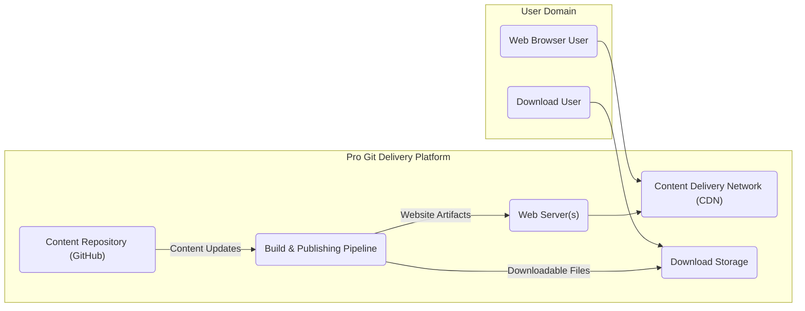

## Project Design Document: Pro Git Book Delivery Platform

**1. Introduction**

This document details the design of the platform responsible for delivering the content of the Pro Git book, accessible at [https://github.com/progit/progit](https://github.com/progit/progit). The focus of this design is on the infrastructure and processes involved in making the book available to users online and through downloadable formats. This document will serve as the foundation for subsequent threat modeling exercises.

**2. Goals and Objectives**

*   Provide reliable and highly available online access to the complete Pro Git book content.
*   Offer downloadable versions of the book in commonly used formats (e.g., PDF, EPUB, MOBI) for offline access.
*   Ensure the delivered content is consistently up-to-date with the latest revisions in the source repository.
*   Maintain a performant and scalable delivery mechanism to accommodate varying user traffic.
*   Minimize the risk of unauthorized modification or access to the book content.

**3. Scope**

This design document encompasses the following components and processes of the Pro Git book delivery platform:

*   The authoritative source content repository hosted on GitHub.
*   The automated build and publishing pipeline responsible for generating deliverable book formats.
*   The web server infrastructure hosting the interactive online version of the book.
*   The Content Delivery Network (CDN) utilized for distributing static assets and improving performance.
*   The storage and delivery mechanisms for downloadable book files.

This document explicitly excludes:

*   The editorial and authoring workflows involved in creating the book content.
*   The detailed internal structure and semantic content of the book itself.
*   User authentication or authorization mechanisms, as the book is intended for public access.
*   Detailed logging, monitoring, and analytics systems.

**4. High-Level Architecture**

**5. Detailed Design**

This section provides a more granular description of each component within the delivery platform.

*   **Content Repository (GitHub):**
    *   Serves as the single source of truth for the Pro Git book content.
    *   Utilizes Git for version control, tracking changes and facilitating collaboration.
    *   Stores the book's source files in a markup language, likely AsciiDoc or Markdown.
    *   Employs branching and tagging strategies for managing different versions of the book.
    *   Webhooks are configured to trigger the Build & Publishing Pipeline upon content updates.

*   **Build & Publishing Pipeline:**
    *   Automates the process of transforming the source content into various deliverable formats.
    *   Likely implemented using a Continuous Integration/Continuous Deployment (CI/CD) system such as GitHub Actions or GitLab CI.
    *   Key stages in the pipeline include:
        *   **Source Code Retrieval:** Fetching the latest content from the specified branch of the GitHub repository.
        *   **Dependency Installation:** Installing necessary tools and libraries (e.g., Asciidoctor, Pandoc, specific theme dependencies).
        *   **Content Processing:** Compiling the source files into HTML for the website and other formats (PDF, EPUB, MOBI).
        *   **Asset Optimization:** Optimizing images, CSS, and JavaScript for performance.
        *   **Artifact Generation:** Creating deployable website artifacts and downloadable book files.
        *   **Deployment to Web Server:** Uploading the generated website artifacts to the designated web server(s).
        *   **Upload to Download Storage:** Uploading the generated downloadable files to the designated storage location.
        *   **CDN Invalidation:** Triggering cache invalidation on the CDN for updated content.

*   **Web Server(s):**
    *   Hosts the interactive online version of the Pro Git book.
    *   Likely utilizes a web server software like Nginx or Apache for serving static content.
    *   Configured to serve the generated HTML, CSS, JavaScript, and image files.
    *   May include basic routing and error handling configurations.
    *   Security hardening measures are implemented, such as disabling unnecessary modules and configuring appropriate headers.

*   **Content Delivery Network (CDN):**
    *   Distributes the static assets of the website (HTML, CSS, JavaScript, images) across geographically dispersed servers.
    *   Improves website loading times and reduces latency for users globally.
    *   Provides caching mechanisms to reduce the load on the origin web server(s).
    *   Offers protection against certain types of attacks, such as Distributed Denial of Service (DDoS).
    *   Configuration includes setting appropriate caching policies and security rules.

*   **Download Storage:**
    *   Stores the downloadable versions of the book in various formats (PDF, EPUB, MOBI).
    *   Could be implemented using:
        *   Object storage services like Amazon S3, Google Cloud Storage, or Azure Blob Storage, offering scalability and durability.
        *   A dedicated file server with appropriate access controls.
    *   Provides publicly accessible URLs for downloading the files.
    *   Access controls are configured to ensure only authorized processes can upload or modify files.

**6. Data Flow**

This section describes the flow of data through the system for typical user interactions and content updates.

*   **User Accessing the Online Version:**
    1. A user's web browser initiates a request for a page from the Pro Git website (e.g., `progit.org/book/`).
    2. The Domain Name System (DNS) resolves the domain name to the CDN's edge servers.
    3. The CDN edge server checks its cache for the requested resource.
        *   **Cache Hit:** If the resource is cached, the CDN serves the content directly to the user's browser.
        *   **Cache Miss:** If the resource is not cached, the CDN requests it from the origin web server(s).
    4. The web server retrieves the requested HTML, CSS, JavaScript, and image files from its storage.
    5. The web server sends the requested resources back to the CDN edge server.
    6. The CDN edge server caches the content and serves it to the user's browser.
    7. The user's browser renders the web page.

*   **User Downloading a Book Format:**
    1. A user clicks a download link for a specific book format (e.g., a PDF link).
    2. The browser sends a request to the URL associated with the downloadable file on the Download Storage.
    3. The Download Storage retrieves the requested file.
    4. The Download Storage streams the file content to the user's browser.
    5. The user's browser downloads the file.

*   **Content Update Process:**
    1. A contributor commits and pushes changes to the Pro Git book's source files in the GitHub repository.
    2. GitHub sends a webhook notification to the Build & Publishing Pipeline.
    3. The CI/CD pipeline is triggered.
    4. The pipeline retrieves the latest content from the GitHub repository.
    5. The pipeline executes the build process, generating updated website artifacts and downloadable files.
    6. The pipeline deploys the new website artifacts to the Web Server(s).
    7. The pipeline uploads the new downloadable files to the Download Storage.
    8. The pipeline triggers a CDN cache invalidation for the relevant paths to ensure users receive the latest content.

**7. Technology Stack**

This section outlines the technologies likely employed within the delivery platform.

*   **Content Source:**
    *   Git (Version Control System)
    *   GitHub (Repository Hosting Platform)
    *   Markup Language (Likely AsciiDoc or Markdown)

*   **Build & Publishing Pipeline:**
    *   CI/CD System (e.g., GitHub Actions, GitLab CI, Jenkins)
    *   Document Processing Toolchain (e.g., Asciidoctor, Pandoc)
    *   Scripting Languages (e.g., Python, Bash) for automation
    *   Potentially containerization technologies (e.g., Docker) for build environment consistency

*   **Web Server:**
    *   Web Server Software (e.g., Nginx, Apache HTTP Server)
    *   Operating System (Likely Linux-based)

*   **CDN:**
    *   CDN Provider (e.g., Cloudflare, Amazon CloudFront, Fastly, Akamai)

*   **Download Storage:**
    *   Object Storage Service (e.g., Amazon S3, Google Cloud Storage, Azure Blob Storage) or
    *   File Server (e.g., Nginx or Apache serving static files)

**8. Deployment Architecture**

This section describes the likely deployment model for the platform's components.

*   **Content Repository:** Hosted and managed by GitHub.
*   **Build & Publishing Pipeline:**
    *   May run on a hosted CI/CD platform (e.g., GitHub Actions) directly integrated with the repository.
    *   Alternatively, could be deployed on self-hosted infrastructure using tools like Jenkins or GitLab CI runners, potentially within containerized environments (e.g., Kubernetes).
*   **Web Server(s):**
    *   Potentially deployed on Virtual Machines (VMs) within a cloud provider (e.g., AWS EC2, Google Compute Engine, Azure Virtual Machines).
    *   Increasingly likely to be deployed within containerized environments (e.g., Docker, Kubernetes) for scalability and resilience, potentially leveraging managed Kubernetes services.
*   **CDN:** Configuration and management are handled through the chosen CDN provider's platform. Integration typically involves DNS changes to point to the CDN.
*   **Download Storage:**
    *   If using object storage, it's a managed service provided by the cloud provider, requiring configuration of buckets and access policies.
    *   If using a file server, it would be deployed on a VM or container, requiring management of the operating system and web server software.

**9. Security Considerations (For Threat Modeling)**

This section highlights key security considerations that will be the focus of subsequent threat modeling activities.

*   **Content Integrity:**
    *   Ensuring the book content remains unaltered during the build and delivery process. Potential threats include compromised build pipelines or storage vulnerabilities leading to content modification.
    *   Mechanisms to verify content integrity (e.g., checksums, digital signatures) should be considered.
*   **Availability:**
    *   Maintaining continuous access to the online version and downloadable files. Potential threats include DDoS attacks targeting the web servers or CDN, or outages affecting the hosting infrastructure.
    *   Redundancy and failover mechanisms are crucial.
*   **CDN Security:**
    *   Protecting against CDN misconfiguration that could expose content or lead to service disruption.
    *   Mitigating risks associated with CDN account compromise.
*   **Web Server Security:**
    *   Hardening the web servers against common web application vulnerabilities (e.g., XSS, injection attacks).
    *   Regular security patching and vulnerability scanning are essential.
*   **Download Storage Security:**
    *   Securing access to the downloadable files to prevent unauthorized modification or deletion.
    *   Implementing appropriate access controls and permissions.
*   **Build Pipeline Security:**
    *   Protecting the CI/CD pipeline from compromise, as this could allow attackers to inject malicious content into the book.
    *   Securely managing secrets and credentials used in the build process.
*   **Dependency Management:**
    *   Ensuring the security of third-party libraries and tools used in the build process to prevent supply chain attacks.
    *   Regularly updating dependencies and scanning for vulnerabilities.
*   **Access Control:**
    *   Implementing the principle of least privilege for access to infrastructure components and administrative interfaces.
    *   Utilizing strong authentication and authorization mechanisms.

This document provides a detailed design of the Pro Git book delivery platform, serving as a crucial input for conducting a thorough threat model. The identified components, data flows, and security considerations will enable a systematic analysis of potential vulnerabilities and the development of appropriate mitigation strategies.
