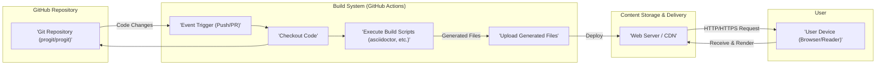

## Project Design Document: Pro Git Book Delivery (Improved)

**1. Introduction**

This document provides an enhanced design overview of the system responsible for delivering the Pro Git book content, as hosted on the GitHub repository [https://github.com/progit/progit](https://github.com/progit/progit). This detailed design serves as the foundation for subsequent threat modeling activities, offering a comprehensive understanding of the system's architecture, individual components, and the flow of data within it.

**2. Goals and Objectives**

*   Ensure reliable and performant delivery of the Pro Git book in multiple formats (HTML, PDF, EPUB) to end-users.
*   Maintain content integrity and ensure the delivered versions accurately reflect the source repository.
*   Automate the build and deployment process to minimize manual intervention and ensure timely updates.
*   Provide a scalable solution capable of handling varying levels of user traffic.

**3. Target Audience**

This document is intended for:

*   Security engineers and architects responsible for identifying and mitigating potential threats.
*   Software developers involved in maintaining and extending the book delivery system.
*   DevOps engineers responsible for the deployment, monitoring, and operation of the system.

**4. System Architecture Overview**

The Pro Git book delivery system operates through a series of interconnected stages:

*   **Source Code Management:** The book's content is authored and managed within a Git repository on GitHub.
*   **Automated Build Pipeline:** Changes to the source repository trigger an automated build process to generate distributable formats.
*   **Content Hosting and Distribution:** The generated book files are stored and served to end-users via web servers or a Content Delivery Network (CDN).

**5. Component Details**

*   **GitHub Repository (`progit/progit`):**
    *   Description: The authoritative source code repository for the Pro Git book. It contains AsciiDoc source files, images, and build configuration.
    *   Functionality: Provides version control, facilitates collaborative editing, and serves as the trigger for the build pipeline.
    *   Technology: Git, GitHub.
    *   Data Stored: AsciiDoc files (.adoc), image files (e.g., .png, .jpg), build scripts (e.g., `Makefile`, `.github/workflows/*`), configuration files (e.g., `.gitattributes`).

*   **Build System (Likely GitHub Actions):**
    *   Description: An automated Continuous Integration/Continuous Delivery (CI/CD) system that executes upon events in the GitHub repository (e.g., `push`, `pull_request`).
    *   Functionality:
        *   Checks out the latest version of the code from the GitHub repository.
        *   Executes build scripts defined in the repository (e.g., using `make`).
        *   Utilizes tools like `asciidoctor` to convert AsciiDoc to HTML.
        *   May use `PrinceXML` or `wkhtmltopdf` to generate PDF files.
        *   Could employ `pandoc` or `ebook-convert` (from Calibre) to create EPUB files.
        *   Potentially runs linters and other quality checks.
        *   Uploads the generated files to the content storage location.
    *   Technology: GitHub Actions (YAML-based workflows), potentially Docker containers for isolated build environments, and various command-line tools for document conversion.
    *   Data Processed: AsciiDoc source files, image files, build scripts, configuration files.
    *   Data Generated: HTML files, PDF files, EPUB files, and potentially log files.

*   **Content Storage and Delivery (Likely GitHub Pages or a CDN):**
    *   Description: The system responsible for hosting the generated book files and serving them to end-users over the internet.
    *   Functionality:
        *   Stores the static HTML, PDF, and EPUB files.
        *   Serves these files via HTTP or HTTPS in response to user requests.
        *   May implement caching mechanisms to improve performance and reduce server load.
        *   Could involve a Content Delivery Network (CDN) to distribute content geographically for faster access.
    *   Technology:
        *   Potentially GitHub Pages, which directly serves static files from a designated branch of the repository.
        *   Alternatively, could use cloud storage services like Amazon S3, Google Cloud Storage, or Azure Blob Storage, potentially fronted by a CDN like Cloudflare, Fastly, or AWS CloudFront.
        *   Web server software like Nginx or Apache might be used if a dedicated server infrastructure is involved.
    *   Data Stored: HTML files, PDF files, EPUB files, associated assets (CSS, JavaScript, fonts).

*   **User Devices (Web Browsers, Ebook Readers):**
    *   Description: The end-user's devices and applications used to access and read the Pro Git book.
    *   Functionality:
        *   Sends HTTP/HTTPS requests to the content storage location.
        *   Receives and renders the HTML content in web browsers.
        *   Downloads and displays PDF and EPUB files in dedicated reader applications.
    *   Technology: Web browsers (Chrome, Firefox, Safari, Edge), ebook reader applications (e.g., Kindle, Apple Books, Adobe Acrobat Reader).
    *   Data Consumed: HTML files, PDF files, EPUB files.

**6. Data Flow Diagram**

**7. Security Considerations**

This section outlines potential security considerations for each component of the system.

*   **GitHub Repository Security:**
    *   **Access Control:** Restrict write access to trusted contributors to prevent unauthorized modifications to the book content or build scripts. Implement branch protection rules.
    *   **Secret Management:** Securely store and manage any secrets or API keys required for the build process (e.g., deployment credentials). Utilize GitHub Secrets or a dedicated secrets management solution.
    *   **Dependency Management:** Regularly review and update dependencies used in the build process to mitigate vulnerabilities. Employ dependency scanning tools.
    *   **Code Review:** Implement code review processes for changes to build scripts and core content.

*   **Build System Security (GitHub Actions):**
    *   **Workflow Security:**  Harden GitHub Actions workflows to prevent script injection or unauthorized actions. Use the principle of least privilege for workflow permissions.
    *   **Runner Security:** If using self-hosted runners, ensure they are securely configured and maintained.
    *   **Supply Chain Security:** Be mindful of the security of actions and tools used within the workflow. Pin specific versions of actions to avoid unexpected changes.
    *   **Output Validation:** Implement checks to ensure the integrity of the generated files before deployment.

*   **Content Storage and Delivery Security:**
    *   **Access Control:** Configure appropriate access controls on the storage location to prevent unauthorized modification or deletion of the book files.
    *   **Authentication and Authorization:** If direct access to the storage is required, implement strong authentication and authorization mechanisms.
    *   **HTTPS Enforcement:** Ensure all content is served over HTTPS to protect user data in transit. Configure HSTS headers.
    *   **CDN Security:** If using a CDN, leverage its security features, such as DDoS protection and Web Application Firewall (WAF).
    *   **Content Security Policy (CSP):** Implement CSP headers to mitigate the risk of cross-site scripting (XSS) attacks, especially if the HTML content includes any dynamic elements.
    *   **Immutable Infrastructure:** Consider deploying generated content as immutable artifacts to prevent tampering after deployment.

*   **User Device Security:**
    *   While the project has limited control over user devices, providing content over HTTPS is crucial.
    *   Inform users about the importance of using up-to-date browsers and ebook readers.

**8. Deployment Model**

The deployment of the Pro Git book likely follows one of these models:

*   **GitHub Pages:** The generated HTML, PDF, and EPUB files are committed to a specific branch (e.g., `gh-pages`) of the `progit/progit` repository. GitHub Pages automatically serves these files as a static website. This is a simple and cost-effective solution for static content.
*   **Static Site Generator with CDN:** A more sophisticated approach involves using a static site generator (though less likely given the direct use of AsciiDoc) and deploying the generated files to a cloud storage service (like AWS S3 or Google Cloud Storage) fronted by a CDN. This offers better scalability and performance.
*   **Dedicated Web Server:**  The generated files could be deployed to a traditional web server (e.g., Nginx or Apache) running on a virtual machine or container. This provides more control over the server configuration but requires more management overhead.

**9. Assumptions and Constraints**

*   The `progit/progit` GitHub repository is the single source of truth for the book's content.
*   The build process is automated and triggered by events within the GitHub repository.
*   The delivered book content is intended for public access.
*   The project relies on the security and availability of third-party platforms like GitHub and the chosen hosting provider.
*   The build process requires specific software dependencies (e.g., `asciidoctor`, PDF generation tools).

**10. Technology Stack**

*   **Version Control:** Git
*   **Repository Hosting:** GitHub
*   **Build Automation:** GitHub Actions
*   **Markup Language:** AsciiDoc
*   **HTML Conversion:** `asciidoctor`
*   **PDF Conversion:** Potentially `PrinceXML`, `wkhtmltopdf`, or `dblatex`
*   **EPUB Conversion:** Potentially `pandoc` or `ebook-convert` (Calibre)
*   **Content Hosting:** Likely GitHub Pages, or potentially cloud storage (S3, Google Cloud Storage) with a CDN (Cloudflare, AWS CloudFront).
*   **Web Server (if applicable):** Nginx or Apache

**11. Future Considerations**

*   Implementing a more robust analytics platform to track download statistics and user engagement.
*   Exploring options for user contributions and translations, which would necessitate additional security measures for handling external input.
*   Automating the process of creating and publishing release notes alongside new book versions.
*   Regularly reviewing and updating the build process and dependencies to maintain security and efficiency.

This improved design document provides a more detailed and comprehensive overview of the Pro Git book delivery system, offering a stronger foundation for effective threat modeling and security analysis.