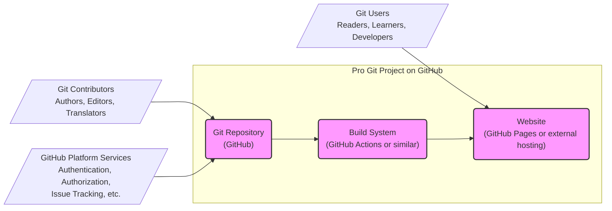

# BUSINESS POSTURE

This project, represented by the GitHub repository 'progit/progit', aims to provide a comprehensive, free, and open-source guide to Git. The primary business priority is to disseminate knowledge about Git to a wide audience, making it accessible and understandable for both beginners and experienced users. The project goals include maintaining the accuracy, relevance, and quality of the book's content, ensuring its availability, and fostering a community around Git learning and usage.

Key business risks associated with this project include:

- Risk of content integrity compromise: Unauthorized modifications or corruption of the book's content could undermine its credibility and usefulness.
- Risk of availability disruption: Inaccessibility of the repository or the book's online version would hinder the project's primary goal of knowledge dissemination.
- Risk of reputational damage: Publication of inaccurate, outdated, or misleading information could negatively impact the project's reputation and the trust of its users.
- Risk of contribution quality degradation:  Acceptance of low-quality or malicious contributions could negatively affect the book's overall quality and integrity.

# SECURITY POSTURE

Existing security controls for the 'progit/progit' project, primarily provided by the GitHub platform, include:

- security control: GitHub platform authentication and authorization mechanisms for repository access and management. Implemented by GitHub.
- security control: GitHub infrastructure security measures protecting the repository and its data. Implemented by GitHub.
- security control: Git version control system, providing content integrity and history tracking. Implemented by Git.
- security control: Public accessibility of the repository, allowing for community review and scrutiny. Implemented by GitHub.

Accepted risks for this project include:

- accepted risk: Reliance on GitHub's security infrastructure and practices.
- accepted risk: Public accessibility of the repository, making it potentially vulnerable to public attacks (although the impact is limited for a read-mostly repository).
- accepted risk: Potential for unintentional or malicious contributions that could compromise content integrity, mitigated by review processes.

Recommended security controls to enhance the project's security posture:

- recommended security control: Implement a robust input validation and review process for all contributions (pull requests) to ensure content quality and prevent malicious insertions.
- recommended security control: Consider signing releases or tags to provide assurance of content authenticity and integrity to users downloading or referencing specific versions of the book.
- recommended security control: Implement automated checks (linters, static analysis if applicable to build scripts) to detect potential issues in contributions before merging.

Security requirements for the 'progit/progit' project:

- Authentication:
    - Requirement: Contributors need to authenticate to GitHub to propose changes via pull requests.
    - Requirement: Repository maintainers need to authenticate to GitHub to manage the repository, review contributions, and make releases.
- Authorization:
    - Requirement: GitHub's role-based access control should be used to manage permissions for repository maintainers and contributors.
    - Requirement: Authorization is needed to control who can merge pull requests, create releases, and modify repository settings.
- Input Validation:
    - Requirement: All contributions, especially content changes, must be reviewed and validated to ensure accuracy, quality, and absence of malicious content.
    - Requirement: If any scripts are used in the build process, inputs to these scripts should be validated to prevent injection vulnerabilities.
- Cryptography:
    - Requirement: Consider using cryptographic signatures for releases to ensure content integrity and authenticity for users downloading or referencing specific versions of the book.

# DESIGN

## C4 CONTEXT

```mermaid
flowchart LR
    subgraph "Pro Git Project"
        Project("Pro Git Book Repository")
    end
    User[/"Git Users"\nReaders, Learners, Developers/] --> Project
    Contributor[/"Git Contributors"\nAuthors, Editors, Translators/] --> Project
    GitHub[/"GitHub"\nPlatform for\nVersion Control\nand Collaboration/] --> Project
    Project --> Website[/"Pro Git Website"\n(Optional)\nOnline version of the book/]
    Website --> User
    style Project fill:#f9f,stroke:#333,stroke-width:2px
```

### Context Diagram Elements

- list
    - Name: Git Users
    - Type: Person
    - Description: Individuals who read and use the Pro Git book to learn and understand Git. This includes developers, students, and anyone interested in version control.
    - Responsibilities: Reading the book content, learning Git concepts, and potentially providing feedback.
    - Security controls: No direct security controls implemented by Git Users. Their interaction is primarily read-only.

- list
    - Name: Git Contributors
    - Type: Person
    - Description: Individuals who contribute to the Pro Git book by writing, editing, translating, or suggesting improvements to the content.
    - Responsibilities: Contributing content, reviewing changes, and maintaining the quality of the book.
    - Security controls: Authentication and authorization via GitHub to contribute changes through pull requests.

- list
    - Name: Pro Git Book Repository
    - Type: Software System
    - Description: The central Git repository hosted on GitHub containing the source files (likely Markdown or similar) for the Pro Git book.
    - Responsibilities: Storing the book's content, managing version history, facilitating collaboration, and serving as the source of truth for the book.
    - Security controls: GitHub platform security, Git version control, access control via GitHub permissions.

- list
    - Name: GitHub
    - Type: Software System
    - Description: The web-based platform providing version control, collaboration, and hosting services for the Pro Git project.
    - Responsibilities: Hosting the Git repository, providing authentication and authorization, managing access control, and facilitating pull requests and issue tracking.
    - Security controls: GitHub's comprehensive security infrastructure, including network security, physical security, application security, and data protection measures.

- list
    - Name: Pro Git Website (Optional)
    - Type: Software System
    - Description: An optional website that may be built from the repository content to provide an online, easily readable version of the Pro Git book.
    - Responsibilities: Presenting the book content in a user-friendly format, making it accessible online, and potentially providing additional features like search or navigation.
    - Security controls: Security controls depend on the website implementation. If it's a static site hosted on GitHub Pages, security relies on GitHub's platform security. If it's a more complex website, additional security measures would be needed.

## C4 CONTAINER



### Container Diagram Elements

- list
    - Name: Git Repository (GitHub)
    - Type: Container
    - Description: A Git repository hosted on GitHub, containing all the source files for the Pro Git book, including text, images, and potentially scripts for building the website.
    - Responsibilities: Version control, content storage, collaboration, and source of truth for the project.
    - Security controls: GitHub platform security, Git version control, access control via GitHub permissions, branch protection rules.

- list
    - Name: Build System (GitHub Actions or similar)
    - Type: Container
    - Description: An automated build system, potentially using GitHub Actions or a similar CI/CD platform, that takes the source files from the Git repository and generates the website and potentially other distributable formats of the book.
    - Responsibilities: Automating the build process, generating website files, running tests or checks, and publishing build artifacts.
    - Security controls: Secure configuration of CI/CD pipelines, secrets management for any credentials used in the build process, and potentially security scanning of build artifacts.

- list
    - Name: Website (GitHub Pages or external hosting)
    - Type: Container
    - Description: The online website serving the Pro Git book content to users. This could be hosted on GitHub Pages directly from the repository or on an external hosting platform.
    - Responsibilities: Serving the book content to users, providing a user-friendly interface for reading, and ensuring website availability.
    - Security controls: Security controls depend on the hosting platform. For GitHub Pages, it relies on GitHub's platform security. For external hosting, standard web server security practices apply, including HTTPS, access control, and regular security updates.

## DEPLOYMENT

Assuming the website is deployed using GitHub Pages:

```mermaid
flowchart LR
    subgraph "GitHub Deployment Environment"
        GitHubPages[/"GitHub Pages\nInfrastructure/"]
    end
    subgraph "User's Browser"
        UserBrowser[/"Web Browser/"]
    end
    UserBrowser --> GitHubPages
    GitHubPages --> CDN[/"GitHub CDN\nContent Delivery Network/"]
    style GitHubPages fill:#f9f,stroke:#333,stroke-width:2px
    style CDN fill:#f9f,stroke:#333,stroke-width:2px
```

### Deployment Diagram Elements

- list
    - Name: GitHub Pages Infrastructure
    - Type: Deployment Environment
    - Description: GitHub's infrastructure for hosting static websites directly from GitHub repositories.
    - Responsibilities: Hosting the website files, serving content over HTTPS, and managing website infrastructure.
    - Security controls: GitHub's platform security, including network security, physical security, and application security.

- list
    - Name: GitHub CDN (Content Delivery Network)
    - Type: Infrastructure
    - Description: GitHub's Content Delivery Network used to distribute website content globally, improving performance and availability.
    - Responsibilities: Caching website content, serving content to users from geographically closer locations, and enhancing website performance.
    - Security controls: GitHub's CDN security measures, including DDoS protection and secure content delivery.

- list
    - Name: User's Browser
    - Type: Client
    - Description: The web browser used by users to access the Pro Git website.
    - Responsibilities: Rendering the website content, handling user interactions, and communicating with the website server.
    - Security controls: Browser security features, user's responsibility to maintain a secure browsing environment.

## BUILD

```mermaid
flowchart LR
    subgraph "Developer Environment"
        Developer[/"Developer/"]
        LocalGit[/"Local Git Repository/"]
    end
    subgraph "GitHub CI/CD (GitHub Actions)"
        GitHubActions[/"GitHub Actions Workflow/"]
        BuildArtifacts[/"Build Artifacts\n(Website Files, etc.)/"]
    end
    Developer --> LocalGit
    LocalGit -- Push --> GitHubRepository[/"GitHub Repository\n(progit/progit)/"]
    GitHubRepository -- Webhook Trigger --> GitHubActions
    GitHubActions --> BuildArtifacts
    BuildArtifacts -- Deploy --> GitHubPages[/"GitHub Pages/"]
    style LocalGit fill:#f9f,stroke:#333,stroke-width:2px
    style GitHubActions fill:#f9f,stroke:#333,stroke-width:2px
    style BuildArtifacts fill:#f9f,stroke:#333,stroke-width:2px
```

### Build Process Description

1.  Developer makes changes to the book content in their local Git repository.
2.  Developer pushes changes to the 'progit/progit' GitHub repository.
3.  A webhook in the GitHub repository triggers a GitHub Actions workflow.
4.  The GitHub Actions workflow checks out the code, builds the website (likely using a static site generator), and potentially runs security checks (linters, etc.).
5.  The build process generates build artifacts, such as website files.
6.  The GitHub Actions workflow deploys the build artifacts to GitHub Pages, making the updated website live.

### Build Security Controls

- security control: Secure GitHub Actions workflow configuration, following best practices for CI/CD security.
- security control: Secrets management in GitHub Actions to securely handle any credentials needed for the build or deployment process.
- security control: Static analysis and linting tools integrated into the build pipeline to detect potential issues in the code or content.
- security control: Dependency scanning (if applicable, e.g., if using Node.js or other package managers for build tools) to identify vulnerable dependencies.
- security control: Branch protection rules on the main branch to ensure that only reviewed and approved code is merged and built.

# RISK ASSESSMENT

Critical business process being protected:

- Maintaining the integrity, availability, and accuracy of the Pro Git book content for public access and knowledge dissemination.

Data being protected and their sensitivity:

- Pro Git book content (text, images, etc.): Publicly available, but integrity and accuracy are important for the project's goals and reputation. Sensitivity: Medium (integrity and reputation impact).
- Repository metadata and Git history: Important for project management and version control. Sensitivity: Low to Medium (availability and integrity impact).
- Potential build artifacts (website files): Publicly available. Sensitivity: Low.

# QUESTIONS & ASSUMPTIONS

Questions:

- What is the exact build process used to generate the Pro Git website (if one exists)? Is it a static site generator, and if so, which one?
- Is there a formal release process for the book, and are releases signed or verified in any way?
- What is the process for reviewing and approving contributions (pull requests) to ensure content quality and prevent malicious changes?

Assumptions:

- The primary goal of the 'progit/progit' repository is to provide a free and open-source Git book for educational purposes.
- The website (if it exists) is likely a static website generated from the repository content and potentially hosted on GitHub Pages.
- The project relies heavily on the security provided by the GitHub platform.
- Contributions are managed through GitHub pull requests and are reviewed by project maintainers.