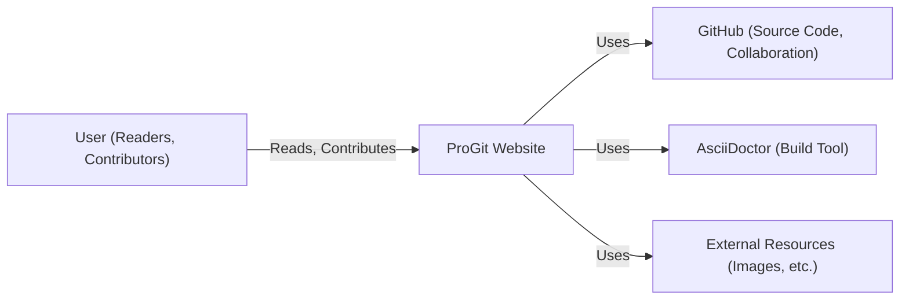
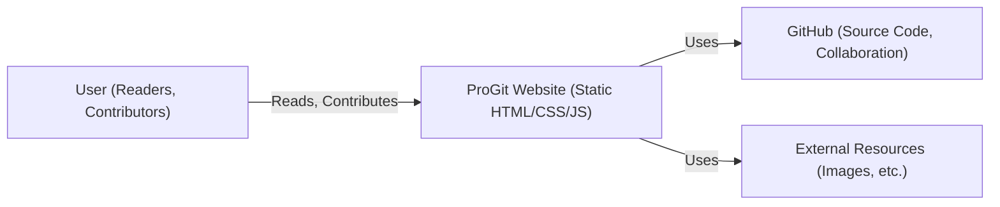
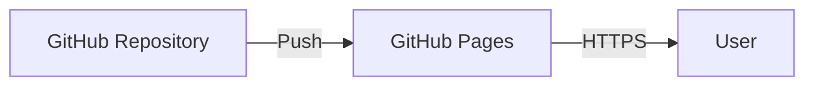
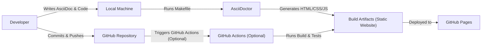

Okay, let's create a design document for the ProGit project, focusing on aspects relevant to threat modeling.

# BUSINESS POSTURE

Business Priorities and Goals:

*   Provide a freely available, high-quality, and up-to-date resource for learning and using Git.
*   Serve as the primary online documentation for Git.
*   Support multiple languages and translations.
*   Maintain a professional and authoritative presentation.
*   Enable community contributions and updates.
*   Ensure easy access and readability across various devices.

Most Important Business Risks:

*   Content Tampering: Unauthorized modification of the book's content, leading to misinformation and damage to the project's reputation.
*   Availability Degradation: Website downtime or slow performance, hindering access to the learning resource.
*   Data Breach (Comments/Contributions): If user comments or contribution mechanisms are compromised, user data could be exposed.  While the repository itself doesn't seem to host a commenting system *directly*, any linked external services (if they exist) would fall under this risk.
*   Reputation Damage: Inaccurate information, outdated content, or security vulnerabilities could harm the project's credibility as the definitive Git resource.
*   Supply Chain Attack: Compromise of dependencies or build tools used to generate the website could inject malicious code.

# SECURITY POSTURE

Existing Security Controls:

*   security control: Version Control (Git): The entire project is hosted on GitHub, providing a complete history of changes, facilitating rollbacks, and enabling collaboration with access controls. Implemented in: GitHub repository.
*   security control: Static Site Generation: The use of AsciiDoc and a static site generator (likely) reduces the attack surface compared to a dynamic website with a database. Implemented in: Build process (Makefile).
*   security control: Code Review: GitHub's pull request mechanism enforces code review before changes are merged into the main branch. Implemented in: GitHub repository workflow.
*   security control: HTTPS (Likely): The website is likely served over HTTPS, encrypting traffic between the user and the server. Implemented in: Hosting provider (GitHub Pages, Netlify, etc. - to be confirmed).
*   security control: Dependency Management: The project uses a Makefile, which likely specifies dependencies. Regular updates to these dependencies are crucial. Implemented in: Makefile.

Accepted Risks:

*   accepted risk: Reliance on GitHub: The project's availability and security are heavily dependent on GitHub's infrastructure and security practices.
*   accepted risk: Limited Input Validation (AsciiDoc): While AsciiDoc itself is relatively safe, any custom extensions or scripts used in the build process could introduce vulnerabilities if not carefully validated.
*   accepted risk: No dedicated security monitoring: There is no explicit mention of security monitoring or intrusion detection systems.

Recommended Security Controls:

*   security control: Content Security Policy (CSP): Implement a strong CSP to mitigate XSS and data injection attacks.
*   security control: Subresource Integrity (SRI): Use SRI tags for any externally hosted JavaScript or CSS files to ensure they haven't been tampered with.
*   security control: Automated Dependency Scanning: Integrate a tool like Dependabot or Snyk to automatically scan for vulnerable dependencies and create pull requests for updates.
*   security control: Static Application Security Testing (SAST): Incorporate a SAST tool into the build process to identify potential vulnerabilities in the AsciiDoc processing or any custom scripts.
*   security control: Regular Security Audits: Conduct periodic security audits of the project's infrastructure and code.
*   security control: Security Headers: Implement security headers like Strict-Transport-Security, X-Content-Type-Options, X-Frame-Options, and Referrer-Policy.

Security Requirements:

*   Authentication: Not directly applicable, as the core project is a static website. However, any associated services (e.g., for contributions or comments) would require strong authentication mechanisms.
*   Authorization: GitHub's built-in access controls manage authorization for contributions to the repository.
*   Input Validation: Validate any user-supplied input, particularly within AsciiDoc processing or custom scripts, to prevent injection attacks.
*   Cryptography: Ensure HTTPS is used for all communication with the website. If any sensitive data is handled (unlikely for this project), use appropriate cryptographic libraries and algorithms.

# DESIGN

## C4 CONTEXT

C4 Context Element Descriptions:

*   Element:
    *   Name: User (Readers, Contributors)
    *   Type: Person
    *   Description: Individuals accessing the ProGit website to learn Git or contribute to the project.
    *   Responsibilities: Read the book content, submit issues, propose changes (via pull requests).
    *   Security controls: Browser security settings, HTTPS (provided by the hosting environment).

*   Element:
    *   Name: ProGit Website
    *   Type: Software System
    *   Description: The online version of the Pro Git book.
    *   Responsibilities: Provide access to the book content in multiple formats and languages.
    *   Security controls: CSP, SRI, Security Headers, Static Site Generation.

*   Element:
    *   Name: GitHub
    *   Type: Software System
    *   Description: Platform hosting the project's source code, managing collaboration, and potentially hosting the website (GitHub Pages).
    *   Responsibilities: Version control, issue tracking, pull request management, code review.
    *   Security controls: GitHub's built-in security features, access controls, two-factor authentication (for contributors).

*   Element:
    *   Name: AsciiDoctor
    *   Type: Software System
    *   Description: Tool used to process AsciiDoc files and generate the website.
    *   Responsibilities: Convert AsciiDoc to HTML, manage build process.
    *   Security controls: Regular updates, secure configuration, input validation (within AsciiDoc processing).

*   Element:
    *   Name: External Resources
    *   Type: Software System
    *   Description: Any external resources used by the website, such as images, fonts, or JavaScript libraries.
    *   Responsibilities: Provide necessary assets for the website.
    *   Security controls: SRI tags, secure hosting of resources.

## C4 CONTAINER

Since ProGit is a static website, the container diagram is very similar to the context diagram. The primary "container" is the generated static website itself.

C4 Container Element Descriptions:

*   Element:
    *   Name: User (Readers, Contributors)
    *   Type: Person
    *   Description: Individuals accessing the ProGit website.
    *   Responsibilities: Read content, submit issues, contribute.
    *   Security controls: Browser security settings, HTTPS.

*   Element:
    *   Name: ProGit Website (Static HTML/CSS/JS)
    *   Type: Web Application
    *   Description: The generated static website files.
    *   Responsibilities: Serve the book content to users.
    *   Security controls: CSP, SRI, Security Headers, Static Site Generation.

*   Element:
    *   Name: GitHub
    *   Type: Software System
    *   Description: Platform hosting the source code and facilitating collaboration.
    *   Responsibilities: Version control, issue tracking, pull requests.
    *   Security controls: GitHub's security features, access controls, 2FA.

*   Element:
    *   Name: External Resources
    *   Type: Software System
    *   Description: External assets used by the website.
    *   Responsibilities: Provide necessary assets.
    *   Security controls: SRI, secure hosting.

## DEPLOYMENT

Possible Deployment Solutions:

1.  GitHub Pages:  The most likely and straightforward option, directly integrated with the GitHub repository.
2.  Netlify/Vercel:  These platforms offer similar functionality to GitHub Pages, with potentially more advanced features (e.g., custom build configurations, serverless functions).
3.  Self-Hosted (e.g., AWS S3 + CloudFront):  Provides more control but requires more configuration and management.

Chosen Solution (for detailed description): GitHub Pages

Deployment Element Descriptions:

*   Element:
    *   Name: GitHub Repository
    *   Type: Git Repository
    *   Description: The source code repository hosted on GitHub.
    *   Responsibilities: Store the project's code, track changes, manage collaboration.
    *   Security controls: GitHub's security features, access controls, 2FA.

*   Element:
    *   Name: GitHub Pages
    *   Type: Hosting Platform
    *   Description: GitHub's service for hosting static websites directly from a repository.
    *   Responsibilities: Serve the website content to users, provide HTTPS.
    *   Security controls: GitHub's infrastructure security, automatic HTTPS (likely).

*   Element:
    *   Name: User
    *   Type: Person
    *   Description: Individuals accessing the ProGit website.
    *   Responsibilities: Read the book content.
    *   Security controls: Browser security settings, HTTPS.

## BUILD

Build Process Description:

1.  Developers write AsciiDoc content and any necessary code (e.g., for custom extensions or scripts).
2.  The `Makefile` is used to orchestrate the build process, invoking AsciiDoctor.
3.  AsciiDoctor processes the AsciiDoc files, generating HTML, CSS, and JavaScript.
4.  Developers commit and push their changes to the GitHub repository.
5.  *Optional:* GitHub Actions can be configured to automatically run the build process and tests on every push, ensuring consistency and catching errors early.
6.  The generated build artifacts (the static website files) are deployed to GitHub Pages.

Security Controls in Build Process:

*   security control: Dependency Management (Makefile): The `Makefile` should clearly define all dependencies, and these should be regularly updated.
*   security control: Static Analysis (Optional):  A SAST tool could be integrated into the build process (either locally or via GitHub Actions) to scan for vulnerabilities.
*   security control: Automated Build (GitHub Actions - Optional):  Automating the build process ensures consistency and reduces the risk of manual errors.
*   security control: Code Review: All changes should be reviewed via pull requests before being merged.
*   security control: Supply Chain Security: Regularly audit and update dependencies to mitigate the risk of supply chain attacks. Consider using tools like `npm audit` or `yarn audit` if JavaScript dependencies are involved (even indirectly).

# RISK ASSESSMENT

Critical Business Processes:

*   Providing accurate and up-to-date information about Git.
*   Maintaining the availability and accessibility of the ProGit website.
*   Protecting the reputation and credibility of the ProGit project.

Data to Protect and Sensitivity:

*   Book Content (AsciiDoc files):  High sensitivity.  Tampering with the content could mislead users and damage the project's reputation.
*   *Potentially* User Data (if comments or contributions are handled externally):  Sensitivity depends on the nature of the data collected.  Any personal information would be considered sensitive.
*   Build Scripts and Configuration: Medium sensitivity. Compromise could lead to the injection of malicious code.

# QUESTIONS & ASSUMPTIONS

Questions:

*   Are there any external services linked to the ProGit website (e.g., for comments, forums, or user accounts)?
*   What specific hosting provider is used for the ProGit website (GitHub Pages, Netlify, etc.)?
*   Are there any custom AsciiDoc extensions or scripts used in the build process?
*   What is the process for updating dependencies?
*   Is there any monitoring in place to detect website downtime or security incidents?

Assumptions:

*   The website is hosted on GitHub Pages.
*   The primary goal is to provide a static, informational resource.
*   There are no user accounts or login functionality directly on the ProGit website itself.
*   The `Makefile` is the primary build tool.
*   The project has a relatively small team of contributors.
*   The project has a moderate risk appetite, given its open-source nature and reliance on community contributions.