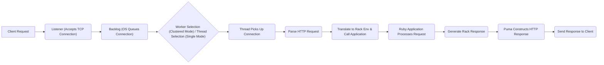

# Project Design Document: Puma Web Server

**Version:** 1.1
**Date:** October 26, 2023
**Author:** AI Software Architect

## 1. Introduction

This document provides a detailed architectural design of the Puma web server (as represented by the codebase at [https://github.com/puma/puma](https://github.com/puma/puma)). This document aims to serve as a foundation for subsequent threat modeling activities by clearly outlining the system's components, their interactions, and data flow.

### 1.1. Purpose

The purpose of this document is to:

*   Describe the high-level architecture of the Puma web server, including its different operating modes.
*   Identify key components and their specific responsibilities within the request lifecycle.
*   Illustrate the flow of requests through the system, highlighting critical interaction points.
*   Outline deployment considerations and common configurations that impact security.
*   Provide a solid basis for identifying potential security vulnerabilities and attack vectors during threat modeling.

### 1.2. Scope

This document covers the core architectural elements of the Puma web server, focusing on both single-mode and clustered deployments. It details the request processing lifecycle from connection acceptance to response delivery, key internal components, and external interfaces. This document does not cover the intricacies of the Ruby programming language itself, the internal workings of the Ruby VM (e.g., garbage collection), or the specific implementation details of the application code that Puma serves, except where they directly interact with Puma's architecture.

### 1.3. Goals

The goals of this design document are to be:

*   **Clear and Concise:** Easy to understand for a diverse audience, including developers, security engineers, and operations personnel.
*   **Comprehensive:** Covering all essential architectural aspects relevant to threat modeling, including different deployment scenarios and key configuration options.
*   **Accurate:** Reflecting the current understanding of the Puma codebase and its common usage patterns.
*   **Well-Formatted:** Using valid markdown and mermaid syntax for enhanced readability and clarity, adhering to the specified formatting constraints.

## 2. Overview

Puma is a mature, flexible, and high-performance HTTP/1.1 server for Ruby applications. It is designed for concurrency and offers two primary modes of operation: threaded mode within a single process and clustered mode with multiple worker processes, each containing its own thread pool. Puma acts as the intermediary between the network and the Ruby application, efficiently handling incoming HTTP requests and routing them to the application for processing according to the Rack specification.

## 3. Architecture

Puma's architecture is modular and adaptable, depending on the configured operating mode. The core components remain consistent, but their interaction and responsibilities can vary.

*   **Master Process:** The central control unit, responsible for:
    *   Loading the application and configuration.
    *   Managing worker processes (in clustered mode), including spawning, monitoring, and restarting them.
    *   Listening for signals (e.g., `SIGTERM`, `SIGUSR1`) to manage the server lifecycle.
    *   Managing the optional Control Server.
*   **Worker Processes (in clustered mode):** Independent processes that handle incoming requests. Each worker process:
    *   Contains its own thread pool.
    *   Operates in isolation from other workers, enhancing stability.
    *   Receives connections from the Listener via the operating system's load balancing.
*   **Thread Pool (within each worker or in single-mode):** A pool of threads responsible for concurrently processing incoming requests. Each thread:
    *   Accepts a connection from the backlog.
    *   Parses the HTTP request.
    *   Interacts with the Ruby application.
    *   Sends the HTTP response.
*   **Listeners:** Network sockets that listen for incoming TCP connections on specified IP addresses and ports. Puma can have multiple listeners configured.
*   **Backlog:** A queue maintained by the operating system kernel, holding incoming TCP connections that have been accepted by the Listener but not yet picked up by a worker thread. The size of the backlog is configurable.
*   **Configuration:** Settings that govern Puma's behavior, loaded from a configuration file (`puma.rb`), environment variables, or command-line arguments. This includes parameters for:
    *   Number of workers and threads.
    *   Listening addresses and ports.
    *   TLS/SSL configuration (certificates, keys).
    *   Control Server settings.
    *   Timeouts.
*   **Control Server (optional):** A separate TCP socket that allows for out-of-band control and monitoring of the Puma server. It provides endpoints for actions like:
    *   Restarting the server.
    *   Getting server status.
    *   Phased restarts (zero-downtime restarts).

### 3.1. Component Diagram

```mermaid
graph LR
    subgraph "Puma Server"
        A("Master Process")
        subgraph "Worker Process 1"
            B["Thread 1 (Worker 1)"]
            C["Thread M (Worker 1)"]
        end
        subgraph "Worker Process N"
            D["Thread 1 (Worker N)"]
            E["Thread P (Worker N)"]
        end
        F["Listener"]
        G["Backlog"]
        H["Configuration"]
        I["Control Server"]
    end

    J["Client"]

    J --> F
    F --> G
    G --> "Worker Process 1"
    G --> "Worker Process N"
    "Worker Process 1" --> B
    "Worker Process 1" --> C
    "Worker Process N" --> D
    "Worker Process N" --> E
    A -- "Manages" --> "Worker Process 1"
    A -- "Manages" --> "Worker Process N"
    A -- "Reads" --> H
    A -- "Listens on" --> I
```

## 4. Data Flow

The journey of an HTTP request through Puma involves several stages, depending on the server's configuration.

1. **Client Request:** A client (e.g., a web browser, API client) initiates an HTTP request to the Puma server's listening address and port.
2. **Listener (Accepts Connection):** The Puma Listener, bound to the configured address and port, accepts the incoming TCP connection.
3. **Backlog (Connection Queued):** The accepted connection is placed in the operating system's connection backlog, awaiting processing by a worker thread.
4. **Connection Handover (Clustered Mode):** In clustered mode, the operating system's kernel load balancer distributes incoming connections among the available worker processes. Each worker has a listening socket inherited from the master process.
5. **Thread Assignment:** A free thread from the selected worker process's thread pool (or the single process's thread pool in single-mode) picks up the connection from the backlog.
6. **Request Parsing:** The assigned thread reads the raw bytes of the HTTP request from the socket and parses it according to the HTTP/1.1 specification.
7. **Application Interaction (Rack Interface):** Puma translates the parsed HTTP request into a Rack environment hash and calls the `call` method of the configured Ruby application.
8. **Application Processing:** The Ruby application processes the request based on its internal logic and generates a Rack-compliant response (status code, headers, body).
9. **Response Transmission:** Puma receives the Rack response from the application and constructs the HTTP response, including headers and body.
10. **Client Response:** Puma sends the formatted HTTP response back to the client over the established TCP connection.
11. **Connection Closure:** After the response is sent, the connection may be kept alive for subsequent requests (HTTP keep-alive) or closed, depending on headers and configuration.

### 4.1. Request Processing Flow



## 5. Deployment Considerations

Puma's versatility allows for deployment in various scenarios, each with its own security implications:

*   **Operating Systems:** Primarily deployed on Linux and other Unix-like systems, offering robust process management and security features. Windows support exists but is less common in production.
*   **Containerization (Docker, Kubernetes):**  Frequently deployed within containers, providing isolation and reproducible environments. Container security best practices are crucial.
*   **Cloud Environments (AWS, Azure, GCP):**  Commonly used in cloud platforms, leveraging their infrastructure and security services. Proper configuration of network security groups and IAM roles is essential.
*   **Process Managers (systemd, initd):** Often managed by process managers for automated startup, monitoring, and restarts. Secure configuration of these managers is important.
*   **Reverse Proxies (Nginx, Apache):**  Almost always deployed behind reverse proxies in production environments. The reverse proxy handles:
    *   TLS/SSL termination.
    *   Load balancing across multiple Puma instances.
    *   Request routing and filtering.
    *   Protection against certain types of attacks (e.g., slowloris).
*   **Clustered vs. Single Mode:** The choice impacts resource utilization and fault tolerance. Clustered mode offers better isolation and can utilize multi-core processors more effectively.
*   **Configuration Management:** Configuration is critical for security. Key considerations include:
    *   **`bind`:** Securely binding to specific interfaces or using Unix sockets can limit exposure.
    *   **`workers` and `threads`:**  Optimizing these values prevents resource exhaustion and denial-of-service.
    *   **`ssl_bind`:** Proper configuration of TLS certificates, keys, and protocols is paramount for secure communication. Avoid outdated or weak ciphers.
    *   **`control_url`:** If enabled, the control server should be protected with strong authentication or restricted to internal networks.
    *   **Timeouts (`worker_timeout`, `shutdown_timeout`):**  Setting appropriate timeouts helps prevent hung requests and graceful shutdowns.
    *   **User and Group:** Running Puma under a non-privileged user account minimizes the impact of potential vulnerabilities.

## 6. Security Considerations

Understanding Puma's architecture allows for identifying potential security concerns:

*   **Exposure of Listeners:** Open ports are potential attack vectors. Ensure only necessary ports are exposed and access is controlled through firewalls or security groups.
*   **Backlog Overflow:** A large number of SYN requests can overwhelm the backlog, leading to denial-of-service. OS-level tuning and reverse proxy configurations can mitigate this.
*   **Worker Process Isolation (Clustered Mode):** While processes offer isolation, vulnerabilities in shared libraries or the Ruby VM could affect multiple workers. Regular updates and security patching are crucial.
*   **Thread Safety of Application Code:** Puma relies on the application being thread-safe. Race conditions or data corruption can occur if the application or its dependencies are not properly designed for concurrency.
*   **Control Server Vulnerabilities:** If enabled, the control server is a privileged interface. Weak authentication or vulnerabilities in its implementation could allow unauthorized control of the server. Secure its access and consider disabling it if not strictly necessary.
*   **TLS/SSL Misconfiguration:** Incorrectly configured TLS/SSL can lead to man-in-the-middle attacks or exposure of sensitive data. Regularly review and update TLS configurations, use strong ciphers, and enforce HTTPS.
*   **Denial of Service (DoS):**  Puma is susceptible to various DoS attacks, including resource exhaustion (CPU, memory, file descriptors) and slow client attacks. Implementing timeouts, resource limits, and using a reverse proxy with appropriate protections can help.
*   **Input Validation (Application Responsibility):** While Puma itself doesn't perform application-level input validation, it's crucial to recognize that vulnerabilities in the served application can be exploited through requests processed by Puma.
*   **Dependency Vulnerabilities:**  Like any software, Puma has dependencies. Regularly audit and update dependencies to patch known security vulnerabilities.
*   **Information Disclosure:** Error messages or debugging information exposed by Puma or the application could reveal sensitive information. Configure error handling to avoid excessive disclosure.
*   **HTTP Header Manipulation:**  Puma processes HTTP headers. Vulnerabilities in header parsing or handling could be exploited. Ensure Puma and the application handle headers securely.

## 7. Diagrams

The component and data flow diagrams are included in sections 3.1 and 4.1 respectively.

## 8. Glossary

*   **Master Process:** The primary Puma process responsible for overall server management and worker process lifecycle.
*   **Worker Process:** An independent process (in clustered mode) dedicated to handling incoming requests.
*   **Thread Pool:** A collection of threads within a worker process (or in single mode) used for concurrent request processing.
*   **Listener:** A network socket that accepts incoming TCP connections.
*   **Backlog:** A queue of pending network connections managed by the operating system.
*   **Control Server:** An optional TCP socket providing out-of-band server management capabilities.
*   **Rack:** A standardized interface between Ruby web servers and web frameworks.
*   **Single Mode:** Puma operating as a single process with multiple threads.
*   **Clustered Mode:** Puma operating with multiple worker processes, each with its own thread pool.

This document provides a more detailed and nuanced understanding of the Puma web server's architecture, enhancing its value for subsequent threat modeling activities. The expanded descriptions of components, data flow, and deployment considerations, along with more specific security considerations, offer a robust foundation for identifying and mitigating potential vulnerabilities.
