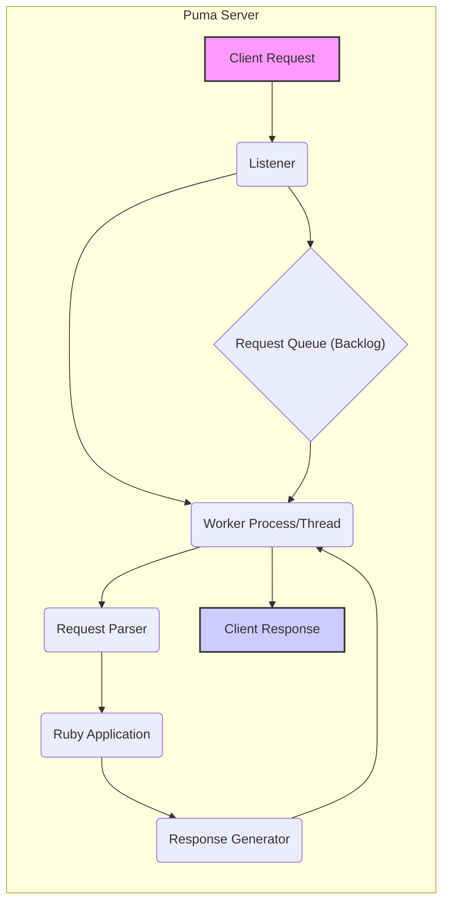
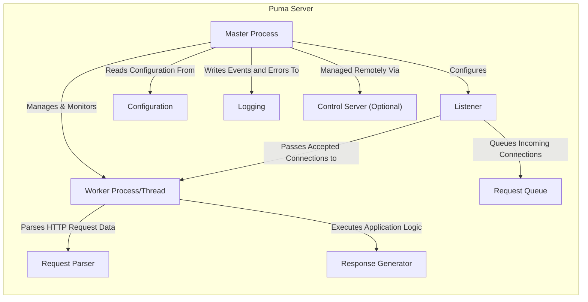
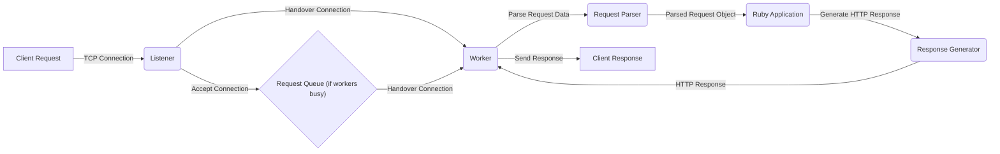

# Project Design Document: Puma Web Server

**Version:** 1.1
**Date:** October 26, 2023
**Author:** AI Software Architect

## 1. Introduction

This document provides a detailed architectural design of the Puma web server, an open-source, concurrent HTTP server for Ruby applications. This document is specifically crafted to serve as a foundational resource for subsequent threat modeling activities. It meticulously outlines the key components, data flow, and deployment considerations of Puma, with a focus on aspects relevant to security analysis.

## 2. Goals

*   Provide a comprehensive and precise overview of Puma's architecture and functionality, emphasizing security-relevant aspects.
*   Clearly identify key components and their interactions, highlighting potential trust boundaries and data flow paths.
*   Describe the typical data flow of an HTTP request within the Puma server, with attention to security checkpoints.
*   Outline common deployment scenarios and their implications for the attack surface.
*   Serve as a robust and detailed basis for identifying potential security vulnerabilities and attack vectors during threat modeling exercises.

## 3. Overview

Puma is engineered as a high-performance and efficient web server, designed to handle a significant volume of concurrent HTTP requests for Ruby applications. It achieves concurrency through a hybrid approach utilizing both threads and processes (workers). The central architecture of Puma comprises a master process responsible for managing worker processes or threads, a listener component that accepts incoming network connections, and a well-defined request processing pipeline. Puma offers flexibility in deployment configurations and seamlessly integrates with widely used Ruby web frameworks such as Ruby on Rails. Its design prioritizes concurrency and resource management.

## 4. Key Components

*   **Master Process:**
    *   The primary parent process that orchestrates and supervises worker processes or threads.
    *   Monitors and responds to system signals for actions such as restarting, reloading configurations, or initiating a graceful shutdown.
    *   Actively monitors the health and status of worker processes, automatically restarting them in case of failures or unexpected termination.
    *   Manages the overall configuration of the Puma server, including settings for workers, listeners, and security parameters.

*   **Worker Processes/Threads:**
    *   The entities responsible for handling individual incoming HTTP requests.
    *   Execute the core Ruby application code in response to received requests.
    *   Operate independently to enable parallel processing of multiple concurrent requests.
    *   Can be configured to utilize either multiple threads within a single process (shared memory) or multiple independent processes (isolated memory). The choice impacts resource usage and isolation.

*   **Listener:**
    *   The component dedicated to accepting incoming TCP connections on specified network interfaces and ports.
    *   Manages the initial TCP handshake process for new connections.
    *   Distributes accepted connections to available worker processes or threads for further processing.
    *   Supports both standard TCP sockets and Unix domain sockets for local communication.
    *   Handles TLS/SSL termination when configured, decrypting incoming traffic before passing it to workers. This is a critical security boundary.

*   **Request Queue (Backlog):**
    *   A buffer or queue where incoming connection requests are temporarily stored when all worker processes/threads are currently busy.
    *   Helps to manage and smooth out bursts of incoming traffic, preventing immediate rejection of connections.
    *   The maximum size of the backlog is configurable, influencing the server's ability to handle sudden spikes in demand.

*   **Request Parser:**
    *   Responsible for dissecting and interpreting the raw HTTP request data received from the connection.
    *   Extracts crucial information such as HTTP headers, the request body, the HTTP method (GET, POST, etc.), and the requested path or URL.
    *   Handles the intricacies of the HTTP protocol, including parsing various header formats and content encodings. This component is a potential point for vulnerabilities related to malformed requests.

*   **Response Generator:**
    *   Takes the output generated by the Ruby application code and formats it into a valid HTTP response.
    *   Sets essential HTTP headers (e.g., Content-Type, Content-Length), the HTTP status code (e.g., 200 OK, 404 Not Found), and the response body containing the requested data.

*   **Configuration:**
    *   A set of parameters and settings that govern the behavior and operational characteristics of the Puma server.
    *   Includes configurable options for:
        *   The number of worker processes or threads to spawn.
        *   The network addresses and ports on which the server will listen for connections.
        *   TLS/SSL certificate and private key paths for secure communication.
        *   Various timeout values for connection handling and request processing.
        *   Configuration of logging destinations and formats.
        *   Process management strategies and options.

*   **Logging:**
    *   The mechanism for recording significant events, errors, and informational messages generated by the Puma server during its operation.
    *   Provides valuable insights into server performance, potential issues, and security-related events.
    *   Can be configured to write log data to various destinations, such as files, standard output, or external logging services. Proper log management is crucial for security auditing and incident response.

*   **Control Server (Optional):**
    *   An optional HTTP-based interface that allows for programmatic management and monitoring of the Puma server.
    *   Provides endpoints for performing actions such as:
        *   Initiating a server restart or graceful shutdown.
        *   Retrieving the current status and metrics of the server.
    *   Typically secured with an authentication token or other security measures to prevent unauthorized access and control. This is a sensitive component from a security perspective.

## 5. Data Flow

The following details the typical progression of an HTTP request as it is processed by the Puma server:

1. **Client Request Initiation:** A client application (e.g., a web browser, a mobile app) initiates an HTTP request directed towards the Puma server's designated listening address and port.
2. **Connection Acceptance by Listener:** The Listener component actively listens for incoming TCP connections and accepts the connection request from the client.
3. **Queueing (Conditional):** If all available Worker processes or threads are currently occupied processing other requests, the newly accepted connection might be placed temporarily in the Request Queue (backlog).
4. **Worker Assignment and Handover:** An available Worker process or thread retrieves the connection from the Listener (or the Request Queue if it was queued).
5. **Request Parsing:** The designated Worker utilizes the Request Parser component to analyze the raw HTTP request data, extracting headers, the request body, and other relevant information.
6. **Application Processing:** The parsed request is then passed to the Ruby application code running within the assigned Worker for processing and handling.
7. **Response Generation:** The Ruby application processes the request and generates a response. The Response Generator component formats this application-specific output into a standard HTTP response, including headers and the response body.
8. **Response Transmission:** The Worker transmits the generated HTTP response back to the requesting client over the established TCP connection.
9. **Connection Management (Closure or Keep-Alive):** After the response is sent, the connection may be closed, or it might be kept alive for subsequent requests from the same client, depending on HTTP headers (e.g., `Connection: keep-alive`) and server configuration.

## 6. Deployment Scenarios

Puma's versatility allows for deployment in various architectural patterns:

*   **Standalone Deployment:** Puma directly handles incoming requests without an intermediary reverse proxy. This is often used in development environments or for smaller-scale applications. This exposes Puma directly to the internet, increasing the attack surface.
*   **Deployment Behind a Reverse Proxy:** A reverse proxy server (e.g., Nginx, Apache) sits in front of Puma, acting as an intermediary. This configuration offers several advantages, including:
    *   **TLS/SSL Termination:** The reverse proxy handles the decryption of HTTPS traffic, offloading this task from Puma.
    *   **Load Balancing:** Distributes incoming traffic across multiple Puma instances for improved scalability and resilience.
    *   **Caching:** Can cache static content, reducing the load on Puma.
    *   **Static File Serving:** Efficiently serves static files without involving the Puma application.
    *   **Request Routing and Filtering:** Allows for sophisticated routing rules and filtering of malicious requests before they reach Puma. This adds a security layer.
*   **Containerized Environments:** Puma is packaged as a container image (e.g., Docker) and deployed within container orchestration platforms like Kubernetes. This provides isolation, scalability, and simplified deployment management. Container security becomes a key consideration.
*   **Managed by Process Managers:** System-level process managers (e.g., Systemd, Upstart) are used to manage Puma as a system service, handling startup, shutdown, and monitoring. The security of the process manager itself is relevant.

## 7. Security Considerations (Detailed)

This section expands on potential security considerations, providing a more detailed perspective for threat modeling:

*   **TLS/SSL Configuration Vulnerabilities:** Incorrect or weak TLS/SSL configuration can lead to man-in-the-middle attacks and eavesdropping. This includes using outdated protocols, weak ciphers, or self-signed certificates in production. The Listener component is the primary point of interaction here.
*   **Request Parsing Exploits:** Vulnerabilities in the Request Parser could allow attackers to send malformed or oversized requests that cause crashes, denial of service, or even code execution. Buffer overflows or injection attacks in parsing logic are potential threats.
*   **Denial of Service (DoS) Attacks:** Puma's configuration, particularly the `backlog` size and timeout settings, can impact its resilience to DoS attacks. Attackers might flood the server with connection requests, exhausting resources.
*   **Control Server Security Weaknesses:** If the optional Control Server is enabled without proper authentication or authorization, it could be exploited by attackers to gain control of the Puma server, leading to arbitrary code execution or data breaches.
*   **Dependency Vulnerabilities:** Puma relies on various Ruby gems and potentially C extensions. Outdated or vulnerable dependencies can introduce security flaws that attackers can exploit. Regular dependency updates and security audits are crucial.
*   **Worker Isolation Issues:** The choice between threaded and process-based workers affects security isolation. Threaded workers share memory, meaning a vulnerability in one thread could potentially compromise the entire process. Process-based workers offer better isolation.
*   **Logging Security Risks:** If sensitive information is logged inappropriately, or if log files are not properly secured, attackers could gain access to confidential data. Log injection attacks are also a possibility if log inputs are not sanitized.
*   **Reverse Proxy Misconfiguration:** When deployed behind a reverse proxy, misconfigurations in the proxy (e.g., allowing direct access to Puma ports, improper header handling) can negate the security benefits of the proxy.
*   **Exposure of Sensitive Information:** Application-level vulnerabilities within the Ruby application running on Puma can lead to the exposure of sensitive data through the response generator.
*   **Session Management Security:** While not directly part of Puma, the way the Ruby application handles sessions is critical. Vulnerabilities here can lead to session hijacking or fixation.

## 8. Technologies Used

*   **Ruby:** The core programming language in which Puma is primarily written.
*   **C (for Extensions):** Puma utilizes C extensions for performance-critical tasks and platform-specific functionalities.
*   **TCP/IP Sockets:** The fundamental networking protocol for communication.
*   **HTTP/1.1 and HTTP/2:** The supported versions of the Hypertext Transfer Protocol.
*   **TLS/SSL (via OpenSSL or similar):** For establishing secure, encrypted connections.
*   **Various Ruby Gems:** A collection of libraries and dependencies that extend Puma's functionality and provide integrations.

## 9. Diagrams

### 9.1. Component Diagram

### 9.2. Request Processing Flow

## 10. Future Considerations

*   Exploration and potential implementation of HTTP/3 support.
*   Enhancements to observability features, providing richer metrics and tracing capabilities.
*   Ongoing performance optimization and reduction of resource consumption.
*   Strengthening security features and providing more granular security configuration options.

## 11. Conclusion

This document provides a detailed and security-focused architectural design of the Puma web server. By meticulously outlining the key components, data flow, and deployment scenarios, it serves as a valuable resource for identifying potential security vulnerabilities during threat modeling activities. Understanding the intricacies of Puma's architecture and its interactions is crucial for building secure and resilient Ruby applications. This document will be instrumental in guiding security assessments and informing ongoing development efforts with security considerations in mind.