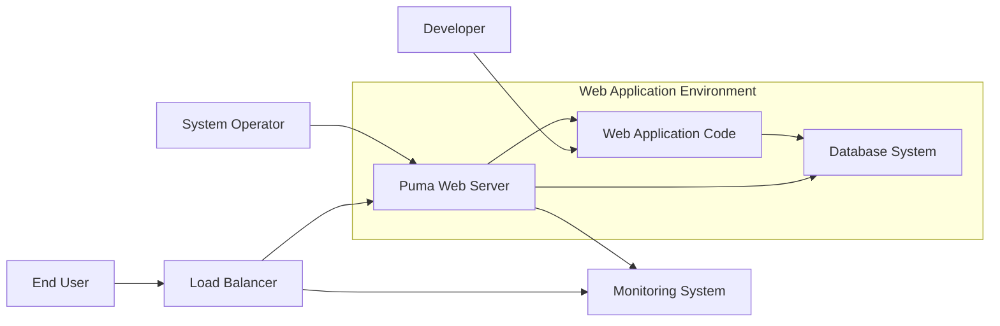
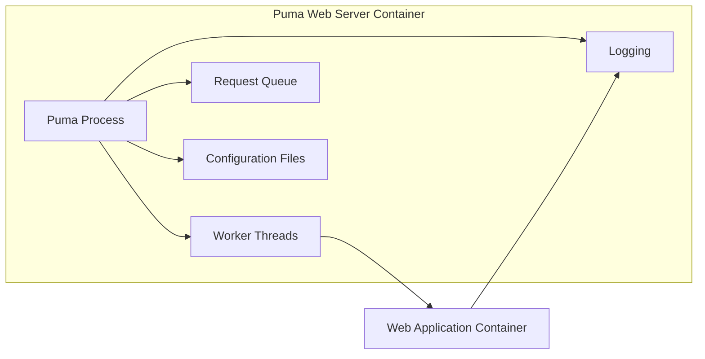
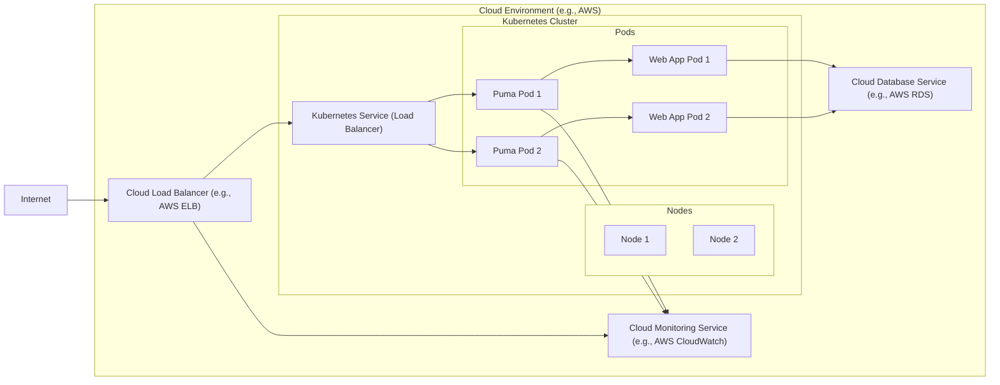
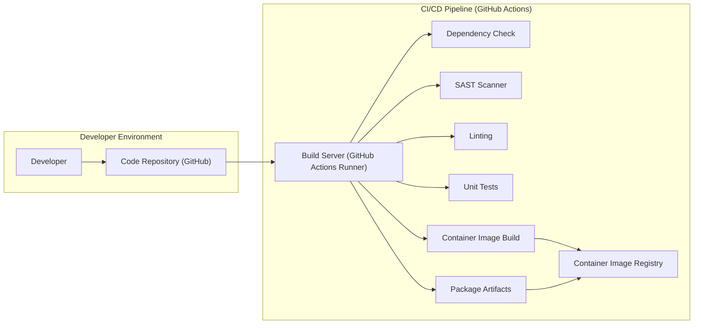

# BUSINESS POSTURE

This project, represented by the Puma web server, aims to provide a robust, high-performance, and concurrent HTTP 1.1 server for Ruby applications. Puma is designed to be easy to use and deploy, making it a popular choice for Ruby on Rails and other Rack-based applications.

Business priorities and goals:
- High Performance: Serve web requests quickly and efficiently to ensure a responsive user experience.
- Concurrency: Handle multiple requests simultaneously to maximize resource utilization and throughput.
- Reliability: Provide stable and dependable service with minimal downtime.
- Ease of Use: Simplify configuration and deployment for developers and operators.
- Community Support: Maintain an active and supportive community to ensure ongoing development and issue resolution.

Most important business risks:
- Performance Degradation: Inability to handle increasing traffic or complex requests, leading to slow response times and poor user experience.
- Downtime: Server crashes or failures resulting in application unavailability and business disruption.
- Security Vulnerabilities: Exploitable weaknesses in Puma or its dependencies that could lead to data breaches, service disruption, or other security incidents.
- Compatibility Issues: Problems arising from incompatibility with specific Ruby versions, libraries, or deployment environments.
- Maintainability Challenges: Difficulties in updating, patching, or extending Puma due to code complexity or lack of documentation.

# SECURITY POSTURE

Existing security controls:
- security control: Dependency Management: Puma uses Bundler to manage dependencies, helping to ensure consistent and reproducible builds. Described in `Gemfile` and `Gemfile.lock`.
- security control: Regular Updates: The Puma project actively maintains the server and releases updates, including security patches. Evident from the project's commit history and release notes on GitHub.
- security control: Input Validation (Limited): Puma handles HTTP requests and performs basic parsing, which includes some implicit input validation at the HTTP protocol level. Implemented within Puma's core request handling logic.
- security control: TLS/SSL Support: Puma supports TLS/SSL for encrypted communication over HTTPS. Configurable via Puma configuration settings.
- security control: Configuration Hardening: Puma allows configuration options to limit resource usage and enhance security, such as setting worker timeouts and thread limits. Configurable via `puma.rb` configuration file or command-line options.

Accepted risks:
- accepted risk: Dependency Vulnerabilities: Reliance on third-party gems introduces potential vulnerabilities in dependencies. Mitigated by dependency management and regular updates, but residual risk remains.
- accepted risk: Configuration Errors: Misconfiguration of Puma settings can lead to security weaknesses or performance issues. User responsibility to configure securely.
- accepted risk: Application Layer Vulnerabilities: Puma is a web server and does not protect against vulnerabilities in the Ruby application it serves. Application security is the responsibility of the application developers.

Recommended security controls:
- security control: Static Application Security Testing (SAST): Integrate SAST tools into the Puma development and release pipeline to automatically identify potential code-level vulnerabilities.
- security control: Software Composition Analysis (SCA): Implement SCA tools to continuously monitor Puma's dependencies for known vulnerabilities.
- security control: Security Audits: Conduct periodic security audits of the Puma codebase by external security experts to identify and address potential weaknesses.
- security control: Secure Defaults: Review and enhance Puma's default configuration to promote secure settings out-of-the-box.
- security control: Content Security Policy (CSP) and other security headers: Encourage and document the use of security headers in applications served by Puma to mitigate client-side vulnerabilities.

Security requirements:
- Authentication: Puma itself does not handle user authentication. Authentication is expected to be implemented at the application layer.
- Authorization: Puma itself does not handle user authorization. Authorization is expected to be implemented at the application layer.
- Input Validation: Puma performs basic HTTP request parsing. Applications using Puma must implement robust input validation to prevent injection attacks and other input-related vulnerabilities.
- Cryptography: Puma supports TLS/SSL for encrypted communication. Applications should enforce HTTPS and utilize strong TLS configurations. Applications may also need to implement application-level cryptography for data protection, which is outside of Puma's scope.

# DESIGN

## C4 CONTEXT

Context Diagram Elements:

- Element:
    - Name: End User
    - Type: Person
    - Description: Users accessing the web application through a web browser or other client.
    - Responsibilities: Accessing application features and data.
    - Security controls: Browser security controls, user device security.

- Element:
    - Name: Developer
    - Type: Person
    - Description: Software developers who write and maintain the Web Application Code.
    - Responsibilities: Developing, testing, and deploying the Web Application.
    - Security controls: Secure coding practices, code review, version control.

- Element:
    - Name: System Operator
    - Type: Person
    - Description: Operations team responsible for deploying, configuring, and maintaining the Puma Web Server and the overall infrastructure.
    - Responsibilities: Server deployment, configuration, monitoring, and incident response.
    - Security controls: Access control to infrastructure, monitoring tools, security incident management processes.

- Element:
    - Name: Puma Web Server
    - Type: Software System
    - Description: The Puma web server itself, responsible for handling HTTP requests and serving the Web Application.
    - Responsibilities: Accepting HTTP requests, routing requests to the Web Application, serving responses, managing connections, and providing basic security features like TLS/SSL support.
    - Security controls: TLS/SSL encryption, configuration hardening options, regular security updates.

- Element:
    - Name: Web Application Code
    - Type: Software System
    - Description: The Ruby application code that Puma executes to handle web requests.
    - Responsibilities: Implementing application logic, handling user requests, interacting with the Database, and enforcing application-level security controls.
    - Security controls: Authentication, authorization, input validation, output encoding, session management, application-level cryptography.

- Element:
    - Name: Database System
    - Type: Software System
    - Description: Database used by the Web Application to store and retrieve data.
    - Responsibilities: Data persistence, data integrity, data access control.
    - Security controls: Database access controls, encryption at rest and in transit, database auditing, vulnerability patching.

- Element:
    - Name: Load Balancer
    - Type: Software System
    - Description: Distributes incoming traffic across multiple Puma instances for scalability and high availability.
    - Responsibilities: Traffic distribution, health checks, SSL termination, basic DDoS protection.
    - Security controls: SSL termination, access control, rate limiting, web application firewall (WAF) integration.

- Element:
    - Name: Monitoring System
    - Type: Software System
    - Description: Collects and visualizes metrics and logs from Puma, Web Application, and infrastructure for performance monitoring and security incident detection.
    - Responsibilities: Performance monitoring, security logging, alerting, incident detection.
    - Security controls: Secure logging practices, access control to monitoring data, intrusion detection system (IDS) integration.

## C4 CONTAINER

Container Diagram Elements:

- Element:
    - Name: Puma Process
    - Type: Container - Process
    - Description: The main Puma process responsible for managing worker threads, request queue, and overall server operation.
    - Responsibilities: Process management, thread management, request routing, configuration loading, logging management.
    - Security controls: Process isolation, resource limits (via configuration), secure configuration loading.

- Element:
    - Name: Worker Threads
    - Type: Container - Thread
    - Description: Multiple worker threads within the Puma process that concurrently handle incoming HTTP requests and execute the Web Application code.
    - Responsibilities: Handling HTTP requests, executing Web Application code, processing responses.
    - Security controls: Thread isolation within the process, resource limits per thread (implicitly managed by process limits).

- Element:
    - Name: Request Queue
    - Type: Container - In-Memory Queue
    - Description: A queue to hold incoming HTTP requests before they are processed by worker threads. Helps manage request concurrency and handle traffic spikes.
    - Responsibilities: Request buffering, request prioritization (basic FIFO).
    - Security controls: In-memory queue (data not persisted), limited exposure.

- Element:
    - Name: Configuration Files
    - Type: Container - Files
    - Description: Configuration files (e.g., `puma.rb`) that define Puma's settings, such as port, workers, threads, TLS/SSL certificates, etc.
    - Responsibilities: Server configuration, security settings, performance tuning.
    - Security controls: File system access controls, secure storage of sensitive configuration (e.g., TLS keys), configuration validation.

- Element:
    - Name: Logging
    - Type: Container - Logging System
    - Description: Puma's logging mechanism to record server events, errors, and access logs. Logs are typically written to files or stdout/stderr.
    - Responsibilities: Event logging, error reporting, access logging for auditing and monitoring.
    - Security controls: Secure logging practices, log rotation, log access controls, integration with centralized logging systems.

- Element:
    - Name: Web Application Container
    - Type: Container - Process/Application Runtime
    - Description: Represents the running instance of the Web Application code that Puma interacts with. This could be a separate process or within the same process space depending on the deployment model.
    - Responsibilities: Application logic execution, handling requests from Puma, interacting with databases and other services.
    - Security controls: Application-level security controls (authentication, authorization, input validation, etc.), process isolation (if in a separate process).

## DEPLOYMENT

Deployment Architecture Option: Containerized Deployment on Cloud Platform (e.g., Kubernetes on AWS, GCP, Azure)

Deployment Diagram Elements:

- Element:
    - Name: Internet
    - Type: Environment
    - Description: The public internet, representing external users accessing the application.
    - Responsibilities: User access to the application.
    - Security controls: General internet security considerations.

- Element:
    - Name: Cloud Load Balancer (e.g., AWS ELB)
    - Type: Infrastructure - Load Balancer
    - Description: Cloud provider's load balancer distributing traffic to the Kubernetes Service.
    - Responsibilities: External traffic entry point, SSL termination, traffic distribution, basic DDoS protection.
    - Security controls: SSL/TLS configuration, access control lists (ACLs), DDoS protection features, web application firewall (WAF) integration.

- Element:
    - Name: Kubernetes Cluster
    - Type: Environment - Container Orchestration Platform
    - Description: Kubernetes cluster managing containerized application deployments.
    - Responsibilities: Container orchestration, scaling, health management, service discovery.
    - Security controls: Kubernetes RBAC, network policies, pod security policies/admission controllers, secrets management, cluster security hardening.

- Element:
    - Name: Nodes (Node 1, Node 2)
    - Type: Infrastructure - Compute Instance (VM/Physical)
    - Description: Worker nodes in the Kubernetes cluster where Pods are deployed.
    - Responsibilities: Running container workloads, providing compute resources.
    - Security controls: Operating system hardening, instance security configurations, security patching, network segmentation.

- Element:
    - Name: Kubernetes Service (Load Balancer)
    - Type: Kubernetes Resource - Service
    - Description: Kubernetes Service of type LoadBalancer, exposing Puma Pods externally within the Kubernetes cluster.
    - Responsibilities: Internal load balancing, service discovery within the cluster, exposing services externally.
    - Security controls: Network policies, service account permissions.

- Element:
    - Name: Puma Pods (Puma Pod 1, Puma Pod 2)
    - Type: Kubernetes Resource - Pod
    - Description: Kubernetes Pods running Puma Web Server containers.
    - Responsibilities: Running Puma processes, serving web requests.
    - Security controls: Container security (image scanning, vulnerability management), pod security context, resource limits.

- Element:
    - Name: Web App Pods (Web App Pod 1, Web App Pod 2)
    - Type: Kubernetes Resource - Pod
    - Description: Kubernetes Pods running Web Application containers.
    - Responsibilities: Executing application logic, interacting with databases.
    - Security controls: Container security, application-level security controls, pod security context, resource limits.

- Element:
    - Name: Cloud Database Service (e.g., AWS RDS)
    - Type: Cloud Service - Database
    - Description: Managed database service provided by the cloud provider.
    - Responsibilities: Data persistence, database management, backups, high availability.
    - Security controls: Database access controls, encryption at rest and in transit, database auditing, managed security features provided by the cloud provider.

- Element:
    - Name: Cloud Monitoring Service (e.g., AWS CloudWatch)
    - Type: Cloud Service - Monitoring
    - Description: Managed monitoring service provided by the cloud provider.
    - Responsibilities: Log aggregation, metric collection, alerting, dashboarding.
    - Security controls: Access control to monitoring data, secure data storage, integration with security information and event management (SIEM) systems.

## BUILD

Build Process Description:

1. Developer commits code changes to the Code Repository (GitHub).
2. Code Repository triggers CI/CD Pipeline (GitHub Actions) on code push or pull request.
3. Build Server (GitHub Actions Runner) executes the defined build workflow.
4. Dependency Check step analyzes project dependencies for known vulnerabilities using Software Composition Analysis (SCA) tools.
5. SAST Scanner step performs Static Application Security Testing to identify potential code-level vulnerabilities.
6. Linting step checks code style and potential code quality issues using linters.
7. Unit Tests step executes automated unit tests to verify code functionality.
8. Package Artifacts step packages the Puma server and application code into distributable artifacts (e.g., gem, tarball).
9. Image Build step builds a container image containing Puma and the application.
10. Image Registry step pushes the built container image to a container image registry (e.g., Docker Hub, private registry).

Build Process Security Controls:

- security control: Version Control: Using Git and GitHub for code repository provides version history, code review capabilities, and access control. Implemented by GitHub.
- security control: Automated Build Pipeline: GitHub Actions provides an automated and auditable build process, reducing manual errors and ensuring consistent builds. Implemented by GitHub Actions.
- security control: Dependency Scanning: Dependency Check step using SCA tools helps identify and mitigate known vulnerabilities in dependencies. Implemented in CI/CD pipeline.
- security control: Static Application Security Testing (SAST): SAST Scanner step identifies potential code vulnerabilities early in the development lifecycle. Implemented in CI/CD pipeline.
- security control: Code Linting: Linting step improves code quality and consistency, reducing potential security issues arising from coding errors. Implemented in CI/CD pipeline.
- security control: Unit Testing: Unit Tests step ensures code functionality and reduces the risk of introducing bugs that could have security implications. Implemented in CI/CD pipeline.
- security control: Container Image Scanning: Container image registries often provide vulnerability scanning for container images, helping to identify vulnerabilities in the base image and dependencies within the container. Implemented by Container Image Registry (e.g., Docker Hub, private registry).
- security control: Secure Artifact Storage: Container Image Registry provides secure storage and access control for built artifacts (container images). Implemented by Container Image Registry.
- security control: Build Server Security: GitHub Actions runners are managed by GitHub, providing a secure build environment. Implemented by GitHub.

# RISK ASSESSMENT

Critical business process we are trying to protect:
- Running web applications and serving content to end-users. Availability and performance of these applications are critical for business operations.

Data we are trying to protect and their sensitivity:
- Application Data: Data processed and stored by the web applications served by Puma. Sensitivity depends on the specific application (could be highly sensitive PII, financial data, or less sensitive public information).
- Access Logs: Logs generated by Puma and the application, which may contain user IP addresses, request paths, and other potentially sensitive information. Medium sensitivity.
- Configuration Data: Puma configuration files, TLS/SSL certificates, and database credentials. High sensitivity.
- Application Code: Source code of the web application. Medium to high sensitivity (intellectual property, potential vulnerabilities).

# QUESTIONS & ASSUMPTIONS

Questions:
- What type of web applications will be served by Puma? (e.g., public website, internal application, API). This will influence the sensitivity of data and specific security requirements.
- What is the expected traffic volume and performance requirements for the web applications? This will impact scalability and performance considerations.
- What are the specific compliance requirements (e.g., GDPR, PCI DSS, HIPAA) that need to be met? This will dictate specific security controls and data protection measures.
- What is the organization's risk appetite? This will influence the balance between security controls, cost, and performance.
- What existing security infrastructure and tools are already in place? This will help to integrate Puma security measures with the overall security architecture.

Assumptions:
- Puma will be deployed in a containerized environment using Kubernetes on a cloud platform.
- Web applications served by Puma will handle user data, and therefore security is a significant concern.
- Standard web application security best practices will be applied at the application layer.
- The organization has a basic understanding of cloud security and container security principles.
- The build process utilizes GitHub Actions for CI/CD.