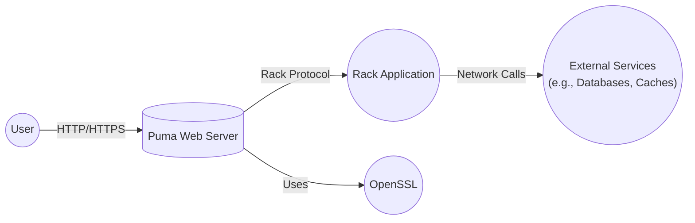
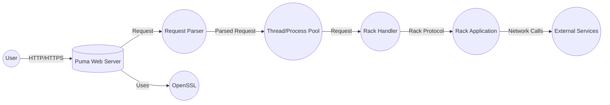
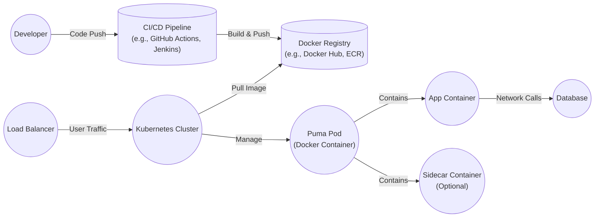
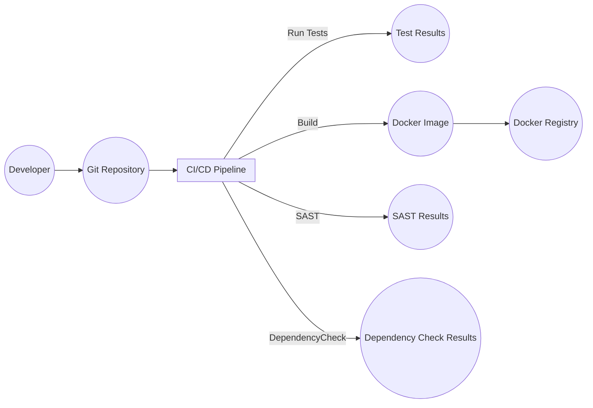

Okay, let's create a design document for the Puma project, focusing on aspects relevant for threat modeling.

# BUSINESS POSTURE

Puma is a Ruby web server built for speed and parallelism.  It's widely used in the Ruby ecosystem, particularly with Rails applications.  Given its role as a core component in many production deployments, the primary business priorities and goals revolve around:

*   Reliability:  Puma must be stable and handle a high volume of requests without crashing or leaking resources.  Downtime directly translates to lost revenue or user trust for applications using Puma.
*   Performance:  Puma's speed and efficiency are key selling points.  Slowdowns or performance bottlenecks impact the responsiveness of applications, leading to poor user experience.
*   Security:  As a web server, Puma is a primary target for attacks.  Vulnerabilities in Puma can expose applications to a wide range of threats, including data breaches, denial-of-service, and remote code execution.
*   Maintainability: The project needs to be maintainable to ensure long-term viability, allowing for bug fixes, security updates, and new feature development.
*   Compatibility: Puma needs to maintain compatibility with various Ruby versions, Rack specifications, and common deployment environments.

Most important business risks:

*   Service Outage: Complete failure of the Puma server, rendering dependent applications inaccessible.
*   Performance Degradation: Significant slowdown in request processing, leading to poor application performance.
*   Security Breach: Exploitation of a vulnerability leading to unauthorized access, data loss, or system compromise.
*   Reputational Damage: Public disclosure of vulnerabilities or outages, eroding trust in Puma and the applications that rely on it.

# SECURITY POSTURE

Existing security controls (based on the GitHub repository and common practices):

*   security control: Code Reviews: Pull requests are used, suggesting a code review process is in place. (Visible in the GitHub repository's contribution guidelines and pull request history).
*   security control: Static Analysis: Some level of static analysis is likely used, potentially through tools like RuboCop (common in the Ruby ecosystem, but needs confirmation).
*   security control: Dependency Management: Bundler is used to manage dependencies, helping to track and update gems (evident from the Gemfile and Gemfile.lock).
*   security control: Community Reporting: Security vulnerabilities can be reported, indicating a process for handling security issues (implied by the project's maturity and widespread use).
*   security control: Regular Releases: New versions are released periodically, suggesting ongoing maintenance and patching of vulnerabilities (visible in the release history on GitHub).
*   security control: Test Suite: A comprehensive test suite exists, covering various aspects of the server's functionality (evident from the /test directory in the repository).

Accepted risks:

*   accepted risk: Complexity of C Code: Puma incorporates C extensions for performance. C code is inherently more prone to memory safety issues than Ruby code.
*   accepted risk: Reliance on Third-Party Libraries: Puma depends on external libraries (e.g., Rack, OpenSSL). Vulnerabilities in these dependencies can impact Puma's security.
*   accepted risk: Network Exposure: As a web server, Puma is inherently exposed to network-based attacks.

Recommended security controls:

*   security control: Fuzz Testing: Implement fuzz testing to proactively discover edge cases and vulnerabilities that might be missed by traditional testing.
*   security control: Dynamic Analysis (DAST): Regularly scan running instances of Puma with a dynamic application security testing tool to identify vulnerabilities in a production-like environment.
*   security control: Security-Focused Code Audits: Conduct periodic, in-depth security audits of the codebase, particularly the C extensions and network-handling components.
*   security control: Supply Chain Security: Implement measures to verify the integrity of dependencies and prevent the introduction of malicious code through compromised libraries (e.g., using tools like Dependabot or Snyk).
*   security control: Content Security Policy (CSP): Encourage the use of CSP headers in applications using Puma to mitigate the impact of cross-site scripting (XSS) vulnerabilities.
*   security control: HTTP Security Headers: Promote the use of other security-related HTTP headers (e.g., HSTS, X-Frame-Options, X-Content-Type-Options) to enhance the security of applications.

Security Requirements:

*   Authentication: Puma itself does not handle application-level authentication. This is the responsibility of the Rack application. However, Puma should support secure communication channels (HTTPS) to protect authentication credentials in transit.
*   Authorization: Similar to authentication, authorization is handled by the Rack application, not Puma itself.
*   Input Validation: Puma should perform basic validation of incoming HTTP requests to prevent common attacks like HTTP request smuggling. However, thorough input validation is primarily the responsibility of the application.
*   Cryptography: Puma should utilize strong cryptographic protocols (e.g., TLS 1.2 or higher) and ciphers when handling HTTPS connections. It should rely on a well-vetted TLS library (e.g., OpenSSL) and provide configuration options for secure settings.

# DESIGN

## C4 CONTEXT

C4 CONTEXT Elements Description:

*   Element:
    *   Name: User
    *   Type: Person
    *   Description: Represents a user interacting with a web application served by Puma.
    *   Responsibilities: Initiates HTTP requests to the application.
    *   Security controls: Browser security features, potentially multi-factor authentication (managed by the application).

*   Element:
    *   Name: Puma Web Server
    *   Type: Software System
    *   Description: The Puma web server itself.
    *   Responsibilities: Receives HTTP requests, handles concurrency, and interfaces with the Rack application.
    *   Security controls: Input validation (basic), TLS termination, connection management, DoS mitigation (limited).

*   Element:
    *   Name: Rack Application
    *   Type: Software System
    *   Description: The Ruby web application (e.g., a Rails application) running on Puma.
    *   Responsibilities: Processes requests, interacts with business logic and data stores, generates responses.
    *   Security controls: Authentication, authorization, input validation (thorough), output encoding, session management, data access controls.

*   Element:
    *   Name: External Services
    *   Type: Software System
    *   Description: External services that the Rack application interacts with (databases, caches, APIs, etc.).
    *   Responsibilities: Varies depending on the specific service.
    *   Security controls: Authentication, authorization, data encryption, access controls (managed by the respective services).

*   Element:
    *   Name: OpenSSL
    *   Type: Software Library
    *   Description: OpenSSL or other TLS library.
    *   Responsibilities: Provides cryptographic functions for secure communication.
    *   Security controls: TLS protocol implementation, cipher suite negotiation, certificate validation.

## C4 CONTAINER

C4 CONTAINER Elements Description:

*   Element:
    *   Name: User
    *   Type: Person
    *   Description: Represents a user interacting with a web application served by Puma.
    *   Responsibilities: Initiates HTTP requests to the application.
    *   Security controls: Browser security features, potentially multi-factor authentication (managed by the application).

*   Element:
    *   Name: Puma Web Server
    *   Type: Software System
    *   Description: The Puma web server itself.
    *   Responsibilities: Receives HTTP requests, handles concurrency, and interfaces with the Rack application.
    *   Security controls: Input validation (basic), TLS termination, connection management, DoS mitigation (limited).

*   Element:
    *   Name: Request Parser
    *   Type: Component
    *   Description: Parses incoming HTTP requests.
    *   Responsibilities: Extracts headers, body, and other request information.
    *   Security controls: Basic input validation, protection against HTTP request smuggling.

*   Element:
    *   Name: Thread/Process Pool
    *   Type: Component
    *   Description: Manages a pool of threads or processes to handle concurrent requests.
    *   Responsibilities: Distributes requests to available workers.
    *   Security controls: Resource limits (to prevent resource exhaustion attacks).

*   Element:
    *   Name: Rack Handler
    *   Type: Component
    *   Description: Adapts the parsed request to the Rack interface.
    *   Responsibilities: Invokes the Rack application with the request.
    *   Security controls: None specific, relies on the security of the Rack application.

*   Element:
    *   Name: Rack Application
    *   Type: Software System
    *   Description: The Ruby web application (e.g., a Rails application) running on Puma.
    *   Responsibilities: Processes requests, interacts with business logic and data stores, generates responses.
    *   Security controls: Authentication, authorization, input validation (thorough), output encoding, session management, data access controls.

*   Element:
    *   Name: External Services
    *   Type: Software System
    *   Description: External services that the Rack application interacts with (databases, caches, APIs, etc.).
    *   Responsibilities: Varies depending on the specific service.
    *   Security controls: Authentication, authorization, data encryption, access controls (managed by the respective services).

*   Element:
    *   Name: OpenSSL
    *   Type: Software Library
    *   Description: OpenSSL or other TLS library.
    *   Responsibilities: Provides cryptographic functions for secure communication.
    *   Security controls: TLS protocol implementation, cipher suite negotiation, certificate validation.

## DEPLOYMENT

Possible deployment solutions:

1.  Traditional VM-based deployment (e.g., using Capistrano, Chef, Ansible).
2.  Containerized deployment (e.g., using Docker, Kubernetes).
3.  Platform-as-a-Service (PaaS) deployment (e.g., Heroku, AWS Elastic Beanstalk).

Chosen solution (for detailed description): Containerized deployment using Docker and Kubernetes.

DEPLOYMENT Elements Description:

*   Element:
    *   Name: Developer
    *   Type: Person
    *   Description: Developers writing and committing code.
    *   Responsibilities: Develops application code and Puma configuration.
    *   Security controls: Code reviews, secure coding practices, access controls to the code repository.

*   Element:
    *   Name: CI/CD Pipeline
    *   Type: Software System
    *   Description: Continuous Integration and Continuous Deployment pipeline.
    *   Responsibilities: Automates the build, testing, and deployment process.
    *   Security controls: Automated security checks (SAST, DAST, dependency scanning), access controls, build artifact signing.

*   Element:
    *   Name: Docker Registry
    *   Type: Software System
    *   Description: Stores Docker images.
    *   Responsibilities: Provides a central repository for storing and retrieving container images.
    *   Security controls: Access controls, image scanning, vulnerability management.

*   Element:
    *   Name: Kubernetes Cluster
    *   Type: Software System
    *   Description: Orchestrates containerized applications.
    *   Responsibilities: Manages the deployment, scaling, and networking of Puma pods.
    *   Security controls: Network policies, role-based access control (RBAC), pod security policies, secrets management.

*   Element:
    *   Name: Load Balancer
    *   Type: Software System
    *   Description: Distributes incoming traffic across multiple Puma pods.
    *   Responsibilities: Provides high availability and scalability.
    *   Security controls: TLS termination, DDoS protection, health checks.

*   Element:
    *   Name: Puma Pod
    *   Type: Container
    *   Description: A Kubernetes pod running the Puma web server and application code.
    *   Responsibilities: Runs the Puma server and the application.
    *   Security controls: Container security context, resource limits, network policies.

*   Element:
    *   Name: App Container
    *   Type: Container
    *   Description: Container with application code.
    *   Responsibilities: Contains application code.
    *   Security controls: Application-level security controls (authentication, authorization, etc.).

*   Element:
    *   Name: Sidecar Container
    *   Type: Container
    *   Description: Optional sidecar container for tasks like logging, monitoring, or service mesh integration.
    *   Responsibilities: Provides supporting functionality to the main application container.
    *   Security controls: Depends on the specific sidecar functionality.

*   Element:
    *   Name: Database
    *   Type: Software System
    *   Description: The application's database.
    *   Responsibilities: Stores application data.
    *   Security controls: Access controls, data encryption, auditing.

## BUILD

Build Process Description:

1.  Developer commits code to the Git repository.
2.  The CI/CD pipeline (e.g., GitHub Actions) is triggered.
3.  The pipeline checks out the code.
4.  Static analysis (SAST) tools (e.g., Brakeman for Rails, RuboCop for Ruby) are run to identify potential security vulnerabilities in the code.
5.  Dependency checks are performed to identify known vulnerabilities in third-party libraries (e.g., using Bundler-audit or Snyk).
6.  The test suite is executed.
7.  If all tests and security checks pass, a Docker image is built, containing the Puma server and the application code.
8.  The Docker image is pushed to a Docker registry (e.g., Docker Hub, Amazon ECR).

Security Controls in Build Process:

*   security control: Code Reviews: Enforced through pull requests before merging code.
*   security control: Static Analysis (SAST): Automated static analysis tools are run as part of the CI pipeline.
*   security control: Dependency Scanning: Automated checks for vulnerable dependencies.
*   security control: Test Suite: Comprehensive test suite to ensure code quality and prevent regressions.
*   security control: Build Automation: The entire build process is automated, reducing the risk of manual errors.
*   security control: Image Signing (Recommended): Docker images should be signed to ensure their integrity.
*   security control: Least Privilege: Build agents should run with minimal necessary privileges.

# RISK ASSESSMENT

Critical Business Processes:

*   Serving web requests: Puma's primary function is to serve web requests. Any disruption to this process directly impacts the availability of the application.
*   Handling user data: Puma handles user data in transit (HTTP requests and responses). Protecting the confidentiality and integrity of this data is crucial.
*   Interfacing with the Rack application: Puma's interaction with the Rack application is critical for the application's functionality.

Data Sensitivity:

*   HTTP Request Data: May contain sensitive information such as cookies, authentication tokens, form data, and API keys. Sensitivity: High.
*   HTTP Response Data: May contain sensitive application data, user profiles, financial information, etc. Sensitivity: Varies depending on the application, but can be High.
*   Configuration Data: Puma's configuration may contain sensitive information like database credentials or API keys (although these should ideally be stored securely using environment variables or secrets management). Sensitivity: High.
*   Log Data: Puma's logs may contain sensitive information, including IP addresses, request details, and error messages. Sensitivity: Medium to High.

# QUESTIONS & ASSUMPTIONS

Questions:

*   What specific static analysis tools are currently used, if any?
*   What is the current process for handling security vulnerability reports?
*   Are there any existing security audits or penetration test reports for Puma?
*   What are the specific deployment environments used in production (e.g., specific Kubernetes configurations, cloud providers)?
*   Are there any specific compliance requirements (e.g., PCI DSS, HIPAA) that apply to applications using Puma?
*   What is the process for updating dependencies, and how frequently is it performed?
*   Is there a formal incident response plan in place for security incidents related to Puma?

Assumptions:

*   BUSINESS POSTURE: Assumes a typical web application deployment scenario where availability, performance, and security are key concerns.
*   SECURITY POSTURE: Assumes a baseline level of security awareness and practices, but acknowledges the inherent risks associated with web servers and C code.
*   DESIGN: Assumes a standard Rack-based application deployment. The deployment section focuses on a Kubernetes-based deployment, but other deployment models are possible. The build process assumes a CI/CD pipeline is used, but the specifics may vary.