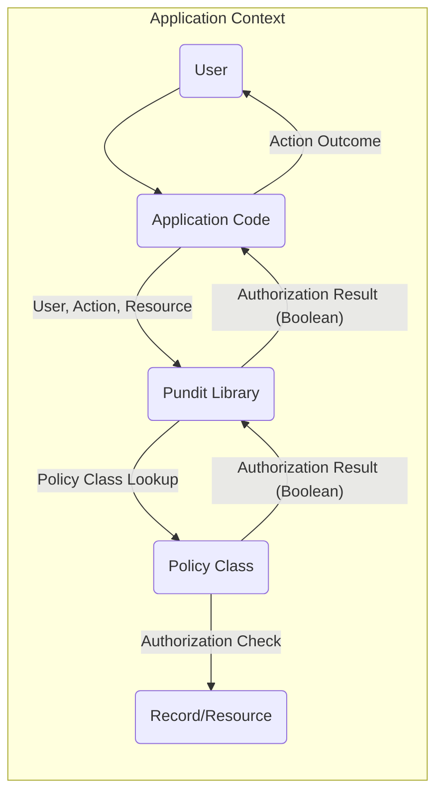

# Project Design Document: Pundit Authorization Library Integration (Improved)

**1. Introduction**

This document details the design for integrating the Pundit authorization library (https://github.com/varvet/pundit) into an application to manage access control. This document is specifically intended to serve as a foundation for subsequent threat modeling activities, focusing on the interaction between the application and the Pundit library.

**2. Project Overview**

The primary objective of this project is to implement a secure, maintainable, and well-defined authorization mechanism within an application using the Pundit library. Pundit's convention-based approach simplifies the definition and management of authorization rules. This document outlines the key components involved in this integration, their responsibilities, and their interactions, specifically with a security lens for future threat analysis.

**3. System Architecture**

The system architecture centers around the application leveraging Pundit to determine if an authenticated user is permitted to perform a specific action on a given resource. The core interaction involves the application delegating authorization decisions to Pundit policies.

**4. Component Design**

*   **User:** Represents the authenticated entity attempting to perform an action within the application. This is typically a human user but could also be an automated system.
    *   Attributes:  `user_id`, roles, specific permissions (if managed outside of Pundit but accessible within policies), authentication status.
    *   Responsibilities: Initiating actions within the application, possessing identifying attributes used in authorization decisions.

*   **Application Code:** The core business logic of the application that requires authorization enforcement.
    *   Responsibilities:
        *   Authenticating the user.
        *   Identifying the current authenticated user.
        *   Identifying the specific resource being accessed or manipulated.
        *   Identifying the action the user is attempting to perform.
        *   **Crucially, performing input validation and sanitization *before* invoking Pundit.**
        *   Instantiating and interacting with the Pundit library to perform authorization checks.
        *   Handling the authorization response (success or failure), including appropriate error handling and logging.

*   **Pundit Library:** The external library responsible for evaluating authorization policies based on the provided user, action, and resource.
    *   Responsibilities:
        *   Receiving the user object, action name (as a symbol or string), and resource object from the "Application Code".
        *   Dynamically determining the relevant "Policy Class" based on the resource type.
        *   Instantiating the determined "Policy Class", typically passing the current "User" and the "Record/Resource" to the constructor.
        *   Calling the appropriate authorization method (e.g., `show?`, `create?`, `update?`, `destroy?`) on the instantiated "Policy Class".
        *   Returning a boolean value indicating whether the action is authorized.

*   **Policy Class:** A dedicated class that encapsulates the authorization rules for a specific type of resource.
    *   Responsibilities:
        *   Defining methods (e.g., `show?`, `create?`) that implement the authorization logic for specific actions on the associated resource type.
        *   Receiving the current "User" and the "Record/Resource" as arguments in its methods.
        *   Accessing attributes of the "User" and the "Record/Resource" to make authorization decisions.
        *   Returning a boolean value indicating authorization.
        *   **Being well-tested to ensure the correctness and security of the authorization logic.**

*   **Record/Resource:** The specific instance of data or functionality that the "User" is attempting to interact with.
    *   Attributes: Varies depending on the resource type and the data it represents.
    *   Responsibilities: Representing the data or functionality being accessed and providing attributes used in authorization decisions.

**5. Data Flow**

**Detailed Data Flow:**

1. The "User" initiates an action within the "Application Code".
2. The "Application Code" authenticates the "User" (this happens *before* Pundit is involved).
3. The "Application Code" identifies the current authenticated "User", the "Action" being attempted, and the specific "Record/Resource" involved.
4. The "Application Code" invokes the "Pundit Library", passing the "User" object, the "Action" (typically as a method name like `:show` or `"update"`), and the "Record/Resource" object.
5. The "Pundit Library" determines the appropriate "Policy Class" to use based on the class of the "Record/Resource". This often follows a convention (e.g., a `Post` resource would have a `PostPolicy`).
6. The "Pundit Library" instantiates the determined "Policy Class", usually passing the current "User" and the "Record/Resource" to the policy's constructor.
7. The "Pundit Library" calls the method on the instantiated "Policy Class" that corresponds to the "Action" being attempted (e.g., if the action is `:show`, the `show?` method is called).
8. The method within the "Policy Class" executes the defined authorization logic. This may involve:
    *   Checking attributes of the "User" object.
    *   Checking attributes of the "Record/Resource" object.
    *   Potentially evaluating relationships between the "User" and the "Record/Resource".
    *   Optionally, accessing external data or services to inform the authorization decision (though this should be done cautiously and with security in mind).
9. The method in the "Policy Class" returns a boolean value (`true` if authorized, `false` if unauthorized) to the "Pundit Library".
10. The "Pundit Library" returns this boolean authorization result to the "Application Code".
11. The "Application Code" then acts based on the received authorization result:
    *   If `true` (authorized), the application proceeds with the requested action.
    *   If `false` (unauthorized), the application prevents the action and typically returns an error message or redirects the user.

**6. Security Considerations (For Threat Modeling)**

This section outlines potential security vulnerabilities and considerations relevant to threat modeling the Pundit integration.

*   **Policy Definition and Management Vulnerabilities:**
    *   **Unauthorized Policy Modification:**  Who has the ability to create, modify, or delete policy classes?  Lack of proper access control here could lead to privilege escalation.
    *   **Policy Logic Errors:**  Bugs or oversights in the policy logic can lead to unintended access being granted or denied. Thorough testing is crucial.
    *   **Information Disclosure in Policies:**  Policies might inadvertently expose sensitive information through comments or logic.
    *   **Lack of Policy Versioning/Auditing:**  Changes to policies should be tracked and auditable to understand who made what changes and when.

*   **Input Handling and Validation:**
    *   **Missing Input Validation Before Pundit:** If the "Application Code" doesn't properly validate inputs before calling Pundit, malicious input could potentially influence policy evaluation or lead to other vulnerabilities.
    *   **Resource Identifier Manipulation:** Can an attacker manipulate resource identifiers to attempt authorization checks on unintended resources?

*   **Authentication and User Impersonation:**
    *   **Weak Authentication:** If the authentication mechanism is weak, an attacker could impersonate a legitimate user and bypass authorization.
    *   **Session Hijacking:**  Compromised user sessions could allow attackers to perform actions as the legitimate user.

*   **Authorization Bypass:**
    *   **Direct Object References:**  Does the application rely solely on Pundit for authorization, or are there other code paths that might bypass these checks?
    *   **Mass Assignment Vulnerabilities:**  If not handled carefully, mass assignment could allow users to modify attributes they shouldn't, potentially circumventing policy restrictions.

*   **Policy Scope and Context Issues:**
    *   **Incorrect Policy Resolution:**  Could the application or Pundit select the wrong policy for a given resource type?
    *   **Context Confusion:** Are there scenarios where the context of the authorization check is ambiguous, leading to incorrect decisions?

*   **Error Handling and Information Leakage:**
    *   **Verbose Error Messages:**  Error messages related to authorization failures should be informative but avoid revealing sensitive information about the system's internal workings or policy logic.

*   **Dependency Vulnerabilities:**
    *   **Vulnerabilities in Pundit Library:**  Regularly check for and update to the latest versions of Pundit to mitigate known vulnerabilities.

*   **Testing and Assurance:**
    *   **Insufficient Policy Testing:**  Lack of comprehensive testing for policy logic can lead to undetected vulnerabilities.
    *   **Absence of Integration Tests:**  Ensure that the integration between the application code and Pundit is thoroughly tested.

**7. Assumptions and Constraints**

*   The application is developed using a framework or language compatible with Pundit (e.g., Ruby on Rails).
*   Policy classes adhere to Pundit's naming conventions and structure.
*   The application is responsible for the authentication of users *before* authorization checks are performed by Pundit.
*   The application correctly identifies the user, action, and resource before invoking Pundit.
*   Secure coding practices are followed in the application code, including input validation and sanitization.
*   The development and deployment environment is secure.

**8. Future Considerations**

*   **Integration with Centralized Authorization Services:**  Exploring integration with external authorization services (e.g., OAuth 2.0 providers, dedicated policy engines) for more complex scenarios.
*   **Attribute-Based Access Control (ABAC):**  Moving towards more fine-grained authorization based on user and resource attributes beyond simple roles.
*   **Dynamic Policy Updates:**  Implementing mechanisms for updating policies without requiring application restarts.
*   **Policy Enforcement Logging and Monitoring:**  Implementing robust logging and monitoring of authorization decisions for auditing and security analysis.
*   **Consideration of Performance Implications:**  As the number of policies and authorization checks grows, performance optimization might be necessary.

This improved design document provides a more detailed and security-focused overview of the Pundit integration. It serves as a valuable resource for identifying potential threats and designing appropriate security measures during the threat modeling process.