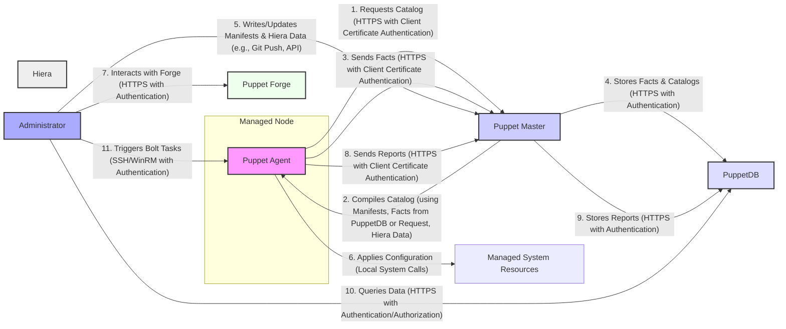
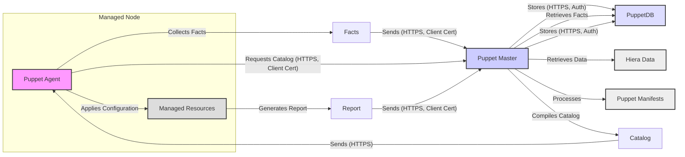

# Project Design Document: Puppet

**Version:** 1.1
**Date:** October 26, 2023
**Author:** AI Software Architect

## 1. Introduction

This document provides a comprehensive architectural design of the Puppet project, a leading open-source infrastructure-as-code (IaC) and configuration management tool. It details the system's components, their interactions, and data flows, with a specific focus on providing the necessary information for effective threat modeling. This document serves as a blueprint for understanding the system's inner workings and identifying potential security vulnerabilities.

## 2. Goals and Objectives

The fundamental goals of the Puppet project are:

* **Automated Infrastructure Management:** To streamline and automate the lifecycle management of IT infrastructure, including servers, network devices, operating systems, and applications.
* **Declarative Configuration:** To enable users to define the desired state of their infrastructure in a declarative manner, allowing Puppet to enforce that state.
* **Idempotent Operations:** To ensure that Puppet's operations are idempotent, meaning running the same configuration multiple times will result in the same desired state without unintended side effects.
* **Centralized Control and Visibility:** To provide a central point of control for managing configurations across a distributed infrastructure, offering improved visibility and consistency.
* **Compliance and Auditability:** To facilitate compliance with regulatory requirements and provide an audit trail of configuration changes.

## 3. System Architecture

Puppet employs a client-server architecture, featuring a central **Puppet Master** and numerous **Puppet Agents** deployed on managed nodes.

### 3.1. Core Components

* **Puppet Master:** The central server responsible for:
    * Authenticating and authorizing Puppet Agents.
    * Compiling catalogs based on manifests, facts, and Hiera data.
    * Managing and distributing code (manifests, modules).
    * Providing a central API for management and integration.
* **Puppet Agent:** The client-side application running on managed nodes, responsible for:
    * Requesting and receiving compiled catalogs from the Puppet Master.
    * Applying the configurations defined in the catalog to the local system.
    * Collecting and reporting facts about the node's state.
    * Sending reports on the outcome of configuration application.
* **Puppet Language (DSL):** A declarative, Ruby-based domain-specific language used to define infrastructure configurations in manifests. It allows users to describe the desired state of resources.
* **Puppet Catalog:** A JSON document compiled by the Puppet Master that describes the desired state of a specific node. It contains a list of resources and their desired properties.
* **Facts:** Key-value pairs representing attributes of a managed node, such as operating system, IP address, hostname, and hardware details. Facts are discovered by the Puppet Agent using Facter.
* **PuppetDB:** An optional but highly recommended, purpose-built database that stores:
    * Collected facts from Puppet Agents.
    * Compiled catalogs generated by the Puppet Master.
    * Reports on Puppet runs.
    PuppetDB enables efficient querying, reporting, and integration with other systems.
* **Hiera:** A hierarchical key-value lookup system that separates configuration data from Puppet code. It allows for flexible and data-driven configurations.
* **Puppet Forge:** A public repository of pre-built, shareable Puppet modules that encapsulate reusable configuration logic.
* **Bolt:** A task runner and orchestration tool that allows for ad-hoc command execution, script deployment, and workflow automation across managed nodes, independent of the regular Puppet agent runs.

### 3.2. Component Interactions

**Detailed Description of Interactions:**

1. **Agent Catalog Request:** The Puppet Agent initiates a connection to the Puppet Master over HTTPS. The agent authenticates itself using its client-side SSL certificate, which has been signed by the Puppet Master's Certificate Authority (CA).
2. **Catalog Compilation:** The Puppet Master compiles the catalog for the requesting agent. This process involves:
    * Retrieving the latest facts for the node from PuppetDB (if configured) or directly from the agent's request.
    * Processing Puppet manifests, which define the desired state of resources.
    * Looking up configuration data in Hiera based on the node's facts and configured hierarchy.
3. **Fact Submission:** The Puppet Agent gathers information about the node's current state (facts) using Facter and sends it to the Puppet Master over HTTPS, again using client certificate authentication.
4. **Fact and Catalog Storage:** The Puppet Master securely stores the received facts and the compiled catalog in PuppetDB over HTTPS. Authentication mechanisms are in place to ensure only authorized components can write to PuppetDB.
5. **Manifest and Hiera Data Management:** Administrators create or modify Puppet manifests and Hiera data. These files are typically stored in version control systems (like Git) and synchronized to the Puppet Master. Direct editing on the Master might also be possible.
6. **Configuration Application:** The Puppet Agent receives the compiled catalog from the Puppet Master and applies the configurations locally on the managed node. This involves creating, modifying, or deleting system resources (files, packages, services, etc.).
7. **Forge Interaction:** Administrators can interact with the Puppet Forge to browse, download, and manage pre-built Puppet modules. This interaction occurs over HTTPS with authentication.
8. **Report Submission:** After attempting to apply the configuration, the Puppet Agent generates a report detailing the outcome of the Puppet run (successes, failures, changes made). This report is sent to the Puppet Master over HTTPS using client certificate authentication.
9. **Report Storage:** The Puppet Master stores the received reports in PuppetDB over HTTPS, ensuring data integrity and auditability.
10. **Data Querying:** Administrators and other authorized systems can query PuppetDB for information about infrastructure state, configuration history, and reports. This communication is over HTTPS and requires authentication and authorization.
11. **Bolt Task Execution:** Administrators can use Bolt to execute ad-hoc commands or run predefined tasks on managed nodes. This typically uses SSH for Linux/macOS nodes and WinRM for Windows nodes, both requiring appropriate authentication credentials.

## 4. Data Flow

The primary data flows within the Puppet ecosystem are:

* **Facts Flow:**
    * Puppet Agent on a managed node collects facts about the node's current state.
    * Puppet Agent sends these facts to the Puppet Master over HTTPS, authenticated with a client certificate.
    * Puppet Master stores the received facts in PuppetDB over HTTPS, requiring authentication.
* **Catalog Flow:**
    * Puppet Agent requests a compiled catalog from the Puppet Master over HTTPS, authenticated with a client certificate.
    * Puppet Master retrieves necessary facts from PuppetDB or the agent's request.
    * Puppet Master retrieves relevant configuration data from Hiera.
    * Puppet Master processes Puppet manifests using the retrieved facts and Hiera data.
    * Puppet Master compiles the catalog representing the desired state of the node.
    * Puppet Master sends the compiled catalog to the requesting Puppet Agent over HTTPS.
* **Report Flow:**
    * Puppet Agent applies the configuration defined in the received catalog.
    * Puppet Agent generates a report detailing the outcome of the configuration application.
    * Puppet Agent sends the report to the Puppet Master over HTTPS, authenticated with a client certificate.
    * Puppet Master stores the received report in PuppetDB over HTTPS, requiring authentication.
* **Code Deployment Flow:**
    * Administrators write or update Puppet manifests and Hiera data, typically in a version control system.
    * These changes are deployed to the Puppet Master, making the new code available for catalog compilation.

## 5. Security Considerations

Security is paramount in Puppet deployments. Key considerations include:

* **Authentication and Authorization:**
    * **Puppet Agent to Master:** Agents authenticate with the Master using pre-signed SSL certificates. This prevents unauthorized agents from receiving configurations. Authorization is based on the agent's certificate name and the Master's configuration.
    * **Administrator Access to Master:** Access to the Puppet Master's administrative interfaces (e.g., web UI, API) should be secured using strong authentication mechanisms (e.g., password-based login with multi-factor authentication, certificate-based authentication). Role-Based Access Control (RBAC) should be implemented to limit access to specific functionalities.
    * **PuppetDB Access Control:** Access to PuppetDB should be restricted to authorized users and services. Authentication and authorization mechanisms provided by PuppetDB (e.g., certificate-based authentication, access control lists) should be configured.
    * **Bolt Authentication:** Bolt relies on SSH or WinRM for remote execution, requiring secure key management and strong password policies.
* **Confidentiality:**
    * **Sensitive Data Handling:** Avoid storing sensitive information (passwords, API keys, secrets) directly in Puppet manifests. Utilize Hiera with an appropriate secrets backend (e.g., HashiCorp Vault, AWS Secrets Manager) to encrypt and manage sensitive data.
    * **Communication Security:** All communication between Puppet components (Agent-Master, Master-PuppetDB) should be encrypted using TLS/SSL to protect data in transit. Ensure that strong cipher suites are configured.
    * **Code Confidentiality:** Protect Puppet code (manifests, modules, Hiera data) from unauthorized access. Implement appropriate file system permissions and access controls.
* **Integrity:**
    * **Code Integrity:** Employ version control systems (e.g., Git) to track changes to Puppet code and ensure its integrity. Implement code review processes to prevent malicious or erroneous code from being deployed. Consider using signing mechanisms for Puppet modules.
    * **Catalog Integrity:** The integrity of compiled catalogs is crucial. Ensure that the communication channels between the Master and Agents are secure to prevent tampering.
    * **Fact Integrity:** While less critical than catalog integrity, ensure that the fact collection process is not compromised to prevent the Master from making incorrect configuration decisions.
* **Availability:**
    * **Puppet Master High Availability:** Implement a high-availability setup for the Puppet Master (e.g., multiple masters behind a load balancer) to prevent a single point of failure from disrupting configuration management.
    * **PuppetDB High Availability:** Similarly, ensure the high availability of PuppetDB to maintain access to facts, catalogs, and reports.
* **Vulnerability Management:** Regularly update Puppet components (Master, Agent, PuppetDB) and their dependencies to patch known security vulnerabilities. Subscribe to security advisories and follow best practices for patching.
* **Secrets Management Best Practices:** Implement robust secrets management practices, including secure storage, rotation, and access control for all secrets used by Puppet.
* **Compliance and Auditing:** Implement logging and auditing mechanisms to track configuration changes and access to Puppet components. This is crucial for meeting compliance requirements. Regularly review audit logs for suspicious activity.

## 6. Deployment

Puppet offers flexible deployment options:

* **Standalone Master:** A single Puppet Master server manages all agents. This is suitable for smaller environments or development setups. It presents a single point of failure.
* **Multi-Master with Load Balancing:** Multiple Puppet Master servers are deployed behind a load balancer for high availability and increased capacity. Agents distribute their requests across the available Masters.
* **Compile Masters:** In large and complex environments, dedicated compile Masters can be used to offload the resource-intensive catalog compilation process from the primary Master(s). This improves performance and scalability.
* **Regional Masters:** For geographically distributed infrastructures, deploying Puppet Masters in different regions can improve performance and reduce latency for agents in those regions.
* **Cloud-Based Deployment:** Puppet Master and related components can be deployed on cloud platforms (AWS, Azure, GCP) using virtual machines or containerized solutions. Cloud-managed services can be leveraged for infrastructure components.

**Key Deployment Security Considerations:**

* **Secure Infrastructure:** Ensure the underlying infrastructure (servers, network) where Puppet components are deployed is securely configured and hardened.
* **Network Segmentation:** Implement network segmentation to isolate the Puppet infrastructure from other less trusted networks.
* **Firewall Rules:** Configure firewalls to allow only necessary traffic to and from Puppet components.
* **Operating System Hardening:** Harden the operating systems of Puppet Master and PuppetDB servers following security best practices.

## 7. Technology Stack

Puppet relies on the following key technologies:

* **Ruby:** The primary programming language for Puppet and Facter.
* **Facter:** A Ruby library used by Puppet Agent to discover and report facts about the system.
* **Puppet Language (DSL):** A domain-specific language built on Ruby.
* **PostgreSQL:** The recommended and commonly used database for PuppetDB.
* **SSL/TLS (OpenSSL):** For secure communication and certificate management.
* **Message Queues (e.g., RabbitMQ, Kafka):** Can be used for asynchronous communication and scaling in advanced Puppet deployments.
* **Web Servers (e.g., Apache HTTP Server, Nginx):** To serve the Puppet Master's web interface and API (using Passenger or similar).
* **Rack:** A modular Ruby web server interface used by Puppet Server.

## 8. Future Considerations

The Puppet project continues to evolve. Potential future enhancements and considerations include:

* **Enhanced Cloud Native Integration:** Deeper integration with container orchestration platforms like Kubernetes, including native resource types and operators.
* **Improved Orchestration and Workflow Automation:** Expanding Bolt's capabilities for more complex, multi-step workflows and integrations with other automation tools.
* **Policy-as-Code Enhancements:** Further development of policy enforcement and compliance features within the Puppet ecosystem.
* **Declarative Resource Management for Cloud Resources:** Expanding the ability to manage cloud-native resources declaratively through Puppet.
* **Improved Observability and Monitoring:** Enhancements to monitoring and logging capabilities for better insights into Puppet deployments.
* **Security Hardening and Best Practices:** Continuous efforts to improve the security posture of Puppet and provide guidance on secure deployment practices.

This detailed design document provides a comprehensive understanding of the Puppet project's architecture, data flows, and security considerations. It serves as a vital resource for threat modeling and for understanding the intricacies of this powerful configuration management tool.