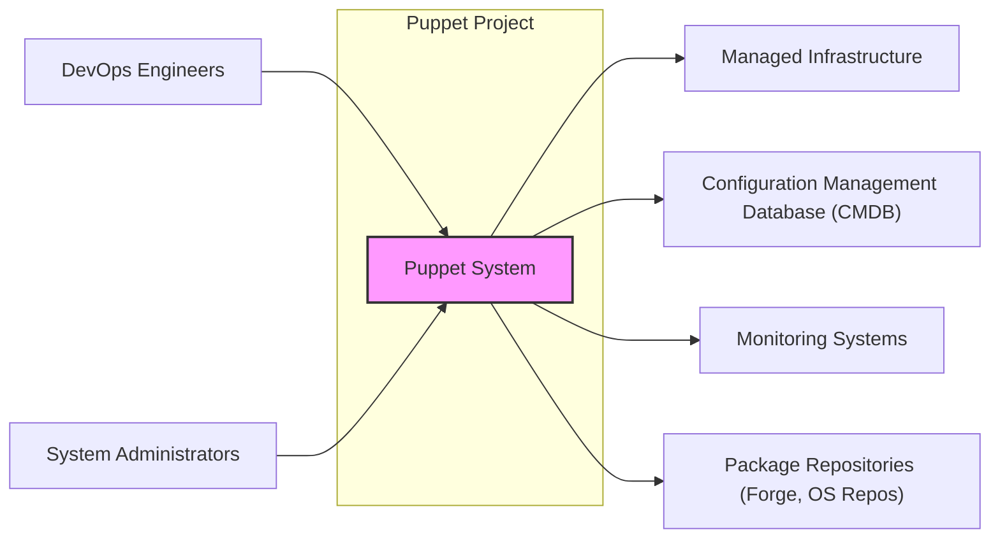
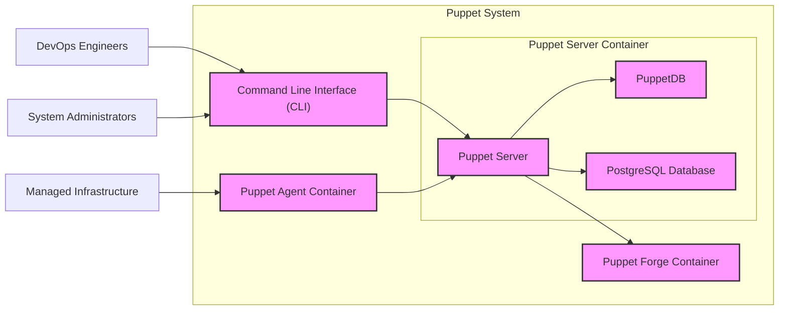
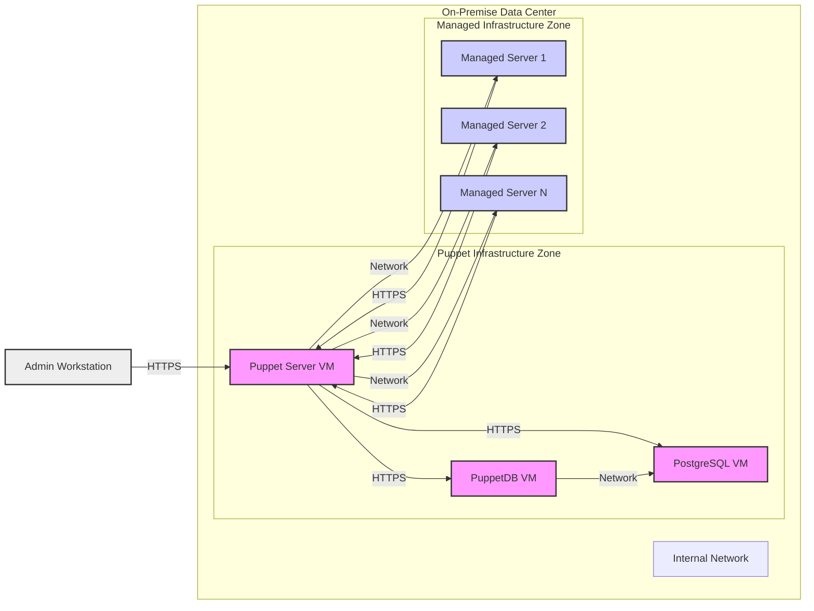
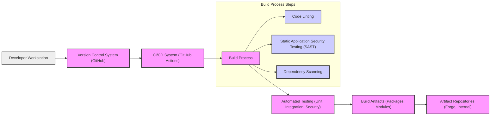

# BUSINESS POSTURE

The Puppet project aims to provide an infrastructure-as-code solution for automating the provisioning, configuration, and management of IT infrastructure. The primary business priorities and goals that Puppet addresses are:

- Infrastructure Automation: Automating repetitive and manual tasks related to infrastructure management, reducing operational overhead and human error.
- Configuration Management: Ensuring consistent and desired state configurations across all managed systems, improving system reliability and compliance.
- Scalability and Efficiency: Enabling organizations to manage infrastructure at scale efficiently, supporting business growth and agility.
- Compliance and Auditability: Providing a traceable and auditable system for infrastructure changes, facilitating compliance with regulatory requirements and internal policies.
- Reduced Downtime: Minimizing configuration drift and ensuring consistent system states, leading to reduced downtime and improved service availability.

Key business risks associated with these priorities and goals include:

- Misconfiguration Risk: Incorrect or unintended configurations deployed through Puppet could lead to system outages, performance degradation, or security vulnerabilities across the managed infrastructure.
- Security Vulnerability Risk: Vulnerabilities in the Puppet software itself or in the managed configurations could be exploited to compromise the managed infrastructure.
- Compliance Violation Risk: Failure to properly configure and manage systems using Puppet could result in non-compliance with industry regulations or internal security policies, leading to legal and financial repercussions.
- Operational Disruption Risk: Issues with the Puppet infrastructure (e.g., Puppet Server downtime) could disrupt infrastructure management operations and impact the ability to deploy critical updates or respond to incidents.
- Data Breach Risk: Exposure of sensitive configuration data managed by Puppet (e.g., credentials, secrets) could lead to unauthorized access and data breaches.

# SECURITY POSTURE

Existing security controls and accepted risks for the Puppet project, focusing on secure software development lifecycle and deployment model:

- security control: Code is hosted on GitHub, leveraging GitHub's security features for access control and code integrity. Implemented: GitHub repository settings and features.
- security control: Development workflow likely includes code reviews and pull requests before merging changes. Implemented: Development team processes, likely documented internally.
- security control: Puppet likely undergoes testing as part of the development process. Implemented: Development team processes, likely documented internally.
- security control: Puppet software is distributed as packages (e.g., RPM, DEB) and through the Puppet Forge, providing a degree of supply chain security through package signing and distribution channels. Implemented: Puppet release and distribution processes.
- accepted risk: Dependency vulnerabilities in Puppet's codebase and its dependencies. Accepted risk: Acknowledged risk in software development, mitigated through dependency scanning and updates.
- accepted risk: Misconfigurations in Puppet manifests and modules leading to security issues in managed infrastructure. Accepted risk: Inherent risk in configuration management, mitigated through testing, code reviews, and best practices.

Recommended security controls to implement as high priority:

- recommended security control: Implement automated Static Application Security Testing (SAST) and Dynamic Application Security Testing (DAST) in the CI/CD pipeline to identify vulnerabilities in Puppet codebase and modules.
- recommended security control: Integrate dependency scanning tools to automatically detect and alert on vulnerable dependencies used by Puppet.
- recommended security control: Implement secrets management practices to securely handle sensitive credentials and secrets used within Puppet configurations and modules.
- recommended security control: Enforce Role-Based Access Control (RBAC) within Puppet Server to restrict access to sensitive functionalities and data based on user roles.
- recommended security control: Implement regular vulnerability scanning and penetration testing of the Puppet infrastructure and managed environments.

Security requirements for the Puppet project:

- Authentication:
  - security requirement: Puppet Server should authenticate users (administrators, developers) accessing the web UI and API.
  - security requirement: Puppet Agents should securely authenticate to the Puppet Server.
  - security requirement: Mechanisms for authentication should support strong password policies and multi-factor authentication where applicable.
- Authorization:
  - security requirement: Puppet Server should enforce authorization policies to control access to resources and actions based on user roles and permissions.
  - security requirement: Puppet Agents should only be authorized to retrieve configurations and apply changes for the nodes they are responsible for.
  - security requirement: Authorization mechanisms should follow the principle of least privilege.
- Input Validation:
  - security requirement: Puppet Server and Agent should validate all inputs, including configurations, API requests, and data received from external sources, to prevent injection attacks and other input-related vulnerabilities.
  - security requirement: Input validation should be applied to both data format and content.
- Cryptography:
  - security requirement: Sensitive data transmitted between Puppet Server and Agents should be encrypted in transit using TLS/HTTPS.
  - security requirement: Sensitive data at rest, such as secrets stored within Puppet Server or PuppetDB, should be encrypted.
  - security requirement: Cryptographic algorithms and key management practices should adhere to industry best practices and standards.

# DESIGN

## C4 CONTEXT

Context Diagram Elements:

- Element:
  - Name: Puppet System
  - Type: Software System
  - Description: The Puppet infrastructure-as-code solution for automating IT infrastructure management. It includes Puppet Server, Agent, and related components.
  - Responsibilities: Automating infrastructure provisioning, configuration management, ensuring desired system states, providing audit trails, and facilitating compliance.
  - Security controls: Authentication, authorization, input validation, encryption of data in transit and at rest, secure software development lifecycle.

- Element:
  - Name: DevOps Engineers
  - Type: User
  - Description: Users responsible for developing, deploying, and managing applications and infrastructure using DevOps practices. They interact with Puppet to define and manage infrastructure configurations.
  - Responsibilities: Defining infrastructure as code using Puppet language, creating and managing Puppet modules, and using Puppet to deploy and manage applications.
  - Security controls: Authentication to access Puppet Server, authorization based on roles to manage configurations and infrastructure.

- Element:
  - Name: System Administrators
  - Type: User
  - Description: Users responsible for the day-to-day operations and maintenance of IT systems. They use Puppet to ensure system consistency, apply updates, and troubleshoot configuration issues.
  - Responsibilities: Monitoring system health, using Puppet to apply configuration changes, troubleshooting configuration issues, and ensuring system compliance.
  - Security controls: Authentication to access Puppet Server, authorization based on roles to manage and monitor infrastructure.

- Element:
  - Name: Managed Infrastructure
  - Type: Software System / Infrastructure
  - Description: The IT infrastructure being managed by Puppet. This includes servers, virtual machines, cloud resources, network devices, and other infrastructure components.
  - Responsibilities: Running applications and services, providing computing resources, and adhering to configurations enforced by Puppet.
  - Security controls: Security configurations applied by Puppet (e.g., firewall rules, user accounts, security patches), security monitoring, and vulnerability management.

- Element:
  - Name: Configuration Management Database (CMDB)
  - Type: Software System
  - Description: A system that stores information about hardware and software assets and their configurations. Puppet may integrate with a CMDB to synchronize configuration data or report on managed infrastructure.
  - Responsibilities: Providing a central repository for configuration information, tracking asset inventory, and potentially integrating with Puppet for data synchronization.
  - Security controls: Access control to CMDB data, data integrity measures, and secure API integration with Puppet.

- Element:
  - Name: Monitoring Systems
  - Type: Software System
  - Description: Systems used to monitor the health and performance of the managed infrastructure and applications. Puppet may integrate with monitoring systems to provide configuration status and trigger alerts.
  - Responsibilities: Monitoring system performance and availability, alerting on issues, and potentially integrating with Puppet to correlate configuration changes with system behavior.
  - Security controls: Secure API integration with Puppet, access control to monitoring data, and secure data transmission.

- Element:
  - Name: Package Repositories (Forge, OS Repos)
  - Type: Software System
  - Description: Repositories that provide software packages and modules used by Puppet. This includes the Puppet Forge for community modules and OS-specific package repositories (e.g., apt, yum).
  - Responsibilities: Providing software packages and Puppet modules, ensuring package integrity, and managing package dependencies.
  - Security controls: Package signing, vulnerability scanning of packages, and secure access to repositories.

## C4 CONTAINER

Container Diagram Elements:

- Element:
  - Name: Puppet Server
  - Type: Container / Application
  - Description: The central component of Puppet, responsible for compiling catalogs, managing agents, and providing APIs for user interaction. Implemented in Ruby and runs on a JVM.
  - Responsibilities: Catalog compilation, agent management, API endpoint for CLI and Forge, authentication and authorization, configuration data management.
  - Security controls: Authentication (user and agent), authorization (RBAC), input validation, TLS/HTTPS for communication, secure configuration management, logging and auditing.

- Element:
  - Name: Puppet Agent
  - Type: Container / Application
  - Description: Runs on managed nodes and communicates with the Puppet Server to retrieve and apply configurations. Implemented in Ruby.
  - Responsibilities: Requesting catalogs from Puppet Server, applying configurations, reporting status back to the server, local resource management.
  - Security controls: Agent authentication to Puppet Server, secure catalog retrieval (TLS/HTTPS), local authorization for configuration application, input validation of received catalogs.

- Element:
  - Name: PuppetDB
  - Type: Container / Database
  - Description: A data warehouse that collects and stores data generated by Puppet, such as node configurations, reports, and events.
  - Responsibilities: Storing and querying Puppet data, providing data for reporting and analysis, supporting Puppet Server operations.
  - Security controls: Access control to PuppetDB data, data encryption at rest (if configured), secure communication with Puppet Server, input validation of data received from Puppet Server.

- Element:
  - Name: PostgreSQL Database
  - Type: Container / Database
  - Description: The database used by PuppetDB to store its data.
  - Responsibilities: Persistent storage of PuppetDB data, database management, ensuring data integrity and availability.
  - Security controls: Database access control, data encryption at rest (if configured), regular backups, database hardening, and security patching.

- Element:
  - Name: Command Line Interface (CLI)
  - Type: Application
  - Description: A command-line tool used by administrators and developers to interact with the Puppet Server, manage configurations, and perform administrative tasks.
  - Responsibilities: Providing a command-line interface for Puppet management, interacting with Puppet Server API, facilitating configuration development and testing.
  - Security controls: Authentication to Puppet Server API, authorization based on user roles, secure handling of credentials, input validation of user commands.

- Element:
  - Name: Puppet Forge
  - Type: Container / Web Application
  - Description: A web-based repository for sharing and discovering Puppet modules.
  - Responsibilities: Hosting and distributing Puppet modules, providing a platform for community module sharing, module metadata management.
  - Security controls: User authentication and authorization, module signing and verification, vulnerability scanning of modules, input validation for module uploads and downloads, protection against web application vulnerabilities.

## DEPLOYMENT

Deployment Architecture: On-Premise Deployment

This deployment architecture describes a typical on-premise deployment of Puppet, suitable for organizations managing infrastructure within their own data centers.

Deployment Diagram Elements:

- Element:
  - Name: Puppet Server VM
  - Type: Virtual Machine
  - Description: Virtual machine hosting the Puppet Server application.
  - Responsibilities: Running Puppet Server, managing agents, compiling catalogs, providing APIs.
  - Security controls: Operating system hardening, network firewall rules, access control to VM, regular security patching, TLS/HTTPS configuration for Puppet Server.

- Element:
  - Name: PuppetDB VM
  - Type: Virtual Machine
  - Description: Virtual machine hosting the PuppetDB application.
  - Responsibilities: Running PuppetDB, storing and querying Puppet data.
  - Security controls: Operating system hardening, network firewall rules, access control to VM, regular security patching, access control to PuppetDB application.

- Element:
  - Name: PostgreSQL VM
  - Type: Virtual Machine
  - Description: Virtual machine hosting the PostgreSQL database for PuppetDB.
  - Responsibilities: Running PostgreSQL database, storing PuppetDB data persistently.
  - Security controls: Operating system hardening, network firewall rules, database access control, regular security patching, database hardening, data encryption at rest (if configured).

- Element:
  - Name: Managed Server 1, 2, N
  - Type: Physical/Virtual Servers
  - Description: Example servers being managed by Puppet Agents.
  - Responsibilities: Running applications and services, being configured and managed by Puppet Agent.
  - Security controls: Operating system hardening, Puppet Agent for configuration enforcement, security configurations applied by Puppet, security monitoring on servers.

- Element:
  - Name: Admin Workstation
  - Type: Physical Workstation
  - Description: Workstation used by administrators to access and manage the Puppet infrastructure.
  - Responsibilities: Accessing Puppet Server web UI and CLI, managing Puppet configurations.
  - Security controls: Workstation hardening, strong authentication, access control, and potentially multi-factor authentication for accessing Puppet infrastructure.

- Element:
  - Name: Internal Network
  - Type: Network
  - Description: The internal network connecting all components within the on-premise data center.
  - Responsibilities: Providing network connectivity between Puppet components and managed infrastructure.
  - Security controls: Network segmentation, firewall rules to restrict traffic flow, network monitoring, and intrusion detection systems.

## BUILD

Build Process Description:

The Puppet project build process typically involves the following steps, focusing on security controls:

1. Developer Workstation: Developers write code, including Puppet modules and core Puppet components, on their local workstations. Security controls: Secure coding practices, workstation security hardening, and code review before committing.
2. Version Control System (GitHub): Code is committed to a version control system, such as GitHub. Security controls: Access control to the repository, branch protection rules, code review process enforced through pull requests.
3. CI/CD System (GitHub Actions): A CI/CD system, like GitHub Actions, is triggered upon code changes in the repository. Security controls: Secure CI/CD pipeline configuration, access control to CI/CD system, and audit logging.
4. Build Process: The CI/CD system executes the build process, which includes:
    - Code Linting: Automated linters check the code for style and potential errors. Security controls: Automated code quality checks to identify potential security issues and coding flaws.
    - Static Application Security Testing (SAST): SAST tools analyze the source code for security vulnerabilities. Security controls: Early detection of potential vulnerabilities in the codebase.
    - Dependency Scanning: Tools scan project dependencies for known vulnerabilities. Security controls: Identification of vulnerable dependencies to ensure supply chain security.
5. Automated Testing: Automated tests, including unit tests, integration tests, and security tests, are executed. Security controls: Verification of code functionality and security properties through automated testing.
6. Build Artifacts: If tests pass, build artifacts are created, such as packages (RPM, DEB) for Puppet Server and Agent, and Puppet modules. Security controls: Artifact signing to ensure integrity and authenticity.
7. Artifact Repositories: Build artifacts are published to artifact repositories, such as the Puppet Forge for modules and internal repositories for Puppet packages. Security controls: Access control to artifact repositories, secure artifact storage, and vulnerability scanning of published artifacts.

# RISK ASSESSMENT

Critical business processes protected by Puppet:

- Infrastructure Provisioning: Automating the creation and setup of new infrastructure resources.
- Configuration Management: Ensuring consistent and desired configurations across all managed systems.
- Application Deployment: Deploying and configuring applications on managed infrastructure.
- Compliance Enforcement: Enforcing security and compliance policies across the IT environment.
- Incident Response: Facilitating rapid and consistent remediation of security incidents through automated configuration changes.

Data being protected and its sensitivity:

- Configuration Data: Puppet manages sensitive configuration data, including:
  - Credentials (passwords, API keys, certificates) used for system access and authentication. Sensitivity: High. Exposure could lead to unauthorized access and system compromise.
  - Network Configurations (firewall rules, routing tables). Sensitivity: High. Misconfiguration or exposure could disrupt network operations or create security vulnerabilities.
  - Application Configurations. Sensitivity: Medium to High, depending on the application and data it handles. Misconfiguration could lead to application vulnerabilities or data breaches.
- System Inventory Data: PuppetDB stores information about managed nodes, including hardware and software inventory, and configuration status. Sensitivity: Medium. Exposure could provide attackers with information about the IT environment.
- Audit Logs: Puppet generates audit logs of configuration changes and user activities. Sensitivity: Medium. Logs are important for security monitoring and incident investigation.

# QUESTIONS & ASSUMPTIONS

Questions:

- What specific security features are currently implemented in Puppet Server and Agent for authentication, authorization, and encryption?
- What type of vulnerability scanning and penetration testing is currently performed on the Puppet project and infrastructure?
- What secrets management solution is recommended or currently used for managing sensitive credentials within Puppet configurations?
- What is the process for security patching and updating Puppet Server and Agents in a deployed environment?
- Are there specific compliance requirements (e.g., PCI DSS, HIPAA) that Puppet is designed to help organizations meet?

Assumptions:

- Puppet project follows secure software development lifecycle best practices, including code reviews and testing.
- Puppet deployments are typically within enterprise environments with existing security infrastructure and policies.
- Security is a significant concern for Puppet users, and the project prioritizes addressing security vulnerabilities and providing secure configuration management capabilities.
- The provided GitHub repository represents the core Puppet project and its related components.
- The described on-premise deployment architecture is a common and representative deployment scenario for Puppet.