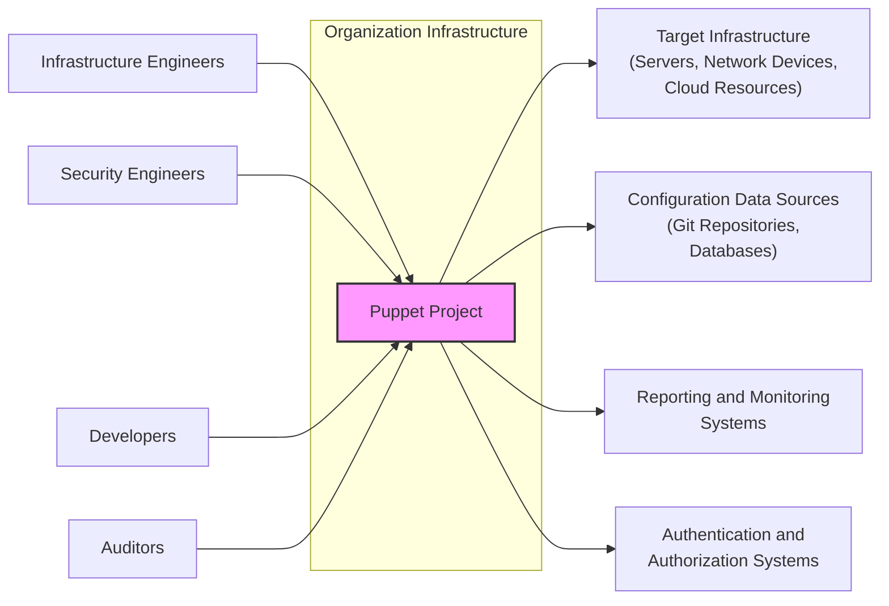
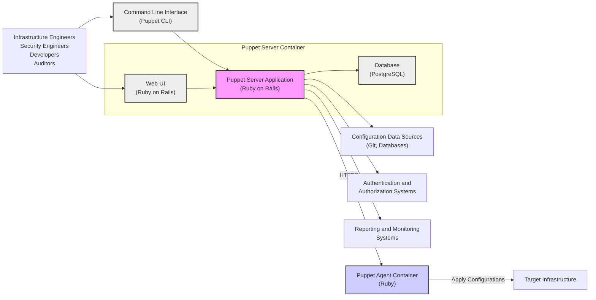
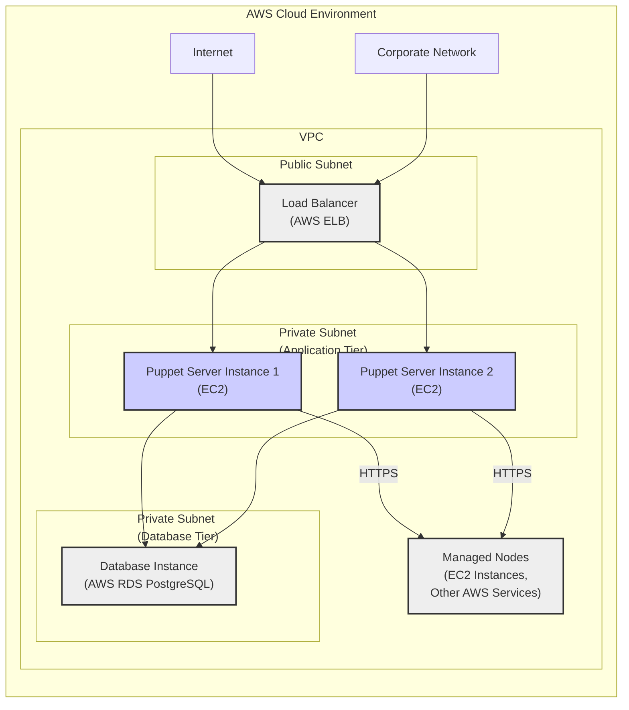
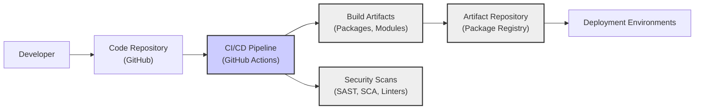

# BUSINESS POSTURE

- Business Priorities and Goals:
  - Automate infrastructure configuration management to ensure consistency and reduce manual errors.
  - Improve operational efficiency by automating repetitive tasks related to system provisioning and configuration.
  - Enforce compliance and security policies across the infrastructure.
  - Enable faster and more reliable deployments of applications and services.
  - Scale infrastructure management to handle growing environments.
- Business Risks:
  - Misconfiguration of infrastructure leading to service disruptions and downtime.
  - Security vulnerabilities introduced through misconfigurations or insecure configurations.
  - Unauthorized access to infrastructure due to mismanaged credentials or access controls.
  - Compliance violations resulting from inconsistent or non-compliant configurations.
  - Operational disruptions due to failures in the automation system itself.

# SECURITY POSTURE

- Existing Security Controls:
  - security control: Code review process for contributions to the Puppet codebase. Implemented in GitHub pull request workflow.
  - security control: Access control to the GitHub repository. Implemented in GitHub repository settings.
  - security control: Release management process with versioning and tagging. Implemented in GitHub release workflow and project documentation.
- Accepted Risks:
  - accepted risk: Open source nature of the project implies public visibility of the codebase, potentially exposing implementation details to attackers.
  - accepted risk: Reliance on community contributions introduces potential risks of malicious or vulnerable code being introduced if not properly vetted.
- Recommended Security Controls:
  - security control: Implement automated Static Application Security Testing (SAST) and Dynamic Application Security Testing (DAST) in the CI/CD pipeline.
  - security control: Implement Software Composition Analysis (SCA) to manage and monitor dependencies for known vulnerabilities.
  - security control: Enhance supply chain security by verifying the integrity and authenticity of dependencies and build artifacts.
  - security control: Develop and implement an incident response plan specific to Puppet infrastructure and related security incidents.
  - security control: Conduct regular security awareness training for developers and operators working with Puppet.
- Security Requirements:
  - Authentication:
    - Requirement: Puppet Server should authenticate agents connecting to it.
    - Requirement: Users accessing Puppet Server web UI or CLI should be authenticated.
    - Requirement: Mechanisms for secure authentication should be configurable and support strong authentication methods.
  - Authorization:
    - Requirement: Implement role-based access control (RBAC) to manage user permissions within Puppet Server.
    - Requirement: Agents should be authorized to perform actions on managed nodes based on defined policies.
    - Requirement: Access to sensitive configuration data and secrets should be restricted based on authorization policies.
  - Input Validation:
    - Requirement: All inputs to Puppet Server and Agents, including configuration data and API requests, must be validated to prevent injection attacks.
    - Requirement: Configuration language (Puppet DSL) should be designed to minimize risks of insecure configurations.
    - Requirement: Validate data received from external systems and data sources.
  - Cryptography:
    - Requirement: Protect sensitive data at rest and in transit using encryption.
    - Requirement: Securely manage cryptographic keys used for encryption and authentication.
    - Requirement: Utilize TLS/SSL for communication between Puppet Server and Agents, and between users and Puppet Server.
    - Requirement: Securely handle secrets and credentials within Puppet configurations, potentially using dedicated secrets management solutions.

# DESIGN

## C4 CONTEXT

- Context Diagram Elements:
  - Element:
    - Name: Puppet Project
    - Type: Software System
    - Description: Open-source configuration management tool for automating infrastructure provisioning and management.
    - Responsibilities: Define and enforce desired state of infrastructure, automate configuration tasks, provide reporting and auditing capabilities.
    - Security controls: Authentication and authorization of users and agents, input validation of configurations, secure storage and transmission of configuration data, audit logging.
  - Element:
    - Name: Infrastructure Engineers
    - Type: Person
    - Description: Users responsible for managing and maintaining the organization's IT infrastructure.
    - Responsibilities: Define infrastructure configurations using Puppet, manage Puppet infrastructure, monitor infrastructure state, troubleshoot configuration issues.
    - Security controls: Authentication to access Puppet Server and related systems, authorization to manage configurations and infrastructure resources.
  - Element:
    - Name: Security Engineers
    - Type: Person
    - Description: Users responsible for ensuring the security of the organization's IT infrastructure.
    - Responsibilities: Define security policies and configurations in Puppet, audit Puppet configurations for security compliance, monitor Puppet infrastructure for security threats.
    - Security controls: Authentication to access Puppet Server and security-related configurations, authorization to manage security policies and audit logs.
  - Element:
    - Name: Developers
    - Type: Person
    - Description: Users who develop and deploy applications and services on the infrastructure managed by Puppet.
    - Responsibilities: Define application deployment configurations using Puppet, integrate application deployments with Puppet automation.
    - Security controls: Authentication to access Puppet for application deployment configurations, authorization to deploy applications to specific environments.
  - Element:
    - Name: Auditors
    - Type: Person
    - Description: Users responsible for auditing the compliance and security of the IT infrastructure.
    - Responsibilities: Review Puppet configurations and audit logs for compliance and security violations, generate reports on infrastructure state and compliance.
    - Security controls: Read-only access to Puppet configurations and audit logs, authentication and authorization for audit access.
  - Element:
    - Name: Target Infrastructure (Servers, Network Devices, Cloud Resources)
    - Type: Software System / Infrastructure
    - Description: The IT infrastructure being managed by Puppet, including servers, network devices, cloud resources, and other infrastructure components.
    - Responsibilities: Execute configurations applied by Puppet Agents, host applications and services, provide infrastructure resources.
    - Security controls: Host-based security controls, network security controls, cloud provider security controls, configuration hardening applied by Puppet.
  - Element:
    - Name: Configuration Data Sources (Git Repositories, Databases)
    - Type: Software System
    - Description: External systems that store configuration data used by Puppet, such as Git repositories for Puppet code and databases for external data.
    - Responsibilities: Store and manage configuration data, provide version control for configurations, provide data to Puppet for configuration management.
    - Security controls: Access control to configuration data sources, encryption of sensitive data at rest, version control and audit logging of configuration changes.
  - Element:
    - Name: Reporting and Monitoring Systems
    - Type: Software System
    - Description: Systems used to monitor the health and performance of the infrastructure managed by Puppet and to generate reports on infrastructure state.
    - Responsibilities: Collect metrics and logs from Puppet infrastructure, provide dashboards and alerts, generate reports on infrastructure state and compliance.
    - Security controls: Secure collection and storage of monitoring data, access control to monitoring dashboards and reports.
  - Element:
    - Name: Authentication and Authorization Systems
    - Type: Software System
    - Description: External systems used for user authentication and authorization, such as LDAP, Active Directory, or OAuth providers.
    - Responsibilities: Authenticate users and agents, provide authorization information to Puppet Server.
    - Security controls: Secure authentication protocols, secure storage of user credentials, robust authorization policies.

## C4 CONTAINER

- Container Diagram Elements:
  - Element:
    - Name: Puppet Server Application
    - Type: Application
    - Description: The core application of Puppet Server, responsible for compiling catalogs, managing agents, and providing APIs. Implemented in Ruby on Rails.
    - Responsibilities: Compile configurations into catalogs, manage agent connections, provide APIs for agents and CLI, enforce authorization policies.
    - Security controls: Authentication and authorization for API access, input validation of API requests, secure catalog compilation, secure communication with agents (HTTPS), secure access to database.
  - Element:
    - Name: Web UI
    - Type: Application
    - Description: Web-based user interface for Puppet Server, providing access to reports, node management, and other features. Implemented in Ruby on Rails.
    - Responsibilities: Provide a graphical interface for managing Puppet infrastructure, display reports and logs, allow user interactions with Puppet Server.
    - Security controls: Authentication and authorization for web UI access, input validation of user inputs, protection against common web vulnerabilities (XSS, CSRF, etc.), secure session management.
  - Element:
    - Name: Database
    - Type: Database
    - Description: Persistent storage for Puppet Server data, including configurations, reports, and node information. Typically PostgreSQL.
    - Responsibilities: Store and retrieve Puppet Server data, ensure data integrity and availability.
    - Security controls: Access control to the database, encryption of data at rest (if required), regular backups, database hardening, secure database configuration.
  - Element:
    - Name: Puppet Agent Container
    - Type: Application
    - Description: Software running on managed nodes that retrieves configurations from Puppet Server and applies them. Implemented in Ruby.
    - Responsibilities: Communicate with Puppet Server, retrieve compiled catalogs, apply configurations to the managed node, report status back to Puppet Server.
    - Security controls: Agent authentication to Puppet Server (certificate-based), secure communication with Puppet Server (HTTPS), secure execution of configurations, local access control on managed node.
  - Element:
    - Name: Command Line Interface (Puppet CLI)
    - Type: Application
    - Description: Command-line tool for interacting with Puppet Server, used by administrators and developers.
    - Responsibilities: Allow users to interact with Puppet Server via command line, trigger catalog compilations, retrieve reports, manage Puppet infrastructure.
    - Security controls: Authentication and authorization for CLI access, secure communication with Puppet Server (HTTPS), secure handling of user credentials.
  - Element:
    - Name: Configuration Data Sources (Git, Databases)
    - Type: External System
    - Description: External systems providing configuration data to Puppet Server.
    - Responsibilities: Provide configuration data to Puppet Server.
    - Security controls: Access control to configuration data, secure storage and transmission of configuration data.
  - Element:
    - Name: Target Infrastructure
    - Type: Infrastructure
    - Description: The infrastructure being managed by Puppet Agents.
    - Responsibilities: Execute configurations applied by Puppet Agents.
    - Security controls: Host-based security controls, network security controls, configuration hardening applied by Puppet.
  - Element:
    - Name: Authentication and Authorization Systems
    - Type: External System
    - Description: External systems used for authentication and authorization.
    - Responsibilities: Authenticate users and agents, provide authorization information.
    - Security controls: Secure authentication protocols, secure authorization mechanisms.
  - Element:
    - Name: Reporting and Monitoring Systems
    - Type: External System
    - Description: External systems for monitoring and reporting.
    - Responsibilities: Collect and display monitoring data from Puppet infrastructure.
    - Security controls: Secure data collection and transmission, access control to monitoring data.
  - Element:
    - Name: Infrastructure Engineers, Security Engineers, Developers, Auditors
    - Type: Person
    - Description: Users interacting with the Puppet system.
    - Responsibilities: Manage and use Puppet for infrastructure automation, security, development, and auditing.
    - Security controls: User authentication and authorization.

## DEPLOYMENT

- Deployment Options:
  - On-Premises Deployment: Puppet Server and Database deployed on physical or virtual servers within the organization's data center. Agents deployed on managed infrastructure within the same network.
  - Cloud Deployment: Puppet Server and Database deployed on cloud infrastructure (e.g., AWS, Azure, GCP). Agents deployed on cloud-based infrastructure.
  - Hybrid Deployment: Puppet Server and Database deployed on-premises or in the cloud, managing infrastructure across both on-premises and cloud environments.

- Detailed Deployment (Cloud Deployment - AWS Example):

- Deployment Diagram Elements:
  - Element:
    - Name: Load Balancer (AWS ELB)
    - Type: Infrastructure Service
    - Description: AWS Elastic Load Balancer distributing traffic to Puppet Server instances.
    - Responsibilities: Load balancing incoming requests to Puppet Server instances, providing high availability and scalability.
    - Security controls: HTTPS termination, security groups to control inbound traffic, DDoS protection provided by AWS.
  - Element:
    - Name: Puppet Server Instance (EC2)
    - Type: Compute Instance
    - Description: EC2 instances running Puppet Server application.
    - Responsibilities: Host Puppet Server application, compile catalogs, manage agents, provide APIs.
    - Security controls: Instance hardening, security groups to control inbound and outbound traffic, access control to EC2 instances, regular patching, intrusion detection systems (IDS).
  - Element:
    - Name: Database Instance (AWS RDS PostgreSQL)
    - Type: Database Service
    - Description: AWS RDS PostgreSQL instance for persistent storage of Puppet Server data.
    - Responsibilities: Store and manage Puppet Server data, ensure data availability and durability.
    - Security controls: Database access control, encryption at rest and in transit, regular backups, database hardening, security groups to control database access, database monitoring.
  - Element:
    - Name: Managed Nodes (EC2 Instances, Other AWS Services)
    - Type: Compute Instance / Cloud Service
    - Description: EC2 instances and other AWS services being managed by Puppet Agents.
    - Responsibilities: Execute configurations applied by Puppet Agents, host applications and services.
    - Security controls: Host-based security controls, security groups, IAM roles for access control, configuration hardening applied by Puppet Agents, regular patching.
  - Element:
    - Name: Internet
    - Type: Network
    - Description: Public internet for external access to Puppet Server (e.g., for web UI or API).
    - Responsibilities: Provide external network connectivity.
    - Security controls: Firewall rules, DDoS protection, intrusion prevention systems (IPS).
  - Element:
    - Name: Corporate Network
    - Type: Network
    - Description: Organization's internal network for internal access to Puppet Server.
    - Responsibilities: Provide internal network connectivity.
    - Security controls: Firewall rules, network segmentation, VPN access (if needed).

## BUILD

- Build Process:
  - Developer commits code changes to the Code Repository (GitHub).
  - CI/CD Pipeline (GitHub Actions) is triggered on code changes.
  - CI/CD Pipeline performs the following steps:
    - Build Artifacts: Compiles and packages the Puppet project into distributable artifacts (e.g., packages, modules).
    - Security Scans: Runs automated security scans, including:
      - Static Application Security Testing (SAST) to identify potential vulnerabilities in the code.
      - Software Composition Analysis (SCA) to identify vulnerabilities in dependencies.
      - Linters to enforce code quality and style guidelines, which can indirectly improve security.
    - Artifact Repository: Publishes the build artifacts to an artifact repository (e.g., package registry, GitHub Packages).
  - Deployment Environments consume build artifacts from the Artifact Repository for deployment.

- Build Security Controls:
  - security control: Secure Code Repository (GitHub) with access controls and audit logging.
  - security control: Automated CI/CD Pipeline (GitHub Actions) to ensure consistent and repeatable builds.
  - security control: Security Scanning (SAST, SCA, Linters) integrated into the CI/CD pipeline to identify and address vulnerabilities early in the development lifecycle.
  - security control: Artifact Repository (Package Registry) with access controls to protect build artifacts from unauthorized access and modification.
  - security control: Supply chain security measures to verify the integrity and authenticity of dependencies used in the build process.
  - security control: Code signing of build artifacts to ensure integrity and authenticity.
  - security control: Build environment hardening to minimize the risk of build system compromise.

# RISK ASSESSMENT

- Critical Business Processes:
  - Infrastructure Provisioning: Automating the setup and configuration of new infrastructure components.
  - Configuration Management: Ensuring consistent and compliant configurations across the infrastructure.
  - Application Deployment: Automating the deployment of applications and services to the infrastructure.
  - Compliance Enforcement: Enforcing security and compliance policies through automated configurations.
  - Incident Remediation: Automating the response to and remediation of infrastructure incidents.
- Data to Protect and Sensitivity:
  - Configuration Data:
    - Sensitivity: High. Configuration data may contain sensitive information such as credentials, API keys, and security policies. Confidentiality, Integrity, and Availability are critical.
  - Audit Logs:
    - Sensitivity: Medium. Audit logs contain information about system activities and user actions, important for security monitoring and compliance. Integrity and Availability are important.
  - System State Data:
    - Sensitivity: Medium. System state data reflects the current configuration and status of the infrastructure. Integrity and Availability are important for operational visibility.

# QUESTIONS & ASSUMPTIONS

- Questions:
  - What are the specific compliance requirements for the target infrastructure (e.g., PCI DSS, HIPAA, SOC 2)?
  - What are the organization's specific security policies and standards that need to be enforced by Puppet?
  - What are the preferred authentication and authorization mechanisms for users and agents?
  - What are the specific deployment environments (on-premises, cloud, hybrid) and their security characteristics?
  - What existing security monitoring and incident response capabilities are in place that Puppet needs to integrate with?
  - What is the organization's risk appetite regarding open source software and supply chain security?

- Assumptions:
  - The organization prioritizes security and compliance for its IT infrastructure.
  - The organization has a need for automated infrastructure management and configuration.
  - The organization is using or planning to use cloud infrastructure (at least partially).
  - The organization has a development and operations team responsible for managing the infrastructure and applications.
  - Standard security best practices are expected to be implemented for the Puppet project and its deployment.