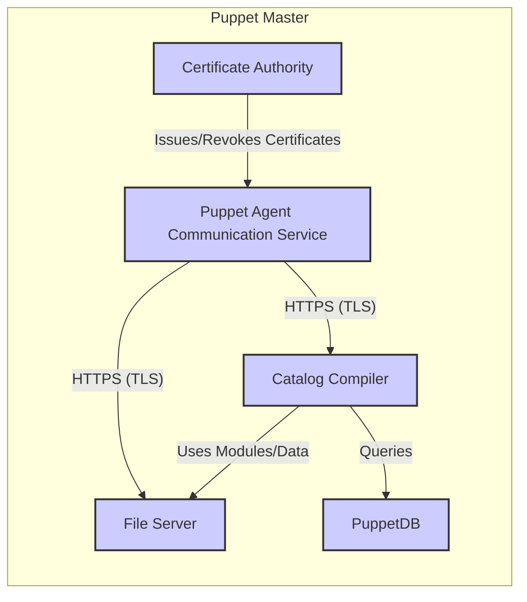
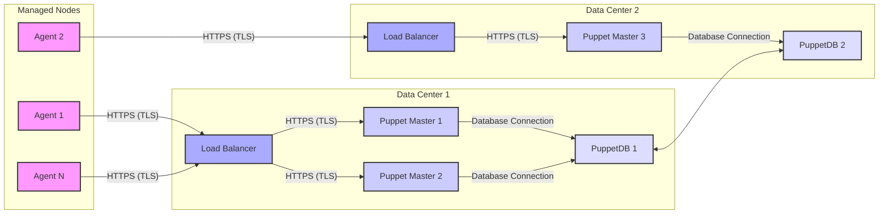

Okay, let's create a design document for the Puppet project, focusing on aspects relevant for threat modeling.

# BUSINESS POSTURE

Puppet is a mature, widely-used configuration management tool. It's crucial for maintaining infrastructure consistency and automating deployments across a wide range of organizations, from small businesses to large enterprises.  The business priorities and goals that Puppet addresses are:

*   Efficiency: Automating system configuration and reducing manual intervention.
*   Consistency: Ensuring that systems are configured identically and according to defined standards.
*   Scalability: Managing a large number of systems (physical, virtual, or cloud-based) effectively.
*   Compliance: Meeting regulatory and internal policy requirements for system configuration.
*   Reduced Downtime: Minimizing errors and enabling faster recovery from failures.
*   Cost Reduction: Through automation, consistency, and reduced downtime.

Based on these priorities, the most important business risks that need to be addressed are:

*   Unauthorized Configuration Changes: Malicious or accidental changes that could disrupt services, expose sensitive data, or violate compliance.
*   Compromise of the Puppet Master: If the central Puppet Master is compromised, an attacker could gain control over all managed nodes.
*   Supply Chain Attacks: Compromised Puppet modules or dependencies could introduce vulnerabilities into the managed infrastructure.
*   Data Breaches: Sensitive data stored within Puppet manifests or passed as parameters could be exposed if not properly protected.
*   Denial of Service: Attacks targeting the Puppet Master or agents could disrupt configuration management and prevent updates.
*   Lack of Auditability: Inability to track who made what changes and when, hindering incident response and compliance.

# SECURITY POSTURE

Puppet has several built-in security controls and also relies on best practices in secure software development and deployment.

Existing Security Controls:

*   security control: TLS Encryption: Communication between the Puppet Master and agents is encrypted using TLS, protecting data in transit. Implemented in Puppet's communication protocol.
*   security control: Certificate-Based Authentication: Puppet uses X.509 certificates to authenticate agents and the master, preventing unauthorized connections. Implemented in Puppet's communication protocol.
*   security control: Role-Based Access Control (RBAC): Puppet Enterprise (the commercial version) offers RBAC to restrict access to specific resources and actions within the Puppet infrastructure. Implemented in Puppet Enterprise.
*   security control: Code Signing: Puppet modules can be signed to verify their integrity and authenticity. Implemented in the Puppet Forge and module development workflow.
*   security control: Auditing: Puppet provides detailed logs of configuration changes and agent activity. Implemented in Puppet's logging system.
*   security control: Hiera: Data separation from code. Implemented in Puppet's data lookup system.

Accepted Risks:

*   accepted risk: Default configurations may not be secure. Users are responsible for reviewing and hardening default settings.
*   accepted risk: Reliance on external security controls. Puppet relies on the underlying operating system and network for some security measures (e.g., firewall, SELinux).
*   accepted risk: Module security is the responsibility of the module author. While code signing helps, users must still vet the modules they use.
*   accepted risk: Plaintext secrets in manifests. Storing secrets directly in Puppet manifests is discouraged but possible, creating a risk.

Recommended Security Controls:

*   Secrets Management Integration: Integrate with a dedicated secrets management solution (e.g., HashiCorp Vault, CyberArk Conjur) to securely store and retrieve sensitive data.
*   Enhanced Input Validation: Implement stricter input validation in custom Puppet modules and manifests to prevent injection attacks.
*   Regular Security Audits: Conduct periodic security audits of the Puppet infrastructure and code.
*   Two-Factor Authentication (2FA): Enforce 2FA for access to the Puppet Master and any web interfaces (e.g., Puppet Enterprise console).

Security Requirements:

*   Authentication: All communication between Puppet components (master, agents, console) must be mutually authenticated using strong cryptographic methods (e.g., TLS with client certificates).
*   Authorization: Access to Puppet resources (nodes, modules, data) must be controlled based on the principle of least privilege. RBAC should be implemented where possible.
*   Input Validation: All input from external sources (e.g., agent facts, user-provided parameters) must be validated to prevent injection attacks and ensure data integrity.
*   Cryptography: Strong cryptographic algorithms and protocols must be used for all encryption (TLS), authentication (certificates), and data protection (e.g., encrypting sensitive data at rest).
*   Data Protection: Sensitive data (passwords, API keys, etc.) must never be stored in plain text within Puppet manifests. Secure storage and retrieval mechanisms (e.g., secrets management integration) must be used.

# DESIGN

## C4 CONTEXT

```mermaid
graph LR
    subgraph "Puppet Ecosystem"
        A[Puppet Master]
    end
    B["System Administrator"] --> A
    C["Managed Nodes (Servers, VMs, Containers)"] <-- A
    D["Puppet Forge (Modules)"] -- "Downloads Modules" --> A
    E["External Secrets Management (e.g., Vault)"] -- "Provides Secrets" --> A
    F["Monitoring System (e.g., Prometheus)"] <-- "Collects Metrics" --> A
    G["Reporting System"] <-- "Collects Reports" --> A

    style A fill:#f9f,stroke:#333,stroke-width:2px
```

C4 Context Element List:

*   1.  Name: Puppet Master
    2.  Type: Server
    3.  Description: The central server that stores and compiles Puppet configurations.
    4.  Responsibilities:
        *   Storing Puppet manifests and modules.
        *   Compiling catalogs for managed nodes.
        *   Authenticating agents.
        *   Providing an API for external access.
        *   Serving the Puppet console (in Puppet Enterprise).
    5.  Security controls: TLS encryption, certificate-based authentication, RBAC (in Puppet Enterprise), auditing.

*   1.  Name: System Administrator
    2.  Type: User
    3.  Description: The person responsible for managing the Puppet infrastructure and writing Puppet code.
    4.  Responsibilities:
        *   Writing and maintaining Puppet manifests and modules.
        *   Managing Puppet infrastructure (master, agents).
        *   Monitoring Puppet's performance and security.
        *   Responding to incidents.
    5.  Security controls: Strong passwords, 2FA (recommended), access controls on the Puppet Master.

*   1.  Name: Managed Nodes (Servers, VMs, Containers)
    2.  Type: System
    3.  Description: The systems that are managed by Puppet.
    4.  Responsibilities:
        *   Running the Puppet agent.
        *   Applying configurations received from the Puppet Master.
        *   Reporting their status to the Puppet Master.
    5.  Security controls: TLS encryption, certificate-based authentication, OS-level security controls (firewall, SELinux).

*   1.  Name: Puppet Forge (Modules)
    2.  Type: External System
    3.  Description: A repository of pre-built Puppet modules.
    4.  Responsibilities:
        *   Providing a platform for sharing Puppet modules.
        *   Hosting module metadata and code.
    5.  Security controls: Code signing (optional), community moderation.

*   1.  Name: External Secrets Management (e.g., Vault)
    2.  Type: External System
    3.  Description: A system for securely storing and managing secrets.
    4.  Responsibilities:
        *   Storing secrets securely.
        *   Providing an API for retrieving secrets.
        *   Auditing access to secrets.
    5.  Security controls: Encryption at rest and in transit, access controls, auditing.

*   1.  Name: Monitoring System (e.g., Prometheus)
    2.  Type: External System
    3.  Description: System for monitoring Puppet Master.
    4.  Responsibilities:
        *   Collecting metrics from Puppet Master.
    5.  Security controls: Access controls, TLS encryption.

*   1.  Name: Reporting System
    2.  Type: External System
    3.  Description: System for collecting reports from Puppet Master.
    4.  Responsibilities:
        *   Collecting reports from Puppet Master.
    5.  Security controls: Access controls, TLS encryption.

## C4 CONTAINER



C4 Container Element List:

*   1.  Name: Puppet Agent Communication Service
    2.  Type: Service
    3.  Description: Handles communication with Puppet agents.
    4.  Responsibilities:
        *   Receiving agent requests.
        *   Authenticating agents using certificates.
        *   Sending catalogs to agents.
        *   Receiving reports from agents.
    5.  Security controls: TLS encryption, certificate-based authentication.

*   1.  Name: Catalog Compiler
    2.  Type: Component
    3.  Description: Compiles Puppet manifests into catalogs for specific nodes.
    4.  Responsibilities:
        *   Parsing Puppet manifests.
        *   Resolving dependencies.
        *   Generating catalogs.
        *   Retrieving data from Hiera and external sources.
    5.  Security controls: Input validation (limited), relies on secure coding practices in manifests and modules.

*   1.  Name: File Server
    2.  Type: Service
    3.  Description: Serves files to Puppet agents.
    4.  Responsibilities:
        *   Providing access to files referenced in Puppet manifests (e.g., templates, scripts).
    5.  Security controls: Access controls (limited), relies on secure file permissions.

*   1.  Name: PuppetDB
    2.  Type: Database
    3.  Description: Stores data about managed nodes, facts, reports, and catalogs.
    4.  Responsibilities:
        *   Storing node data.
        *   Providing a query API for accessing data.
    5.  Security controls: Database access controls, encryption at rest (optional), TLS encryption for communication.

*   1.  Name: Certificate Authority
    2.  Type: Component
    3.  Description: Manages X.509 certificates for Puppet infrastructure.
    4.  Responsibilities:
        *   Issuing certificates to agents and the master.
        *   Revoking certificates.
        *   Maintaining a Certificate Revocation List (CRL).
    5.  Security controls: Strong key protection, access controls.

## DEPLOYMENT

Puppet can be deployed in several ways:

1.  Single Master: A single Puppet Master server manages all agents.  Simple to set up, but a single point of failure.
2.  Multiple Masters with Load Balancer: Multiple Puppet Masters behind a load balancer provide high availability and scalability.
3.  Masterless Puppet: Agents apply configurations locally without a central master.  Suitable for smaller, less dynamic environments.

We'll describe the Multiple Masters with Load Balancer deployment:



Deployment Element List:

*   1.  Name: Load Balancer (LB1, LB2)
    2.  Type: Network Device
    3.  Description: Distributes traffic across multiple Puppet Masters.
    4.  Responsibilities:
        *   Receiving agent requests.
        *   Forwarding requests to available Puppet Masters.
        *   Health checking Puppet Masters.
    5.  Security controls: TLS termination (optional), access controls.

*   1.  Name: Puppet Master (PM1, PM2, PM3)
    2.  Type: Server
    3.  Description: Instances of the Puppet Master server.
    4.  Responsibilities: (See C4 Container)
    5.  Security controls: (See C4 Container)

*   1.  Name: PuppetDB (PDB1, PDB2)
    2.  Type: Database
    3.  Description: Replicated instances of the PuppetDB database.
    4.  Responsibilities: (See C4 Container)
    5.  Security controls: (See C4 Container)

*   1. Name: Agent (Agent1, Agent2, AgentN)
    2. Type: Software
    3. Description: Puppet agent running on managed node.
    4. Responsibilities:
        * Connect to Puppet Master via Load Balancer.
        * Request and apply configuration.
    5. Security controls: TLS encryption, certificate-based authentication.

## BUILD

Puppet itself is primarily developed in Ruby and Clojure. The build process involves multiple steps and security considerations:

```mermaid
graph LR
    A[Developer Workstation] --> B[Git Repository (GitHub)]
    B -- "Push" --> C[CI/CD Pipeline (GitHub Actions)]
    C -- "Build & Test" --> D[Artifact Repository (RubyGems, Clojars)]
    C -- "Security Scans (SAST, SCA)" --> E[Vulnerability Reports]
    D -- "Release" --> F[Puppet Master (Installation)]

    style A fill:#f9f,stroke:#333,stroke-width:2px
    style B fill:#aaf,stroke:#333,stroke-width:2px
    style C fill:#ccf,stroke:#333,stroke-width:2px
    style D fill:#ddf,stroke:#333,stroke-width:2px
    style E fill:#fcc,stroke:#333,stroke-width:2px
    style F fill:#ccf,stroke:#333,stroke-width:2px
```

Build Process Description:

1.  Developers write code and commit it to a Git repository (GitHub).
2.  A CI/CD pipeline (GitHub Actions) is triggered on each push or pull request.
3.  The pipeline builds the software, runs unit and integration tests, and performs security scans.
    *   Static Application Security Testing (SAST): Analyzes the source code for vulnerabilities. Tools like RuboCop (for Ruby) and other linters are used.
    *   Software Composition Analysis (SCA): Identifies known vulnerabilities in third-party dependencies. Tools like Dependabot (integrated into GitHub) are used.
4.  If all tests and scans pass, the pipeline creates build artifacts (e.g., RubyGems for Ruby code, JAR files for Clojure code).
5.  These artifacts are published to artifact repositories (RubyGems, Clojars).
6.  The Puppet Master is installed and configured using these artifacts (typically through package managers like apt or yum).

Security Controls in Build Process:

*   security control: CI/CD Pipeline: Automates the build, test, and deployment process, ensuring consistency and reducing manual errors.
*   security control: SAST: Identifies vulnerabilities in the Puppet codebase.
*   security control: SCA: Identifies vulnerabilities in third-party dependencies.
*   security control: Code Review: All code changes are reviewed by other developers before being merged.
*   security control: Signed Commits: Developers sign their commits to ensure authenticity.
*   security control: Dependency Management: Tools like Bundler (for Ruby) and Leiningen (for Clojure) manage dependencies and ensure that specific versions are used.

# RISK ASSESSMENT

*   Critical Business Processes:
    *   Automated Configuration Management: Ensuring systems are configured correctly and consistently.
    *   Infrastructure Provisioning: Automating the deployment of new systems.
    *   Compliance Enforcement: Maintaining systems in compliance with security policies and regulations.

*   Data Sensitivity:
    *   Configuration Data (Manifests, Modules): Contains information about the infrastructure, including server roles, software versions, and network configurations. Sensitivity: Medium to High.
    *   Facts: Data collected from managed nodes, including operating system details, IP addresses, and installed software. Sensitivity: Medium.
    *   Reports: Data about configuration runs, including any changes made and errors encountered. Sensitivity: Medium.
    *   Secrets (if not properly managed): Passwords, API keys, and other sensitive data. Sensitivity: High.
    *   PuppetDB data: Contains facts, reports and catalogs. Sensitivity: Medium to High.

# QUESTIONS & ASSUMPTIONS

*   Questions:
    *   What specific compliance requirements (e.g., PCI DSS, HIPAA) must Puppet deployments adhere to?
    *   What is the expected scale of the Puppet infrastructure (number of managed nodes)?
    *   What is the existing security infrastructure (firewalls, intrusion detection systems, etc.)?
    *   What is the process for managing and rotating Puppet certificates?
    *   Are there any specific security concerns or past incidents related to configuration management?
    *   What level of access do different teams/users have to the Puppet infrastructure?
    *   What are the procedures for incident response in case of a security breach?

*   Assumptions:
    *   BUSINESS POSTURE: The organization has a moderate to high risk aversion, given Puppet's critical role in infrastructure management.
    *   SECURITY POSTURE: Basic security controls (TLS, certificates) are in place, but there's room for improvement (secrets management, 2FA).
    *   DESIGN: A multi-master deployment with load balancing is preferred for high availability and scalability. The organization uses a CI/CD pipeline for building and deploying Puppet code.
    *   The organization has a dedicated operations team responsible for managing the Puppet infrastructure.
    *   The organization has a process for vulnerability management and patching.
    *   The organization uses Hiera for data separation.