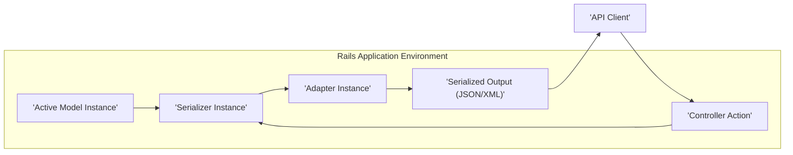
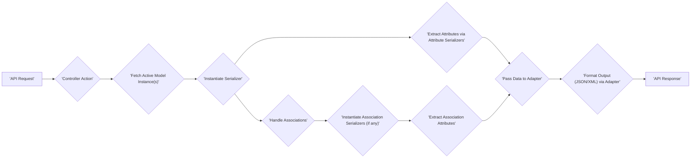

# Project Design Document: Active Model Serializers (Improved)

**Version:** 1.1
**Date:** October 26, 2023
**Author:** AI Software Architect

## 1. Introduction

This document provides an enhanced design overview of the Active Model Serializers (AMS) project, with a strong emphasis on aspects relevant for thorough threat modeling. The goal is to provide a clear and detailed articulation of the architecture, components, and data flow within AMS to facilitate the identification and analysis of potential security vulnerabilities. This improved version aims to offer more specific details and context for security considerations.

## 2. Project Overview

Active Model Serializers is a Ruby gem that offers a structured and customizable approach to serializing Ruby objects, particularly instances of Active Model, into formats like JSON or XML for API responses. It acts as a crucial intermediary between the application's data models and the API's presentation layer, granting developers fine-grained control over which attributes and associations are included in the serialized output and how they are formatted. This control is vital for both functionality and security.

## 3. System Architecture

The architecture of AMS is centered around serializers and adapters working in concert. The following diagram illustrates the high-level architecture and key interactions:

### 3.1. Key Components (Detailed)

*   **Active Model Instance:** This is the core data object, typically an instance of an ActiveRecord model or a similar object conforming to the Active Model interface. It holds the raw data that needs to be presented through the API. Potential vulnerabilities here relate to the integrity and sensitivity of the data itself.
*   **Serializer Instance:** A Ruby object instantiated based on a defined serializer class. It acts as a blueprint for how a specific Active Model instance should be transformed.
    *   **Attribute Serializers:**  Methods or blocks within the serializer that define how individual attributes of the Active Model instance are extracted and formatted. This is a critical point for controlling data exposure.
    *   **Association Serializers:**  Handle the serialization of associated models. They can recursively invoke other serializers, creating a chain of serialization. Incorrect configuration here can lead to over-fetching or exposure of related data.
    *   **Custom Serializer Logic:** Developers can add custom methods and logic within serializers to manipulate data before output. This introduces potential for vulnerabilities if not implemented securely.
*   **Adapter Instance:** Responsible for taking the data prepared by the serializer and formatting it into the final output format.
    *   **JSON Adapter:** Formats the output according to standard JSON conventions. Potential vulnerabilities could arise from incorrect handling of data types or encoding issues.
    *   **JSON API Adapter:** Adheres to the JSON API specification, providing a standardized structure. While offering benefits, it also has specific requirements that, if violated, could lead to parsing errors or unexpected behavior on the client side.
    *   **XML Adapter:** Formats the output as XML. XML processing is known to have potential security vulnerabilities (e.g., XXE attacks) if not handled carefully, although AMS itself might not directly introduce these.
    *   **Custom Adapters:** Developers can create custom adapters for specific output formats. This introduces the risk of vulnerabilities within the custom adapter's implementation.
*   **Controller Action:** The specific action within a Rails controller that initiates the serialization process. It typically fetches the Active Model instance(s) and then calls the serializer. The controller is responsible for authorization and ensuring only permitted data is passed to the serializer.
*   **API Client:** The external application or service that consumes the serialized data from the API endpoint. This could be a web browser, a mobile application, or another server.

### 3.2. Component Interactions (Detailed)

1. The **Controller Action**, upon receiving an **API Request**, retrieves the relevant **Active Model Instance(s)** based on application logic and authorization rules.
2. The controller action instantiates the appropriate **Serializer Instance** for the retrieved model instance(s). The choice of serializer is typically based on the model class.
3. The **Serializer Instance** introspects the **Active Model Instance** and, based on its defined attributes and associations, extracts the necessary data. This involves calling attribute serializers and potentially instantiating association serializers.
4. For associations, the **Serializer Instance** may recursively instantiate other **Serializer Instances** for the associated models, following the defined relationships.
5. The **Serializer Instance** organizes the extracted data into a structure suitable for the chosen adapter.
6. The configured **Adapter Instance** receives this structured data from the serializer.
7. The **Adapter Instance** formats the data into the final **Serialized Output** (JSON or XML) according to its specific rules and conventions.
8. The formatted **Serialized Output** is then sent as the **API Response** back to the **API Client**.

## 4. Data Flow (Detailed)

The following diagram provides a more granular view of the data flow during the serialization process, highlighting key stages:

### 4.1. Data Elements (Detailed)

*   **Request Parameters:** Data sent by the API client, which influences the data retrieval process in the controller and thus indirectly affects what is serialized. Malicious parameters could lead to the retrieval of unexpected or sensitive data.
*   **Active Model Attributes:** The raw data fields of the Ruby model instance. These are the primary targets of serialization and potential over-exposure.
*   **Association Data:** Data retrieved from related models based on defined associations. Improperly secured associations can lead to unauthorized data access.
*   **Serializer Configuration:** The Ruby code within the serializer class that dictates which attributes and associations are included and how they are formatted. This configuration is crucial for security and needs careful review.
*   **Adapter Configuration:** Settings specific to the chosen adapter that might influence the output format (e.g., root element in XML, formatting options in JSON).
*   **Intermediate Serialized Data:** The data structure created by the serializer before being passed to the adapter. This is a logical representation of the data to be formatted.
*   **Serialized Output:** The final JSON or XML string sent to the API client. This is the point where data exposure vulnerabilities manifest.

## 5. Security Considerations (Enhanced for Threat Modeling)

This section expands on the initial security considerations, providing more specific examples of potential threats and vulnerabilities related to AMS.

*   **Data Exposure (Information Disclosure):**
    *   **Over-serialization of Sensitive Attributes:** Serializers might be configured to include attributes containing sensitive information (e.g., passwords, API keys, personal data) that should not be exposed in the API response. *Example: A user serializer inadvertently includes the `password_digest` attribute.*
    *   **Exposure through Associations:**  Incorrectly configured association serializers can lead to the exposure of data from related models that the client is not authorized to access. *Example: An order serializer includes details of the associated user's payment information.*
    *   **Serialization of Internal Implementation Details:**  Custom serializer logic might inadvertently expose internal application details or logic through the serialized output.
*   **Input Validation and Data Integrity (Indirect Impact):**
    *   While AMS doesn't directly validate input, it serializes data originating from the application's models. If the models contain invalid or malicious data due to lack of input validation elsewhere, AMS will faithfully serialize this data. *Example: A model with a compromised `email` field is serialized and sent to the client.*
*   **Denial of Service (DoS):**
    *   **Complex and Deeply Nested Serializations:** Serializing very large or deeply nested object graphs can consume excessive server resources (CPU, memory), potentially leading to DoS. *Example: A request to serialize a user with thousands of associated orders and their details.*
    *   **Circular Reference Exploitation:**  If model associations create circular references and serializers are not configured to handle this, it can lead to infinite loops during serialization, causing a DoS.
*   **Dependency Vulnerabilities:**
    *   AMS relies on other Ruby gems. Vulnerabilities in these dependencies (e.g., JSON parsing libraries) could be exploited if AMS uses the vulnerable functionality. Regular dependency updates are crucial.
*   **Custom Adapter Vulnerabilities:**
    *   If developers create custom adapters, vulnerabilities in their implementation (e.g., improper handling of data encoding, injection flaws) could introduce security risks.
*   **Information Disclosure through Error Messages:**
    *   Detailed error messages generated during the serialization process (e.g., due to missing attributes or incorrect data types) could reveal internal application structure or data models to attackers. Proper error handling and logging are essential.
*   **Mass Assignment Vulnerabilities (Indirect):**
    *   Although not directly within AMS, if serializers are used in conjunction with controller logic that doesn't properly filter parameters, it could indirectly contribute to mass assignment vulnerabilities if clients can control which attributes are serialized and potentially influence model updates.

## 6. Assumptions and Constraints

*   AMS is assumed to be used within a standard Ruby on Rails application environment.
*   The primary use case is serializing Active Record models for building RESTful APIs.
*   The application utilizing AMS is responsible for implementing robust authentication and authorization mechanisms *before* data reaches the serialization layer. AMS itself does not handle authentication or authorization.
*   This design document focuses on the core functionality and architecture of AMS and does not cover specific application-level implementations or customizations beyond the gem's features.

## 7. Future Considerations

*   **Schema Generation and Validation:** Exploring how AMS could be integrated with schema generation tools (e.g., for OpenAPI/Swagger) to automatically define and validate API output structures, enhancing both documentation and security.
*   **Performance Monitoring and Optimization:** Implementing mechanisms to monitor the performance of the serialization process and identify potential bottlenecks or resource-intensive serializations that could be targets for DoS attacks.
*   **Integration with Security Auditing Tools:** Investigating how AMS could be integrated with security auditing tools to automatically detect potential misconfigurations or vulnerabilities in serializers.
*   **Support for Data Masking/Filtering:**  Exploring features within AMS to allow for more dynamic and context-aware filtering or masking of sensitive data during serialization, further mitigating data exposure risks.

This improved design document provides a more detailed and security-focused understanding of the Active Model Serializers project. The enhanced descriptions of components, data flow, and the more specific security considerations will be valuable for conducting a comprehensive threat modeling exercise.
