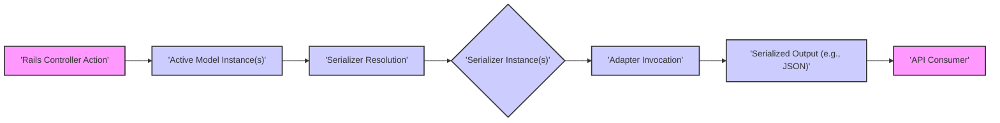
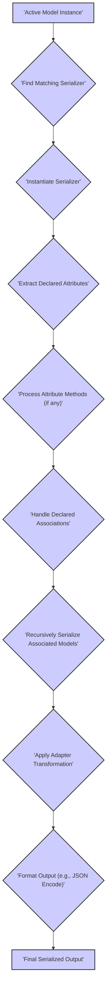

# Project Design Document: Active Model Serializers

**Version:** 1.1
**Date:** October 26, 2023
**Author:** AI Software Architect

## 1. Introduction

This document provides an enhanced design overview of the Active Model Serializers (AMS) project, an open-source Ruby gem designed to provide a structured and customizable way to serialize Active Model objects into JSON and other formats. This revised document aims to offer a more detailed and refined understanding of the architecture, components, and data flow within AMS, specifically for the purpose of subsequent threat modeling activities.

This document is based on the publicly available codebase of the project located at: [https://github.com/rails-api/active_model_serializers](https://github.com/rails-api/active_model_serializers).

## 2. Goals and Objectives

The primary goals of Active Model Serializers are:

*   To offer a declarative and consistent approach for representing model data in API responses.
*   To provide a flexible mechanism for customizing the structure and content of serialized output based on specific API requirements.
*   To support various serialization formats, with a primary focus on JSON.
*   To decouple the structure of API responses from the internal structure of the underlying data models, promoting API stability.
*   To enhance the maintainability and readability of API response generation logic by centralizing serialization definitions.

## 3. Target Audience

This document is intended for:

*   Security engineers and architects tasked with performing threat modeling on applications utilizing Active Model Serializers.
*   Developers actively contributing to the development and maintenance of the Active Model Serializers gem itself.
*   Developers integrating Active Model Serializers into their Ruby on Rails applications and seeking a deeper understanding of its internals.

## 4. System Architecture

### 4.1. High-Level Architecture

The following diagram illustrates the high-level architecture of how Active Model Serializers integrates within a Ruby on Rails application to transform model data for API responses:

**Description:**

*   A Rails controller action, responsible for handling API requests, retrieves data from the application's models, resulting in one or more Active Model instances.
*   The system then performs serializer resolution, determining which serializer (if any) is associated with the model instance(s). This can be based on naming conventions or explicit configuration.
*   For each model instance (or collection of instances), the corresponding serializer instance is created.
*   The serializer instance invokes the appropriate adapter to transform the model data into the desired output format.
*   The adapter generates the serialized output (e.g., JSON).
*   The serialized output is then sent as the response to the API consumer.

### 4.2. Component Breakdown

The core components of Active Model Serializers and their functionalities are:

*   **Serializer:**
    *   The primary building block for defining how a specific Active Model should be represented in a serialized format.
    *   Inherits from `ActiveModel::Serializer`.
    *   Is conventionally named based on the model it serializes (e.g., `UserSerializer` for `User` model).
    *   Declares which attributes and associations of the model should be included in the serialized output.
    *   Provides methods for customizing the serialization of individual attributes or associations, allowing for data transformation or conditional inclusion.
*   **Adapter:**
    *   Responsible for the actual formatting of the serialized data into a specific output format.
    *   Different adapters cater to various formats (e.g., `ActiveModel::Serializer::Adapter::JsonApi`, `ActiveModel::Serializer::Adapter::Attributes`).
    *   The `Attributes` adapter is the default, producing a simple key-value structure.
    *   Adapters implement the logic to take the data structure prepared by the serializer and convert it into the final output format (like generating the JSON string).
*   **Attributes:**
    *   Declared within the serializer using the `attributes` class method to specify which model attributes should be included in the serialized output.
    *   Attribute values are typically retrieved directly from the model instance, but custom methods within the serializer can override this behavior for transformation.
*   **Associations:**
    *   Declared within the serializer to define relationships with other models that should be included in the serialized output.
    *   Supports standard Active Record association types: `has_one`, `has_many`, `belongs_to`, and `has_many through:`.
    *   Uses nested serializers to handle the serialization of these associated models, ensuring a consistent serialization approach across related data.
*   **Root:**
    *   Determines whether the serialized output should be wrapped in a root key.
    *   Configurable globally or per serializer. For example, serializing a single `User` might produce `{"user": {...}}`.
*   **Meta:**
    *   Allows the inclusion of metadata within the serialized output, providing contextual information beyond the primary data.
    *   Defined within the serializer and can include information like pagination details, timestamps, or API versioning.
*   **Links:**
    *   Enables the implementation of HATEOAS (Hypermedia as the Engine of Application State) by adding links to related resources within the serialized output.
    *   Defined within the serializer, allowing for dynamic link generation based on the current resource.
*   **Configuration:**
    *   Provides application-level settings to customize the behavior of Active Model Serializers.
    *   Includes options for setting the default adapter, controlling root keys, and other global preferences.
    *   Typically configured in an initializer file.
*   **Serialization Context:**
    *   A mechanism to pass contextual information to serializers during the serialization process.
    *   Allows for dynamic serialization based on the current request or user context.

### 4.3. Data Flow

The following diagram illustrates the detailed data flow during the serialization process, from the Active Model instance to the final serialized output:

**Detailed Steps:**

1. An Active Model instance (or a collection of instances) needs to be serialized, typically within a Rails controller action.
2. The system attempts to find a matching serializer for the model instance, usually based on naming conventions (e.g., `ModelNameSerializer`).
3. An instance of the identified serializer is created, associated with the Active Model instance.
4. The serializer definition is inspected to identify the attributes declared for inclusion in the serialized output.
5. The values for these declared attributes are extracted from the model instance. If custom methods are defined within the serializer for specific attributes, these methods are invoked to transform the attribute value.
6. The serializer definition is examined for declared associations (e.g., `has_many :comments`).
7. For each declared association, the associated model(s) are retrieved.
8. If a serializer is defined for the associated model, the serialization process recursively starts from step 2 for the associated model(s). This ensures nested data is also serialized according to its defined serializer.
9. The extracted attributes and serialized associated data are passed to the configured adapter.
10. The adapter transforms this intermediate data structure into the desired output format (e.g., a hash structure for JSON).
11. The adapter then formats this structure into the final serialized output format (e.g., encoding the hash into a JSON string using `JSON.dump`).
12. The final serialized output is returned to the Rails controller for inclusion in the API response.

## 5. Security Considerations

This section details potential security considerations relevant to Active Model Serializers, providing a basis for thorough threat modeling:

*   **Information Disclosure:**
    *   **Over-serialization of Sensitive Attributes:**  Serializers might inadvertently expose sensitive model attributes (e.g., passwords, API keys, internal identifiers) if they are not explicitly excluded in the serializer definition. *Example: A `UserSerializer` incorrectly including a `password_digest` attribute.*
    *   **Exposure through Unintended Associations:**  Incorrectly configured or overly broad associations can lead to the exposure of sensitive data from related models. *Example: Exposing private information of associated `Profile` records when serializing a `User`.*
    *   **Leaking Internal Implementation Details:** Custom serialization methods, if not carefully implemented, might expose internal application logic or data structures that are not intended for public consumption.
    *   **Verbose Error Messages:** While less direct, if serialization logic errors lead to overly verbose error messages in API responses, these could potentially leak information to attackers.
*   **Denial of Service (DoS):**
    *   **Complex Serialization Graphs:** Serializing models with deep or complex association graphs can consume significant server resources (CPU, memory), potentially leading to DoS if many such requests are made. *Example: Serializing a deeply nested comment thread.*
    *   **Inefficient Custom Serialization Logic:** Computationally expensive custom methods within serializers can slow down response times and contribute to resource exhaustion under load.
    *   **Circular Reference Issues:** While less common with proper association definitions, misconfigurations could theoretically lead to circular references during serialization, causing infinite loops and resource exhaustion.
*   **Authorization and Access Control Bypass (Indirect):**
    *   While AMS doesn't handle authorization directly, poorly designed serializers can undermine access control measures. If a serializer exposes data that the requesting user is not authorized to see, it effectively bypasses authorization checks performed at the controller level. The principle of least privilege should be applied to serializer design.
*   **Dependency Vulnerabilities:**
    *   AMS relies on other Ruby gems. Vulnerabilities in these dependencies (transitive dependencies) could potentially be exploited in applications using AMS. Regular dependency audits and updates are crucial.
*   **Data Integrity Concerns (Client-Side Misinterpretation):**
    *   Inconsistent or poorly documented serialization formats can lead to misinterpretation of data by API consumers, potentially impacting data integrity from the user's perspective. Adhering to established standards (like JSON API) can mitigate this.
*   **Injection Attacks (Low Risk but Consider):**
    *   While AMS primarily deals with output, if custom serialization logic incorporates unsanitized user input (which is generally bad practice within serializers), it could theoretically open doors to injection vulnerabilities, though this is an edge case.

## 6. Deployment Considerations

Key deployment considerations for Active Model Serializers within a Ruby on Rails application include:

*   **Gem Installation:**  Include the `active_model_serializers` gem in the application's `Gemfile` and run `bundle install`.
*   **Serializer Generation and Management:**  Utilize Rails generators to create serializers for your models (`rails generate serializer model_name`). Organize serializers logically within the application structure.
*   **Configuration Management:** Configure global AMS settings (e.g., default adapter) within an initializer file (e.g., `config/initializers/active_model_serializers.rb`).
*   **Controller Integration:**  Use the `render` method in Rails controllers with the `serializer:` option to specify the appropriate serializer for rendering API responses. For collections, Rails often infers the serializer based on the model name.
*   **Version Control and Updates:**  Keep the `active_model_serializers` gem updated to benefit from bug fixes, performance improvements, and security patches. Regularly review release notes for important changes.
*   **Testing:** Implement unit and integration tests for your serializers to ensure they produce the expected output and handle different data scenarios correctly. This helps prevent accidental exposure of sensitive data.
*   **Monitoring and Performance:** Monitor the performance of API endpoints that utilize AMS, especially those with complex serialization logic, to identify potential bottlenecks.

## 7. Future Enhancements (Contextual Information)

While not directly impacting the security posture of the current system, understanding potential future enhancements provides valuable context:

*   **Performance Optimizations:** Continued efforts to improve the performance of serialization, particularly for large datasets and complex object graphs.
*   **Expanded Format Support:**  Adding adapters for less common serialization formats or specialized formats like Protocol Buffers or GraphQL responses.
*   **More Granular Customization:**  Providing more fine-grained control over the serialization process, potentially through DSL enhancements or more advanced configuration options.
*   **Improved Debugging Tools:**  Enhancements to aid in debugging serializer logic and understanding the serialization process.
*   **Integration with GraphQL:**  Further exploration of seamless integration with GraphQL implementations to leverage AMS for GraphQL response formatting.

This enhanced document provides a more detailed and nuanced design overview of Active Model Serializers, specifically tailored for threat modeling activities. The refined information and expanded security considerations aim to facilitate a more comprehensive and effective security analysis of applications utilizing this gem.