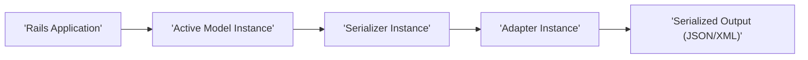
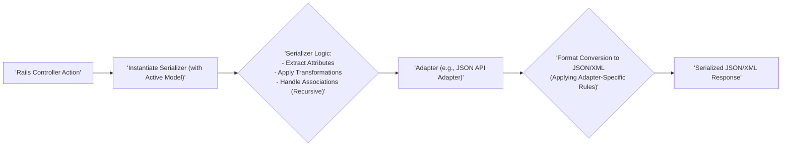

## Project Design Document: Active Model Serializers (Improved)

**Version:** 1.1
**Date:** October 26, 2023
**Author:** AI Software Architect

### 1. Introduction

This document provides an enhanced and more detailed design overview of the Active Model Serializers (AMS) project, as found in the repository [https://github.com/rails-api/active_model_serializers](https://github.com/rails-api/active_model_serializers). This improved document aims to provide a stronger foundation for subsequent threat modeling activities by offering a deeper understanding of the library's architecture, data flow, and potential security implications.

### 2. Goals

*   Provide a comprehensive and technically detailed understanding of the AMS architecture and its internal workings.
*   Clearly identify the responsibilities and interactions of key components within the serialization process.
*   Elaborate on the data transformations and flow during serialization.
*   Highlight specific potential threat vectors and vulnerabilities relevant to security analysis and threat modeling.

### 3. Overview

Active Model Serializers (AMS) is a Ruby library designed to serialize Ruby objects, particularly those adhering to the Active Model interface (common in Rails applications), into structured formats like JSON or XML for API responses. It offers a declarative and customizable approach to defining how model data is represented externally. AMS acts as a crucial layer between the application's data models and the API consumers, controlling the shape and content of the API responses.

**Key Concepts:**

*   **Serializers:**  The central components of AMS. They are Ruby classes that inherit from `ActiveModel::Serializer` and act as blueprints for transforming model data. They explicitly define which attributes and associations of a model should be included in the serialized output and how they should be formatted.
*   **Adapters:** Responsible for taking the data prepared by the serializer and formatting it according to a specific output format (e.g., JSON, XML, JSON API). Adapters enforce the structure and conventions of the target format.
*   **Attributes:**  Specific data points (fields) from the model that are selected to be included in the serialized output. These are typically simple data types like strings, numbers, or booleans.
*   **Associations:** Relationships between the primary model and other models (e.g., `has_many`, `belongs_to`, `has_one`). Serializers can define how these related models are included in the output, often by using other serializers.
*   **Configuration:**  Settings that govern the global behavior of AMS, such as the default adapter to use, key formatting conventions (e.g., camelCase), and namespace configurations.

**High-Level Architecture Diagram:**

### 4. Detailed Design

#### 4.1. Components

*   **Active Model:**
    *   Serves as the source of data for the serialization process.
    *   Typically an instance of an ActiveRecord model or any Ruby object including `ActiveModel::Model`.
    *   Provides access to the raw data that needs to be transformed and formatted for API consumption.

*   **Serializer:**
    *   A Ruby class inheriting from `ActiveModel::Serializer`, acting as a data mapper.
    *   Contains declarative definitions for:
        *   **Attribute Mappings:** Specifies which attributes from the Active Model should be included in the output. This can involve direct mapping or transformations.
        *   **Association Handling:** Defines how related models are serialized. This often involves specifying which serializer to use for the associated model. Options include embedding associated data or providing links to related resources.
        *   **Custom Attribute Methods:** Allows defining methods within the serializer to generate derived attributes or format existing ones. This provides flexibility in shaping the output.
        *   **Conditional Logic:** Enables the inclusion or exclusion of attributes and associations based on specific conditions.
        *   **Caching Mechanisms:**  May implement caching strategies to improve performance by storing and reusing previously serialized output.

*   **Adapter:**
    *   A class responsible for the final formatting of the serialized data into a specific output format.
    *   Key adapters include:
        *   `ActiveModel::Serializer::Adapter::Attributes`: Produces a simple key-value structure.
        *   `ActiveModel::Serializer::Adapter::JsonApi`: Implements the widely adopted JSON API specification, enforcing its structure and conventions (e.g., `data`, `included`, `links`).
        *   `ActiveModel::Serializer::Adapter::Json`: Generates standard JSON output.
        *   `ActiveModel::Serializer::Adapter::XML`: Creates XML output.
    *   Receives the processed data from the serializer and transforms it into the desired format, handling aspects like root elements and metadata.

*   **Configuration:**
    *   Provides global settings that influence AMS's behavior.
    *   Key configuration options include:
        *   **`default_adapter`:** Specifies the adapter to use if not explicitly defined for a serializer.
        *   **`key_transform`:** Controls how attribute and association keys are formatted (e.g., `:camel_lower`, `:unaltered`).
        *   **`namespace`:** Allows namespacing of serialized output.
        *   **Adapter-specific options:**  Configurations specific to the chosen adapter (e.g., JSON API settings).

#### 4.2. Data Flow

The serialization process in AMS involves the following steps:

1. **Initiation:** A Rails controller action or another part of the application instantiates a serializer, passing an instance of an Active Model (or a collection of instances) as the data source.
2. **Serializer Processing:** The serializer inspects its defined attributes and associations.
    *   **Attribute Extraction and Transformation:** For each defined attribute, the serializer retrieves the corresponding value from the Active Model instance. Custom methods within the serializer might be invoked to transform or format these values.
    *   **Association Handling:** For each defined association:
        *   The serializer retrieves the associated model(s).
        *   A new serializer instance is typically created for the associated model(s).
        *   The serialization process is recursively applied to the associated model(s).
        *   The serialized representation of the associated model(s) is then incorporated into the output, according to the association type and adapter conventions.
3. **Adapter Invocation:** The serializer passes the processed data (a structured representation of attributes and associations) to the configured adapter.
4. **Format Conversion:** The adapter takes the structured data and formats it into the target output format (e.g., JSON or XML). This involves applying the specific rules and conventions of the chosen format. For example, the JSON API adapter will structure the output according to the JSON API specification.
5. **Output Generation:** The adapter returns the final serialized output, which is typically sent as the response to an API request.

**Detailed Data Flow Diagram:**

#### 4.3. Interactions

*   **Rails Application ↔ Serializers:** The Rails application initiates the serialization process by instantiating serializers, providing the data to be serialized.
*   **Serializers ↔ Active Model:** Serializers directly interact with the Active Model instance to access attribute values and navigate associations.
*   **Serializers ↔ Adapters:** Serializers delegate the final formatting of the serialized data to the configured adapter. This is a key point of abstraction, allowing different output formats without changing the core serializer logic.
*   **Serializers ↔ Serializers (through Associations):** When handling associations, a serializer often instantiates other serializers to manage the serialization of related models, creating a chain of serialization.
*   **Configuration ↔ Serializers & Adapters:** Global configuration settings influence the behavior of both serializers and adapters, such as the default adapter and key formatting.

### 5. Security Considerations (Areas for Threat Modeling)

This section provides a more detailed breakdown of potential security concerns relevant to threat modeling.

*   **Data Exposure:**
    *   **Over-serialization of Sensitive Attributes:** Serializers might be configured to include attributes containing sensitive information (e.g., passwords, API keys, personal data) that should not be exposed in API responses. This can occur due to misconfiguration or a lack of awareness of data sensitivity.
    *   **Unintended Exposure through Associations:**  Incorrectly configured or overly permissive association handling can lead to the exposure of related data that the client is not authorized to access. For example, eagerly loading and serializing all associated records when only a subset is needed.
    *   **Exposure via Custom Logic:** Custom methods within serializers, if not carefully implemented, could inadvertently expose sensitive data or introduce vulnerabilities if they process user-provided input without proper sanitization.

*   **Injection Attacks (Indirect):**
    *   While AMS primarily handles output, vulnerabilities could arise if serializer logic relies on dynamic attribute selection or filtering based on user-controlled input. This could potentially lead to information disclosure or unexpected behavior.
    *   If custom serializer logic interacts with external systems or databases based on unsanitized input, it could be susceptible to injection vulnerabilities in those systems.

*   **Denial of Service (DoS):**
    *   **Complex Serialization Graphs:** Serializers with deeply nested associations or complex custom logic can lead to excessive processing time and resource consumption, potentially causing DoS if many such requests are made concurrently.
    *   **Resource Exhaustion through Large Datasets:** Attempting to serialize very large datasets or objects with numerous associations can exhaust server memory and processing power.
    *   **Inefficient Caching Mechanisms:** If caching is implemented poorly, it could lead to cache misses and repeated expensive serialization operations, contributing to performance degradation.

*   **Configuration Vulnerabilities:**
    *   **Insecure Default Adapter Settings:** The default adapter settings might have security implications if they expose more information than necessary or have known vulnerabilities.
    *   **Misconfigured Key Transformations:** Incorrectly configured key transformations could lead to inconsistencies or difficulties in consuming the API. While not directly a security vulnerability, it can disrupt service.
    *   **Lack of Namespace Enforcement:**  If namespacing is not properly configured or enforced, it could lead to naming conflicts or unexpected data structures.

*   **Dependency Vulnerabilities:**
    *   AMS relies on other Ruby gems. Vulnerabilities in these dependencies (e.g., JSON parsing libraries) could potentially be exploited through AMS if it uses the vulnerable components. Regular dependency updates and security audits are crucial.

*   **Authentication and Authorization Bypass (Indirect):**
    *   While AMS doesn't handle authentication directly, it's crucial to ensure that the data being serialized is consistent with the application's authorization rules. If serializers are not configured to respect access controls, they could inadvertently expose data to unauthorized users. Threat modeling should consider how AMS interacts with the application's authentication and authorization layers.

*   **Input Validation Issues (Indirect):**
    *   AMS serializes data originating from Active Models. If the underlying models lack proper input validation, invalid or potentially malicious data might be serialized and exposed through the API. This highlights the importance of input validation at the model level.

### 6. Deployment Considerations

*   AMS is typically deployed within a Ruby on Rails application environment.
*   The security posture of AMS is intrinsically linked to the security of the underlying Rails application, its dependencies, and the deployment environment.
*   Consider the security implications of the specific adapter being used, as different adapters might have different performance characteristics and potential vulnerabilities.
*   Regularly update AMS and its dependencies to patch any known security vulnerabilities.

### 7. Future Considerations

*   Potential integration with emerging API technologies like GraphQL could introduce new serialization paradigms and associated security considerations.
*   Evolutions in the Active Model or Rails framework might necessitate updates or changes in AMS, potentially impacting its security profile.
*   The introduction of new adapters or features in AMS could introduce new attack vectors that need to be considered during threat modeling.

This improved document provides a more in-depth understanding of the Active Model Serializers project, offering a stronger foundation for identifying and mitigating potential security threats. The detailed security considerations outlined above should be thoroughly investigated during the threat modeling process.