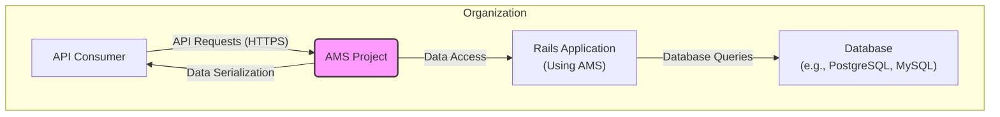
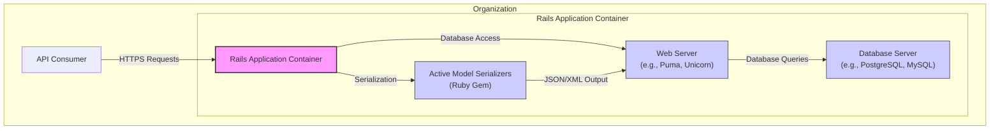

# BUSINESS POSTURE

This project, Active Model Serializers (AMS), is a Ruby gem designed to provide a structured and efficient way to serialize data in Ruby on Rails applications, primarily for building APIs.

- Business Priorities and Goals:
  - Efficient API Development: AMS aims to simplify and speed up the process of creating APIs by providing a consistent and declarative approach to data serialization.
  - Data Consistency: Ensure that API responses are consistently formatted and structured, improving the developer experience for API consumers.
  - Performance Optimization: Optimize the serialization process to minimize overhead and improve API response times.
  - Maintainability: Provide a clear and organized way to manage serialization logic, making API code easier to maintain and evolve.

- Most Important Business Risks:
  - Data Exposure: Incorrectly configured serializers could inadvertently expose sensitive data through APIs.
  - API Availability: Issues with the serialization process could lead to API errors or performance degradation, impacting API availability.
  - Integration Complexity:  Complexity in integrating and configuring AMS within existing Rails applications could slow down development and introduce errors.
  - Security Vulnerabilities:  Vulnerabilities in AMS itself or its dependencies could be exploited to compromise applications using it.

# SECURITY POSTURE

- Existing Security Controls:
  - security control: Dependency Management: RubyGems is used for managing dependencies, including AMS. (Implemented in Gemfile and Gemfile.lock)
  - security control: Code Review:  The project is hosted on GitHub, suggesting that code reviews are likely part of the development process through pull requests. (Implemented in GitHub repository workflow)
  - security control: Open Source: Being open source allows for community scrutiny and contributions to identify and fix security issues. (Implemented by project being publicly available on GitHub)
  - security control: Version Control: Git is used for version control, enabling tracking of changes and rollbacks if necessary. (Implemented by Git and GitHub)

- Accepted Risks:
  - accepted risk: Third-party Dependency Vulnerabilities:  Reliance on RubyGems and other dependencies introduces the risk of vulnerabilities in those components. Mitigation relies on dependency updates and vulnerability scanning.
  - accepted risk: Open Source Security: While open source allows for community review, it also means vulnerabilities are publicly known once discovered. Mitigation relies on prompt patching and updates.

- Recommended Security Controls:
  - security control: Automated Security Scanning: Implement automated security scanning (e.g., using tools like Bundler Audit for dependency checks, and static analysis security testing (SAST) tools for Ruby code) in the CI/CD pipeline.
  - security control: Software Composition Analysis (SCA): Regularly perform SCA to identify and manage open-source components and their known vulnerabilities.
  - security control: Secure Development Training: Ensure developers are trained in secure coding practices, especially related to API security and data serialization.
  - security control: Security Testing: Conduct regular security testing, including penetration testing and vulnerability assessments, of applications using AMS.

- Security Requirements:
  - Authentication: AMS itself does not handle authentication. Applications using AMS must implement their own authentication mechanisms to verify the identity of API clients. This is typically done at the application level, before serialization takes place.
  - Authorization: AMS does not handle authorization. Applications must implement authorization logic to control access to data based on the authenticated user's roles and permissions. This should be applied before data is serialized and returned in API responses.
  - Input Validation: While AMS focuses on output serialization, input validation is crucial for API security. Applications using AMS must validate all incoming data to prevent injection attacks and ensure data integrity. Input validation should be performed before data reaches the serialization layer.
  - Cryptography: If sensitive data is handled by the application and serialized by AMS, ensure that appropriate cryptography is used to protect data in transit and at rest. AMS itself does not provide cryptographic features, so this must be implemented at the application level. Consider encrypting sensitive attributes before serialization if necessary, or ensuring that APIs are served over HTTPS to protect data in transit.

# DESIGN

## C4 CONTEXT



- C4 Context Elements Description:
  - - Name: API Consumer
    - Type: Person/System
    - Description: External developers or systems that consume APIs built using Rails applications that utilize Active Model Serializers.
    - Responsibilities: Send API requests, consume API responses, and integrate with the API.
    - Security controls: Implement client-side authentication and authorization as required by the API, handle API keys or tokens securely, and validate API responses.
  - - Name: AMS Project
    - Type: Software System (Ruby Gem)
    - Description: Active Model Serializers library. It is responsible for transforming Ruby objects into JSON or XML formats as defined by serializers.
    - Responsibilities: Serialize data according to defined serializers, handle relationships and attributes, and provide a consistent output format.
    - Security controls:  None directly within AMS itself as it's a library. Security relies on the Rails application using it and the underlying RubyGems ecosystem.
  - - Name: Rails Application (Using AMS)
    - Type: Software System
    - Description: The Ruby on Rails application that integrates and uses the Active Model Serializers gem to build and serve APIs. This application contains the business logic, data models, and API endpoints.
    - Responsibilities: Implement API endpoints, handle authentication and authorization, perform input validation, interact with the database, and utilize AMS for data serialization.
    - Security controls:  Web Application Firewall (WAF), authentication and authorization mechanisms (e.g., OAuth 2.0, JWT), input validation, output encoding, secure session management, vulnerability scanning, and security audits.
  - - Name: Database (e.g., PostgreSQL, MySQL)
    - Type: Data Store
    - Description: The database system used by the Rails application to store and retrieve data.
    - Responsibilities: Persist application data, provide data access to the Rails application, and ensure data integrity and availability.
    - Security controls: Database access controls, encryption at rest, encryption in transit, regular backups, database activity monitoring, and vulnerability patching.

## C4 CONTAINER



- C4 Container Elements Description:
  - - Name: API Consumer
    - Type: Person/System
    - Description: Same as in Context Diagram. External developers or systems that consume APIs.
    - Responsibilities: Same as in Context Diagram. Send API requests, consume API responses.
    - Security controls: Same as in Context Diagram. Client-side authentication, API key management, response validation.
  - - Name: Rails Application Container
    - Type: Web Application
    - Description:  Represents the running Rails application, encompassing the web server, application code, and the AMS library. It's the primary container responsible for handling API requests and responses.
    - Responsibilities: Receive API requests, route requests to appropriate controllers, execute application logic, utilize AMS for serialization, and return API responses.
    - Security controls:  Web Application Firewall (WAF), rate limiting, input validation within the application code, output encoding, session management, logging and monitoring, and security updates for the application framework and dependencies.
    - - Name: Active Model Serializers (Ruby Gem)
      - Type: Library
      - Description: The Active Model Serializers gem, integrated within the Rails application. It provides the serialization logic.
      - Responsibilities: Serialize Ruby objects into JSON or XML based on serializer definitions.
      - Security controls:  Indirectly secured through dependency management (RubyGems), vulnerability scanning of dependencies, and code reviews of the AMS library itself (as an open-source project).
    - - Name: Web Server (e.g., Puma, Unicorn)
      - Type: Web Server
      - Description: The web server that hosts the Rails application and handles incoming HTTP requests.
      - Responsibilities: Accept HTTP requests, forward requests to the Rails application, and serve responses back to clients.
      - Security controls:  Web server configuration hardening, TLS/SSL configuration for HTTPS, handling of HTTP headers, protection against DDoS attacks, and regular security updates for the web server software.
    - - Name: Database Server (e.g., PostgreSQL, MySQL)
      - Type: Database
      - Description: Same as in Context Diagram. The database system storing application data.
      - Responsibilities: Same as in Context Diagram. Persist data, provide data access.
      - Security controls: Same as in Context Diagram. Database access controls, encryption, backups, monitoring.

## DEPLOYMENT

Assuming a typical cloud deployment scenario using AWS.

```mermaid
flowchart LR
    subgraph "AWS Cloud"
      direction TB
      A["Internet"] --> B["Load Balancer\n(AWS ELB)"]
      B --> C{["Web Server Instance(s)\n(EC2 Instances)"]}
      C --> D["Rails Application Container"]
      D --> E["Active Model Serializers\n(Ruby Gem)"]
      D --> F["Database Client"]
      C --> G["File Storage\n(AWS S3)"]
      F --> H["Database Server\n(AWS RDS)"]
    end
    style D fill:#f9f,stroke:#333,stroke-width:2px
    style E fill:#ccf,stroke:#333,stroke-width:1px
    style F fill:#ccf,stroke:#333,stroke-width:1px
```

- Deployment Elements Description:
  - - Name: Internet
    - Type: Network
    - Description: The public internet, from where API consumers access the application.
    - Responsibilities: Provide public network access.
    - Security controls:  None directly controlled by the project. Relies on general internet security and client-side security.
  - - Name: Load Balancer (AWS ELB)
    - Type: Infrastructure Component
    - Description: AWS Elastic Load Balancer, distributing incoming traffic across multiple web server instances.
    - Responsibilities: Distribute traffic, provide high availability, and potentially handle TLS termination.
    - Security controls:  TLS/SSL termination, DDoS protection, security groups to control inbound traffic, and access logging.
  - - Name: Web Server Instance(s) (EC2 Instances)
    - Type: Compute Instance
    - Description: Amazon EC2 instances running the web servers and Rails application containers. Multiple instances for scalability and high availability.
    - Responsibilities: Host the Rails application, process API requests, and serve API responses.
    - Security controls:  Operating system hardening, security patching, instance-level firewalls (security groups), intrusion detection systems (IDS), and access control (IAM roles).
  - - Name: Rails Application Container
    - Type: Application Runtime
    - Description:  Containerized environment (e.g., Docker) running the Rails application, including AMS and dependencies.
    - Responsibilities: Execute the Rails application code, utilize AMS for serialization, and interact with the database and other services.
    - Security controls:  Container image scanning for vulnerabilities, container runtime security, resource limits, and secure configuration of the container environment.
  - - Name: Active Model Serializers (Ruby Gem)
    - Type: Library
    - Description: Same as in Container Diagram. The AMS library within the Rails application container.
    - Responsibilities: Same as in Container Diagram. Data serialization.
    - Security controls: Same as in Container Diagram. Dependency management, vulnerability scanning.
  - - Name: Database Client
    - Type: Library
    - Description: Database client library used by the Rails application to connect to the database server.
    - Responsibilities: Facilitate communication between the Rails application and the database.
    - Security controls:  Secure configuration of database connection parameters, using least privilege database credentials, and keeping the client library updated.
  - - Name: File Storage (AWS S3)
    - Type: Storage Service
    - Description: Amazon S3 for storing static files, user uploads, or other files needed by the application.
    - Responsibilities: Store and serve files.
    - Security controls:  Access control policies (IAM policies, bucket policies), encryption at rest, encryption in transit (HTTPS), and versioning.
  - - Name: Database Server (AWS RDS)
    - Type: Managed Database Service
    - Description: Amazon RDS (Relational Database Service) providing a managed database instance.
    - Responsibilities: Persist application data, manage database operations, and ensure database availability and performance.
    - Security controls:  Database engine hardening, access control lists (security groups), encryption at rest and in transit, automated backups, database monitoring, and patching managed by AWS.

## BUILD

```mermaid
flowchart LR
    A["Developer"] --> B["Code Changes\n(Git)"]
    B --> C["GitHub\nRepository"]
    C --> D["GitHub Actions\n(CI/CD)"]
    subgraph "GitHub Actions Workflow"
      direction TB
      D --> E["Checkout Code"]
      E --> F["Install Dependencies\n(Bundler)"]
      F --> G["Run Linters & SAST"]
      G --> H["Run Tests"]
      H --> I{["Build Artifacts\n(Gem Package)"]}
      I --> J["Publish Artifacts\n(RubyGems.org)"]
    end
    J --> K["RubyGems\nRegistry"]
    style D fill:#f9f,stroke:#333,stroke-width:2px
    style E fill:#ccf,stroke:#333,stroke-width:1px
    style F fill:#ccf,stroke:#333,stroke-width:1px
    style G fill:#ccf,stroke:#333,stroke-width:1px
    style H fill:#ccf,stroke:#333,stroke-width:1px
    style I fill:#ccf,stroke:#333,stroke-width:1px
    style J fill:#ccf,stroke:#333,stroke-width:1px
```

- Build Elements Description:
  - - Name: Developer
    - Type: Person
    - Description: Software developer contributing to the AMS project.
    - Responsibilities: Write code, commit changes, and create pull requests.
    - Security controls:  Secure development environment, code review participation, and adherence to secure coding practices.
  - - Name: Code Changes (Git)
    - Type: Version Control
    - Description: Code modifications tracked using Git version control.
    - Responsibilities: Track code history, manage branches, and facilitate collaboration.
    - Security controls:  Commit signing, branch protection rules, and access control to the Git repository.
  - - Name: GitHub Repository
    - Type: Code Repository
    - Description: GitHub repository hosting the AMS project source code.
    - Responsibilities: Store source code, manage pull requests, and trigger CI/CD workflows.
    - Security controls:  Access control (permissions), branch protection rules, audit logs, and vulnerability scanning of the repository.
  - - Name: GitHub Actions (CI/CD)
    - Type: CI/CD System
    - Description: GitHub Actions used for automated build, test, and release processes.
    - Responsibilities: Automate build pipeline, run tests, perform security checks, and publish artifacts.
    - Security controls:  Secure workflow definitions, secret management, access control to workflows, and audit logs.
  - - Name: Checkout Code
    - Type: Build Step
    - Description: Step in the CI/CD workflow to retrieve the source code from the GitHub repository.
    - Responsibilities: Obtain the latest code version for building.
    - Security controls:  Access control to the repository, secure communication with GitHub.
  - - Name: Install Dependencies (Bundler)
    - Type: Build Step
    - Description: Step to install Ruby dependencies using Bundler.
    - Responsibilities: Resolve and install required Ruby gems.
    - Security controls:  Dependency vulnerability scanning (Bundler Audit), using `Gemfile.lock` for dependency pinning, and verifying gem checksums.
  - - Name: Run Linters & SAST
    - Type: Build Step
    - Description: Step to perform code linting and Static Application Security Testing (SAST).
    - Responsibilities: Identify code quality issues and potential security vulnerabilities in the source code.
    - Security controls:  Configuration of linters and SAST tools, review of scan results, and automated breaking of the build on critical findings.
  - - Name: Run Tests
    - Type: Build Step
    - Description: Step to execute automated tests (unit, integration, etc.).
    - Responsibilities: Verify code functionality and detect regressions.
    - Security controls:  Secure test environment, isolation of tests, and code coverage analysis.
  - - Name: Build Artifacts (Gem Package)
    - Type: Build Output
    - Description: The packaged Ruby gem file (.gem) created during the build process.
    - Responsibilities: Package the library for distribution.
    - Security controls:  Signing of gem packages (if applicable), integrity checks of the built artifact.
  - - Name: Publish Artifacts (RubyGems.org)
    - Type: Release Step
    - Description: Step to publish the built gem package to RubyGems.org.
    - Responsibilities: Make the gem available for public download and use.
    - Security controls:  Secure credentials for publishing to RubyGems.org, verification of package integrity during publishing, and access control to publishing process.
  - - Name: RubyGems Registry
    - Type: Package Registry
    - Description: RubyGems.org, the public registry for Ruby gems.
    - Responsibilities: Host and distribute Ruby gems.
    - Security controls:  Registry security measures, malware scanning of uploaded gems, and vulnerability reporting mechanisms.

# RISK ASSESSMENT

- Critical Business Processes:
  - API Data Serialization: The core function of AMS is to serialize data for APIs. Failure or compromise of this process can lead to data exposure, API unavailability, or incorrect data being served.
  - API Availability:  If AMS introduces performance bottlenecks or errors, it can negatively impact the availability and responsiveness of APIs built using it.
  - Secure API Development:  If developers misuse AMS or fail to understand its security implications, it can lead to vulnerabilities in APIs.

- Data We Are Trying to Protect and Their Sensitivity:
  - Data serialized by AMS: The sensitivity of the data depends entirely on the application using AMS. It could range from publicly available information to highly sensitive personal or financial data. AMS itself does not inherently handle sensitive data, but it is used to present data through APIs, which can include sensitive information.
  - Sensitivity Levels:
    - Public Data: Low sensitivity.
    - Internal Data: Medium sensitivity (data intended for internal use only).
    - Confidential Data: High sensitivity (e.g., personal identifiable information (PII), financial data, trade secrets).
    - Highly Confidential Data: Very high sensitivity (e.g., regulated data like HIPAA, PCI DSS data).

# QUESTIONS & ASSUMPTIONS

- BUSINESS POSTURE:
  - Question: What are the primary use cases for APIs built using AMS within the organization? (e.g., public APIs, internal APIs, partner APIs).
  - Assumption: AMS is primarily used for building RESTful APIs for web and mobile applications.
  - Question: What is the expected scale and performance requirements for APIs using AMS?
  - Assumption: APIs are expected to handle moderate to high traffic and require efficient serialization.

- SECURITY POSTURE:
  - Question: What are the existing security policies and standards that the organization adheres to?
  - Assumption: The organization follows general web application security best practices and has some level of security awareness.
  - Question: Are there specific compliance requirements (e.g., GDPR, HIPAA, PCI DSS) that APIs using AMS must adhere to?
  - Assumption:  Compliance requirements are application-specific and need to be considered when using AMS in those contexts.
  - Question: What type of data sensitivity is typically handled by APIs using AMS?
  - Assumption: Data sensitivity varies depending on the application, but applications may handle confidential or highly confidential data.

- DESIGN:
  - Question: What is the typical deployment environment for applications using AMS? (Cloud, on-premises, hybrid).
  - Assumption: Cloud deployment (AWS) is a common scenario.
  - Question: What are the performance and scalability requirements for the serialization process?
  - Assumption: Performance is important, and AMS is expected to be efficient.
  - Question: Are there specific logging and monitoring requirements for applications using AMS?
  - Assumption: Standard application logging and monitoring practices are in place.