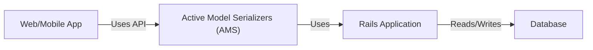
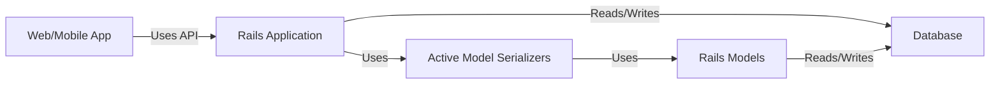
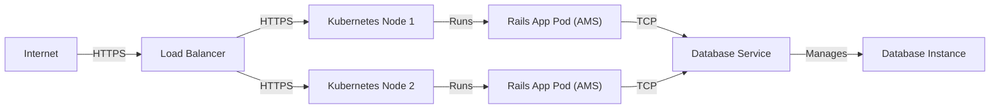
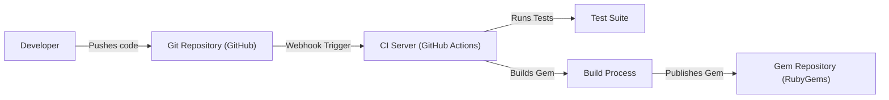

# Project Design Document: Active Model Serializers

## BUSINESS POSTURE

Active Model Serializers (AMS) is a Ruby on Rails library that provides a convention-over-configuration approach to generating JSON responses from Rails models. It simplifies the process of serializing model data, including attributes and relationships, into a format suitable for API consumption.

Priorities:

- Maintainability: AMS is a mature project, and ensuring its continued maintainability is crucial. This includes keeping dependencies up-to-date, addressing reported issues, and ensuring compatibility with newer Rails versions.
- Ease of Use: A primary goal is to provide a simple and intuitive API for developers to serialize their models.
- Performance: Serialization can be a performance bottleneck, so optimizing for speed is important.
- Community Engagement: Maintaining an active and engaged community is vital for the long-term health of the project.
- Flexibility: While convention-over-configuration is a core principle, providing sufficient flexibility for customization is important.

Business Goals:

- Provide a reliable and efficient way for Rails developers to generate JSON responses.
- Reduce boilerplate code associated with JSON serialization.
- Promote consistency in API design across Rails projects.

Most Important Business Risks:

- Security Vulnerabilities: Serialization libraries can be potential targets for attacks, such as object injection or data leakage.
- Performance Bottlenecks: Inefficient serialization can negatively impact API response times.
- Compatibility Issues: Incompatibility with newer Rails versions or other dependencies can break existing applications.
- Lack of Maintenance: If the project is not actively maintained, it can become outdated and unusable.
- Community Fragmentation: A decline in community engagement can lead to fewer contributions and slower issue resolution.

## SECURITY POSTURE

Existing Security Controls:

- security control: Regular dependency updates: The project uses tools like Dependabot to keep dependencies up-to-date, mitigating known vulnerabilities in third-party libraries. (Implemented in GitHub repository configuration).
- security control: Code Reviews: All contributions go through a code review process, helping to identify potential security issues before they are merged. (Implemented as a standard practice in the project's contribution guidelines).
- security control: Automated Testing: The project has a comprehensive test suite, which helps to prevent regressions and ensure that security-related features function as expected. (Implemented in the `test` directory of the repository).
- security control: Escaping: AMS likely uses Rails' built-in escaping mechanisms to prevent cross-site scripting (XSS) vulnerabilities when rendering JSON. (Implicitly handled by Rails).

Accepted Risks:

- accepted risk: Potential for unknown vulnerabilities: Like any software, AMS may contain unknown vulnerabilities that could be exploited.
- accepted risk: Reliance on external dependencies: The project depends on other libraries, and vulnerabilities in those dependencies could impact AMS.
- accepted risk: Limited control over user input: While AMS handles serialization, it relies on the application to properly validate and sanitize user input before it reaches the serialization layer.

Recommended Security Controls:

- security control: Implement a Content Security Policy (CSP): While AMS itself doesn't directly handle HTTP responses, recommending the use of CSP in applications using AMS can mitigate XSS risks.
- security control: Conduct regular security audits: Periodic security audits, including penetration testing, can help identify and address potential vulnerabilities.
- security control: Consider using a static analysis security tool (SAST): Integrating a SAST tool into the CI/CD pipeline can help detect potential security issues early in the development process.

Security Requirements:

- Authentication: Not directly applicable to AMS, as it's a serialization library. Authentication should be handled at the application level.
- Authorization: Not directly applicable to AMS. Authorization should be handled at the application level, controlling which resources a user can access. AMS should only serialize data that the user is authorized to see.
- Input Validation: While AMS doesn't directly handle user input, it's crucial that applications using AMS properly validate and sanitize all input before it's used to query models or passed to serializers. This prevents injection attacks and other data-related vulnerabilities.
- Cryptography: Not directly applicable to AMS in most cases. If sensitive data needs to be encrypted, it should be handled at the application or database level before serialization. AMS should serialize the encrypted data, not perform the encryption itself.

## DESIGN

### C4 CONTEXT

Element Description:

- Element:
    - Name: User
    - Type: External User
    - Description: Represents a web or mobile application that consumes the JSON API provided by the Rails application.
    - Responsibilities: Makes requests to the API, handles responses, and displays data to the end-user.
    - Security controls: Implements appropriate authentication and authorization mechanisms to access the API.
- Element:
    - Name: AMSProject
    - Type: Project
    - Description: The Active Model Serializers library itself.
    - Responsibilities: Provides a framework for serializing Rails models into JSON.
    - Security controls: Relies on Rails' built-in security features and secure coding practices.
- Element:
    - Name: RailsApp
    - Type: System
    - Description: The Ruby on Rails application that utilizes AMS.
    - Responsibilities: Handles API requests, interacts with models and the database, and uses AMS to serialize data.
    - Security controls: Implements authentication, authorization, input validation, and other security measures.
- Element:
    - Name: Database
    - Type: System
    - Description: The database used by the Rails application to store data.
    - Responsibilities: Stores and retrieves data.
    - Security controls: Implements access controls, encryption, and other database security measures.

### C4 CONTAINER

Element Description:

- Element:
    - Name: User
    - Type: External User
    - Description: Represents a web or mobile application that consumes the JSON API.
    - Responsibilities: Makes requests to the API, handles responses.
    - Security controls: Implements authentication and authorization.
- Element:
    - Name: RailsApp
    - Type: Container (Web Application)
    - Description: The Ruby on Rails application.
    - Responsibilities: Handles API requests, interacts with models, uses AMS for serialization.
    - Security controls: Authentication, authorization, input validation, session management.
- Element:
    - Name: AMS
    - Type: Container (Ruby Gem)
    - Description: The Active Model Serializers library.
    - Responsibilities: Provides serialization logic.
    - Security controls: Relies on Rails' security features and secure coding practices.
- Element:
    - Name: Model
    - Type: Container (Ruby Classes)
    - Description: The Rails models representing the application's data.
    - Responsibilities: Encapsulates data and business logic.
    - Security controls: Data validation, associations.
- Element:
    - Name: Database
    - Type: Container (Database)
    - Description: The database storing the application's data.
    - Responsibilities: Stores and retrieves data.
    - Security controls: Access controls, encryption.

### DEPLOYMENT

Possible Deployment Solutions:

1.  Heroku: A cloud platform as a service (PaaS) that supports Ruby on Rails applications.
2.  AWS Elastic Beanstalk: Another PaaS offering from Amazon Web Services.
3.  Docker-based deployment: Containerizing the application using Docker and deploying it to a container orchestration platform like Kubernetes or Amazon ECS.
4.  Traditional server deployment: Deploying the application to a virtual or physical server running a web server like Nginx or Apache, and a Ruby application server like Puma or Unicorn.

Chosen Solution (Docker-based deployment with Kubernetes):

Element Description:

- Element:
    - Name: Internet
    - Type: External Entity
    - Description: The public internet.
    - Responsibilities: Routes traffic to the load balancer.
    - Security controls: Standard internet security protocols (HTTPS).
- Element:
    - Name: Load Balancer
    - Type: Infrastructure Node
    - Description: Distributes incoming traffic across multiple Kubernetes nodes.
    - Responsibilities: Load balancing, SSL termination.
    - Security controls: SSL certificates, firewall rules.
- Element:
    - Name: Node1, Node2
    - Type: Infrastructure Node
    - Description: Kubernetes worker nodes.
    - Responsibilities: Run application pods.
    - Security controls: Node-level security configurations, network policies.
- Element:
    - Name: Pod1, Pod2
    - Type: Container Instance
    - Description: Pods running the Rails application, including AMS.
    - Responsibilities: Handle API requests, serialize data.
    - Security controls: Container security context, network policies.
- Element:
    - Name: DatabaseService
    - Type: Infrastructure Node/Service
    - Description: A Kubernetes service that provides a stable endpoint for accessing the database.
    - Responsibilities: Service discovery, connection management.
    - Security controls: Network policies, access controls.
- Element:
    - Name: DatabaseInstance
    - Type: Infrastructure Node
    - Description: The actual database instance (e.g., PostgreSQL, MySQL).
    - Responsibilities: Data storage and retrieval.
    - Security controls: Database-level security configurations, encryption at rest.

### BUILD

Build Process Description:

1.  Developer pushes code changes to the GitHub repository.
2.  A webhook triggers the CI server (GitHub Actions in this case).
3.  The CI server checks out the code and runs the test suite.
4.  If the tests pass, the CI server builds the Ruby gem. This typically involves running `gem build active_model_serializers.gemspec`.
5.  The built gem is then published to the RubyGems repository using `gem push`.

Security Controls:

- security control: Code Review: All code changes are reviewed before being merged.
- security control: Automated Testing: The test suite is run automatically on every build.
- security control: Dependency Management: Dependencies are managed using Bundler, and tools like Dependabot are used to keep them up-to-date.
- security control: Secure Credentials: API keys and other secrets used for publishing the gem are stored securely (e.g., using GitHub Actions secrets).
- security control: Static Analysis: Linters and static analysis tools (e.g., RuboCop) can be integrated into the build process to identify potential code quality and security issues.
- security control: Supply Chain Security: Consider using tools to verify the integrity of dependencies and prevent supply chain attacks.

## RISK ASSESSMENT

Critical Business Processes:

- API Response Generation: The core function of AMS is to generate JSON responses for API requests. Any disruption to this process would directly impact the functionality of applications using the library.
- Data Serialization: AMS handles the serialization of model data. Errors or vulnerabilities in this process could lead to data corruption, leakage, or other security issues.

Data Sensitivity:

- The sensitivity of the data handled by AMS depends entirely on the application using it. AMS itself doesn't define the data it serializes.
- Applications using AMS may handle a wide range of data, from publicly available information to highly sensitive personal or financial data.
- The application using AMS is responsible for classifying and protecting data appropriately. AMS should be treated as a component that handles potentially sensitive data, and appropriate security measures should be applied at the application level.

## QUESTIONS & ASSUMPTIONS

Questions:

- What specific types of data will be serialized by applications using AMS? (This is crucial for determining the appropriate security measures.)
- What are the performance requirements for API responses? (This will influence the optimization strategies for AMS.)
- What is the expected level of customization required by users of AMS? (This will help determine the balance between convention-over-configuration and flexibility.)
- Are there any specific compliance requirements (e.g., GDPR, HIPAA) that need to be considered?

Assumptions:

- BUSINESS POSTURE: The project is actively maintained and has a responsive community.
- BUSINESS POSTURE: The primary use case is for generating JSON APIs for Rails applications.
- SECURITY POSTURE: The Rails application using AMS will implement appropriate security measures, including authentication, authorization, and input validation.
- SECURITY POSTURE: Developers using AMS are aware of basic security best practices.
- DESIGN: The deployment environment will be properly secured, with appropriate network policies and access controls.
- DESIGN: The database used by the Rails application will be configured securely.