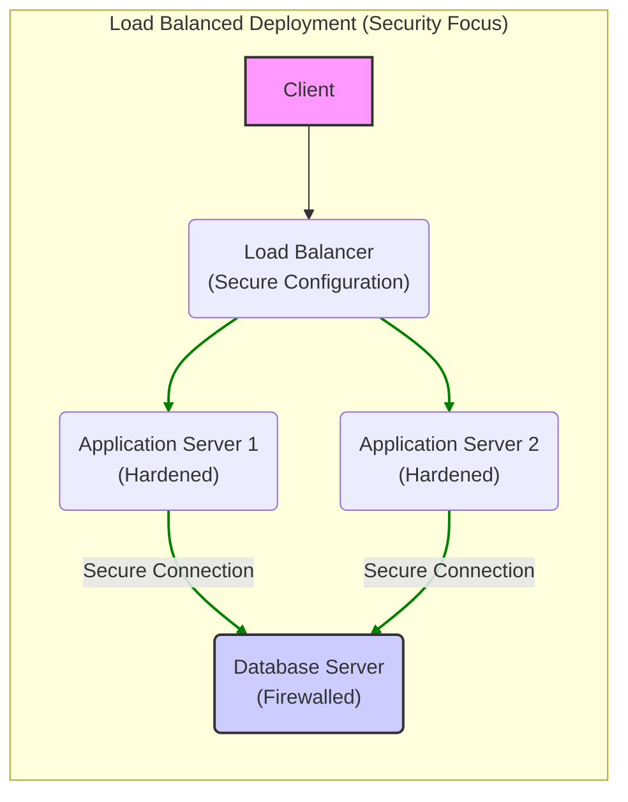

# Project Design Document: Ruby on Rails Framework (Threat Modeling Focus)

**Version:** 1.1
**Date:** October 26, 2023
**Prepared By:** AI Software Architect

## 1. Introduction

This document provides a detailed architectural overview of the Ruby on Rails (Rails) framework, specifically tailored for threat modeling activities. It outlines the key components, their interactions, data flow, and deployment considerations, with a focus on identifying potential security vulnerabilities. This document serves as a foundation for security assessments and the development of mitigation strategies.

## 2. Goals

* Provide a comprehensive and security-focused description of the Rails framework architecture.
* Clearly identify the major components and their security-relevant responsibilities.
* Illustrate the typical data flow within a Rails application, highlighting potential attack vectors.
* Detail external dependencies and their associated security risks.
* Describe common deployment architectures and their security implications.
* Serve as a primary resource for identifying potential security threats and vulnerabilities during threat modeling sessions.

## 3. Target Audience

* Security engineers and architects responsible for threat modeling and security assessments.
* Developers building and maintaining Rails applications who need to understand security implications.
* Penetration testers and security auditors evaluating the security posture of Rails applications.
* Operations teams deploying and managing Rails applications, focusing on secure configurations.

## 4. Architectural Overview

Rails is a full-stack web application framework written in Ruby, adhering to the Model-View-Controller (MVC) architectural pattern. This pattern promotes separation of concerns, which is beneficial for security by isolating different aspects of the application. The principles of "convention over configuration" and "don't repeat yourself" (DRY) can impact security if conventions are not followed or if code reuse introduces vulnerabilities.

## 5. Key Components

* **Model:**
    * Represents the application's data and business logic.
    * Interacts with databases through ActiveRecord, which, if not used carefully, can be susceptible to SQL injection.
    * Enforces data integrity and business rules; weak enforcement can lead to data manipulation vulnerabilities.
    * Handles data validation; insufficient validation is a common source of vulnerabilities.

* **View:**
    * Responsible for presenting data to the user.
    * Uses templates (e.g., ERB, Haml) where improper escaping can lead to Cross-Site Scripting (XSS) vulnerabilities.
    * Receives data from the controller; ensuring data is sanitized before rendering is crucial.

* **Controller:**
    * Acts as an intermediary, handling user requests and coordinating between the Model and the View.
    * Receives user input, making it a primary target for injection attacks.
    * Performs authorization checks; flaws in authorization logic can lead to unauthorized access.
    * Manages session data; insecure session handling can lead to session hijacking.

* **Routing:**
    * Maps URLs to controller actions.
    * Incorrectly configured routes can expose unintended functionality or data.
    * Can be manipulated to bypass security checks if not designed carefully.

* **Active Record:**
    * The ORM layer, simplifying database interactions.
    * While it helps prevent direct SQL injection, improper use of raw SQL or dynamic finders can still introduce vulnerabilities.
    * Mass assignment vulnerabilities can occur if not properly controlled.

* **Action Controller:**
    * Provides core controller functionalities, including request parsing and session management.
    * Vulnerabilities in this component can have widespread impact.
    * Handles CSRF protection; ensuring it's correctly implemented is vital.

* **Action View:**
    * Provides helpers for generating UI elements.
    * Improper use of helpers can lead to XSS vulnerabilities.

* **Active Support:**
    * Offers utility classes, some of which handle security-sensitive operations like cryptographic functions.
    * Using outdated or insecure cryptographic methods can weaken security.

* **Middleware:**
    * Processes requests and responses.
    * Security middleware (e.g., for header management, request filtering) is crucial for defense in depth.
    * Misconfigured or missing security middleware can leave applications vulnerable.

* **Asset Pipeline:**
    * Manages static assets.
    * Vulnerabilities in asset processing or delivery can lead to attacks.
    * Improperly secured asset directories can expose sensitive files.

* **Mailers:**
    * Used for sending emails.
    * Email injection vulnerabilities can occur if user input is not sanitized.
    * Exposing sensitive information in emails is a risk.

* **Jobs (Active Job):**
    * Handles background tasks.
    * If not secured, malicious jobs could be scheduled or executed.
    * Access to job queues needs to be controlled.

* **Testing Framework (Minitest):**
    * While not a runtime component, thorough security testing is essential.
    * Lack of security-focused tests can lead to undetected vulnerabilities.

## 6. Data Flow (Security Focused)

The data flow in a Rails application presents several points where security vulnerabilities can be introduced or exploited:

1. **Client Request (Potential Attack Vector):** User input, including URLs, headers, and form data, can be crafted to exploit vulnerabilities.
2. **Web Server (Entry Point for Attacks):** The web server needs to be hardened and properly configured to prevent attacks before they reach the application.
3. **Routing (Potential for Bypass):**  Maliciously crafted URLs can bypass intended routing logic or access unauthorized endpoints.
4. **Controller Action (Input Handling and Authorization):**
    * Input validation flaws here are a primary source of injection vulnerabilities.
    * Insufficient authorization checks can lead to unauthorized access to functionality.
5. **Model Interaction (Data Access and Manipulation):**
    * SQL injection can occur if data passed to the database layer is not properly sanitized.
    * Business logic flaws in the Model can lead to data corruption or manipulation.
6. **Database (Data at Rest):** The database itself needs to be secured to protect sensitive data from unauthorized access.
7. **View Rendering (Output Encoding):** Failure to properly encode data before rendering can lead to XSS vulnerabilities.
8. **Middleware (Security Gatekeeper):** Security middleware should inspect and sanitize requests and responses, but misconfiguration can create vulnerabilities.
9. **Web Server Response (Potential for Information Leakage):** Response headers can reveal sensitive information if not configured correctly.
10. **Client (Target of Attacks):**  The client's browser can be targeted through XSS or other client-side vulnerabilities.

```mermaid
graph LR
    subgraph "Rails Application"
        A["Client Request\n(Potential Attack)"] --> B("Web Server\n(Entry Point)");
        B --> C{"Routing\n(Bypass Risk)"};
        C --> D["Controller Action\n(Input Validation,\nAuthorization)"];
        D --> E{"Model Interaction\n(SQL Injection Risk)"};
        E --> F["Database\n(Data at Rest)"];
        D --> G["View Rendering\n(XSS Risk)"];
        G --> H["Middleware (Response)\n(Security Headers)"];
    end
    H --> I("Web Server Response\n(Info Leakage)");
    I --> J["Client\n(Target of Attacks)"];
    style A fill:#f9f,stroke:#333,stroke-width:2px
    style J fill:#f9f,stroke:#333,stroke-width:2px
    style F fill:#ccf,stroke:#333,stroke-width:2px
    linkStyle 0,1,2,3,4,5,6,7,8,9 stroke-width:2px,stroke:red;
```

## 7. External Dependencies (Security Implications)

External dependencies introduce additional attack surfaces and potential vulnerabilities:

* **Database:**
    * Vulnerabilities in the database software itself.
    * Misconfigurations leading to unauthorized access.
    * Weak authentication credentials.

* **Web Server:**
    * Vulnerabilities in the web server software.
    * Misconfigurations exposing sensitive information or allowing attacks.

* **Operating System:**
    * OS-level vulnerabilities can be exploited to compromise the application.
    * Improperly configured OS security settings.

* **Ruby Interpreter:**
    * Vulnerabilities in the Ruby interpreter.
    * Using outdated or unsupported versions.

* **JavaScript Runtime (for Asset Pipeline):**
    * Vulnerabilities in Node.js or its modules.

* **Caching Systems:**
    * Data stored in the cache might be sensitive and needs to be protected.
    * Vulnerabilities in the caching software.

* **Background Job Processors:**
    * Security of the job queue and worker processes.
    * Unauthorized access to job management interfaces.

* **Email Servers (SMTP):**
    * Security of communication with the SMTP server.
    * Risk of email interception or spoofing.

* **Cloud Providers:**
    * Security of the cloud platform and its services.
    * Misconfigurations of cloud resources.

* **Content Delivery Networks (CDNs):**
    * Potential for CDN compromise or data breaches.
    * Serving outdated or compromised assets.

* **External APIs:**
    * Security of communication with external APIs.
    * Vulnerabilities in the external APIs themselves.
    * Exposure of API keys or secrets.

## 8. Deployment Architecture (Security Considerations)

Different deployment architectures have varying security implications:

* **Single Server Deployment:**
    * Single point of failure.
    * Increased attack surface as all components are on one machine.
    * Requires careful hardening of the single server.

* **Load Balanced Deployment:**
    * Improved availability and scalability.
    * Load balancers need to be secured to prevent them from becoming attack vectors.
    * Communication between application servers and the database needs to be secured.

* **Containerized Deployment (Docker, Kubernetes):**
    * Isolation between containers improves security.
    * Security of the container images and orchestration platform is crucial.
    * Proper configuration of network policies and access controls is essential.

* **Platform as a Service (PaaS):**
    * Security relies on the PaaS provider's infrastructure.
    * Understanding the shared responsibility model is important.
    * Configuration options provided by the PaaS need to be used securely.



## 9. Security Considerations (Detailed)

This section expands on the initial security considerations, providing more detail for threat modeling:

* **Input Validation:**
    * **Threat:** Injection attacks (SQL, XSS, Command Injection, etc.).
    * **Mitigation:** Implement robust server-side validation, use parameterized queries, encode output, sanitize user input.

* **Authentication and Authorization:**
    * **Threat:** Unauthorized access, privilege escalation.
    * **Mitigation:** Use strong password policies, multi-factor authentication, role-based access control, secure session management.

* **Session Management:**
    * **Threat:** Session hijacking, session fixation.
    * **Mitigation:** Use secure session cookies (HttpOnly, Secure), regenerate session IDs, implement session timeouts.

* **Cross-Site Scripting (XSS) Prevention:**
    * **Threat:** Execution of malicious scripts in users' browsers.
    * **Mitigation:** Encode output based on context, use Content Security Policy (CSP).

* **Cross-Site Request Forgery (CSRF) Protection:**
    * **Threat:** Unauthorized actions performed on behalf of authenticated users.
    * **Mitigation:** Use anti-CSRF tokens, implement SameSite cookie attribute.

* **SQL Injection Prevention:**
    * **Threat:** Unauthorized access to or manipulation of database data.
    * **Mitigation:** Use parameterized queries or ORM features, avoid raw SQL where possible, enforce least privilege for database access.

* **Mass Assignment Vulnerabilities:**
    * **Threat:** Modification of unintended model attributes through user input.
    * **Mitigation:** Use strong parameters to whitelist allowed attributes.

* **Dependency Management:**
    * **Threat:** Exploitation of known vulnerabilities in dependencies.
    * **Mitigation:** Regularly update dependencies, use dependency scanning tools.

* **Security Headers:**
    * **Threat:** Various attacks that can be mitigated by proper header configuration.
    * **Mitigation:** Implement headers like HSTS, Content-Security-Policy, X-Frame-Options, X-XSS-Protection, X-Content-Type-Options.

* **Logging and Monitoring:**
    * **Threat:** Undetected security incidents.
    * **Mitigation:** Implement comprehensive logging, monitor logs for suspicious activity, set up alerts.

* **Secrets Management:**
    * **Threat:** Exposure of sensitive credentials.
    * **Mitigation:** Store secrets securely (e.g., using environment variables, dedicated secrets management tools), avoid hardcoding secrets.

* **File Upload Security:**
    * **Threat:** Uploading and execution of malicious files.
    * **Mitigation:** Validate file types and sizes, sanitize file names, store uploaded files outside the web root, use virus scanning.

* **Denial of Service (DoS) Prevention:**
    * **Threat:** Making the application unavailable to legitimate users.
    * **Mitigation:** Implement rate limiting, use CDNs, protect against common DoS attack vectors.

## 10. Threat Modeling Focus

This design document is specifically structured to facilitate threat modeling. When conducting threat modeling sessions using this document, consider the following:

* **Identify Assets:** What are the valuable assets the application handles (e.g., user data, financial information)?
* **Identify Entry Points:** Where does data enter the application (e.g., user input, API endpoints)?
* **Identify Trust Boundaries:** Where does the level of trust change (e.g., between the application and external services)?
* **Identify Threats:** What are the potential threats to each component and data flow (using categories like STRIDE)?
* **Identify Vulnerabilities:** What weaknesses in the design or implementation could be exploited?
* **Identify Attack Vectors:** How could an attacker exploit the identified vulnerabilities?

Focus on the data flow diagram to trace how data moves through the system and where security controls are needed. Analyze each component's responsibilities and potential weaknesses. Use the external dependencies section to understand the risks introduced by third-party components. Consider the security implications of the chosen deployment architecture.

## 11. Conclusion

This enhanced design document provides a comprehensive and security-focused overview of the Ruby on Rails framework. It highlights key components, data flow, external dependencies, and deployment considerations, with a strong emphasis on potential security vulnerabilities. This document is intended to be a valuable resource for security professionals and developers involved in threat modeling and securing Rails applications. By understanding the architecture and potential threats, teams can proactively implement security measures and build more resilient applications.